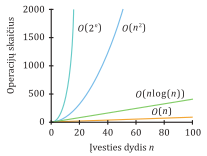
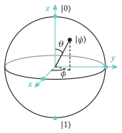
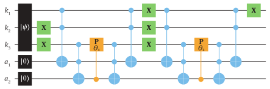
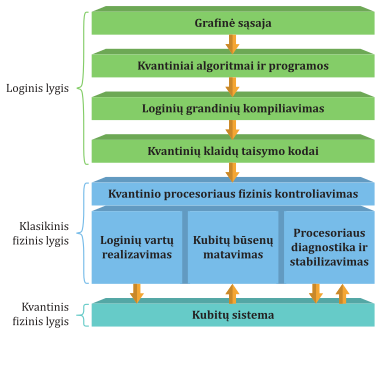

# Kvantinės kompiuterijos apžvalga

## Įvadas 

Šiandieniniai kompiuteriai, kuriuos čia vadinsime klasikiniais, atvėrė
kelią į informacijos amžių. Puslaidininkinių tranzistorių išradimas
XX a. viduryje ir jų pagrindu formuojami mikroprocesoriai leido
nuosekliai didinti kompiuterių skaičiuojamąją galią bei kompiuterių
miniatiūrizacijos lygį. Sunku nepervertinti kompiuterių vaidmens
technologinėje ir socialinėje žmonijos raidoje -- nuo naujų medžiagų ir
medikamentų kūrimo, atliekamų skaičiavimų nustatant erdvėlaivių
trajektorijas, mašininiu mokymusi grindžiamo savaeigio transporto, genų
inžinerijos iki socialinių tinklų, paremtų į tinklą sujungtais
kompiuteriais.

**Moore'o dėsnis** (angl. *Moore's law*) yra artimai susietas su
skaičiuojamosios galios didėjimu per pastaruosius 40 metų. Šis dėsnis
teigia, kad tranzistorių skaičius integruotose mikroprocesorių
grandinėse padvigubėja maždaug kas dvejus metus. Didesnis tranzistorių
skaičius procesoriuose gali leisti atlikti sudėtingesnes skaičiavimų
operacijas, suteikti daugiau greitai pasiekiamos atminties ir
paralelizuoti skaičiavimus. Moore'o dėsnis savo ruožtu reiškia
komponentų mažėjimą; puslaidininkinių procesorių komponentų dydžiai
siekia 1--2 nanometrus. Dviejuose nanometruose galima išrikiuoti apie
dešimt atomų, tad, be praktinės, matome ir fundamentinę ribą klasikinių
kompiuterių komponentų dydžiui -- vienas atomas. Tai nulems, jog
netolimoje ateityje prireiks kitų būdų patenkinti didėjantiems
skaičiavimų spartos poreikiams. Tačiau technologinei raidai svarbių
užduočių skaičiavimo galimybės jau ir dabar yra itin ribotos.

Mažėjant klasikinių kompiuterių komponentų dydžiui, tenka neišvengiamai
atsižvelgti į **kvantinius dydžio efektus** (angl. *quantum
size-effects*). Medžiagos apimtį sumažinus iki nanometro skalės, ima
ryškėti krūvininkų energijos lygmenų persitvarkymai, taip pat didėja
tikimybė krūvininkams pabėgti iš medžiagos **kvantinio tuneliavimo**
principu (angl. *quantum tunneling*). Šie ir kiti kvantiniai efektai
padaro puslaidininkinių tranzistorių veikimą nenuspėjamą, ir reikia
papildomų priemonių norint išlaikyti jų funkcionavimą. Pažangesnių
nanomedžiagų gamybos principų įsisavinimas veikiausiai leis klasikinius
procesorius padaryti energetiškai efektyvesnius ir padidinti jų spartą.
Tačiau yra ir kitas sprendimo būdas -- keisti patį klasikinį skaičiavimo
modelį į tokį, kuris paremtas kvantinėmis taisyklėmis.

Kvantinė kompiuterija yra nauja skaičiavimų paradigma. Tai nulemia
fundamentalaus klasikinės informacijos paketo bito pakeitimas kvantiniu
bitu, vadinamuoju **kubitu** (angl. *qubit*). Šios technologijos
privalumai kyla iš tipinių kvantinių efektų -- kubito gebėjimo būti
skirtingose būsenose vienu metu, vadinamojoje būsenų **superpozicijoje**
(angl. *state* *superposition*), **interferencijos efektų**
(angl. *interference*) ir **kvantinio supynimo** (angl. *quantum
entanglement*). Kvantinis procesorius yra sudarytas iš daugelio kubitų,
o bendroje visų kubitų būsenų superpozicijoje yra koduojama ir
apdorojama informacija. Kadangi kvantinių būsenų transformacijos,
kurioms vykstant atliekamas informacijos apdorojimas, veikia visas
būsenas superpozicijoje vienu metu, kvantinis kompiuteris iš pagrindų
pasižymi didelėmis paralelizavimo galimybėmis. Kubitu gali būti įvairios
kvantinės fizinės sistemos, kuriose įmanoma tiksliai kontroliuoti ir
nuskaityti dvi skirtingas būsenas. Tarp jų yra elektronų ir atomų
branduolių sukininės būsenos, sklindančių fotonų poliarizacija,
elektroniniai ir vibraciniai atomų lygmenys, elektromagnetinio lauko
rezonansai uždaroje ertmėje, krūvininkų skaičius superlaidininkuose.

Įdomu paminėti, kad skaičiavimai, pagrįsti kvantinėmis taisyklėmis, buvo
pasiūlyti kur kas anksčiau, nei dydžio efektai klasikiniuose
kompiuteriuose galėjo kelti rūpesčių, maždaug 1980 metais. Tada tai
atrodė arti fantastikos ribų, nes kontroliuoti kvantinių sistemų būsenas
ir apsaugoti jas pakankamai ilgai nuo sunykimo, norint spėti atlikti
skaičiavimus, itin keblu. Šiuo požiūriu technologinėje raidoje kvantinė
kompiuterija žymi pradžią, kai įspūdingu tikslumu gebama kontroliuoti
fundamentalių gamtos ingredientų kitimą laike. Kvantinė kompiuterija yra
tik vienas šios pažangos vaisius, tačiau potencialiai turintis esminę
rolę paveikti žmonių kasdienybei.

Rašydami šią knygą esame vadinamojoje
**triukšmingų tarpinės skalės kvantinių technologijų** etape
(angl. *noisy intermediate-scale quantum*, trumpinys NISQ). NISQ
kvantiniai procesoriai turi 50-100 kubitų skaičių, pasižymi
sparčiai atsirandančiomis klaidomis ir nenaudoja klaidų taisymo
algoritmų. Tai neleidžia atlikti ilgų ir tikslių praktinės svarbos skaičiavimų.  
Didėjant kvantinių kompiuterių skaičiuojamajai galiai verta tikėtis
proveržių srityse, kuriose reikalingi intensyvūs skaičiavimai. Šios
sritys apima medikamentų ir technologinių medžiagų kūrimą, branduolinę
energetiką, fundamentinius mokslinius tyrimus, dirbtinio intelekto
tobulinimą, finansinių rinkų modeliavimą, logistiką, klimato kaitos ir
kitų kompleksinių sistemų vyksmų modeliavimą.

Kvantiniai kompiuteriai veikiausiai neišstums klasikinių įrenginių,
puikiai atliekančių daugybę funkcijų, bet bus naudojami greta. To
pavyzdys -- **grafikos apdorojimo procesorius** (angl. *graphics
processing unit*), integruotas daugumoje kompiuterių. Palyginus su
bendro naudojimo kompiuterio procesoriumi, grafikos procesoriaus
elektroninė architektūra suteikia galimybes paralelizuoti ir itin
paspartinti tam tikro tipo duomenų apdorojimą. Galima panašiai
įsivaizduoti ir su klasikiniu kompiuteriu integruotą kvantinį
procesorių, į kurį nukreipiamos užduotys, reikalaujančios jo suteikiamų
privalumų, taip realizuojant hibridinį kvantinį-klasikinį skaičiavimo
metodą.

Knygoje pristatomi kvantinės kompiuterijos pagrindai vadinamiesiems
**universaliesiems kvantiniams kompiuteriams** (angl. *universal quantum
computers*). Universalumas čia reiškia, kad jie nėra specializuoti
spręsti specifinius uždavinius, bet gali atlikti bet kokį suformuluotą
skaičiavimą. Šiuo metu plačiausiai vystomas kvantinio skaičiavimo
modelis yra **grįstas loginiais vartais** (angl. *gate-based model*);
jis dar vadinamas **kvantinių grandinių modeliu** (angl. *quantum
circuit model*). Kaip rodo pavadinimas, jų žemiausio lygmens
programavimas yra pagrįstas kvantiniais loginiais vartais, kurie atlieka
kubitų būsenų transformacijas. Kvantiniame procesoriuje pasitelkiama
keletas skirtingų loginių vartų, sudarančių universalų rinkinį; jų
kombinacijomis galima įvykdyti visus įmanomus skaičiavimus. Tokiu
principu veikia ir klasikiniai kompiuterių procesoriai, kuriuose
elektroninės loginės grandinės atlieka pateiktos dvejetainės skaičių
sekos apdorojimą. Skaičiavimų universalumas leidžia atsiriboti nuo
konkrečios fizinės sistemos, realizuojančios kubitus, ir susitelkti į
skaičiavimo užduočių formulavimą bei programavimą. Skirtingi kvantiniai
procesoriai gali naudoti skirtingo tipo loginius elementus; tačiau tai
tik reiškia, kad kvantinį algoritmą teks perkompiliuoti naujais
elementais -- algoritmo pagrindas nekinta.

Ankstyvieji kvantinės kompiuterijos tyrinėtojai turi pirmenybę
apsiprantant su pasauliu, kuriame reikia žaisti pagal kvantines
taisykles. Vertinant iš fizikos perspektyvos, kubitas -- pati
paprasčiausia kvantinė sistema, kuri nėra triviali. Kvantiniame
kompiuteryje matome situaciją, kai iš daugelio paprastų sistemų iškyla
nauji kompleksiškumo reiškiniai. Kvantinis superpozicijos principas yra
pagrindinis to šaltinis; visgi tai kitokios prigimties superpozicija,
nei aptinkama klasikinėse sistemose. Pavyzdžiui, skirtingi stygų
vibracijos dažniai muzikos instrumente nusako skirtingas būsenas.
Spragtelėjus stygą pirštu, ji greičiausiai bus sužadinta virpėti vienu
metu keletu skirtingų dažnių, o tai savo ruožtu nusakys stovinčiųjų
bangų (virpesių) superpoziciją. Taip pat ir bangos, keliaujančios
sužadintu vandens paviršiumi skirtingomis kryptimis, yra būsenų
superpozicija bei demonstruoja tokius reiškinius kaip interferencija,
kada persiklojusių bangų amplitudė vietomis padidėja ir sumažėja. 

Norint pamatyti skirtumus tarp klasikinių ir kvantinių sistemų įsivaizduokime instrumento stygą, kuri gali vibruoti tik dviem
skirtingais dažniais. Vadinsime juos $|0\rangle$ ir
$|1\rangle$. Stygos būseną galime užrašyti kaip šių
virpesių sumą: $|S\rangle = a|0\rangle + b|1\rangle$;
čia $a$ ir $b$ nusako atitinkamų virpesių amplitudę, tai yra garsumą.
Siekdami padaryti šį pavyzdį artimesnį kvantinėms sistemoms,
tvirtinsime, kad styga bet kuriuo metu negali nevibruoti bent vienu iš
šių dviejų dažnių. Keturių stygų violončelėje jos bendrą būseną bet
kuriuo metu galima nusakyti įvardijant keturių stygų būsenas --
$|S_1 \rangle$, $|S_2 \rangle$,
$|S_3 \rangle$, $|S_4 \rangle$, ir todėl
iš viso aštuonias amplitudes $\{(a_1,b_1),\ldots,(a_4,b_4)\}$. Tačiau, jeigu šios stygos būtų
kvantinės sistemos taip pat su dviem skirtingomis būsenomis (kubitai),
nusakyti violončelės būsenai reikėtų įvardyti šešiolika amplitudžių!
Papildomos būsenos kvantinėje violončelės versijoje atsiranda dėl to,
kad galima ne vien tos pačios stygos būsenų superpozicija, bet ir bendra
skirtingų stygų būsenų superpozicija. Pavyzdžiui, dvi galimos klasikinės
violončelės būsenos yra kai visos keturios stygos vibruoja tik
$|0 \rangle$ dažniu, nusakoma amplitudėmis
$\{(a_1,0),(a_2,0),(a_3,0),(a_4,0)\}$ ir kai 
vienu metu visos stygos vibruoja tik $|1\rangle$
dažniu, nusakoma amplitudėmis
$\{(0,b_1 ),(0,b_2 ),(0,b_3 ),(0,b_4 )\}$. Jeigu šios stygos būtų kvantinės, tada galima ir šių klasikinių
būsenų superpozicija. Tai reiškia, vienu metu visos stygos vibruoja tik
$|0\rangle$ dažniu ir nevibruoja
$|1\rangle$, taip pat vibruoja $|1\rangle$
dažniu ir nevibruoja $|0\rangle$. Bendrai tariant, jeigu
klasikinių stygų skaičius yra $n$, tokiai sistemai nusakyti bet kuriuo
metu reikia $2n$ amplitudžių verčių. O štai kvantinėje jos versijoje šis
skaičius yra $2^n$. Tad jeigu sutarsime, kad amplitudžių vertės koduoja
informaciją, taps akivaizdu, jog kvantinės sistemos gali savyje laikyti
eksponentiškai daugiau informacijos.

Eksponentinis skirtumas tarp klasikinių ir kvantinių būsenų skaičiaus
atsiranda dėl to, kad kvantinėse sistemose galimos **supintosios
būsenos** (angl. *entangled states*). Minėta superpozicijos būsena yra
kvantinio supynimo pavyzdys, leidžiantis keletui „stygų" elgtis kaip
viena „superstyga". Supintos sistemos pasižymi kvantinėmis
koreliacijomis, kurių neįmanoma imituoti klasiškai ir paaiškinti
klasikine tikimybių teorija. Jos elgiasi panašiai kaip vienas darinys,
net jeigu yra atskirtos viena nuo kitos dideliais atstumais. Pavyzdžiui,
dviejų klasikinių bitų būseną galima pakeisti į bet kurią kitą iš
keturių galimų kombinacijų $\{00, 01, 10, 11\}$ tik keičiant kiekvieno
individualaus bito būseną. Supintojoje 2 kubitų būsenoje pakanka
kontroliuoti vieno pasirinkto kubito būseną norint akimirksniu pakeisti
jų bendrą būseną į bet kurią iš analogiškai keturių skirtingų.

```{r dvieju-kubitu-supynimas, echo=FALSE, fig.cap="Dviejų kubitų kvantinis supynimas", out.width='40%', fig.align='center'}

```

Supintosiose sistemose (žr. \@ref(fig:dvieju-kubitu-supynimas) pav.)
dalis informacijos yra laikoma kvantinėse koreliacijose tarp kubitų
būsenų. To gerą pavyzdį pateikia fizikas Johnas Preskillas.
Įsivaizduokime, kad turime dvi šimto puslapių dydžio knygas -- vieną
įprastą klasikinę, o kitą kvantinę, kurioje informacija yra laikoma
kvantinėse būsenose. Perskaitę vieną įprastos knygos puslapį sužinome
1% visos joje pateikiamos informacijos, tad perskaitę šimtą puslapių
žinome viską, kas joje yra. Tačiau skaitydami kvantinę knygą ir
atversdami kiekvieną naują puslapį gauname nenuspėjamą turinį. Perskaitę
visą šimtą puslapių turėsime tik mažą idėją, apie ką rašoma knygoje, nes
eksponentiškai didesnė dalis informacijos yra laikoma ne atskiruose
puslapiuose, bet koreliacijose tarp jų. Norint sužinoti visą
informaciją, laikomą kvantinėje knygoje, reikia „skaityti" visus knygos
puslapius vienu metu. Tai yra klasikinėje terpėje neturintis analogijų
procesas.

Informacija, kuri koduojama ir apdorojama kvantinėse sistemose, vadinama
kvantine informacija. **Kvantinės informacijos teorija** (angl. *quantum
information theory*) yra nauja informatikos šaka ir skiriasi nuo
klasikinės informatikos keletu esminių principų. Didžioji dalis
informacijos, esančios kvantinių būsenų erdvėje, nėra prieinama. Norint
sužinoti anksčiau minėto kvantinio instrumento būseną esančioje
superpozicijoje, galimi atsakymai yra: visos keturios stygos vibruoja
pirmuoju $|0\rangle$ arba antruoju
$|1\rangle$ dažniu. Kitaip tariant, atskleisdami
kvantinėse superpozicijos būsenose laikomą informaciją gauname klasikinę
informaciją, o superpozicija yra sugriaunama. Neįmanoma nuspėti, kuris
rezultatas bus aptiktas; žinomos tik jų tikimybės, kurios yra
proporcingos amplitudžių dydžiams. Wooterso ir Zureko **uždraustojo
kopijavimo teorema** (angl. *no-cloning theorem*) nusako kitą esminį
skirtumą tarp kvantinės ir klasikinės informacijos. Ši teorema teigia,
kad kvantinės informacijos neįmanoma kopijuoti. Tai nereiškia, kad
žinodami informacijos, tai yra kvantinės būsenos, paruošimo žingsnius
negalime jos tiksliai atkartoti. Šis principas veikiau rodo, kad gavus
kvantinės informacijos paketą su nežinomu turiniu neįmanoma sukurti šio
turinio identiškos kopijos.

Nors šie skirtumai atrodytų kaip keblumai, panaikinantys minėtus
kvantinių sistemų privalumus, tačiau dar ne viskas prarasta. Pirmiausiai
galima atkreipti dėmesį, kad nors apdorojamos informacijos apimtis tam
tikrose užduotyse gali būti astronominio dydžio, tačiau praktikoje
dažnai prireikia tik sąlygiškai mažos jos dalies, kad sužinotume norimą
atsakymą ar perteiktume duomenis žmogiškuoju pavidalu. Dėl eksponentinio
būsenų skaičiaus perteikti net ir 300 kubitų laikomą kvantinę
informaciją į klasikinės atminties išteklius būtų neįmanoma, tam
prireiktų maždaug $10^{90}$ amplitudžių verčių. Šis skaičius yra didesnis
nei stebimoje Visatoje esančių atomų skaičius.

Ekstravagantiškos kvantinių sistemų savybės pačios savaime neužtikrina,
kad jomis pagrįstas skaičiavimas bus pranašesnis už klasikinius. Galima
pateikti tris geras priežastis, kodėl kvantinis skaičiavimo modelis
visgi demonstruoja pranašumą. Pirma (ir akivaizdžiausia) priežastis
slypi kvantinių sistemų modeliavime. Dėl eksponentiškai didelės
kvantinių būsenų erdvės nėra žinoma, kaip efektyviai jas modeliuoti
klasikiniu kompiuteriu. Čia ištekliai auga eksponentiškai su sistemos
dydžiu (kubitų skaičiumi), o štai modeliuojami kvantiniu kompiuteriu jie
bendrai auga tiesiškai. Vienas pavyzdys, kuriame kvantinių sistemų
modeliavimas galėtų suteikti globaliai svarbų proveržį, yra vadinamas
**azoto fiksacijos procesu** (angl. *nitrogen fixation process*). Šiame
procese stipriomis trigubomis kovalentinėmis jungtimis molekulėse $\mathrm{N}_2$
susijungę azoto atomai yra atskiriami ir kartu su kitais elementais
transformuojami į amoniaką ($\mathrm{NH}_3$) bei kitus nitratus, naudojamus
pramoninei trąšų gamybai. Efektyviausiam žinomam procesui, vadinamam
**Haberio-Bošo procesu** (angl. *Haber-Bosch process*), reikia itin
didelių slėgių ir temperatūrų šiai transformacijai atlikti, ir todėl
išeikvojama ypatingai daug energijos. Azoto fiksacija yra taip pat
esminis procesas biologinėse sistemose atliekant biosintezę. Biologinės
sistemos tai atlieka itin efektyviai įprastinėmis kambario sąlygomis
naudojant nitrogenazės fermentą. Šio organinio cheminio proceso
supratimas galėtų padaryti trąšų gamybą energetiškai žymiai efektyvesnę.
Tačiau jis yra neįkandamas klasikiniams superkompiuteriams dėl per
didelio laisvės laipsnių skaičiaus net ir sąlygiškai mažoje molekulėje.

Antroji priežastis slypi sunkių ar neįveikiamų klasikinių užduočių skaičiavimuose
kvantiniu kompiuteriu. Jau dabar yra atrasta ženkliai greitesnių kvantinių algoritmų už geriausius žinomus
klasikinius. Tarp gerai žinomų yra pirminių skaičių skaidymas, tiesinių lygčių sprendimas, paieška duomenų bazėse ir jų sąrašas sparčiai auga.

Galiausiai **skaičiavimų sudėtingumo** (angl. *computational
complexity*) teorijos argumentai teigia, kad kvantiniu kompiuteriu
galima efektyviau testuoti reikšmes iš **koreliuotųjų tikimybinių
funkcijų** (angl. *correlated probability distribution*). Tokio tipo
skaičiavimais yra dažnai grindžiami pirmieji **kvantinės viršenybės**
(angl. *quantum supremacy*) demonstravimai prieš klasikinius
kompiuterius pasitelkiant mažą skaičių kubitų.

Esminiai kvantinės informacijos skirtumai taip pat atsispindi ir
ryšiuose, kuriais siunčiama arba pasitelkiama kvantinė informacija.
Kvantinis supynimas leidžia atlikti komunikacijų protokolus, neįmanomus
naudojant vien klasikines būsenas. Tarp šių protokolų yra **tankusis
kodavimas** (angl. *dense coding*), leidžiantis nusiųsti dvigubai
daugiau bitų klasikinės informacijos su kiekvienu kubitu. **Kvantinė
teleportacija** (angl. *quantum teleportation*) suteikia būdą persiųsti
tolydžiosiose kubito būsenos amplitudėse koduojamą kvantinę informaciją
naudojant tik du bitus informacijos. Ne mažiau svarbūs yra kvantinės
informacijos principų taikymai kriptografijoje. Kvantiniai protokolai
leidžia užtikrinti fizikos dėsniais apsaugotą komunikaciją. Itin didelio
saugumo reikalaujančios komunikacijos ateityje veikiausiai kliausis
kvantiniais ryšiais arba turės būti atnaujinamos naujais klasikiniais
protokolais, kadangi šiandieniniai kriptografijos protokolai tampa
įveikiami pažangiais kvantiniais kompiuteriais.

## Kvantinės kompiuterijos pradmenys

Kvantinių sistemų egzistavimas ir pagrindiniai jų elgsenos principai
buvo laipsniškai atskleisti 1900--1930 metų laikotarpiu ieškant išeities
iš absurdiškų spėjimų, kuriuos buvo galima prieiti taikant tuometines
fizikos teorijas. Viena tokių problemų buvo vadinama **ultravioletinės
srities katastrofa** (angl. *ultraviolet catastrophe*), privedanti prie
begalinių energijų. Šios anomalijos ištaisymas ir interpretacija
fizikiniame modelyje įvedant elektromagnetinio lauko energijos kvantą,
dabar vadinamą fotonu, buvo pirmieji žingsniai link kvantinės mechanikos
atsiradimo. Kvantinė mechanika suteikia rinkinį taisyklių, vadinamų
postulatais, kurios padeda sujungti abstraktų jos matematinį formalizmą
su tuo, ką įmanoma objektyviai išmatuoti ir apibūdinti fiziniame
lygmenyje. Postulatai kvantinėje mechanikoje gali būti palyginami su
aksiomomis matematinėse logikų sistemose, įvardijantys pradinius
pasiūlymus ar principus, kurie savaime nėra įrodomi, tačiau pagal juos
grindžiama likusi loginė sistema. Fizinių teorijų, pagrįstų kvantine
mechanika, pavyzdžiai yra kvantinė elektrodinamika ir kvantinė
chromodinamika, apibūdinančios šviesos (fotonų) sąveiką su elektros
krūvį turinčia materija (elektronai, protonai, miuonai) ir branduolyje
stipriąsias sąveikas tarp kvarkų bei gliuonų atitinkamai. Kitaip nei
klasikinėje fizikoje, kvantinės sistemos būsena ir su ja susietos
savybės, tokios kaip jos padėtis ir judėjimo kryptis, negali
būti stebimi nepaveikiant pačios sistemos būsenos. Tai savo
ruožtu apibūdina tarsi paslėptą pasaulį, kurio tiesiogiai pasiekti negalime. Kiek žinoma, gamta yra fundamentaliai
kvantinė, nors keistosios jos savybės atsiskleidžia tik esant
specifinėms sąlygoms.

Pirmąsias idėjas panaudoti kvantines sistemas skaičiavimo procesuose
galima aptikti jau devintojo dešimtmečio pradžioje. Tokie žymūs fizikai
kaip Richardas Feynmanas, Paulas Benioffas, Yuri Maninas, Davidas
Deutschas ir kiti atkreipė dėmesį, kad klasikiniais kompiuteriais
modeliuoti kvantines sistemas bendroje situacijoje yra neefektyvu ir
daugeliu atvejų tiesiog neįmanoma. Kompiuterio atminties ištekliai,
reikalingi apibūdinti kvantinės sistemos būsenai, auga eksponentiškai
kartu su sistemos dydžiu. Tai brėžia praktinę ribą ties santykinai mažo
dydžio sistemomis bei riboto tipo skaičiavimais ir todėl tiesiogiai
veikia fundamentinių tyrimų spartą bei technologinę raidą. Kvantinio
kompiuterio idėją pastūmėjo to meto technologiniai pasiekimai, pirmą
kartą demonstruojantys individualių atominio lygmens sistemų kontrolę.
Pavyzdžiui, galėjimas judinti ir sugrupuoti pavienius atomus medžiagos
paviršiuje skenuojamuoju elektroniniu mikroskopu, jonų pagavimas
elektromagnetinėse gaudyklėse, pavienių elektronų perkėlimas įvairiuose
elektroniniuose dariniuose.

Šie pasiekimai veikiau suteikė stimulo tolimesniems tyrimams, kadangi
mechaniškai kontroliuoti atominio lygmens sistemas nebūtinai reiškia,
kad kontroliuojamos ir jų kvantinės būsenos. Informacijos kodavimas ir
apdorojimas kvantinėse sistemose yra pagrįstas jų būsenų **koherentiniu
valdymu** (angl. *coherent control*)*.* Fizikiniais terminais tai
reiškia gebėjimą išlaikyti ir keisti santykines fazes tarp kvantinių
sistemų. Kad geriau suprastume koherencijos principą, įsivaizduokime
dviejų žmonių irkluojamą valtį. Norint ja plaukti irkluotojams tenka
sukoordinuoti periodinį irklų pakėlimą iš vandens, nuleidimą ir
atsistūmimą nuo vandens. Jeigu jie tai idealiai sukoordinuoja, tada
galime sakyti, kad jų santykinė fazė lygi nuliui. Koherentinis valdymas
reiškia, kad jie gali tiksliai pasirinkti kokią tik pageidauja fazę ir
ją išlaikyti. Tačiau jeigu šie irkluotojų atliekami judesiai nepastoviai
kinta, tai lems nekoherentinį plaukimą ir tiesiog valties sukinėjimąsi
vietoje. Viena iš esminių užduočių išlaikant kvantinių sistemų
koherenciją -- užtikrinti jų izoliavimą nuo nepageidaujamų sąveikų su
aplinkos kvantinėmis sistemomis, kurios nenuspėjamai keičia jų santykines
fazes ir priveda prie **dekoherencijos** (angl. *decoherence*).
Dekoherencija yra didžiausias kvantinių kompiuterių priešas, jos efektai
pasireiškia atsitiktiniais būsenų pokyčiais, sistemos triukšmu, ir dėl
to atsirandančiomis skaičiavimų klaidomis. Žinoma, yra ir tokių
kvantinių sistemų, kurios labai silpnai sąveikauja su kitomis
sistemomis. Tačiau sąveikos yra reikalingos siekiant realizuoti logines
operacijas ir skaičiavimų universalumą. Šie vienas kitam
prieštaraujantys reikalavimai uždeda apribojimus sistemoms, kurios yra
tinkamos realizuoti kubitus.

Kvantinė kompiuterija įgavo pagreitį ir sulaukė platesnės bendruomenės
susidomėjimo dešimtojo dešimtmečio pradžioje. Peteris Šoras sukūrė
algoritmą, kuriuo parodė, kad kvantiniu kompiuteriu įmanoma pasiekti
eksponentinį pagreitinimą siekiant atlikti itin didelės svarbos
užduotis -- pirminių skaičių faktorizavimą ir diskrečiojo logaritmo
apskaičiavimą. Nėra žinomų efektyvių algoritmų spręsti šias problemas
naudojant klasikinius kompiuterius, ir jos traktuojamos kaip
neįveikiamos. Kadangi pirminių skaičių faktorizavimu yra pagrįsta
didžioji dalis globaliai taikomos kriptografijos, tai indikuoja
akivaizdžią praktinę svarbą ir kartu potencialiai egzistencinę krizę
komunikacijų saugumui. Ne mažiau svarbūs buvo pirmieji kvantinių klaidų
taisymo principai. Klaidų prevencijos ir taisymo algoritmai yra neatsiejama dalis
praktinės svarbos skaičiavimuose.

Kubitais pagrįstas modelis buvo pastūmėtas itin sėkmingo skaitmeninio
kompiuterio modelio, naudojančio dvejetainę sistemą. Vertinant iš
praktinės pusės, kontroliuoti dvi būsenas sistemoje yra paprasčiau ir
tai išlaiko skaičiavimų universalumą -- sudėtingesnis modelis nėra
būtinas norint atlikti visus suformuluojamus skaičiavimus. Kubitais
pagrįstuose skaičiavimo modeliuose pasirenkamos sistemos, kurios
nusakomos dviem skirtingomis būsenomis arba kuriuose tarp daugelio
galimų būsenų yra efektyviai kontroliuojamos tik dvi skaičiavimams
atlikti. Pavyzdžiui, **jonų gaudyklėmis** (angl. *ion traps*) pagrįsti
kvantiniai procesoriai išnaudoja dalį pagautų jonų elektroninių ir
vibracinių energijos lygmenų. Ne vien išimtinai atominio lygmens
sistemos demonstruoja kvantinius reiškinius. Makroskopinio skaičiaus
elektronų bendrosios krūvio kvantinės būsenos, vadinamos **transmonais**
(angl. *transmon*), stabilizuojasi superlaidininkuose esant itin mažoms
temperatūroms ir yra naudojamos šios architektūros kvantiniuose
kompiuteriuose. Kitos technologijos, galinčios tapti svarbios ateityje,
yra grindžiamos fotonika ir atominiais defektais puslaidininkiuose.
Verta išskirti fotoninius įrenginius, kurie turi natūralų privalumą, nes
gali būti paprasčiau integruojami į kvantinius tinklus išnaudojant
egzistuojančius šviesolaidinius tinklus ir palydovus. Kvantiniai tinklai
suteikia galimybes taikyti **išskaidytą skaičiavimų modelį**
(angl. *distributed computing*) tarp ne itin galingų ankstyvosios raidos
kvantinių kompiuterių, tačiau juos kartu sujungus galima efektyviai
pasiekti didesnę skaičiavimų galią.

## Tiuringo mašina 

Siekiant tiksliau palyginti kvantinių ir klasikinių kompiuterių
skaičiavimų efektyvumą, verta trumpam grįžti prie klasikinio skaičiavimo
modelio. Šiandieninių kompiuterių konceptas, apimantis pagrindinius jų
ingredientus bei skaičiavimų universalumą, buvo suformuluotas **Alano
Tiuringo** (angl. *Alan Turing*) 1930 metais. Tiuringo darbas šioje
srityje buvo paskatintas kitų siekių ir tik vėliau buvo suprasta
atradimo svarba universalaus kompiuterio gimimui. Tiuringas siekė
atsakyti į žymaus matematiko **Davido Hilberto** (angl. *David Hilbert*)
iškeltą klausimą ir iššūkį -- surasti įrodymą: ar visada egzistuoja
algoritmas, kuris naudodamas loginės sistemos aksiomas gali nuspręsti,
ar pateiktas teiginys yra teisingas arba neteisingas?

Prieš žygiuojant toliau priminsime, kad algoritmas -- tai tiksliai
nusakyta veiksmų seka ar instrukcijos, skirtos išspręsti užduotį. Su
aritmetinio pobūdžio algoritmais susiduriama jau vidurinėje mokykloje,
pavyzdžiui, naudojant **Euklido** (angl. *Euclid*) 2000 metų senumo
algoritmus reikia atlikti dviejų skaičių dalybą su liekanomis arba
didžiausio bendrojo daliklio paiešką. Algoritmų paskirtis gali būti
įvairiausio pobūdžio, įskaitant duomenų apdorojimą ir automatizuotą
sprendimų priėmimą. Algoritmus reikėtų atskirti nuo kompiuterio
programų, kadangi algoritmai yra bendresnio pobūdžio instrukcijos ir
egzistuoja nepriklausomai nuo programavimo kalbų. Skirtingos
programavimo kalbos gali būti pavartojamos tam pačiam algoritmui
įvykdyti.

Hilbertas pats tikėjosi, kad visada galima rasti tokius algoritmus ir
todėl iš principo įmanoma išspręsti visas problemas matematikoje.
Įrodymas, kad matematikoje egzistuoja neišsprendžiamų problemų, dar tais
pačiais metais buvo pateiktas **Kurto Godelio** (angl. *Kurt Gödel*) jo
dviejose žymiose **nepilnumo teoremose** (angl. *Gödel's*
*incompleteness theorems*). Šios teoremos tvirtina, kad aksiomomis
pagrįstose loginėse sistemose visada bus galima rasti teiginių, kurių
neįmanoma nei įrodyti, nei paneigti. To nepavyks apeiti net ir įvedus
papildomas aksiomas, t. y. išplečiant loginę sistemą, kadangi tokia
sistema negalės užtikrinti savęs pačios nuoseklumo (užtikrinti
neprieštaravimo pačiai sau).

Tiuringas performulavo Gödelio rezultatus į algoritmų kalbą, kuriuos
gali įvykdyti jo apibūdinta Tiuringo mašina. Tai idealizuotas
konceptualus kompiuteris, turintis visus esminius šių dienų kompiuterio
komponentus: skaitymo ir rašymo įrenginius, atmintį, procesorių.
Tiuringo mašina gali atlikti visus skaičiavimus, kuriuos gali atlikti
žmogus, tik efektyviai turi neribotą kiekį popieriaus ir rašymo
priemonių. A. Tiuringas kartu su A. Churchu pateikė formalų algoritmo
apibūdinimą (angl. *Church-Turing thesis*):

***Churcho--Tiuringo tezė:** visos funkcijų klasės, apskaičiuojamos
Tiuringo mašina, yra ekvivalentiškos klasei funkcijų, apskaičiuojamų
naudojant algoritmą.*

Kitaip tariant, Tiuringo mašina gali įvykdyti bet kokį suformuluojamą
algoritmą. Tai taikydamas Tiuringas parodė, kad egzistuoja kompiuteriu
neišsprendžiamų algoritmų, vienas toks yra vadinamas **sustojimo
problema** (angl. *halting problem*). Šiuolaikiniai programuojami
kompiuteriai yra pagrįsti **fon Noimano architektūra** (angl. *von*
*Neumann architecture*), pristatyta šio žymaus matematiko (angl. *John
von Neumann*) ir realizuota 1940--1950 metais. Fon Noimano architektūra
atspindi realizuotą Tiuringo mašiną, naudojančią technologiškai
praktiškesnius sprendimus ir aritmetinę loginę sistemą (Būlio algebrą).
Skaičiavimo galios ir universalumo atžvilgiu programuojamų šiandieninių
kompiuterių modelis yra ekvivalentiškas Tiuringo mašinai su ribota
atmintimi. Šie bendri principai leidžia suprasti, kad kvantinis
kompiuteris negalės atlikti to, ko negali atlikti universali Tiuringo
mašina, kuria galima modeliuoti ir kvantinius kompiuterius. Kvantinių
kompiuterių pranašumas atsiskleidžia kvantinių algoritmų efektyvumu.

## Skaičiavimų ištekliai

Algoritmų kompleksiškumo analizės sritis parodo problemai spręsti
reikalingus skaičiavimo išteklius -- bendrai laiko, erdvės (atminties)
ir energijos išteklius. Tradiciškai kompiuterių moksle laikas ir erdvė
buvo pagrindiniai dominantys ištekliai. Jie leidžia nustatyti, ar tam
tikros klasės problemos gali būti išsprendžiamos per atitinkamą laiką
esant ribotai kompiuterio atminčiai. Yra nemažai problemų, kurios
traktuojamos kaip sunkios ar net neįveikiamos dėl joms išspręsti
reikalingų nepasiekiamo dydžio išteklių. Pavyzdžiui, geriausias žinomas
klasikinis algoritmas skaičiaus faktorizavimui į dviejų pirminių skaičių
sandaugą reikalauja eksponentiškai augančių laiko išteklių su
faktorizuojamojo skaičiaus dydžiu. Ši problema neturi efektyvaus
skaičiavimų metodo ir nuo sąlygiškai mažos įvesties dydžio tampa laiko
atžvilgiu neįveikiama.

Operacijų skaičius yra tiesiogiai susietas su laiko ištekliais,
reikalingais atlikti algoritmą. Kompiuterio procesoriaus dažnis ir jo
architektūros bei algoritmo paralelizavimo galimybės yra pagrindiniai
veiksniai, kurie atspindi, kiek operacijų per laiko vienetą galima
atlikti, ir todėl nusako bendrą algoritmo vykdymo laiką. Tiksliai
nusakyti laiko išteklius yra keblu, kadangi net nežymiai pakeitus
skaičiavimo modelį ar kompiuterio architektūrą tai gali juos paveikti.
Tačiau dažnai mus domina esminė algoritmo elgsena bei viršutinės
operacijų skaičiaus ribos. Asimptotinė algoritmo elgsena didėjant
įvesties dydžiui leidžia tai įvertinti. Imkime pavyzdį: palyginkime du
skirtingus algoritmus, atliekančius tą pačią užduotį. Reikalingas
operacijų skaičius, kuris priklauso nuo įvesties tikslumo ar dydžio,
nusakyto *n-*bitais, pirmajame algoritme yra
$f(n) = n^3 + 10n + 100$, o antrajame
$g(n) = 1000n + \log (n)$. Šių funkcijų
asimptotinė elgsena, kai $n\rightarrow \infty$ (artėja prie labai
didelio skaičiaus), yra atitinkamai $O(n^3 )$ ir
$O(n)$. Simbolis $O$ su skliausteliuose pažymėta funkcine
forma yra vartojamas įvardyti funkcijos viršutinei elgsenos ribai ir
blogiausiam scenarijui. Algoritmas $g(n)$ su tiesine
$O(n)$ elgsena yra akivaizdžiai efektyvesnis, kai
$n\rightarrow \infty$, nepaisant didelio koeficiento šalia $n$.

Vertinant laiko išteklius, riba yra standartiškai nubrėžiama tarp
algoritmų, kurių ištekliai auga: 1) kaip polinomas ir 2) kuriuose
resursai auga greičiau nei bet koks polinomas (sakoma
„superpolinomiškai"). Problema yra lengva, traktuojama, arba įmanoma,
jeigu egzistuoja algoritmas, kuriam reikalingi polinominiai laiko
ištekliai. Palyginimui, problema yra vadinama sunkia, netraktuojama,
arba neįmanoma, jeigu ištekliai auga superpolinomiškai. Antruoju atveju
įprasta sakyti, kad yra reikalaujama eksponentinio dydžio išteklių. Tai
mažas piktnaudžiavimas eksponentinės funkcijos apibrėžimu, nes,
pavyzdžiui, $n^{\log n}$ auga greičiau nei bet kuris polinomas, bet
lėčiau nei tikra eksponentinė funkcija. Aišku, galima įsivaizduoti ir
polinomą su itin dideliu koeficientu (pvz., $n^{1000}$), kuriam gali
prireikti daugiau operacijų nei kai kurioms eksponentėms (pvz.,
$2^{n/1000}$). Tačiau praktikoje algoritmų su dideliais koeficientais
retai pasitaiko, ir istoriškai polinominiai algoritmai pasitvirtina
esantys efektyvesni. \@ref(fig:algoritmu-sudetingumas) pav. pateikiame kreives keleto dažnai aptinkamų
kompleksiškumo klasės funkcijų, palyginančių, kaip auga operacijų
skaičius didėjant įvesties dydžiui. Atkreipiame dėmesį, kad čia
vertikalioji ašis užsibaigia tik ties 2000.

```{r algoritmu-sudetingumas, echo=FALSE, fig.cap="Keletas algoritmų sudėtingumo pavyzdžių. Nuo sparčiausiai iki lėčiausiai augančio operacijų skaičiaus: eksponentinė elgsena, polinominė, logtiesinė ir tiesinė", out.width='50%', fig.align='center'}

```

Galime palyginti laiko išteklius keletui kvantinių ir klasikinių
algoritmų, skirtų atlikti tą pačią užduotį. Faktorizuojant pirminius
skaičius geriausiam žinomam klasikiniam algoritmui reikalinga
$O\left( e^{n^{\frac{1}{3}}\log (n)^{\frac{2}{3}}} \right)$
operacijų, o kvantiniam Šoro --
$O\big( n^2 \log (n)\log (\log(n))\big)$.
Šis eksponentinis pagreitinimas yra artimai susietas su Šoro algoritme
taikoma **kvantine Furjė transformacija** (angl. *quantum Fourier
transform*), kuriai reikalinga $O(n^2 )$ operacijų.
Klasikinei **diskrečiajai Furjė transformacijai** (angl. *fast Fourier
transform*) reikalinga eksponentiškai daugiau operacijų,
$O(n2^n )$. Taip pat galima paminėti nestruktūrizuotų
duomenų bazių **Groverio kvantinės paieškos algoritmą** (angl. *Grover
algorithm*), kuriam reikia $O\left(\sqrt{n}\right)$ operacijų ir kuris
suteikia kvadratinį pagreitinimą prieš klasikinę paiešką
$O(n)$.

Algoritmui reikalingi erdvės ištekliai yra ne kas kita, kaip atminties
ištekliai. Atminties išteklių esminis augimas didėjant įvesties dydžiui
$n$ yra taip pat nusakomas $O$ simboliu. Laiko ir atminties ištekliai
gali augti tokiu pačiu tempu, jeigu kiekviename algoritmo žingsnyje yra
reikalaujama nauja atminties celė. Atminties ištekliai skiriasi nuo
laiko, nes dažnai yra įmanoma atlaisvinti nenaudojamos atminties
išteklius. Nėra įrodyta, kad kvantiniai algoritmai turi pranašumą
atminties išteklių srityje.

Nors tai neatspindi algoritmų atminties sudėtingumo, tačiau šioje
vietoje verta pabandyti lyginti klasikinių bei kvantinių kompiuterių
atminties talpą. Informacija yra įrašoma kvantinio kompiuterio kubitų
registre. Registras, sudarytas iš $n$ kubitų, gali būti $2^n$
skirtingose būsenose vienu metu, o kiekvieną būseną nusakančios
amplitudės yra kompleksiniai skaičiai. Galime pažiūrėti, kiek
informacijos baitais atitiktų, pavyzdžiui, 50 kubitų registras
klasikiniame kompiuteryje. Pirmiausiai atkreipiame dėmesį, kad nusakyti
tolydžiai kintančią kubito amplitudę iš principo reikėtų begalinio
tikslumo ir todėl formaliai begalinės informacijos kiekio. Tačiau
praktiškai kvantiniame kompiuteryje tikslumas bus taip pat ribotas (dėl
triukšmo, loginių vartų netikslumų), tad skaičiaus tikslumui
apsiribosime **32 bitais** (angl. *single-precission floating-point
number*). Nusakyti bendrai 50 kubitų sistemos būsenai reikia $2^{50}$
kompleksinių amplitudžių, kiekvienai iš jų reikia 2 realiųjų skaičių,
kurių kiekvienas užima 32 bitus. Tad iš viso reikalaujama 8 petabaitų
atminties. Tai yra artima darbinei atminčiai, kurią vienas iš
pajėgiausių superkompiuterių (*IBM Summit*) šios knygos rašymo metu geba
pasiūlyti. Dėl eksponentinio atminties reikalavimų augimo kvantinio
kompiuterio veikimo modeliavimas pradedant nuo maždaug 50--60 kubitų
ribos tampa labai greitai neįveikiamas net ir sudėjus visas planetos
atminties saugyklas. Šiuo požiūriu kvantinis kompiuteris gali pasiūlyti
didesnę atminties talpą, negu kada nors bus įmanoma pasiekti
klasikiniais įrenginiais. Čia svarbus priminimas, kad tai yra kvantinė
informacija, saugoma būsenų superpozicijose. Šią informaciją galima
efektyviai apdoroti, tačiau, kitaip nei klasikinės, jos visos tiesiogiai
nuskaityti neįmanoma. Galime sakyti, kad kvantinė informacija yra
paslėpta arba potenciali. Minėtame pavyzdyje pamatavę 50 kubitų gausime
50 bitų, o ne 8 petabaitų dvejetainių skaičių seką.

Energija yra kitas svarbus skaičiavimų išteklius ir gali būti susietas
su laiko bei erdvės ištekliais, reikalingais atlikti algoritmą. Su
vadinamąja **galios siena** (angl. *power wall*) klasikiniai
kompiuteriai susidūrė dar 2000 metų pradžioje, kai buvo pasiekti maždaug
3,5 GHz procesorių dažniai. Kiekviename klasikinio procesoriaus cikle,
kai tranzistorių loginės būsenos pasikeičia
($0 \rightarrow 1$, $1 \rightarrow 0$), yra išeikvojama energija ir
išsklaidoma šilumos forma. Standartiniai **CMOS** (angl. *complementary
metal-oxide-semiconductor*) tranzistorių technologija pagrįsti
procesoriai itin pažengė mažinant energijos sąnaudas, daugiausia
mažinant tranzistorių įtampą loginėms vertėms keisti. Norint toliau
didinti klasikinių kompiuterių galią svarbu atrasti būdą, kaip tokiu
pačiu greičiu ar sparčiau mažinti jų energijos sąnaudas. Nors šiuo metu
klasikiniai procesoriai eikvoja energiją dėl neoptimalių technologijų,
tačiau egzistuoja ir fundamentali riba, įvardijanti minimalią energijos
kainą ištrinant informaciją. **Landauerio principas** (angl. *Landauer principle*)
teigia, kad informacija ir energija yra
artimai susietos:

***Landauerio principas**: kiekvieną kartą, kai ištrinamas vienas bitas
informacijos, į aplinką yra išsklaidoma bent
$k_{\mathrm{B}}T\log (2)$ energijos.*

Čia $k_{\mathrm{B}}$ yra Bolcmano konstanta, $T$ -- kompiuterio aplinkos
temperatūra. Tai suteikia užuominą, kad informacija nėra vien abstraktus
konceptas, tačiau gali būti prilyginta kitiems fizikiniams dydžiams.
Atliekant skaičiavimus klasikiniame procesoriuje dalis informacijos yra
visada ištrinama dėl juose naudojamų negrįžtamųjų loginių vartų.
Pavyzdžiui, plačiai naudojamuose loginiuose vartuose ***NAND***
(angl. *negated AND*) yra įvestis dviem bitams ir išvestis vienam bitui:
$(0,0)\rightarrow 1$, $(0,1)\rightarrow 1$, $(1,0)\rightarrow 1$, $(1,1)\rightarrow 0$.
Čia skliausteliuose nurodyta
įvesties bitų vertė ir rodyklyte -- išvesties bitas. Jeigu išvesties
bito vertė yra 1, tada galimos trys skirtingos įvesties bitų
kombinacijos. Todėl neįmanoma unikaliai pasakyti, kokie buvo įvesties
bitai iš trijų kombinacijų, ir dėl šios priežasties vienas bitas
informacijos yra negrįžtamai prarandamas.

Landauerio ribą galima apeiti naudojant grįžtamuosius loginius vartus ir
neištrinant informacijos skaičiavimo procese. Tam atliekamas įprastas
skaičiavimas, o pabaigoje registras yra grąžinamas į pradinę loginę
būseną termodinamiškai grįžtamuoju būdu. Klasikiniuose skaičiavimuose
galima pasitelkti vien tik grįžtamuosius loginius vartus, tačiau
procesorių architektūra sudėtingėja, tam reikia papildomų bitų ir
loginių vartų. O štai kvantiniame kompiuteryje skaičiavimai yra pagrįsti
grįžtamaisiais loginiais vartais, mat kvantinės fizikos dėsniai yra
fundamentaliai grįžtamieji. Kitaip tariant, kvantiniame kompiuteryje
galima atsukti laiką atgal. Tam tereikia pritaikyti atvirkštinius
loginius vartus atvirkštine tvarka. Tiesa, informacija kvantiniame
procesoriuje yra trinama kubitų būsenų matavimo ir dekoherencijos
procesų metu. Tačiau išsklaidoma Landauerio energija auga tiesiškai su
kubitu skaičiumi $n$, o ne eksponentiškai su galimų būsenų skaičiumi
$2^n$. Tai bendrai yra gera žinia, kadangi kvantiniai kompiuteriai turi
potencialą dominuoti ateityje atliekant intensyviausius skaičiavimus.

## Kvantiniai bitai

Klasikinėje kompiuterijoje informacija yra koduojama naudojant
„abėcelę", turinčią dvi skirtingas „raides", standartiškai įvardijamas 0
ir 1, kurios nusako elementariausią loginę sistemos būseną. Mažiausias
klasikinės informacijos vienetas **bitas** (angl. *binary digit*)
atspindi šią dvejetainę būseną. Kadangi dvejetainių skaičių seka yra
diskrečioji, joje koduojama informacija vadinama skaitmenine. Tai galima
palyginti su informacija, laikoma analoginiu pavidalu, pavyzdžiui,
vinilinėse plokštelėse, kuriose garso įrašas kinta tolydžiai su
paviršiaus įspaudimo gyliu ir deformacijomis. 

Bitas yra matematinis objektas, turintis dvejetainę savybę, ir nepriklauso nuo jį
realizuojančių fizinių sistemų. Tai itin pravartu, kadangi naudojant
vien abstrakčius matematinius objektus ir taikant su jais susietą
operacijų logiką galima formuluoti skaičiavimo modelius ir testuoti
informacines teorijas nesirūpinant dėl fizinio lygmens. Pagrindinis
reikalavimas fiziniame lygmenyje yra tas, kad bitą realizuojantis
darinys turėtų dvi būsenas, kurias būtų lengva atskirti ir keisti
panorėjus. Fizinė sistema, realizuojanti skaitmeninę informaciją,
neprivalo būti savaime diskreti. Tranzistoriais pagrįstuose
procesoriuose bitų vertės yra koduojamos elektros įtampa, kuri nusako
tolydžiai kintantį fizikinį dydį. Šis iš esmės analoginis signalas yra
skaitmenizuojamas diskrečiosiomis elektroninių grandinių įtampomis
$V=0$ ir $V=V_0$, koduojančiomis bito būsenas 0 ir 1.

Kvantinis bitas (kubitas) taip pat gali būti realizuojamas skirtingomis
fizinėmis sistemomis. Kubitą apibūdiname nusakydami jo būseną, tačiau
tai yra iš esmės kitoks matematinis objektas nei klasikinis bitas.
Kubito būsena yra įvardijama vektoriumi 2 dimensijų kompleksinėje
vektorių erdvėje ir bendrai užrašoma taip:
\begin{equation}
|\psi \rangle = a|0\rangle + b|1\rangle\,.
(\#eq:kubito-busena)
\end{equation}

Terminai „kvantinė būsena" ir „vektorius" dažnai vartojami
pakaitomis ir reiškia tą patį, nes kvantinė būsena yra visiškai nusakoma
vektoriumi. Skliausteliai $|\ldots\rangle$
indikuoja, kad šis objektas yra vektorius. Kubito būseną žymime savo
nuožiūra pasirinktu simboliu, šiuo atveju graikiška raide $\psi$
(tariama *psi*). Vektorius $|\psi\rangle$ yra kitų dviejų vektorių,
$|0\rangle$ ir $|1\rangle$, vadinamų
**skaičiuojamaisiais baziniais vektoriais** (angl. *computational basis
vectors*), kombinacija. Baziniai vektoriai atlieka panašią funkciją kaip
ilguma ir platuma geografinėje sistemoje nusakyti objekto padėčiai Žemės
paviršiuje. Santykinai su baziniais vektoriais yra įvardijama
$|\psi\rangle$ orientacija vektorių erdvėje. Koeficientai $a$ ir $b$, formaliai vadinami amplitudėmis, yra
kompleksiniai skaičiai (turi realiąją ir menamąją dalis). Klasikinio bito būsenų 0 ir 1 kvantinis atitikmuo būtų $|0\rangle$ ir $|1\rangle$ nustačius $b=0$ ir $a=0$ amplitudes, atitinkamai. Bendroje situacijoje, kubitas $|\psi\rangle$ yra šių būsenų superpozicijoje. 
Amplitudės gali kisti tolydžiai, tačiau yra tarpusavyje susietos taip, kad jų
(kompleksinių) kvadratų suma susidėtų į vienetą (sakoma, kad yra
normuotos):
\begin{equation}
|a|^2 + |b|^2 = 1\,.
(\#eq:normavimas)
\end{equation}
Šis reikalavimas reiškia, kad kubitų būsenos
$|\psi\rangle$ yra visada nusakytos vienetinio ilgio
vektoriumi. Vieno kubito būsenas galime iliustruoti grafiškai
pasitelkdami vadinamąją **Blocho sferą** (angl. *Bloch sphere*). Vieną
kubitą perteikiame perrašę kompleksines amplitudes $a$ ir $b$ taip, kad
jos būtų parametrizuotos kampais $\theta$ ir $\varphi$, nurodytais sferoje
(žr. \@ref(fig:blocho-sfera) pav.):
\begin{equation}
|\psi\rangle = \cos\left(\frac{\theta}{2}\right) |0\rangle +
\mathrm{e}^{\mathrm{i}\varphi}\sin\left(\frac{\theta}{2}\right)|1\rangle\,.
(\#eq:blocho-kampai)
\end{equation}
Kubito būsena yra nusakoma Blocho vektoriumi, pavaizduotu nuo centro iki
Blocho sferos paviršiaus. Matome, kad skirtingos kubito būsenos nusako
skirtingą vektoriaus orientaciją išlaikant vienetinį jo ilgį.
Pavyzdžiui, būsenos $|0\rangle$ ir
$|1\rangle$ yra Blocho vektoriaus pozicijos išilgai $z$
ašies ir nukreiptos į viršų arba į apačią ($\theta = 0^{\circ}\,,180^{\circ}$), atitinkamai.
Sferos pusiaujas ($\theta = 90^{\circ}$) nusako visas $|0\rangle$ ir
$|1\rangle$ būsenų lygias superpozicijas, kurios skiriasi viena
nuo kitos tik santykiniu $\mathrm{e}^{\mathrm{i}\varphi}$ fazės nariu, parametrizuojamu
azimutiniu kampu $\varphi$. Visi įmanomi vektoriai nuo centro iki bet
kurio taško sferos paviršiuje įvardija visas skirtingas kubito būsenas, kurių iš esmės yra begalybė.

```{r blocho-sfera, echo=FALSE, fig.cap="Blocho sfera", out.width='40%', fig.align='center'}

```

Siekdami sužinoti kubito būseną mes turime jį **pamatuoti**
(angl. *state measurement*). Būsenų amplitudžių kvadratas nusako galimus
matavimo rezultatus ir jų tikimybes. Matavimo procesą šiame skyriuje
simboliškai rašysime $M$ raide, prišlieta prie kubito būsenos
$|\psi\rangle = a|0\rangle + b|1\rangle$.
Atlikus kubito matavimą galima rasti $|0\rangle$ būseną
su tikimybe $p = |a|^2$ arba $|1\rangle$
su tikimybe $p = |b|^2$:
\begin{align}
M|\psi\rangle \rightarrow & |0\rangle\,,\qquad p = |a|^2\,,(\#eq:matavimas-a)\\
M|\psi\rangle \rightarrow & |1\rangle\,,\qquad p = |b|^2\,.(\#eq:matavimas-b)
\end{align}
Matavimas priverčia kubitą „pasirinkti" vieną iš dviejų galimų būsenų,
$|0\rangle$ arba $|1\rangle$, o
superpozicijos būsena yra negrįžtamai prarandama. Kartais dar sakoma,
kad superpozicijos būsena suyra (angl. *state collapse*). Amplitudžių kvadratų vienetinė suma atspindi
tai, kad tikimybė $p$ rasti $|0\rangle$ arba
$|1\rangle$ būseną turi susidėti į 1.
Čia naudojame trupmenas vietoj procentų nusakyti tikimybėms, pavyzdžiui,
$p = 0.75$ nusako 75% tikimybę.

Siekdami pabrėžti statistinį matavimų aspektą, imkime
pavyzdį $|\psi\rangle$ būsenos, kurioje amplitudės yra
$a = \mathrm{i}\sqrt{0.7}$ ir $b = \sqrt{0.3}$. Paruošus daugybę kubitų
identiškoje $|\psi\rangle$ būsenoje ir visiems atlikus
būsenų matavimus, 0.7 visų kartų bus rasta būsena
$|0\rangle$ bei 0.3 visų kartų
$|1\rangle$. Panašiai kaip metant monetą -- nors ir
žinome, kad tikimybė gauti vieną iš dviejų rezultatų turėtų būti
$p = 0.5$, tačiau norint šį statistinį faktą realizuoti reikia kartoti
monetos metimą begalę kartų. Trumpoje sekoje ši statistika gali
drastiškai skirtis nuo $p = 0.5$, kadangi atskiri monetos metimo
rezultatai nėra priklausomi vienas nuo kito.

Net ir paruošus begalę kubitų identiškose būsenose ir visus pamatavus,
amplitudžių $a$ ir $b$ įvardyti taip nepavyks. Žinosime tik jų
(kompleksinius) kvadratus $|a|^2$ ir
$|b|^2$, nusakančius tikimybes rasti
$|0\rangle$ ir $|1\rangle$ būsenas. Mat
kubito amplitudės $a$ ir $b$ yra kompleksiniai skaičiai, kuriuos bendrai
užrašome $z = |z| \mathrm{e}^{\mathrm{i}\varphi}$. Čia $|z|$ yra kompleksinio
skaičiaus $z$ modulis, o narys $\mathrm{e}^{\mathrm{i}\varphi}$ nusako santykinę fazę.
Santykinė fazė tarp kubitų būsenų $|0\rangle$ ir
$|1\rangle$ yra svarbi ir turi fiziškai stebimą efektą,
tačiau informacija apie ją kompleksiniame kvadrate yra prarandama.

Tad galime klausti, jeigu neįmanoma atskleisti bendros kubito
superpozicijos būsenos, kaip žinoti, kad visas šis reikalas nėra
susigalvota matematinė iliuzija? Nors matavimas pakeičia kubito būseną
atsitiktinai, tačiau iki matavimo būsenas kvantiniame kompiuteryje
galime keisti deterministiškai. Būsenų transformacijose atsitiktinumų
nėra, todėl pradėję nuo, pavyzdžiui, $|1\rangle$ būsenos,
galime patikrinti, ar po sekos transformacijų matavimų tikimybės
atitinka spėjimus, nusakomus $|a|^2$ ir
$|b|^2$. **Kvantinių būsenų tomografija** (angl. *quantum
state tomography*) yra vienas metodas, leidžiantis unikaliai nusakyti
būseną. Šis metodas reikalauja paruošti identišką kvantinę
būseną daugybę kartų ir atlikti sumaniai parinktus skirtingo tipo būsenų
matavimus. Kvantinių būsenų tomografija nėra įprastai taikoma
kvantinėje kompiuterijoje, tačiau leidžia atlikti diagnostines užduotis.
Vis dėlto, turint tik vieną kubitą nežinomoje superpozicijos būsenoje,
atskleisti amplitudžių $a$ ir $b$, kitaip tariant, pasakyti, kokia yra
būsena $|\psi\rangle$ prieš matavimą -- iš esmės
neįmanoma.

Kiek žinoma, kvantiniuose matavimuose stebimas atsitiktinumas yra
vienintelis **tikras atsitiktinis procesas gamtoje** (angl. *true
quantum randomness*). Vis dar nėra suprastos to ištakos -- kvantinėje
fizikoje šis faktas tiesiog pateikiamas kaip postulatas. Vienas iš
bandymų tai paaiškinti traktuoja viską, įskaitant matavimo įrenginį ir
patį eksperimentuotoją, kvantiniu lygmeniu. Tada visas procesas turėtų
būti unitarinis ir be atsitiktinumų. Kažkas panašaus į matavimo procesą
galėtų atsirasti dėl mikroskopinio dydžio daiktų sparčios
dekoherencijos. Nepaisant atliktų darbų šioje srityje, nėra sutarimo, ar
taip įmanoma įrodyti matuojant stebimą atsitiktinumą. Tad nors kvantinė
mechanika ir turi interpretacinių klaustukų, tačiau gali tiksliau nei
bet kuri kita teorija apibūdinti stebimą pasaulį. Tuo mes ir
vadovaujamės kvantinės kompiuterijos taikymuose nesigilindami į
filosofinius aspektus. Šis pragmatinis principas yra Davido N. Mermino
vadinamas **„tylėk ir skaičiuok"** (angl. *shut up and calculate*).
Gebėjimas beprecedentiškai tiksliai kontroliuoti kvantines sistemas ir
besivystantis kvantinės informatikos mokslas galbūt ateityje leis geriau
suprasti keistąsias šios teorijos savybes.

Dabar aptarsime, kaip perteikti būsenas, sudarytas iš daugiau nei vieno
kubito. Tam pirmiausiai imkime du klasikinius bitus. Du bitai vienu metu
gali būti vienoje iš keturių skirtingų būsenų $\{00, 01, 10, 11\}$.
Vadovaujantis kvantinės superpozicijos principu, bendra 2 kubitų būsena
$|\psi\rangle$ yra visų šių klasikinių bitų būsenų
superpozicija:
\begin{equation}
|\psi\rangle = a|00\rangle + b|01\rangle + c|10\rangle + d|11\rangle\,.
(\#eq:dvieju-kubitu-superpozicija)
\end{equation}
Vektorius $|\psi\rangle$ yra nusakomas įvardijant
keturias amplitudes, prišlietas prie
$\{|00\rangle, |01\rangle, |10\rangle, |11\rangle\}$
2 kubitų skaičiuojamųjų bazinių vektorių. Pirmo kubito $k_1$ būsena yra
įvardijama kairiuoju skaičiumi, o antro $k_2$ -- dešiniuoju,
$|k_1 k_2 \rangle$. Formaliai
$|k_1 k_2 \rangle$ nusako vektorių
$|k_1 \rangle$ ir $|k_2 \rangle$
tenzorinę sandaugą, žymimą
$|k_1 k_2 \rangle \equiv |k_1\rangle\otimes |k_2 \rangle$,
ir yra apibrėžtas 4 dimensijų kompleksinėje vektorių erdvėje. Keičiant
amplitudes yra keičiama $|\psi\rangle$ vektoriaus
orientacija šioje vektorių erdvėje. Amplitudės tarpusavyje vėlgi
susietos taip, kad jų (kompleksinių) kvadratų suma susidėtų į vienetą:
\begin{equation}
|a|^2 +|b|^2 + |c|^2 + |d|^2 = 1\,.
(\#eq:dvieju-kubitu-normavimas)
\end{equation}
Matavimo $M|\psi\rangle$ pabaigoje gauname du bitus
informacijos, susietus su viena iš keturių galimų būsenų. Tikimybė rasti
bet kurią iš jų vėlgi nusakoma tos būsenos amplitudės kvadratu:
\begin{align}
M|\psi\rangle \rightarrow &|00 \rangle\,,\qquad p = |a|^2\,, (\#eq:dvieju-matavimas-a)\\
M|\psi\rangle \rightarrow &|01 \rangle\,,\qquad p = |b|^2\,, (\#eq:dvieju-matavimas-b)\\
M|\psi\rangle \rightarrow &|10 \rangle\,,\qquad p = |c|^2\,, (\#eq:dvieju-matavimas-c)\\
M|\psi\rangle \rightarrow &|11 \rangle\,,\qquad p = |d|^2\,. (\#eq:dvieju-matavimas-d)
\end{align}
Galiausiai kvantinio registro, sudaryto iš $n$ kubitų, būsena yra
įvardijama visų $2^n$ bazinių vektorių kombinacija ir nusakoma $2^n$
dimensijų vektorių erdvėje. Ši superpozicijos būsena glaustai užrašoma
pasitelkiant sumos simbolį:
\begin{equation}
|\psi\rangle = \sum_{x = 0}^{2^n - 1}c_x |x\rangle\,.
(\#eq:n-kubitu-superpozicija-1)
\end{equation}
Čia $c_x$ yra $|x\rangle$ bazinio vektoriaus amplitudė,
o amplitudžių kvadratų suma tenkina $\sum_x |c_x|^2 = 1$.
Kiekvienas bazinis vektorius $|x\rangle$ yra formaliai
pavienių $n$ kubitų tenzorinė sandauga
$|x\rangle \equiv |k_1 \rangle\otimes |k_2 \rangle\otimes\ldots\otimes |k_n \rangle$, $k_i \in \{ 0,1\}$.
Atlikę visų $n$ kubitų būsenų matavimus rasime $n$ bitų seką, nusakomą
vienu iš galimų superpozicijoje esančių būsenų
$|x\rangle$ su tikimybe $|c_x|^2$.

## Kvantinės informacijos apdorojimas

Kompiuterių mokslas teigia, kad pasitelkiant vos keletą skirtingų
elementarių loginių elementų ir sujungiant juos kartu galima realizuoti
visus įmanomus skaičiavimus. Klasikiniame procesoriuje dvejetainė
informacija yra apdorojama pasitelkiant loginius vartus. Skirtingi
loginiai vartai turi tam tikrą skaičių įvesties ir išvesties jungčių, į
kurias galime įsivaizduoti ateinant laidus. Laidais tarp loginių vartų
keliaujantis elektros signalas dviejų skirtingų verčių įtampos pavidalu
nusako keliaujančius bitus. Loginiai vartai su atkeliavusiais bitais
gali atlikti skirtingas elementariąsias bitų transformacijas.
Pavyzdžiui, loginiai vartai, kurie turi po vieną įvesties ir išvesties
bitą, gali būti tik dviejų rūšių. Pirma iš jų palieka išvesties bito
vertę tokią pačią, kaip ir įvesties $0\rightarrow 0$, $1\rightarrow 1$ ir nusako trivialų
identitetą, dar vadinama **tapatybės transformacija** (angl. *identity*). Antrojo tipo vartai išvestyje apverčia įvesties bito vertę
$0\rightarrow 1$, $1\rightarrow0$ ir yra žinomi kaip *NOT*. Kiti elementarūs loginiai vartai *AND,
OR, NAND* turi įvestį dviem bitams ir vieną išvesties bitą. Norint
atlikti visus įmanomus klasikinius skaičiavimus, tai yra pasiekti
skaičiavimų universalumą, pakanka vien *AND* ir *NOT*, arba vien tik
*NAND* loginių vartų, iš kurių kombinacijų konstruojamos loginės
grandinės. Dvejetainis elektros signalas, praėjęs tokią programuojamą
loginę grandinę, yra pakeičiamas kita seka taip atliekant dvejetainių
skaičių aritmetiką ir logines operacijas. Likusią kompiuterio įrangą
galima vadinti išoriniais elementais, kurie padeda pateikti informaciją
į procesoriaus loginių operacijų elementą ir iš jo paimti bei perteikti
apdorotą informaciją.

Norint suprasti pagrindinius kvantinės informacijos apdorojimo principus
galima taip pat apsiriboti kvantinio procesoriaus veikimo funkcijomis.
Kaip ir klasikinis procesorius, kvantinis procesorius vykdo pateiktas
logines grandines, sudarytas iš loginių vartų sekų. Vieno kubito atveju
kvantinių loginių vartų efektą galima iliustruoti kaip Blocho vektoriaus
krypties keitimą Blocho sferoje. Kitaip nei klasikiniame procesoriuje,
kuriame vieno bito galimos transformacijos yra tik tapatybės transformacija ir *NOT* loginiai vartai, skirtingų
1 kubito transformacijų iš principo yra begalybė. Tai yra dėl to, kad
amplitudės, nusakančios kubito būseną, gali kisti tolydžiai, tad Blocho
vektoriaus pasukimas apie tam tikrą Blocho sferos ašį skirtingais
kampais formaliai nusako skirtingus loginius vartus. Kaip ir
klasikiniame, kvantiniame procesoriuje galima rasti universalų rinkinį
loginių vartų, kurių kombinacijos leidžia atlikti visas įmanomas
kvantinio registro būsenų transformacijas ir todėl galiausiai -- visus
suformuluojamus algoritmus.

Kubitų loginiai vartai yra apibūdinami matematiniais objektais, kurie
vadinami tiesiniais operatoriais. Šie operatoriai turi svarbią savybę --
veikdami bendrą kvantinę būseną, nusakytą vektoriumi
$|\psi\rangle$, jie keičia tik šio vektoriaus orientaciją
vektorių erdvėje, tačiau nekeičia vektoriaus ilgio. Ši savybė vadinama
**unitarumu** (angl. *unitarity*) ir užtikrina, kad loginiai vartai
nepažeidžia tikimybinio būsenų matavimo principo -- visų galimų matavimo
rezultatų tikimybės $p$ susidės į 1. Norint sužinoti kvantinių loginių
vartų efektą bendrai superpozicijos būsenai pakanka žinoti, kaip
atitinkamas operatorius $U$ veikia kiekvieną skaičiuojamąjį vektorių
atskirai:
\begin{equation}
U|\psi\rangle = U(a|0\rangle + b|1\rangle) = a( U|0\rangle) + b(U|1\rangle)\,.
(\#eq:efektas-superpozicijos-busenai)
\end{equation}
Skaičius (amplitudes) $a$ ir $b$ iškėlėme už skliaustelių norėdami
aiškiau parodyti, kad operatoriai veikia vektorius ir kiekvieną jų
superpozicijoje vienu metu. Pavyzdžiui, kvantiniai loginiai vartai
*NOT*, žymimi simboliu $X$ ir veikiantys superpozicijos būseną
$|\psi\rangle$, turi šį efektą:
\begin{equation}
X|\psi\rangle = a(X|0\rangle) + b(X|1\rangle) =a|1\rangle + b|0\rangle\,.
(\#eq:not-vartai)
\end{equation}
Jų efektas baziniams vektoriams yra
$X|0\rangle = |1\rangle$ ir
$X|1\rangle = |0\rangle$. Matome
elementariausią kvantinio paralelizmo pavyzdį, kai pritaikius vieną
loginę operaciją ji yra įvertinama visuose superpozicijos nariuose vienu
metu. Klasikiniame kompiuteryje, norint apskaičiuoti funkcijos $f(x)$
vertes su reikšmėmis $x$, reikia $f(x)$ įvertinti su kiekviena $x$
reikšme atskirai. Tad jeigu funkcijos reikšmes $x$ koduojame skirtingais
kubitų skaičiuojamaisiais vektoriais, superpozicijos principas ir
tiesinis operatorių veikimas leidžia įvertinti vienu funkcijos $f$
iškvietimu visas reikšmes tuo pačiu metu.

Kvantinės būsenos ir jas transformuojantys operatoriai yra realizuojami
tiesinėje algebroje stulpeliniais vektoriais ir matricomis, atitinkamai.
Vieno kubito būsena gali būti išreikšta bet kuriuo iš šių būdų:
\begin{equation}
|\psi\rangle = a|0\rangle + b|1\rangle = a\begin{bmatrix}
1 \\
0 \\
\end{bmatrix} + b\begin{bmatrix}
0 \\
1 \\
\end{bmatrix} = \begin{bmatrix}
a \\
b \\
\end{bmatrix}\,.
(\#eq:busena-matrica)
\end{equation}
Visi operatoriai, keičiantys 1 kubito būseną, yra realizuojami ($2\times 2$)
dydžio matricomis. Pavyzdžiui, kvantinių *NOT* bei vadinamųjų
**Hadamardo loginių vartų** (angl. *Hadamard*, trumpinys $H$) veiksmai
kubito būsenai $|1\rangle$ atrodo taip:
\begin{align}
X|1\rangle = &\begin{bmatrix}
0 & 1 \\
1 & 0 \\
\end{bmatrix}\begin{bmatrix}
0 \\
1 \\
\end{bmatrix} = \begin{bmatrix}
1 \\
0 \\
\end{bmatrix} = |0\rangle\,, (\#eq:not-matrica)\\
H|1\rangle = &\frac{1}{\sqrt{2}}\begin{bmatrix}
1 & 1 \\
1 & -1 \\
\end{bmatrix}\begin{bmatrix}
0 \\
1 \\
\end{bmatrix} = \frac{1}{\sqrt{2}}\begin{bmatrix}
1 \\
-1 \\
\end{bmatrix} = \frac{|0\rangle - |1\rangle}{\sqrt{2}}\,.(\#eq:hadamard-matrica)
\end{align}
Iš pateiktų pavyzdžių matyti, kad $H$ ir $X$ vartai yra sau
atvirkštiniai. Atlikus du veiksmus vieną po kito, pavyzdžiui, $HH$,
kubito būsena nepakinta. Iš tiesų visi loginiai vartai kvantinėje
kompiuterijoje turi sau atvirkštinius loginius vartus arba yra patys sau
atvirkštiniai. Pasukus būseną nusakantį vektorių tam tikra kryptimi,
atvirkštiniai loginiai vartai atsuka šį vektorių atgal atbuline kryptimi
išlaikydami jo ilgį.

Tiesinėje algebroje $n$ kubitų būseną nusakantis vektorius yra stulpelis
su $2^n$ elementų, o loginiai vartai yra $(2^n \times 2^n)$ dydžio
unitarinės matricos. Jos nusako $n$ kubitų būsenos transformaciją --
vektoriaus posūkį $2^n$ dimensijų vektorių erdvėje. Tačiau norint
atlikti visas įmanomas $n$ kubitų būsenų transformacijas nepakanka, kad
kiekvienam kubitui atskirai veiktų 1 kubito loginiai vartai. Tai
pirmiausiai matome todėl, kad didžioji dalis $2^n$ skirtingų
superpozicijos būsenų yra supintos. Supynimas yra nelokalus efektas, jo
neįmanoma nei įvesti, nei panaikinti atliekant kvantines transformacijas
su pavieniais kubitais. Nelokalios transformacijos yra reikalingos
sukurti supintosioms būsenoms ir taip atlikti bendresnes *n *kubitų
būsenų transformacijas. Kaip tik galėjimas panaudoti visą eksponentiškai
didelę būsenų erdvę suteikia kvantiniams kompiuteriams pranašumą prieš
klasikinius įrenginius.

Sąlyginiai 2 kubitų loginiai vartai $CNOT$ (angl. *controlled
NOT*, trumpinys $cX$) kartu su bendro tipo 1 kubito vartais leidžia
realizuoti vieną galimą universalų rinkinį. Vartai $cX$ apverčia
antrojo kubito būseną, jeigu pirmojo kubito būsena yra
$|1\rangle$, ir palieka ją nepakeistą, jeigu pirmasis yra
$|0\rangle$. Fiziškai tai apibūdina sąveikas tarp dviejų
kubitų. Vienas pavyzdys $cX$, veikiančių 2-kubitų būseną
$|11\rangle$ tiesinėje algebroje:
\begin{equation}
cX|11\rangle = \begin{bmatrix}
\begin{matrix}
1 & 0 \\
0 & 1 \\
\end{matrix} & \begin{matrix}
0 & 0 \\
0 & 0 \\
\end{matrix} \\
\begin{matrix}
0 & 0 \\
0 & 0 \\
\end{matrix} & \begin{matrix}
0 & 1 \\
1 & 0 \\
\end{matrix} \\
\end{bmatrix}\begin{bmatrix}
0 \\
0 \\
0 \\
1 \\
\end{bmatrix} = \begin{bmatrix}
0 \\
0 \\
1 \\
0 \\
\end{bmatrix} = |10\rangle\,.
(\#eq:cX-matrica)
\end{equation}
Tačiau kvantinėje kompiuterijoje galime pritaikyti $cX$, kai
pirmas kubitas yra $|0\rangle$ ir
$|1\rangle$ būsenų superpozicijoje. Tai nusako
klasikinėje kompiuterijoje analogo neturinčią deterministinę
operaciją -- kvantinį supynimą:
\begin{equation}
cX(a|0\rangle + b|1\rangle)\otimes |0\rangle = a|00\rangle + b|11\rangle\,.
(\#eq:supynimas)
\end{equation}
Kubitų būsenų transformacijas galima itin paprastai ir intuityviai
iliustruoti. Kiekvienam kubitui yra priskiriama atskira grandis --
horizontali linija, o loginių vartų sekos yra išrikiuojamos iš kairės į
dešinę ir pavaizduoja laike atliekamas būsenų tranformacijas.
Skaičiavimo pradžioje kubitai yra standartiškai inicijuojami
(angl. *reset*) į pradines $|0\rangle$ būsenas. Tokios
diagramos yra vadinamos **kvantinėmis grandinėmis** (angl. *quantum
circuits*).

```{r kvantine-grandine, echo=FALSE, fig.cap="Kvantinės grandinės pavyzdys", out.width='93%', fig.align='center'}

```

\@ref(fig:kvantine-grandine) pav. kvantinėje grandinėje matome 1 kubito vadinamuosius Pauli-$X$
vartus (žali); loginiai vartai, veikiantys du ar daugiau kubitų, turi
vertikalią kubitų grandines jungiančią liniją. Tarp jų yra 2 kubitų
fazės vartai (oranžiniai) ir 3 kubitų vadinamieji Tofoli loginiai vartai
(mėlyni). Parodyta kvantinė grandinė pritaiko jau paruoštai trijų kubitų
($k_1$, $k_2$, $k_3$) būsenai $|\psi\rangle$ santykinę
fazę. Kubitai $a_1$ ir $a_2$ pradinėse $|0\rangle$
būsenose čia atlieka juodraščio funkciją, į kurį užrašomi tarpiniai
skaičiavimo rezultatai. Nuo jų būsenų priklauso, kuriam iš
skaičiuojamųjų vektorių, sudarančių $|\psi\rangle$, bus
pritaikytos fazės $\theta_1$ ir $\theta_2$. 

Kvantiniai loginiai vartai, veikiantys atskirus kubitus, gali būti
atliekami vienu metu (paraleliai), jeigu kvantinio procesoriaus
architektūra tai leidžia. Kvantinės **grandinės gylis** $d$
(angl. *circuit depth*) nusako ilgiausią loginių vartų seką grandinėje
nuo pradžios iki algoritmo pabaigos, kuri nebegali būti padaroma
trumpesnė didesniu paralelizavimu. Parodytos grandinės gylis yra
$d = 13$.

## Skaičiavimo procesas

Apibendrinus, norint atlikti skaičiavimą kvantiniame procesoriuje
reikalingi trys pagrindiniai elementai:

1. *kvantinių bitų registras. Registras -- tai kubitų rinkinys, kuriame
koduojama ir apdorojama informacija. Registrą galima inicializuoti į
mums žinomą pradinę būseną, standartiškai $|0\rangle$
visiems kubitams;*

2. *universalių kvantinių loginių vartų rinkinys. Loginiai vartai atlieka
registro būsenų keitimo operacijas, leidžiančias koduoti ir apdoroti
informaciją;*

3. *kubitų būsenų matavimai. Norint nuskaityti registre apdorotą
informaciją, kubitų būsenos turi būti išmatuojamos.*

Šie trys elementai yra traktuojami, kaip esantys loginiame lygmenyje.
Kubitų skaičius bei skaičiavimo klaidų efektyvus nebuvimas loginiame
lygmenyje nebūtinai atspindi fizinio procesoriaus kubitų skaičių bei
veikimo netikslumus. Fiziniame lygmenyje skaičiavimo klaidos gali
atsirasti dėl kubitų būsenų dekoherencijos, netikslių loginių vartų
atlikimo bei matavimo procedūrų klaidų. Loginis lygmuo atspindi fizinio
lygmens procesoriaus funkcionavimą su jau atliktais **klaidų taisymo
kodais** (angl. *error correction codes*). Klaidoms atspari skaičiavimo
teorija teigia, kad jeigu klaidų atsiradimo dažnis yra mažesnis nei tam
tikra riba, tada įmanoma transformuoti kvantines grandines į klaidoms
atsparias, kuriose klaidos efektyviai aptinkamos ir ištaisomos. Tai
leistų atlikti neribotos trukmės kvantinius skaičiavimus.

Kvantinių klaidų taisyme, panašiai kaip ir klasikinėje skaitmeninėje
kompiuterijoje bei ryšiuose, pasitelkiama **perteklinė informacija**
(angl. *redundant information*). Vietoj vieno fizinio kubito,
informacija yra koduojama kelete fizinių kubitų, kurie formuoja
vadinamąjį loginį kubitą (angl. *logical qubit*). Loginiai vartai yra
pakeičiami loginių vartų seka, kurią pritaikius fiziniams kubitams
efektyviai atliekama norima loginė operacija su loginiais kubitais.
Esminiai skirtumai nuo klasikinių klaidų taisymo atsiranda dėl to, kad
kvantinės taisyklės neleidžia kopijuoti būsenų, o tiesioginis būsenų
matavimas sugriauna superpoziciją ir joje saugomą informaciją. Kvantinių
klaidų aptikimas ir taisymas yra įmanomas pasitelkiant vėlgi supintąsias
kvantines būsenas.

Dėl tolygiai galinčių kisti būsenų kvantinis kompiuteris iš pirmo
žvilgsnio atrodytų analoginis įrenginys. Analoginiai klasikiniai
kompiuteriai neprigijo praktikoje, nes jų klaidas taisyti itin keblu.
Tačiau kvantinėje kompiuterijoje klaidos gali būti efektyviai
skaitmenizuojamos, pakanka sugebėti taisyti tik tris skirtingo tipo
klaidas norint ištaisyti bendriausio tipo (tolydžiai kintančias)
klaidas. Tad klaidų taisymo skaitmeninimas bei išmatuotų būsenų
skaitmeninis pavidalas rodo, kad kvantinis kompiuteris yra veikiau
dualus analoginis--skaitmeninis įrenginys, ir galbūt tiksliausiai --
tiesiog kvantinis.

```{r kvantinio-skaiciavimo-procesas, echo=FALSE, fig.cap="Kvantinio skaičiavimo procesas", out.width='69%', fig.align='center'}

```

Siekdami lengviau įsivaizduoti kvantinio skaičiavimo procesą, pateikiame
jį visą sluoksniais (angl. *full quantum stack*) iliustracijoje
\@ref(fig:kvantinio-skaiciavimo-procesas) pav. Aukščiausiame loginiame lygmenyje kvantinio kompiuterio
programavimą galima atlikti įvairiomis programavimo kalbomis,
pavyzdžiui, *Python, C++*, ar specializuotose kvantinio programavimo
aplinkose. Šiame lygmenyje yra pasitelkiami jau suformuluoti kvantiniai
algoritmai ar įvairūs jų moduliai, kurie taip pat gali pasitelkti
tarpinius klasikinius skaičiavimus.

Programos yra toliau nukreipiamos į žemesnį kvantinių loginių grandinių
lygį, kuriame algoritmai yra išreiškiami loginiais vartais. Kvantinio
loginio lygmens programavimas yra nauja paradigma. Nors 10--20 kubitų
dydžio procesoriui pateikiamo algoritmo loginių vartų sekas galima iš
principo sudėlioti ir optimizuoti „rankomis", tačiau to tampa
nebeįmanoma padaryti procesoriui, turinčiam 1000 kubitų. Todėl
neišvengiamai teks automatizuoti kvantinių grandinių kompiliavimą ir optimizavimą. Artimuoju kvantinių
kompiuterių raidos laikotarpiu tai gali lemti, ar tam tikrus algoritmus
apskritai įmanoma atlikti. Pavyzdžiui, Šoro algoritmą galima realizuoti
renkantis panaudoti daugiau kubitų ir mažiau loginių operacijų, arba
atvirkščiai. Ribotas kubitų skaičius, tarpusavio kubitų jungčių
topologija, ribotas loginių vartų tikslumas bei jų atlikimo trukmė yra
vieni iš pagrindinių faktorių, į kuriuos turėtų būti atsižvelgiama
kvantinių grandinių kompiliavime. Kvantinis loginis lygmuo į tai
neatsižvelgia ir todėl turi būti kompiliuojamas pasitelkiant kvantinių
klaidų taisymo kodus. Šie kodai priklausys nuo kvantinio procesoriaus
architektūros ir galbūt specifinės skaičiavimo užduoties.

Loginės operacijos yra toliau išreiškiamos
mašinine kalba, kuri įvardija, kokie fiziniai veiksmai (lazerių
impulsai, grandinės įtampos keitimai ir t.t.) yra atliekami
kontroliuoti kvantiniam procesoriui. Kvantiniame fiziniame lygmenyje yra fizinių kubitų sistema. Ji izoliuota
nuo išorinių sąveikų ir veikiama tik per klasikinę--kvantinę ribą
atlikti unitarinėms kvantinių būsenų transformacijoms bei matavimams.
Pasitelkiama klasikinė kompiuterija atlikti kvantinio procesoriaus
veikimo diagnostikai, papildomiems sistemą stabilizuojantiems ir klaidas
mažinantiems protokolams.


## Kvantinių kompiuterių charakteristikų palyginimas 

Atsižvelgdami į kuriamų kvantinių kompiuterių neidealias veikimo
charakteristikas norime geriau suprasti, kaip galima įvertinti jų
gebėjimą įvykdyti pateiktą algoritmą, ir tarpusavyje palyginti
skirtingus įrenginius. Vienas iš pagrindinių rodiklių palyginti
skirtingų superkompiuterių skaičiuojamajai galiai yra **flopai**
(angl. *floating-point operations per second*, trumpinys FLOPS). Flopais
matuojama skaičiuojamoji galia nusako, kiek aritmetinių operacijų
skaičių per sekundę sugeba atlikti superkompiuteriai. Pagrindiniai
fiziniai rodikliai, turintys įtakos flopams, yra naudojamų procesorių
dažniai ir procesorių lustų skaičius. Antrasis rodiklis nusako gebėjimą
paralelizuoti skaičiavimus, tai leidžia atlikti daugiau loginių
operacijų per tą patį procesoriaus laiko ciklą.

Dominančiam kvantiniam algoritmui atlikti egzistuoja minimalūs kubitų
bei loginių vartų skaičiaus reikalavimai. Jeigu klaidos neribotų
kvantinių kompiuterių veikimo, jų skaičiavimo galia taip pat galiausiai
atsiremtų į loginių operacijų skaičių per laiko vienetą. Imant konkretų
pavyzdį, galima įvertinti Šoro algoritmui reikalingus laiko išteklius
siekiant įveikti $n = 1024$ bitų RSA kriptografija užšifruotą turinį.
Teoriniai skaičiavimai rodo, kad tam reikia maždaug $2n$ loginių kubitų,
o sudėtingumas yra nulemtas $O(n^3 \log n)$ skaičiumi Tofoli loginių
vartų. Tad reikėtų maždaug 2050 kubitų ir bent maždaug $10^{10}$ loginių
vartų. Loginių vartų atlikimo trukmė skiriasi tarp fizinių kvantinio
procesoriaus realizacijų, tačiau bendrai yra žymiai ilgesnė (veikia
apytikriai MHz dažniu) nei klasikinių procesorių (veikiančių GHz
dažniu). Pavyzdžiui, transmonais pagrįstuose IBM procesoriuose šios
knygos rašymo metu 2 kubitų *cX* loginiai vartai, ribojantys bendrą
loginių operacijų atlikimo trukmę, užtrunka maždaug 200 nanosekundžių. O
štai jonų gardelėmis pagrįstuose procesoriuose *IonQ* 2 kubitų loginiai
vartai atliekami žymiai lėčiau, apytikriai 200 mikrosekundžių per
operaciją. Darant prielaidas, kad tiek užtrunka atlikti ir 3 kubitų
Tofoli loginius vartus bei kad kvantinės grandinės gylis abiejose
architektūrose yra toks pat kaip ir loginių vartų skaičius,
apytikriai $10^{10}$ loginių vartų užtruktų apytikriai 1 ir apytikriai
$5\times 10^2$ valandų, atitinkamai.

Aktreipiame dėmesį, kad čia naudojome loginių kubitų skaičių. Vienam
loginiam kubitui realizuoti gali prireikti $10^3$ fizinių kubitų,
loginių vartų skaičius didės taip pat. Vis dėlto tai yra veikiau
pesimistinis įvertinimas -- kvantinės technologijos itin sparčiai
tobulėja ir tikėtina, kad atsiras sumanesni būdai, kaip sumažinti
kvantinių skaičiavimų išteklius.

## Dekoherencijos trukmė ir loginių vartų tikslumas {#dekoherencija-poskyris}

Artimuoju kvantinių kompiuterių raidos laikotarpiu yra svarbiau
atsižvelgti į skaičiavimų trukmę ir tikslumą ribojančius faktorius.
Elementariausi fiziniai rodikliai, nusakantys kvantinio procesoriaus
gebėjimą atlikti skaičiavimus, yra kubitų dekoherencijos trukmė ir
loginių vartų tikslumas. Dekoherencija yra procesas, kurio metu
nekontroliuojamos kubitų sąveikos su kitomis kompiuterio vidinėmis ar
išorinėmis kvantinėmis sistemomis nebeleidžia demonstruoti
interferencinių savybių. Mūsų požiūriu, nežinant apie įvykusias sąveikas
atrodys, kad laikui bėgant kubitų būsenos tampa atsitiktinės, praranda
gebėjimą išlaikyti superpozicijas ir demonstruoti supynimą su kitais
procesoriaus kubitais. Sakoma, kad kubitų būsenos sunyksta.

Standartiškai yra išskiriamos dvi dekoherencijos trukmės $T_1$ ir
$T_2$. Tikimybė, kad kubitas, paruoštas į būseną
$|1\rangle$ atskaitos laike $t = 0$, joje išliks praėjus
laiko intervalui $t$, paprastai seka eksponentinę gesimo funkciją
$\mathrm{e}^{-\frac{t}{T_1}}$. Dekoherencijos laiko konstanta $T_1$ nusako
vadinamąjį **amplitudės slopinimo** (angl. *amplitude-damping*), arba
**energijos relaksacijos** (angl. *energy relaxation*) laiką. Istoriškai
kubitų sistemose, pagrįstose superlaidžiomis grandinėmis ir jonų
gaudyklėmis, kubitų būsenos $|0\rangle$ ir
$|1\rangle$ nusakomos žemiausio ir gretimo aukštesnio
energijos lygmens kvantinės sistemos būsenomis. Energijos relaksacija
šiame kontekste,
$|1\rangle \rightarrow |0\rangle$, yra
procesas, kuriame aukštesnio energijos lygmens būsena savaime ar
stimuliuojama iš išorės sugrįžta į žemesnį lygį. Pavyzdžiui, praėjus
laikui $t = T_1$ tikimybė pamatavus kubitą vis dar jį rasti
$|1\rangle$ būsenoje yra $p = 0.37$.

Dekoherencijos trukmės konstanta $T_2$
nusako **fazės slopinimo** (angl. *phase-damping*) trukmę, dar vadinamą
**depoliarizacijos** trukme (angl. *depolarization*). Šis rodiklis
įvardija kubitų, esančių būsenų superpozicijoje, gebėjimą išlaikyti
santykinę fazę. Kaip ir laiko konstantą $T_1$, $T_2$ galima
nustatyti atlikus seriją matavimų naudojant skirtingus laiko intervalus,
po kurių išmatuojamos būsenos. Fazės slopinimo konstantai rasti kubitas
yra paruošiamas į superpozicijos būseną
$|0_x \rangle = \frac{|0\rangle + |1\rangle}{\sqrt{2}}$
atskaitos laike $t = 0$. Praėjus laiko intervalui $t$ yra pritaikoma
Hadamardo transformacija ir išmatuojama būsena. Jeigu įvyko fazės
klaida, kubito būsena pasikeičia taip:
$|0_x \rangle \rightarrow |1_x\rangle$,
tad atlikus $H$ vartus bus rasta būsena $|1\rangle$, o ne
$|0\rangle$. Tikimybė rasti $|0\rangle$
būseną seka eksponentinę gesimo funkciją
$\frac{\mathrm{e}^{-\frac{t}{T_2}} + 1}{2}$. Po pakankamai ilgo
laiko $t \gg T_2$ tikimybės rasti $|0\rangle$ arba
$|1\rangle$ būseną susivienodina. Abiejų minėtų procesų
gesimo funkcijos yra parodytos \@ref(fig:fazes-amplitudes-slopinimas) pav.

```{r fazes-amplitudes-slopinimas, echo=FALSE, fig.cap="Fazės ir amplitudės slopinimas. Parodytos kreivės nusako, kokia tikimybė rasti kubitą pradinėje nurodytoje būsenoje bėgant laikui. Iliustracijai panaudota $T_1 = T_2 = 300$ mikrosekundžių dekoherencijos trukmė", out.width='60%', fig.align='center'}
knitr::include_graphics("media/image1_6.svg")
```

Individualių kvantinių loginių **vartų tikslumą** (angl. *gate
fidelity*) galima įvertinti palyginus, kiek būsenos, kurioms buvo
atliekami šie loginiai vartai, yra artimos būsenoms, kurioms buvo
atlikti idealiai veikiantys loginiai vartai. Idealiai veikiančių loginių
vartų efektas kvantinei būsenai gali būti apskaičiuotas popieriaus lape
arba klasikiniu kompiuteriniu modeliavimu. Gerai funkcionuojančių vartų
tikslumas neturėtų priklausyti nuo pateiktos kvantinės būsenos, tad
dažnai atliekant šį testą yra suvidurkinamas loginių vartų efektas
daugeliui skirtingų pradinių būsenų. Loginių vartų netikslumų įvedamos
klaidos sumuojasi su atliekamų vartų skaičiumi, tad kuo ilgesnis
algoritmas, tuo tikslesni turėtų būti loginiai vartai. Norint sėkmingai
vykdyti klaidų taisymo algoritmus ir pasiekti klaidoms atsparią
skaičiavimų ribą, reikalingas tam tikras minimalus loginių vartų
tikslumas. Įprastai kvantiniame procesoriuje tikslumą riboja 2 kubitų
loginiai vartai, kuriuos yra fiziškai sudėtingiau realizuoti negu
1 kubito loginius vartus.
