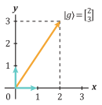
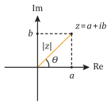
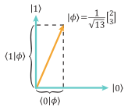
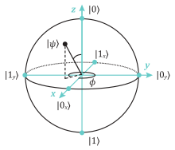

# Matematinių įrankių rinkinys {#matematikos-skyrius}

## Tiesinė algebra

Tiesinė algebra yra kvantinės kompiuterijos matematinė kalba. Šiame
skyriuje pateikiame jos pagrindinius konceptus bei kitus matematinius
įrankius, kurių naudojimą bus galima aptikti įvairiose knygos vietose.
Tai jokiu būdu nėra pilnutinis tiesinės algebros išdėstymas -- išsamesnį pristatymą, esant poreikiui, galima
rasti matematikos ir fizikos sričių literatūros šaltiniuose, kurių dalis
yra pateikta knygos pabaigoje.

Pagrindiniai objektai tiesinėje algebroje yra vektorių erdvės, kurių
elementai -- vektoriai. Kvantinėje kompiuterijoje aptinkamos vien
baigtinio dimensijų skaičiaus vektorių erdvės. Taip yra todėl, kad
naudojamas baigtinis $n$ skaičius kubitų, pavienių kubitų būsena yra
nusakoma vektoriumi 2 dimensijų vektorių erdvėje, o jų bendra būsena
$2^n$ dimensijose. Baigtinio dimensijų skaičiaus sistemas yra lengviau
analizuoti -- išvengiama matematinių komplikacijų, dažnai sutinkamų
kitose kvantinėse sistemose su begaliniu dimensijų skaičiumi ir
reikalaujančių papildomo žinių bagažo. Tad, šiuo požiūriu,
koncentruojantis vien į baigtinio dimensijų skaičiaus sistemas galima
žymiai greičiau įsisavinti esminius konceptus.

Vektoriai yra aptinkami įvairiausiose srityse ir dažnai apibūdinami kaip
rodyklytės erdvėje, turinčios tam tikrą ilgį bei orientaciją. Kvantinėje
kompiuterijoje tik specifinėse situacijose tokia vektorių vaizdinė
reprezentacija yra įmanoma, pavyzdžiui, perteikiant vieno kubito būseną
vektoriumi Blocho sferoje. Panašios vizualizacijos, be abejo, yra
naudingos įgauti pradinę intuiciją apie vektorius ir jų transformacijas.
Vis dėlto yra tikslingiau galvoti apie vektorius tiesiog kaip apie
abstrakčius objektus, turinčius nurodytas savybes. Jos nusako, kaip
galima sudėti vektorius ir sudauginti juos su skaičiais. Vektorių
vizualizacijos keblumas kvantinėje kompiuterijoje atsiranda dėl to, kad
šie vektoriai yra apibrėžti kompleksinėje **vektorių erdvėje**
(angl. *complex vector space*), o ne įprastinėje realiųjų skaičių
**Euklido erdvėje** (angl. *Euclidean vector space*). Be to, kvantinės
būsenos yra formaliai nusakomos **spinduliais** (angl. *rays*), nors ir
įprasta sakyti, kad vektoriais. Spindulys yra grupė vektorių, kurie
skiriasi tarp savęs tik globalia faze (čia reikia atskirti nuo
santykinės fazės). Pavyzdžiui, kvantinė būsena, nusakyta
$|v\rangle$ arba $- |v\rangle$
vektoriais, yra fiziškai identiška, nors tai ir reikštų skirtingus
euklidinius vektorius, orientuotus antiparaleliai.

Kvantinėje kompiuterijoje kompleksinių vektorių
baigtinio dydžio $d$ dimensijų erdvę žymėsime simboliu $V^d$.
Viršuje užrašome erdvės dimensiją $d$ (natūralusis teigiamasis
skaičius), jeigu yra poreikis specifinėje situacijoje ją įvardyti.
Vektorių erdvės elementai yra vektoriai, kuriuos visada galime išreikšti
sugrupuotų kompleksinių skaičių stulpeliu:
\begin{equation}
|v\rangle = \begin{bmatrix}
z_1 \\
z_2 \\
\vdots \\
z_n \\
\end{bmatrix}\,.
(\#eq:vektorius-stulpelis)
\end{equation}
Skliausteliai, turintys formą $|\ldots \rangle$ yra
naudojami įvardyti kad šis objektas yra vektorius stulpelis. Skaičius
žymime indeksuotomis mažosiomis raidėmis $z_i$. Norint glaustai
parodyti, kad vektorius $|v\rangle$ priklauso tam tikrai
vektorių erdvei $V$, rašome $|v\rangle \in V$. Simbolis
$\in$ nusako, kad kairėje esantis objektas yra vienas iš dešinėje
esančio objekto elementų.

Elementų $z_i$ skaičius vektoriuje nusako vektorių erdvės dimensijų
skaičių. Vektorius galima sudėti tik tuo atveju, jeigu jie priklauso tai
pačiai vektorių erdvei. Apsistojant ties viena reprezentatyvia vektorių
erdve $V$, joje yra apibrėžtos vektorių sudėties operacijos,
tenkinančios šias savybes:

\begin{equation}
|v_1 \rangle + |v_2 \rangle = |v_2 \rangle + |v_1 \rangle\,;
(\#eq:sudeties-savybe-1)
\end{equation}
\begin{equation}
|v_1 \rangle + \big( |v_2\rangle + |v_3 \rangle \big) = \big( |v_1 \rangle + |v_2 \rangle \big) + |v_3\rangle\,.
(\#eq:sudeties-savybe-2)
\end{equation}

Tai bendrai parodo, kad eiliškumas vektorių sudėčiai nėra svarbus.
Vektorių erdvėje taip pat egzistuoja nulinis vektorius, analogiškas
nuliniam skaičiui. Kvantinėje kompiuterijoje $|0 \rangle$
yra jau paskirtas kitkam, tad nusakyti nuliniam vektoriui vartojamas
simbolis 0. Nulinio vektoriaus efektas apibūdinamas
$|v\rangle + 0 = |v \rangle$, iš to
gauname $|v\rangle - |v\rangle = 0$.

Kompleksinio skaičiaus $z_i$ daugyba su vektoriais tenkina šias
savybes:

\begin{equation}
z\big( |v_1 \rangle + |v_2 \rangle \big) = z |v_1\rangle + z |v_2\rangle\,;
(\#eq:daugybos-savybe-1)
\end{equation}
\begin{equation}
( z_1 + z_2 ) |v \rangle = z_1 |v \rangle + z_2 |v \rangle\,;
(\#eq:daugybos-savybe-2)
\end{equation}
\begin{equation}
( z_1 z_2 ) |v \rangle = z_1 \big(z_2 |v \rangle\big)\,.
(\#eq:daugybos-savybe-3)
\end{equation}

Atkreipiame dėmesį, kad sandaugose praleidžiame daugybos simbolį, tad du
vienas šalia kito raidėmis nusakyti skaičiai (ar skaičius su vektoriumi)
reiškia, kad jie yra sudauginami. Skaičių daugybai nesvarbu eiliškumas
$z_1 z_2 = z_2 z_1$. Taip pat galima daugyba su nuliniu skaičiumi,
deja, taip pat žymimu $0$, $0 |v \rangle = 0$. Tai yra visos
elementariosios ir itin intuityvios aritmetinės operacijos. Šių
aritmetinių operacijų metu gautas vektorius vėlgi priklauso tai pačiai
vektorių erdvei. Kvantinėse sistemose yra apibrėžta vadinamoji dviejų
vektorių vidinė sandauga, žymima
$\langle v |u \rangle$, kurios rezultatas yra
skaičius. Prie vidinės sandaugos šiame skyriuje dar sugrįšime.

Toliau primename vektorių, išreikštų sugrupuotų skaičių stulpeliais,
aritmetiką. Imant kaip pavyzdį trijų elementų vektorius, sudėtis
nusakoma:
\begin{equation}
\begin{bmatrix}
z_1 \\
z_2 \\
z_3 \\
\end{bmatrix} + \begin{bmatrix}
z_4 \\
z_5 \\
z_6 \\
\end{bmatrix} = \begin{bmatrix}
z_1 + z_4 \\
z_2 + z_5 \\
z_3 + z_6 \\
\end{bmatrix}\,.
(\#eq:triju-elementu-sudetis)
\end{equation}
Čia kiekvienas elementas $z_i$ yra kompleksinis skaičius. Vektoriaus
ir skaičiaus $g$ sandauga:
\begin{equation}
g\begin{bmatrix}
z_1 \\
z_2 \\
z_3 \\
\end{bmatrix} = \begin{bmatrix}
g z_1 \\
g z_2 \\
g z_3 \\
\end{bmatrix}\,.
(\#eq:vektoriaus-skaiciaus-sandauga)
\end{equation}
Kiti du svarbūs konceptai yra vektorių erdvę dengiantis vektorių
rinkinys (angl. *spanning set*) ir vektorių **tiesinė nepriklausomybė**
(angl. *linear independence*). Vektorių erdvę $V$ dengiantis rinkinys
$\big\{ |v_1\rangle , |v_2\rangle , |v_3 \rangle\ldots \big\}$
yra toks vektorių rinkinys, kurių tiesinėmis kombinacijomis galima
išreikšti bet kokį vektorių $|v\rangle$, esantį $V$. Tai
yra:
\begin{equation}
|v \rangle = \sum_i z_i |v_i\rangle\,.
(\#eq:dengiantis-rinkinys)
\end{equation}
Tiesinė vektorių nepriklausomybė leidžia formaliai nusakyti vektorių
erdvės dimensiją ir tuo pačiu rasti mažiausią skaičių vektorių,
dengiančių vektorių erdvę $V$. Vektoriai
$\big\{|v_1 \rangle , |v_2 \rangle ,\ldots , |v_n \rangle\big\}$
yra tiesiškai priklausomi, jeigu bent vienas vektorius šiame rinkinyje,
sakysime $|v_2 \rangle$, gali būti išreikštas likusių
$n-1$ vektorių tiesinėmis kombinacijomis:
\begin{equation}
z_1 |v_1\rangle + z_3 |v_2 \rangle + \cdots + z_n |v_n \rangle = |v_2\rangle\,.
(\#eq:tiesiskai-priklausomi)
\end{equation}
Tiesiškai nepriklausomų vektorių rinkinyje nė vieno iš jų neįmanoma
išreikšti kitų likusiųjų suma. Formaliai, tiesiškai priklausomas
vektorių rinkinys tenkina šią lygybę:
\begin{equation}
z_1 |v_1 \rangle + z_2 |v_2\rangle + \cdots + z_n |v_n \rangle = 0\,.
(\#eq:tiesiskai-priklausomi-2)
\end{equation}
Čia suma lygi nuliniam vektoriui ir joje egzistuoja skaičiai $z_i$,
kurie ne visi lygūs nuliui $z_i \neq 0$. O štai tiesiškai
nepriklausomame vektorių rinkinyje ši lygybė gali būti tenkinama tik tuo
atveju, jeigu visi skaičiai $z_i = 0$.

Galima parodyti, kad bet kurie du skirtingi tiesiškai nepriklausomi
vektorių rinkiniai, dengiantys tą pačią vektorių erdvę $V$, turi vienodą
skaičių vektorių. Vektoriai, priklausantys tokiam rinkiniui, yra
vadinami **baziniais vektoriais** (angl. *basis vectors*), o jų skaičius
rinkinyje formaliai nusako vektorių erdvės *V* dimensiją. Pavyzdžiui,
imkime 3 dimensijų erdvės bazinių vektorių rinkinį:
\begin{equation}
|v_1 \rangle = \begin{bmatrix}
1 \\
0 \\
0 \\
\end{bmatrix},\quad |v_2\rangle = \begin{bmatrix}
0 \\
1 \\
0 \\
\end{bmatrix},\quad |v_3 \rangle = \begin{bmatrix}
0 \\
0 \\
1 \\
\end{bmatrix}\,.
(\#eq:baziniai-vektoriai-3d)
\end{equation}
Matome, kad bet kokį vektorių $|v\rangle$ šioje erdvėje
galime išreikšti jų suma:
\begin{equation}
|v\rangle = \begin{bmatrix}
a \\
b \\
c \\
\end{bmatrix} = a\begin{bmatrix}
1 \\
0 \\
0 \\
\end{bmatrix} + b\begin{bmatrix}
0 \\
1 \\
0 \\
\end{bmatrix} + c\begin{bmatrix}
0 \\
0 \\
1 \\
\end{bmatrix}\,.
(\#eq:isreiskimas-per-bazinius-3d)
\end{equation}
Taip pat akivaizdu, kad dviejų bazinių vektorių, pavyzdžiui
$|v_1 \rangle$ ir $|v_3 \rangle$,
nepakaktų išreikšti visus įmanomus vektorius šioje erdvėje. Keturi
baziniai vektoriai 3 dimensijose būtų perteklius, kadangi vieną iš jų
visada galime išreikšti kitų suma. Egzistuoja begalė skirtingų bazinių
vektorių rinkinių. Pavyzdžiui, kitas rinkinys:
\begin{equation}
|v_1 \rangle = \begin{bmatrix}
2 \\
- 1 \\
0 \\
\end{bmatrix},\quad |v_2 \rangle = \begin{bmatrix}
2 \\
5 \\
3 \\
\end{bmatrix},\quad |v_3 \rangle = \begin{bmatrix}
1 \\
1 \\
1 \\
\end{bmatrix}\,.
(\#eq:kitas-baziniu-rinkinys)
\end{equation}
Siekdami patikrinti šių vektorių tiesinę nepriklausomybę išspręstume
trijų lygčių sistemą:
\begin{equation}
\begin{aligned}
2a + 2b + c =& 0\,, \\
-a + 5b + c =& 0\,,\\
3b + c  =& 0\,. \\
\end{aligned}
(\#eq:vektoriu-nepriklausomybes-sistema)
\end{equation}
Sistemą išsprendę rastume, kad vieninteliai skaičiai, tenkinantys
lygybę, yra $a = b = c = 0$. Vienas svarbus skirtumas tarp šio bazinio
vektorių rinkinio ir parodyto anksčiau yra tai, kad ankstesniame
rinkinyje visi vektoriai tarpusavyje sudaro stačiuosius kampus.
Kompleksinėje vektorių erdvėje statmenumo konceptas yra vadinamas
ortogonalumu. Dviejų vektorių ortogonalumą, kaip matysime vėliau, galima
nustatyti atlikus jų vidinę sandaugą,
$\langle v_m |v_n \rangle$. Jeigu du
(nenuliniai) vektoriai yra ortogonalieji, jų vidinė sandauga visada bus
skaičius, lygus nuliui.

Kvantinėje kompiuterijoje 2 dimensijų kompleksinių vektorių erdvės
$V^2$ nusako individualių kubitų būsenų erdvę. Bendra vieno kubito
būsena yra vektorius:
\begin{equation}
|\psi\rangle = a|0\rangle + b|1\rangle\,.
(\#eq:bendra-kubito-busena)
\end{equation}
Čia $|0\rangle$ ir $|1\rangle$ yra
standartiškai naudojami baziniai vektoriai, dar vadinami
skaičiuojamaisiais baziniais vektoriais. Išreiškus juos stulpeliniu
vektoriumi:
\begin{equation}
|0\rangle = \begin{bmatrix}
1 \\
0 \\
\end{bmatrix},\quad |1\rangle = \begin{bmatrix}
0 \\
1 \\
\end{bmatrix}\,.
(\#eq:baziniai-vektoriai-stulpeliais)
\end{equation}
Galima lengvai patikrinti, kad šis dviejų vektorių rinkinys
$\big\{|0\rangle , |1\rangle\big\}$ yra tiesiškai
nepriklausomas ir todėl jų kombinacijomis galima išreikšti bet kokį kitą
vektorių $|v\rangle$ šioje 2 dimensijų erdvėje keičiant
koeficientus $a$ ir $b$:
\begin{equation}
|v\rangle = a\begin{bmatrix}
1 \\
0 \\
\end{bmatrix} + b\begin{bmatrix}
0 \\
1 \\
\end{bmatrix} = \begin{bmatrix}
a \\
b \\
\end{bmatrix}\,.
(\#eq:bet-koks-vektorius-per-bazinius)
\end{equation}
Kvantinėje mechanikoje koeficientai turi tenkinti lygybę
$|a|^2 + |b|^2 = 1$. Nors šis bazinių vektorių rinkinys kvantinėje
kompiuterijoje naudojamas standartiškai, tačiau skirtingų bazinių
rinkinių yra begalė. Kitas dažnai aptinkamas ortogonalus 1 kubito
būsenas nusakantis rinkinys yra šis:
\begin{equation}
|0_x \rangle = \frac{1}{\sqrt{2}}\begin{bmatrix}
1 \\
1 \\
\end{bmatrix},\quad
|1_x \rangle = \frac{1}{\sqrt{2}}\begin{bmatrix}
1 \\
-1 \\
\end{bmatrix}\,.
(\#eq:kitas-busenu-rinkinys)
\end{equation}
Palyginę su $\big\{|0\rangle, |1\rangle\big\}$
matome, kad
$\big\{|0_x \rangle, |1_x \rangle\big\}$
rinkinyje bazinius vektorius galime išreikšti sudėję bei atėmę pirmųjų
elementus, atitinkamai, naudojant koeficientus $a = b = 1/\sqrt{2}$:
\begin{equation}
|0_x \rangle = \frac{1}{\sqrt{2}}\big(|0\rangle + |1\rangle\big)\,,\quad
|1_x \rangle = \frac{1}{\sqrt{2}}\big(|0\rangle - |1\rangle\big)\,.
(\#eq:isreiskimas-per-pirmuosius-bazinius)
\end{equation}
Dviejų bazinių vektorių suma kvantinėje kompiuterijoje yra vadinama
būsenų superpozicija. Tiesinės algebros požiūriu, tai tiesiog atspindi
vieną galimą būdą išreikšti vektorių sąlygiškai su kitais dviem.

Užbaigdami šią dalį atitrūksime nuo kompleksinių skaičių ir kvantinių
sistemų. Kompleksinių skaičių vartojimas komplikuoja vektorių, kaip
matematinių objektų, iliustravimą. Siekiant susidaryti intuiciją yra
palankiau sugrįžti prie realiosios Euklido vektorių erdvės, kurioje
galima vektorius pavaizduoti rodyklyte. Euklido erdvėje vektorių daugyba
yra galima tik su realiaisiais skaičiais. Realieji skaičiai yra
vartojami nusakant kasdienius dydžius, tokius kaip atstumas, aukštis,
valiutos kiekis sąskaitoje ir panašiai. Vektorius nusako dydį, bet dar
pateikia ir informaciją apie kryptį. Paprastas pavyzdys būtų greičio
vektorius, suteikiantis informaciją apie greitį bei judėjimo kryptį.
Imkime kaip pavyzdį greitumo vektorių $|g\rangle$,
nusakantį greitį 2 dimensijose (plokštumoje):
\begin{equation}
|g \rangle = \begin{bmatrix}
2 \\
3 \\
\end{bmatrix}\,.
(\#eq:greicio-pvz)
\end{equation}
Galime žvelgti į šiuos du skaičius stulpelyje, kaip suteikiančius
koordinates $(x, y)$. Naudojant statmeną $x$--$y$ koordinačių sistemą, šis
vektorius pavaizduotas \@ref(fig:vektoriaus-pvz) pav.

```{r vektoriaus-pvz, echo=FALSE, fig.cap="Vektoriaus pavyzdys plokštumoje. Joje priskirta stačiakampė $x$--$y$ kordinačių sistema; vienetiniai vektoriai pažymėti žalia spalva", out.width='28%', fig.align='center'}

```

Norėdami nubrėžti $|g\rangle$ vektorių, einame 2
žingsnius $x$ ašimi į dešinę ir 3 $y$ ašimi į viršų. Šiuo atveju nėra
svarbu, ar vektorius prasideda nuo 0, ar kitur, svarbu vektoriaus
orientacija ir ilgis. Vektoriaus ilgis $|g\rangle$
nusakys šiame pavyzdyje greitį, kurį rodytų spidometras. Taikydami
Pitagoro teoremą randame $|g\rangle$ ilgį
$\sqrt{2^2 + 3^2} = \sqrt{13}$. Vektoriaus iliustracijoje matome
$|0\rangle$ ir $|1\rangle,$ pažymėtus
rodyklytėmis, kurie atlieka, analogiškai su kubitais, bazinių vektorių
vaidmenį. Jie yra statmeni (ortogonalieji) vienas kito atžvilgiu ir
vienetinio ilgio. Vektorių $|g\rangle$ išreiškiame jais
taip:
\begin{equation}
|g\rangle = 2|0\rangle + 3|1\rangle = 2\begin{bmatrix}
1 \\
0 \\
\end{bmatrix} + 3\begin{bmatrix}
0 \\
1 \\
\end{bmatrix}\,.
(\#eq:greitis-per-bazinius)
\end{equation}
Visi įmanomi vektoriai šioje plokštumoje gali būti sukonstruoti
naudojant šiuos bazinius vektorius bei keičiant koeficientus $a$ ir $b$.
Bazinių vektorių rinkinys, analogiškas minėtam kubitų rinkiniui
$\big\{ |0_x \rangle, |1_x \rangle\big\}$,
šioje plokštumoje būtų gautas pasukus $|0\rangle$ ir
$|1\rangle$ kartu pagal laikrodžio rodyklę $45^{\circ}$ laipsnių
kampu išlaikant tarp jų statųjį kampą.

## Kompleksiniai skaičiai

Šie skaičiai turi realiąją ir menamąją dalis ir yra bendrai išreiškiami
$z = a + b\mathrm{i}$. Čia $a$ ir $b$ yra realieji skaičiai, kompleksinio
skaičiaus realioji (Re) ir menamoji (Im) dalys yra atitinkamai $a$ ir
$b$. Tai dar gali būti rašoma $\mathrm{Re}(z) = a$, $\mathrm{Im}(z) = b$. Skaičių $b$
dauginantis raide $\mathrm{i}$ žymimas narys yra menamasis vienetas, turintis
savybę:
\begin{equation}
\mathrm{i}^2 = -1\,.
(\#eq:i-kvadratas)
\end{equation}
Tad į realųjį skaičių galime žiūrėti kaip į kompleksinį skaičių, kuriame
menamoji dalis $b = 0$. Atliekant dviejų kompleksinių skaičių arba
kompleksinio ir realiojo skaičiaus sudėtis, realiosios ir menamosios
dalys yra sudedamos tarpusavyje atskirai:
\begin{equation}
(a + b\mathrm{i}) + (c + d\mathrm{i}) = (a + c) + (b + d)\mathrm{i}\,.
(\#eq:kompleksiniu-sudetis)
\end{equation}
Taikydami menamojo vieneto savybę bei kompleksinių skaičių sudėtį,
dviejų kompleksinių skaičių sandaugą randame:
\begin{equation}
(a + b\mathrm{i}) (c + d\mathrm{i}) = (ac - bd) + (ad + bc)\mathrm{i}\,.
(\#eq:kompleksiniu-sandauga)
\end{equation}
Atliekant skaičiavimus kvantinėje kompiuterijoje dažnai naudojamas
vadinamasis kompleksinis skaičiaus jungimas, dar įvardijamas kaip
**konjugacija** (angl. *complex conjugation*). Apačioje parodytas ryšys
tarp kompleksinio skaičiaus $z$ ir jo kompleksinės jungties, kuri yra
žymima su žvaigždute $z^{*}$:
\begin{equation}
z = a + b\mathrm{i}  \rightarrow z^{*} = a - b\mathrm{i}\,.
(\#eq:kompleksinis-jungtinumas)
\end{equation}
Kompleksinis jungimas apverčia menamosios dalies ženklą. Pavyzdžiui,
kvantinės būsenos kompleksinės amplitudės $z$ kvadratas yra
apskaičiuojamas naudojant kompleksinę jungtį:
\begin{equation}
|z|^2 = z z^{*} = (a + b\mathrm{i}) (a - b\mathrm{i}) = a^2 + b^2\,.
(\#eq:kompleksinis-amplitudes-kvadratas)
\end{equation}
Čia $|z|$ reiškia šio skaičiaus modulį ir
matome, kad $z z^{*}$ visada yra realusis skaičius. Kompleksinius
skaičius galime išreikšti grafiškai plokštumoje, kurioje horizontalioji
ir vertikalioji ašys nusako realiąją (Re) ir menamąją (Im) dalis,
atitinkamai.

```{r kompleksinio-vaizdavimas, echo=FALSE, fig.cap="Kompleksinio skaičiaus pavaizdavimas stačiakampėje Re--Im koordinačių sistemoje pateikiant koordinates $(a, b)$. Naudojant polines koordinates, pateikiamas spindulio ilgis ir kampas ($|z|$, $\\theta$)", out.width='30%', fig.align='center'}

```

Viršuje parodyti du būdai išreikšti kompleksiniam skaičiui. Galime
nusakyti kompleksinį skaičių $(a, b)$ koordinatėmis Re--Im koordinačių
sistemoje arba išreikšti $z$ polinėje koordinačių sistemoje. Nubrėžę
spindulį nuo koordinačių centro iki $(a, b)$ taško, spindulys sudaro
$\theta$ kampą su Re ašimi. Kadangi spindulio ilgis yra
$|z| = \sqrt{a^2 + b^2}$, koordinates $(a, b)$ galime išreikšti
$\big(a = |z|\cos(\theta), b = |z|\sin(\theta)\big)$. Tad polinėje koordinačių
sistemoje nusakomi du parametrai, spindulio ilgis ir kampas ($|z|$, $\theta$).

Jeigu imsime kompleksinį skaičių, kurio spindulio ilgis $|z| = 1$,
Oilerio formulė (angl. *Euler formula*) mums rodo:
\begin{equation}
\mathrm{e}^{\mathrm{i}\theta} = \cos(\theta) + \mathrm{i}\sin(\theta)\,.
(\#eq:oilerio-formule)
\end{equation}
Oilerio formulėje $\mathrm{e}$ yra natūraliojo logaritmo pagrindas, kurio reikšmė
$\mathrm{e}\sim 2.718\ldots$ . Akivaizdu, kad Oilerio funkcijos modulis
$\big|\mathrm{e}^{\mathrm{i}\theta}\big| = 1$. Bet kokį kompleksinį skaičių $z$ galime išreikšti
taip:
\begin{equation}
z = |z|\mathrm{e}^{\mathrm{i}\theta}\,.
(\#eq:kompleksinio-eksponentine-israiska)
\end{equation}
Taip išreikšto skaičiaus $z$ kompleksinė jungtis bei jo modulio
kvadratas, minėti viršuje, gaunami atliekant konjugaciją eksponentėje:
\begin{align}
z^{*} = & |z|\mathrm{e}^{-\mathrm{i}\theta}\,;(\#eq:kompleksinis-jungtinis-eksponente)\\
|z|^2 = & |z| |z|\mathrm{e}^{-\mathrm{i}\theta}\mathrm{e}^{\mathrm{i}\theta}= |z|^2\,. (\#eq:kompleksinis-modulis-eksponente)
\end{align}
Viršuje pritaikėme eksponenčių daugybos formulę,
$\mathrm{e}^{\mathrm{i}a}\mathrm{e}^{\mathrm{i}b} = \mathrm{e}^{\mathrm{i}(a + b)}$ bei $\mathrm{e}^0 = 1$.

## Vidinė vektorių sandauga

Šioje dalyje apibūdiname kvantinėje kompiuterijoje dažnai aptinkamą
**vidinę dviejų vektorių sandaugą** (angl. *inner product*), dar
vadinama **skaliarine sandauga** (angl. *scalar product*)*.* Vektorius
$|\psi\rangle$ su tokio tipo skliausteliais yra
vadinamas *ket* ir yra asocijuojamas su stulpeliniu vektoriumi.
Vektorius eilutė yra žymimas apsuktais skliausteliais,
$\langle\psi|$ ir vadinamas *bra*. Iš bet kokio *ket*
vektoriaus galime padaryti *bra* vektorių dviem žingsniais. Pavyzdžiui,
turime *ket* su keturiais elementais:
\begin{equation}
|\psi\rangle = \begin{bmatrix}
a_1 \\
a_2 \\
a_3 \\
a_4 \\
\end{bmatrix}\,.
(\#eq:ket-pvz)
\end{equation}
Visi $|\psi\rangle$ vektoriaus elementai yra bendrai
kompleksiniai skaičiai. Pirmame žingsnyje vektorius eilutė yra gaunamas
atlikus vadinamąją **transpoziciją** (angl. *transposition*), žymimą *T*
raide virš vektoriaus $|\psi\rangle^T$. Elementai
stulpelyje iš viršaus į apačią yra pergrupuojami eilutėje iš kairės į
dešinę:
\begin{equation}
|\psi\rangle^T = \lbrack a_1\: a_2\: a_3\: a_4\rbrack\,.
(\#eq:transpozicijos-pvz)
\end{equation}
Galiausiai, *bra* vektorius yra gaunamas atlikus transponuotajam
vektoriui kiekvieno jo elemento kompleksinę jungtį
$\big(|\psi\rangle^T\big)^{*}= |\psi\rangle^{\dagger} = \langle\psi|$.
Ši dviguba operacija yra vadinama ermitine jungtimi, kuriai nurodyti
vartojamas durklo formos ženklas $\dagger$. Tad galiausiai randame:
\begin{equation}
|\psi\rangle^{\dagger} = \langle\psi|  = \lbrack a_1^{*}\: a_2^{*}\: a_3^{*}\: a_4^{*}\rbrack\,.
(\#eq:ermitine-jungtis-pvz)
\end{equation}
*Bra* vektoriai yra **dualūs** *ket* vektoriams (angl. *dual vector*) --
kiekvienas *bra* turi vieną sau atitinkantį *ket*. Formaliai, jeigu
$|\psi\rangle$ yra $V$ vektorių erdvės elementas, tai
jam dualus $\langle\psi|$ vektorius yra dualios
$\overline{V}$ vektorių erdvės elementas. Kadangi *ket* ir *bra* yra
skirtingų erdvių elementai, jų tarpusavyje sudėti negalima, tai yra
neapibrėžta operacija. Tačiau visos minėtos operacijos *bra* vektorių
erdvėje $\overline{V}$ yra identiškos *ket* $V$ erdvei.

Vidinė dviejų vektorių sandauga yra atliekama tarp *bra* ir *ket*
vektorių, tiesinėje algebroje -- tarp vektoriaus eilutės ir stulpelio.
Imkime kaip pirmą pavyzdį vidinę $|\psi\rangle$
vektoriaus sandaugą su sau dualiu vektoriumi,
$\langle\psi|\psi\rangle$. Rašant
vektoriaus elementais, vidinė sandauga formaliai išreiškiama:
\begin{equation}
\begin{aligned}
\langle\psi|\psi\rangle = & \lbrack a_1^{*}\: a_2^{*}\: a_3^{*}\: a_4^{*} \rbrack \begin{bmatrix}
a_1 \\
a_2 \\
a_3 \\
a_4 \\
\end{bmatrix} \\
= & a_1^{*} a_1 + a_2^{*} a_{2} + a_3^{*} a_{3} + a_4^{*} a_{4} \\
= & |a_1|^2 + |a_2|^2 + |a_3|^2 + |a_4|^2\,.
\end{aligned}
(\#eq:vidine-sandauga-su-dualiu)
\end{equation}
Matome, kad atlikus vidinę vektoriaus sandaugą su sau dualiu vektoriumi
rezultatas visada bus realusis neneigiamasis skaičius,
$\langle \psi|\psi\rangle \geq 0$. Šis
skaičius nusako kompleksinių kvadratų sumą, kurią dar galime
identifikuoti kaip $|\psi\rangle$ vektoriaus ilgio
kvadratą. Kvantinės būsenos yra nusakomos normuotaisiais vektoriais, tai
yra, turinčiais vienetinį vektoriaus ilgį. Tad normuotojo vektoriaus
vidinė sandauga su savo dualiuoju vektoriumi visada lygi vienetui,
$\langle\psi |\psi\rangle = 1$. Galime bet
kurį vektorių padaryti normuotuoju, jeigu jis toks nėra, padalindami jį
iš skaičiaus, nusakančio vektoriaus ilgį
$\sqrt{\langle\psi |\psi\rangle}$:
\begin{equation}
|\hat{\psi}\rangle = |\psi\rangle/\sqrt{\langle\psi |\psi\rangle}\,.
(\#eq:vektoriaus-sunormavimas)
\end{equation}
Dviejų skirtingų tos pačios vektorių erdvės vektorių
$|\psi\rangle$ ir $|\phi\rangle$ vidinė
sandauga $\langle\psi|\phi\rangle$ yra:
\begin{equation}
\langle\psi |\phi\rangle = \lbrack a_1^{*}\: a_2^{*}\: a_3^{*}\: a_4^{*}\rbrack\ \begin{bmatrix}
b_1 \\
b_2 \\
b_3 \\
b_4 \\
\end{bmatrix} = a_1^{*} b_1 +a_2^{*} b_2 + a_3^{*} b_3 + a_4^{*} b_{4}\,.
(\#eq:skirtingu-vidine-sandauga)
\end{equation}
Dviejų vektorių, turinčių $n$ elementų, vidinė sandauga
$\langle\psi |\phi\rangle$ yra glaustai
užrašoma:
\begin{equation}
\langle\psi|\phi\rangle = \sum_{i = 1}^{n} a_i^{*} b_i\,.
(\#eq:n-elementu-vidine-sandauga)
\end{equation}
*Ket* ir *bra* eiliškumas (kuris vektorius rašomas kairėje ir kuris --
dešinėje) vidinėje sandaugoje gali būti svarbus, nes sudauginus
skirtingus vektorius gaunamas skaičius yra bendrai kompleksinis.
Skirtumas tarp jų eiliškumo slypi gauto skaičiaus kompleksiniame
jungime. Šį principą galima išreikšti taip:
\begin{equation}
\langle\psi|\phi\rangle = \big(\langle\phi|\psi\rangle\big)^{*}\,.
(\#eq:kompleksiskai-jungtine-vidine-sandauga)
\end{equation}
Skaičius vidinėje sandaugoje galime visada iškelti už jos:
\begin{equation}
\langle\psi|\big(z_1|\phi_1 \rangle + z_2|\phi_2\rangle\big) = z_1\langle\psi|\phi_1\rangle + z_2\langle\psi |\phi_2 \rangle\,.
(\#eq:skaiciaus-iskelimas-is-vidines)
\end{equation}
Vidinės sandaugos modulio kvadratas,
$\big|\langle\psi|\phi\rangle\big|^2$,
dar vadinamas kompleksiniu kvadratu, naudojant vektorių simboliką yra:
\begin{equation}
\big|\langle\psi|\phi\rangle\big|^2 = \langle\psi |\phi\rangle\langle\psi |\phi\rangle^{*}
= \langle\psi |\phi\rangle\langle\phi |\psi\rangle = \langle\phi |\psi\rangle\langle\psi |\phi\rangle =
\big|\langle\phi |\psi\rangle\big|^2\,.
(\#eq:vidines-sandaugos-modulio-kvadratas)
\end{equation}
Viršuje matome dviejų kompleksinių skaičių sandaugą, kuri yra gaunama iš
dviejų vidinių vektorių sandaugų
$\langle\psi |\phi\rangle$ ir
$\langle\phi |\psi\rangle$. Kadangi šie du
nariai nusako skaičius, juos galime pergrupuoti, kaip pageidaujama,
nekeičiant rezultato; tai ir parodyta viršuje. Kompleksiniame kvadrate
vektorių eiliškumas nėra svarbus.

Ortogonaliųjų vektorių normuotumas gali būti glaustai užrašytas taip:
$\langle v_i|v_j \rangle = \delta_{ij}$.
Čia simbolis $\delta_{ij}$ vadinamas **Kronekerio delta funkcija**
(angl. *Kronecker delta function*), kuri $\delta_{ij} = 0$, jeigu
$i \neq j$ (pavyzdžiui, baziniai vektoriai vidinėje sandaugoje skiriasi)
bei $\delta_{ij} = 1$, jeigu $i = j$. Imkime vektorių
$|v\rangle$, išreikštą ortogonaliaisiais baziniais
vektoriais $\big\{|v_i \rangle\big\}$ su atitinkamais
koeficientais $z_i$:
\begin{equation}
|v\rangle = \sum_i z_i |v_i \rangle\,.
(\#eq:vektoriaus-isreikstas-baziniais-pvz)
\end{equation}
Naudodami $\delta_{ij}$, bet kurį $i$-tąjį koeficientą $z_i$ galime
rasti atlikę vektoriaus $|v\rangle$ vidinę sandaugą su
atitinkamu *bra* $\langle v_i|$:
\begin{equation}
z_i = \langle v_i |v \rangle\,.
(\#eq:koeficiento-radimas)
\end{equation}
Vidinės sandaugos geometrinę interpretaciją galime lengviau pamatyti
naudodami 2 dimensijų Euklido vektorių erdvę. Imkime
$|\phi\rangle = a|0\rangle + b|1\rangle$
normuotąjį vektorių, išreikštą $|0\rangle$ ir
$|1\rangle$ baziniais vektoriais, ir konkretų $a$ ir $b$
koeficientų pavyzdį:
\begin{equation}
|\phi\rangle = \frac{2}{\sqrt{13}}|0\rangle + \frac{3}{\sqrt{13}}|1\rangle = \frac{1}{\sqrt{13}}\begin{bmatrix}
2 \\
3 \\
\end{bmatrix}\,.
(\#eq:konkretus-koeficientai-pvz)
\end{equation}
Atlikę šio vektoriaus vidinę sandaugą su $|0\rangle$
vektoriumi rasime:
\begin{equation}
\langle 0|\phi\rangle = \frac{2}{\sqrt{13}}\langle 0|0\rangle + \frac{3}{\sqrt{13}}\langle 0|1\rangle = \frac{2}{\sqrt{13}}\,.
(\#eq:vidine-sandauga-koeficientas-pvz)
\end{equation}
Viršuje
$\langle 0|0\rangle = 1$ ir
$\langle 0|1\rangle = 0$, naudojant bazinių
vektorių ortogonalumą ir normuotumą, apibendrinta minėta delta funkcija
$\langle v_i |v_j \rangle = \delta_{ij}$.
Galime šią vidinę sandaugą iliustruoti \@ref(fig:vektoriaus-dekompozicija-pvz) pav.

```{r vektoriaus-dekompozicija-pvz, echo=FALSE, fig.cap="Vektoriaus $|\\phi\\rangle$ dekompozicija į statmenus vienetinius (bazinius) vektorius $|0\\rangle$ ir $|1\\rangle$. Vidinės sandaugos čia nusako $|\\phi\\rangle$ vektoriaus projekcijas (arba persiklojimą) į atitinkamus bazinius vektorius", out.width='35%', fig.align='center'}

```

Nubrėžę brūkšniuotą statmeną liniją matome, kad vidinė sandauga
$\langle 0|\phi\rangle$ indikuoja
$|\phi\rangle$ vektoriaus projekcijos dydį (arba
persiklojimą) santykinai su $|0\rangle$ vektoriumi. Tai
atspindi koeficientas šalia $|0\rangle$ vektoriaus.
Analogiškai randama projekcija į $|1\rangle$ bazinį
vektorių vidinėje sandaugoje
$\langle 1|\phi\rangle$. Net ir
kompleksinėje vektorių erdvėje yra teisinga sakyti, kad
$\langle 0|\phi \rangle$ parodo, kokį
komponentą $|\phi\rangle$ turi
$|0\rangle$ atžvilgiu.

Norėdami įvertinti, kiek du normuotieji kompleksiniai vektoriai
persikloja, galime apskaičiuoti vidinės sandaugos modulį
\begin{equation}
\big|\langle\psi |\phi \rangle \big| =
\sqrt{\langle\psi |\phi\rangle\langle\phi |\psi\rangle} = \cos(\theta)\,.
(\#eq:vektoriu-persiklojimo-nustatymas)
\end{equation}
$\theta$ nusako kampą tarp vektorių $|\phi\rangle$ ir
$|\psi\rangle$. Verta atkreipti dėmesį, kad kampas čia
yra apibrėžtas $0 \leq \theta \leq \pi/2$, kadangi modulis visada
grąžina teigiamąjį skaičių. Matome, kad dviejų vienodų vektorių vidinės
sandaugos modulis yra 1, o ortogonaliųjų ($\theta = \pi/2$), žinoma, 0.

## Kubito reprezentacija Blocho sferoje

Vieno kubito būsenas
$|\psi\rangle = a |0\rangle + b|1\rangle$
įmanoma išreikšti geometriškai naudojant vadinamąją Blocho sferos
reprezentaciją. Kubitas šioje reprezentacijoje pavaizduojamas kaip
orientuotasis vektorius realioje 3 dimensijų erdvės Blocho sferoje,
prasidedantis nuo sferos centro ir užsibaigiantis jos paviršiuje. Tokį
kubito būsenos pavaizdavimą galime rasti pirmiausiai išreiškę
kompleksinius skaičius $a$ ir $b$ Oilerio formule:
\begin{equation}
|\psi\rangle = |a|\mathrm{e}^{\mathrm{i}\phi_1}|0\rangle + |b|\mathrm{e}^{\mathrm{i}\phi_2}|1\rangle\,.
(\#eq:koeficientai-oilerio-formule)
\end{equation}
Kadangi $\mathrm{e}^{\mathrm{i}\phi}$ narių modulis yra $|\mathrm{e}^{\mathrm{i}\phi}| = 1$ ir
amplitudės susideda $|a|^2 + |b|^2 = 1$, galime atlikti keitimą
$|a| + |b| = \cos(\alpha) + \sin(\alpha)$. Kampams paprastai yra
leidžiama kisti nuo 0 iki $2\pi$ apsukant visą ratą. Tačiau $|a|$ ir $|b|$
yra teigiamieji skaičiai, tad išsaugodami šį reikalavimą turime
apibrėžti $\alpha$ kampą $0 \leq \alpha \leq \pi/2$. Konvenciškai yra
taikomas keitimas $\alpha = \theta/2$ ir kampas $\theta$ apibrėžiamas
$0 \leq \theta \leq \pi$, tad amplitudės tampa
$|a| + |b| = \cos(\theta/2) + \sin(\theta/2)$. Iškeldami $\mathrm{e}^{\mathrm{i}\phi_1}$
narį ir pervadindami $\phi_2 - \phi_1 \equiv \phi$, gauname:
\begin{equation}
|\psi\rangle = \mathrm{e}^{\mathrm{i}\phi_1}\big(\cos(\theta/2)|0\rangle
+ \sin(\theta/2)\mathrm{e}^{\mathrm{i}\phi}|1\rangle\big)\,.
(\#eq:koeficientu-pertvarkymas-1)
\end{equation}
Kadangi globali kvantinės būsenos fazė neturi fizinės įtakos, galime
panaikinti narį $\mathrm{e}^{\mathrm{i}\phi_1}$. Taip prieiname prie kubito būsenos
Blocho reprezentacijos:
\begin{equation}
|\psi\rangle = \cos(\theta/2)|0\rangle + \sin(\theta/2)\mathrm{e}^{\mathrm{i}\phi}|1\rangle\,.
(\#eq:koeficientu-pertvarkymas-2)
\end{equation}
Iš pirmo žvilgsnio atrodytų, kad turint dvi kompleksines amplitudes $a$
ir $b$ reikia bendrai keturių realiųjų skaičių nusakyti bendrai kubito
būsenai. Tačiau dėl reikalavimo amplitudžių kvadratui susidėti į vienetą
ir įtakos nedarančios globalios fazės pakanka tik dviejų realiujų
skaičių. Pirmasis parametras $0 \leq \theta \leq \pi$ nusako ilgumos
kampą, kurį šioje reprezentacijoje Blocho vektorius sudaro su Blochos
sferos $z$ ašimi. Antrasis parametras $0 \leq \phi < 2\pi$, nusako
azimutinį kampą, kurį šio vektoriaus projekcija sudaro $x$--$y$
plokštumoje (sferos pusiaujyje) skaičiuojant nuo teigiamosios $x$ ašies.
Blocho vektorius, tolydžiai keičiant šiuos du parametrus, apibūdina
visus įmanomus taškus Blocho sferos paviršiuje.

```{r blocho-sfera-2, echo=FALSE, fig.cap="Bendra kubito būsena $|\\psi\\rangle$ nusakoma Blocho vektoriumi, pažymėtu nuo Blocho sferos centro iki jos paviršiaus. Išilgai $x$, $y$ ir $z$ ašių pažymėtos dažnai algoritmuose pasitelkiamos būsenos", out.width='45%', fig.align='center'}

```

Patikrinkime keletą orientacijų, kad pamatytume, kaip Blocho sferoje
pavaizduojamos skirtingos kubito būsenos. Jeigu imsime kampą
$\theta = 0$, tada $\cos(0/2) = 1$, $\sin(0/2) = 0$ ir randame, kad į
$+z$ orientuotas Blocho vektorius nusako $|0\rangle$
būseną. Jeigu imsime $\theta = \pi$, tada $\cos(\pi/2) = 0$,
$\sin(\pi/2) = 1$ ir randame, kad į $-z$ orientuotas vektorius nusako
$|1\rangle$ būseną. Šiame kubito parametrizavime
$|0\rangle$ ir $|1\rangle$ būsenos,
kurios, kaip žinome, yra ortogonalios, vaizduojamos kaip antiparaleliai
orientuoti Blocho vektoriai. Tai gali šiek tiek klaidinti ir šį
skirtumą, atsirandantį perteikiant 1 kubito kompleksinę vektorių erdvę
realioje sferoje, tiesiog reikia prisminti. Tad jeigu $z$ ašys nusako
$|0\rangle$ ir $|1\rangle$ būsenas,
kokios būsenos yra išilgai $x$ ir $y$ ašių? Šias būsenas vadinsime
atitinkamai $|0_x \rangle$ ir
$|1_x \rangle$ bei $|0_y \rangle$ ir
$|1_y \rangle$. Išilgai $x$ ašies turime
$\theta = \pi/2,$ o imdami $\phi = 0$ ir $\phi = \pi$ randame
$|0_x \rangle$ ir $|1_x \rangle$:
\begin{equation}
|0_x \rangle = \frac{1}{\sqrt{2}}\big( |0\rangle + |1\rangle\big)\,,\quad
|1_x \rangle = \frac{1}{\sqrt{2}}\big(|0\rangle - |1\rangle\big)\,.
(\#eq:busenos-isilgai-x)
\end{equation}
Išilgai $y$ ašies $\theta = \pi/2$ bei $\phi = \ \pi/2$ ir
$\phi = 3\pi/2$, randame $|0_y \rangle$ ir
$|1_y \rangle$:
\begin{equation}
|0_y \rangle = \frac{1}{\sqrt{2}}\big(|0\rangle + \mathrm{i}|1\rangle\big)\,,\quad
|1_y \rangle = \frac{1}{\sqrt{2}}\big(|0\rangle - \mathrm{i}|1\rangle)\,.
(\#eq:busenos-isilgai-y)
\end{equation}
Šios būsenos, kaip ir visos kitos $x$--$y$ plokštumoje, yra lygios
$|0\rangle$ ir $|1\rangle$ būsenų
superpozicijos, besiskiriančios viena nuo kitos santykinėmis $\phi$
fazėmis. Galima patikrinti jų ortogonalumą,
$\langle 0_x|1_x \rangle = 0$,
$\langle 0_y |1_y \rangle = 0$.

Trumpam grįžkime prie to, kodėl Blocho sferos reprezentacijoje atsiranda
pusiniai kampai $\theta/2$. Kvantiniai 1 kubito loginiai vartai yra
visiškai nusakomi unitariniais operatoriais, priklausančiais **SU(2)
grupei** (angl. *special unitary group*), kurie atlieka vektoriaus
rotaciją 2 kompleksinių dimensijų erdvėje. Tačiau Blocho sferoje vartų
efektą iliustruojame kaip vektoriaus rotacijas 3 dimensijų Euklido
erdvėje, kurias apibūdina operatoriai, priklausantys **SO(3) grupei**
(angl. *special orthogonal group*). Tarp šių grupių yra atsitiktinė
sąsaja, ledžianti atlikti SU(2) elemento vizualizaciją, tačiau SU(2)
grupė dvigubai dengia SO(3) grupę. Tai reiškia, kad du SU(2) elementus,
besiskiriančius tik $\pi$ faze, galime perteikti tuo pačiu elementu SO(3)
grupėje, išsaugodami visą likusią grupės struktūrą. Dėl to rotacija
$\theta$ kampu Blocho sferoje nusako $\theta/2$ rotaciją kompleksinėje
vektorių erdvėje. Turime apeiti Blocho sferą aplink du kartus
($\theta = 4\pi$) siekdami sugrįžti į tą pačią būseną.

## Tiesiniai operatoriai ir matricos

Kvantiniai loginiai vartai matematikoje yra nusakomi objektais, kurie
vadinami **tiesiniais operatoriais** (angl. *linear operator*).
Operatoriai, veikdami vektoriais nusakytas kvantines būsenas, apibūdina
šių vektorių transformacijas. Pavyzdžiui, 1 kubito Blocho sferos
reprezentacijoje operatoriaus veiksmas yra keisti Blocho vektoriaus
orientaciją sferoje. Formaliai, operatorius $A$ (vartojame didžiąsias
raides žymėti operatoriams) transformuoja kiekvieną vektorių
$|v\rangle \in V$ į kitą vektorių
$|u\rangle$, priklausantį tai pačiai vektorių erdvei,
$|u\rangle \in V$:
\begin{equation}
A|v\rangle = |u\rangle\,.
(\#eq:tiesinio-operatoriaus-apibrezimas)
\end{equation}
Operatoriaus veiksmas *ket* vektoriui yra užrašomas panašiai kaip jų
tarpusavio sandauga, kurioje operatorius stovi kairėje *ket* pusėje.
Toliau pateikiame elementarias operacijas tarp operatorių ir vektorių,
operatorių ir operatorių.

Skaičių, dauginantį vektorių, galima visada iškelti už operatoriaus ir
vektoriaus:
\begin{equation}
A\big(z|v\rangle\big) = zA|v\rangle\,.
(\#eq:skaiciaus-iskelimas-pries-operatoriu)
\end{equation}
Visi loginiai vartai kvantinėje kompiuterijoje yra tiesiniai
operatoriai. Operatoriaus tiesiškumo savybė jam veikiant bet kokius du
(ar daugiau) vektorius:
\begin{equation}
A\big(|v\rangle + |u\rangle\big) = A|v\rangle + A|u\rangle\,.
(\#eq:operatoriaus-tiesiskumo-savybe)
\end{equation}
Tai parodo, kad operatorius $A$ veikia atskirai kiekvieną vektorių
sumoje tiesiniu būdu. Kadangi bet kokį vektorių $V$ erdvėje galima
išreikšti pasirinktais baziniais vektoriais, norint nustatyti
$A|\psi\rangle$ pakanka žinoti, kaip tiesinis
operatorius veikia pasirinktus bazinius vektorius.

Du operatoriai $A$ ir $B$ yra lygūs ($A = B$), jeigu bet kokiam
vektoriui galioja sąlygos $|v\rangle \in V$,
$A|v\rangle = B|v\rangle$. Dviejų
tiesinių operatorių suma nusako kitą tiesinį operatorių $A + B = C$:
\begin{equation}
C|v\rangle = (A + B)|v\rangle = A|v\rangle + B|v\rangle\,.
(\#eq:operatoriu-sumos-apibrezimas)
\end{equation}
Operatorių sudėtyje eiliškumas nėra svarbus, $A + B = B + A$. Vienas iš
paprasčiausių operatorių yra **identitetas** (angl.* identity*), žymimas
simboliu $I$ ir dar vadinamas **vienetiniu operatoriumi**.
Identititetas, veikdamas vektorių, jo nekeičia
$I|v\rangle = |v\rangle$; tai yra
analogiška vektoriaus sandaugai su skaičiumi 1. Taip pat egzistuoja ir
nulinis operatorius, vadinsime jį $N$, $N|v\rangle = 0$.
Dviejų operatorių sandauga $AB = D$ nusako kitą operatorių:
\begin{equation}
AB|v\rangle = D|v\rangle\,.
(\#eq:operatoriu-sandaugos-apibrezimas)
\end{equation}
Kairėje lygties dalyje operatorius $B$ veikia vektorių
$|v\rangle$, toliau operatorius $A$ veikia gautą vektorių
$B|v\rangle$. Eiliškumas operatorių
sandaugoje bendrai yra svarbus, nes kvantinėje kompiuterijoje dažnai
aptinkami operatoriai, kuriems $AB \neq BA$. Tik itin specifinėse
situacijose galima aptikti, kai eiliškumas nėra svarbus, $AB = BA$. Kai
dviejų ar daugiau operatorių sandaugos eiliškumas nėra svarbus, tokie
operatoriai yra vadinami **tarpusavyje komutatyviais**
(angl. *commutative operators*). Dviejų operatorių komutatyvumas yra
standartiškai užrašomas įdedant juos į skliaustelius, kurios forma
išskleidus reiškia:
\begin{equation}
\lbrack A,B\rbrack = AB - BA\,.
(\#eq:operatoriu-komutatorius)
\end{equation}
Operatoriai $A$ ir $B$ yra komutatyvūs, jeigu $\lbrack A,B\rbrack = 0$
ir nekomutatyvūs, jeigu $\lbrack A,B\rbrack \neq 0$. Kita savybė, dviejų
operatorių **antikomutatyvumas** (angl. *anticommutative*), yra
operacija, apibrėžta lenktiniais skliausteliais:
\begin{equation}
\big\{ A,B \big\} = AB + BA\,.
(\#eq:operatoriu-antikomutatorius)
\end{equation}
Du operatoriai yra antikomutatyvieji, jeigu $\big\{ A,B \big\} = 0$.
Sukeitus antikomutatyviuosius operatorius vietomis skliausteliuose, jų
sandaugoje atsiranda minuso ženklas, nes $AB = - BA$. Šios dvi
operatorių klasės aptinkamos specifinėse kvantinių skaičiavimų
užduotyse, kaip bus aptarta vėliau.

Abstraktus operatorius kvantinėje kompiuterijoje gali būti visada
realizuojamas tiesinėje algebroje matricos forma -- sugrupuotų skaičių
lentele. Tai yra vadinama operatoriaus **vaizdavimas matrica**
(angl. *matrix representation*). Abstrakti operatoriaus forma ir
matricos forma yra ekvivalentiškos, tad šiuos terminus dažnai vartosime
pakaitomis. Verta atsiminti, kad jei norime realizuoti operatorių
matricos forma, reikia pasirinkti tam tikrą vektorių erdvės $V$, kuriame
veikia operatorius $A$, bazinių vektorių rinkinį. Mat operatorius gali
būti išreikštas su skirtingais bazinių vektorių rinkiniais. Jeigu nėra
nurodoma kitaip, operatoriai standartiškai išreiškiami skaičiuojamųjų
vektorių bazėje
$\big\{|0\rangle , |1\rangle\big\}$.

Išsamiau panagrinėkime, kaip tiesiniai operatoriai (loginiai vartai) yra
išreiškiami matricų forma, kuo išsiskiria tokių matricų savybės ir jų
aritmetika. Matrica, transformuojanti vektorių $n$ dimensijų vektorių
erdvėje, yra kvadratinės formos kompleksinių skaičių lentelė, turinti
($n\times n$) elementų (sakoma: $n$ stulpelių ir $n$ eilučių). Kadangi
$n$ kubitų vektorių erdvė yra $2^n$ dimensijų, kvantinėje
kompiuterijoje paprastai aptinkame tik kvadratines matricas su lyginiu
skaičiumi eilučių ir stulpelių. Pavyzdžiui, visos vieno kubito būsenas
nusakančios transformacijos yra išreiškiamos ($2\times 2$) dydžio matricomis.
Toliau pateikiame pagrindines aritmetines operacijas tarp matricų,
iliustracijai naudodami ($3\times 3$) matricų dydį.

Matricų sudėtis galima tik tarp tokio paties dydžio matricų. Dviejų
operatorių $A$ ir $B$, išreikštų matricomis, sudėtis:
\begin{equation}
\begin{aligned}
A + B = &\begin{bmatrix}
a_{11} & a_{12} & a_{13} \\
a_{21} & a_{22} & a_{23} \\
a_{31} & a_{32} & a_{33} \\
\end{bmatrix} + \begin{bmatrix}
b_{11} & b_{12} & b_{13} \\
b_{21} & b_{22} & b_{23} \\
b_{31} & b_{32} & b_{33} \\
\end{bmatrix} \\
= & \begin{bmatrix}
a_{11} + b_{11} & a_{12} + b_{12} & a_{13} + b_{13} \\
a_{21} + b_{21} & a_{22} + b_{22} & a_{23} + b_{23} \\
a_{31} + b_{31} & a_{32} + b_{32} & a_{33} + b_{33} \\
\end{bmatrix}\,.
\end{aligned}
(\#eq:operatoriai-matricu-sudetis)
\end{equation}
Matricų elementus, kurie yra bendrai kompleksiniai skaičiai, čia
vadiname $a_{ij}$ ir $b_{ij}$. Pirmasis simbolis $i$ padeda įvardyti
eilutės numerį (skaičiuojant nuo viršaus), antrasis simbolis $j$ --
stulpelio numerį (skaičiuojant iš kairės). Taip rašyti nebūtina, tačiau
pravartu siekiant greičiau įvardyti matricos elementus. Norint sudėti
dvi matricas $A$ ir $B$ jų stulpelių ir eilučių skaičius turi būti
vienodas. Sudėties tvarka yra nesvarbi $A + B = B + A$, vadovaujantis
minėta abstraktesne operatorių aritmetika. Skaičiaus ir matricos
sandauga $zA = Az$ yra apibrėžta:
\begin{equation}
z\begin{bmatrix}
a_{11} & a_{12} & a_{13} \\
a_{21} & a_{22} & a_{23} \\
a_{31} & a_{32} & a_{33} \\
\end{bmatrix} = \begin{bmatrix}
za_{11} & za_{12} & za_{13} \\
za_{21} & za_{22} & za_{23} \\
za_{31} & za_{32} & za_{33} \\
\end{bmatrix}\,.
(\#eq:skaiciaus-matricos-sandauga)
\end{equation}
Dviejų matricų sandauga tarpusavyje galima, jeigu pirmosios matricos
stulpelių skaičius yra lygus antrosios matricos eilučių skaičiui.
Kadangi čia susiduriame tik su kvadratinės formos matricomis, tai
reiškia, kad matricos sandaugoje turi būti tokio paties dydžio.
Sandaugoje gautas naujas darinys yra tokio paties dydžio nauja matrica.
Matricų $AB = C$ sandauga atliekama taip:
\begin{equation}
\begin{bmatrix}
a_{11} & a_{12} & a_{13} \\
a_{21} & a_{22} & a_{23} \\
a_{31} & a_{32} & a_{33} \\
\end{bmatrix}\begin{bmatrix}
b_{11} & b_{12} & b_{13} \\
b_{21} & b_{22} & b_{23} \\
b_{31} & b_{32} & b_{33} \\
\end{bmatrix} = \begin{bmatrix}
c_{11} & c_{12} & c_{13} \\
c_{21} & c_{22} & c_{23} \\
c_{31} & c_{32} & c_{33} \\
\end{bmatrix}\,.
(\#eq:matricu-sandauga-1)
\end{equation}
Kiekvienas elementas $c_{ij}$ yra atitinkamos $A$ eilutės ir $B$
stulpelio elementų sandaugų suma:
\begin{equation}
C = \begin{bmatrix}
a_{11}b_{11} + a_{12}b_{21} + a_{13}b_{31} & a_{11}b_{12} + a_{12}b_{22} + a_{13}b_{32} & a_{11}b_{13} + a_{12}b_{23} + a_{13}b_{33} \\
a_{21}b_{11} + a_{22}b_{21} + a_{23}b_{31} & a_{21}b_{12} + a_{22}b_{22} + a_{23}b_{32} & a_{21}b_{13} + a_{22}b_{23} + a_{23}b_{33} \\
a_{31}b_{11} + a_{12}b_{21} + a_{13}b_{31} & a_{31}b_{12} + a_{32}b_{22} + a_{33}b_{32} & a_{31}b_{13} + a_{32}b_{23} + a_{33}b_{33} \\
\end{bmatrix}\,.
(\#eq:matricu-sandauga-2)
\end{equation}
Matricų daugyba yra asociatyvi, pavyzdžiui, trijų operatorių sandaugoje
$ABC = A(BC) = (AB)C$. Galime pasirinkdami sudauginti pirmiausiai $BC$
arba $AB$ tarpusavyje. Šiame skyriuje minėtos vektorių operacijos:
vektoriaus transpozicija, kompleksinė bei ermitinė jungtys yra taip pat
naudojamos matricoms. Matricos transpozicija $A^T$ sukeičia eilučių ir
stulpelių elementus vietomis taip:
\begin{equation}
A^T = \begin{bmatrix}
a_{11} & a_{12} & a_{13} \\
a_{21} & a_{22} & a_{23} \\
a_{31} & a_{32} & a_{33} \\
\end{bmatrix}^{T} = \begin{bmatrix}
a_{11} & a_{21} & a_{31} \\
a_{12} & a_{22} & a_{32} \\
a_{13} & a_{23} & a_{33} \\
\end{bmatrix}\,.
(\#eq:matricos-transpozicija)
\end{equation}
Matricų sandaugoje transpozicija sukeičia operatorių eiliškumą,
$(AB)^T = B^T A^T$. Matricos kompleksinė jungtis $A^{*}$
kiekvienam jo elementui atlieka kompleksinę jungtį $a_{ij}^{*}$.
Ermitinė matricos jungtis taip pat yra kartu atliekama transpozicija ir
elementų kompleksinė jungtis $A^{\dagger} = \big(A^T\big)^{*}$:
\begin{equation}
A^{\dagger} = \begin{bmatrix}
a_{11} & a_{12} & a_{13} \\
a_{21} & a_{22} & a_{23} \\
a_{31} & a_{32} & a_{33} \\
\end{bmatrix}^{\dagger} = \begin{bmatrix}
a_{11}^{*} & a_{21}^{*} & a_{31}^{*} \\
a_{12}^{*} & a_{22}^{*} & a_{32}^{*} \\
a_{13}^{*} & a_{23}^{*} & a_{33}^{*} \\
\end{bmatrix}\,.
(\#eq:matricos-ermitine-jungtis)
\end{equation}
Matricų sandaugoje tai sukeičia eiliškumą
$(AB)^{\dagger} = B^{\dagger}A^{\dagger}$. Taip pat galima parodyti,
kad $(A^{\dagger})^{\dagger} = A$,
$(A + B)^{\dagger} = A^{\dagger} + B^{\dagger}$ ir
$(zA)^{\dagger} = z^{*}A^{\dagger}$.

Pateikiame keturis kvantinėje kompiuterijoje dažnai aptinkamus
operatorius ir jų matricų išraiškas skaičiuojamųjų
vektorių bazėje
$\big\{|0\rangle , |1\rangle\big\}$:
\begin{equation}
I = \begin{bmatrix}
1 & 0 \\
0 & 1 \\
\end{bmatrix}\,,\quad X = \begin{bmatrix}
0 & 1 \\
1 & 0 \\
\end{bmatrix}\,,\quad Y = \begin{bmatrix}
0 & - i \\
i & 0 \\
\end{bmatrix}\,,\quad Z = \begin{bmatrix}
1 & 0 \\
0 & - 1 \\
\end{bmatrix}\,.
(\#eq:daznai-naudojami-operatoriai)
\end{equation}
Šios matricos vadinamos fiziko **Pauli vardu** (angl. *Wolfgang Pauli*)
ir sudaro vadinamąjį Pauli bazinių matricų rinkinį $\{ I, X, Y, Z\}$.
Trys Pauli matricos $X$, $Y$, $Z$ yra tarpusavyje nekomutatyvios, bet
kurių dviejų Pauli matricų sandauga gražina trečiąją:
\begin{align}
XY = & \mathrm{i}Z\,,\quad XZ = -\mathrm{i}Y\,,\quad YZ = \mathrm{i}X\,; (\#eq:pauli-x-y-z)\\
YX = & -\mathrm{i}Z\,,\quad ZX = \mathrm{i}Y\,,\quad ZZ = - \mathrm{i}X\,. (\#eq:pauli-y-x-z)
\end{align}
Tai galime lengvai patikrinti, pavyzdžiui $XY$ ir $YX$:
\begin{align}
XY = & \begin{bmatrix}
0 & 1 \\
1 & 0 \\
\end{bmatrix}\begin{bmatrix}
0 & - \mathrm{i} \\
\mathrm{i} & 0 \\
\end{bmatrix} = \begin{bmatrix}
0 \cdot 0 + 1 \cdot \mathrm{i} & 0 \cdot 0 + 1 \cdot 0 \\
1 \cdot 0 + 0 \cdot \mathrm{i} & 1\cdot (-\mathrm{i}) + 0 \cdot 0 \\
\end{bmatrix} = \mathrm{i}\begin{bmatrix}
1 & 0 \\
0 & - 1 \\
\end{bmatrix} = \mathrm{i}Z\,; (\#eq:pauli-x-y)\\
YX = & \begin{bmatrix}
0 & -\mathrm{i} \\
\mathrm{i} & 0 \\
\end{bmatrix}\begin{bmatrix}
0 & 1 \\
1 & 0 \\
\end{bmatrix} = \begin{bmatrix}
0 \cdot 0 + 1 \cdot (-\mathrm{i}) & 0 \cdot 1 + 0 \cdot (-\mathrm{i}) \\
\mathrm{i}\cdot 0 + 0 \cdot 1 & \mathrm{i} \cdot 1 + 0 \cdot 0 \\
\end{bmatrix} = \mathrm{i}\begin{bmatrix}
-1 & 0 \\
0 & 1 \\
\end{bmatrix} = -\mathrm{i}Z\,. (\#eq:pauli-y-x)
\end{align}
Akivaizdu, kad $X$, $Y$, $Z$ Pauli operatoriai yra tarpusavyje
antikomutatyvūs.

Grįžkime prie vektorių veikimo operatoriumi, norėdami parodyti, kokios
operacijos yra matematiškai apibrėžtos. Tą galime pavaizduoti matricų
reprezentacija, nes vektorius gali būti taip pat formaliai vadinamas
matrica. Pavyzdžiui, vieno kubito *ket* vektorius
$|v\rangle$ yra išreiškiamas $(2\times 1)$ dydžio matrica
(vektorius stulpelis), tiesinėje algebroje turinčia dvi eilutes ir vieną
stulpelį. O štai *bra* vektorius $\langle v|$ yra
išreiškiamas $(1\times 2)$ matrica (vektorius eilutė), turinčia vieną eilutę
ir du stulpelius.

Prisimenant matricų daugybą, leidžiama dauginti dvi $(n\times n)$, $(n\times 1)$
dydžio matricas; tai atlikę gauname naują $(n\times 1)$ dydžio matricą, o
tiksliau -- vektorių stulpelį (*ket*). Tačiau šių dviejų matricų
atvirkštinė daugyba $(n\times 1)(n\times n)$ nėra galima, nes stulpelių
skaičius pirmojoje matricoje ir eilučių skaičius antrojoje neatitinka.
Tai parodo, kad negalimas *ket* vektoriaus veikimas operatoriumi; jeigu
*ket* stovi operatoriaus kairėje, $|v\rangle A$ yra
neapibrėžta operacija. Teisingas eiliškumas yra
$A|v\rangle$. *Bra* vektoriaus veikimas operatoriumi
atliekamas būtent *bra* esant operatoriaus kairėje
$\langle v|A$. Taip gaunamas kitas *bra* vektorius, nes
$(1\times n)(n\times n) = (1\times n)$. Šioje situacijoje neteisingas
eiliškumas būtų $A\langle v|$. Iliustracijai imkime
$X|0\rangle$ ir $\langle 0|X$:
\begin{align}
X|0\rangle = & \begin{bmatrix}
0 & 1 \\
1 & 0 \\
\end{bmatrix}\begin{bmatrix}
1 \\
0 \\
\end{bmatrix} = \begin{bmatrix}
0 \cdot 1 + 1 \cdot 0 \\
1 \cdot 1 + 0 \cdot 0 \\
\end{bmatrix} = \begin{bmatrix}
0 \\
1 \\
\end{bmatrix} = |1\rangle\,;(\#eq:x-0-pvz)\\
\langle 0| X = & \lbrack 1\: 0 \rbrack\begin{bmatrix}
0 & 1 \\
1 & 0 \\
\end{bmatrix} = \lbrack 1 \cdot 0 + 0 \cdot 1 + 1 \cdot 1 + 0 \cdot 0  \rbrack = \lbrack 0\: 1 \rbrack = \langle 1|\,.
(\#eq:0-x-pvz)
\end{align}
Pamename, kad
$|v\rangle^{\dagger} = \langle v|$ bei
$(AB)^{\dagger} = B^{\dagger}A^{\dagger}$. Iš to gauname, kad
$\big( A|v\rangle\big)^{\dagger} = \langle v| A^{\dagger}$.
Todėl dualioje erdvėje $A|v\rangle$ operacijos atitikmuo
yra ermitinė $A^{\dagger}$ operatoriaus jungtis, veikianti *bra*
vektorių iš dešinės $\langle v| A^{\dagger}$. Viršuje $X$
operatorius turi tokią savybę -- jo ermitinė jungtis yra lygi jam
pačiam, tad $X = X^{\dagger}$.

Taip pat atkreipiame dėmesį į tokio tipo operaciją:
\begin{equation}
\langle u | A | v \rangle = a_{uv}\,.
(\#eq:op-matricinis-elementas)
\end{equation}
Dėl daugybos asociatyvumo šią operaciją galime atlikti dviem būdais:
$\langle u|A|v\rangle = \langle u|\big(A|v\rangle\big) = \big(\langle u|A\big)|v\rangle$.
Naryje $\langle u|\big(A|v\rangle\big)$
operatorius $A$ veikia vektorių $|v\rangle$ iš kairės,
grąžindamas bendrai kitą vektorių, sakykime,
$A|v\rangle = |g\rangle$. Iš to gaunamas
vidinės sandaugos $\langle u|g\rangle$
rezultatas -- skaičius $a_{uv}$. Antruoju būdu naryje
$\big(\langle u|A\big)|v\rangle$ pirmiausiai
atliekama $\langle u|A$ ir toliau -- vidinė sandauga su
$|v\rangle$.

## Unitariniai ir ermitiniai operatoriai

Unitariniai operatoriai yra plačiausiai
naudojama ir aptinkama operatorių klasė kvantinėje kompiuterijoje. Šie
operatoriai matematiškai apibūdina kvantinių loginių vartų efektą -- jie
transformuoja vektoriais nusakomas kubitų būsenas į kitas būsenas.
Unitarinis operatorius $U$ pasižymi savybe šia savybe:
\begin{equation}
U^{\dagger}U = UU^{\dagger} = I\,.
(\#eq:unitarinio-apibrezimas)
\end{equation}
Tai parodo, kad unitarinio operatoriaus sandauga su jo ermitine jungtimi
$U^{\dagger}$ yra lygi vienetiniam operatoriui. Vadinasi, $U^{\dagger}$ yra
atvirkštinis $U$ operatoriui (rašoma $U^{\dagger}= U^{-1}$), ir todėl galima
visada atstatyti pradinį vektorių:
$U^{\dagger}U|v\rangle = I|v\rangle = |v\rangle$.
Unitariniai operatoriai turi kitą svarbią savybę -- veikdami vektorių
$|v\rangle$ transformuoja jį į kitą vektorių, tačiau
nekeičia vektoriaus ilgio. Dėl šios priežasties veikiantys du skirtingus
vektorius unitariniai operatoriai išsaugo jų vidinės sandaugos reikšmę.
Imkime du, nebūtinai ortogonaliuosius, vektorius
$|v\rangle$ ir $|u\rangle$. Minėtas $U$
savybes galime paprastai parodyti:
\begin{equation}
\langle u|U^{\dagger}U|v\rangle = \langle u|I|v\rangle = \langle u|v\rangle\,.
(\#eq:unitarinio-savybes)
\end{equation}
Jeigu $|v\rangle$ yra
normuotasis vektorius, $U$ išlaiko normuotumą
$\langle v|U^{\dagger}U |v\rangle = 1$. Tad
unitarinių operatorių efektas gali būti apibūdintas kaip vektorių
posūkis vektorių erdvėje. Jeigu $U$ veikia visus bazinius vektorius jų rinkinyje, tada naujai gauti vektoriai nusako kitą **transformuotą
bazinių vektorių rinkinį** (angl. *basis transformation*).

Kita svarbi operatorių klasė kvantinėje kompiuterijoje yra **ermitiniai
operatoriai** (angl. *hermitian operator*). Operatorių **tikrinių
vektorių** (angl. *eigenvector*) ir **tikrinių verčių**
(angl. *eigenvalue*) konceptai leidžia geriau suprasti ermitinių ir
unitarinių operatorių savybes bei jų vartojimą. Vektorius
$|\lambda\rangle$ yra vadinamas tiesinio operatoriaus
$K$ tikriniu vektoriumi, o $\lambda$ yra su šiuo vektoriumi susieta
tikrinė vertė (skaičius), jeigu tenkinama lygybė:
\begin{equation}
K|\lambda\rangle = \lambda |\lambda\rangle\,.
(\#eq:tikrines-vertes-apibrezimas)
\end{equation}
Atkreipiame dėmesį, kad bendroje situacijoje operatorius, veikdamas
vektorių, pakeičia jį į kitą vektorių. Tačiau jeigu
$|\lambda\rangle$ yra $K$ operatoriaus vienas iš
tikrinių vektorių, tada operatoriaus veiksmas šiam vektoriui yra lygus
vektoriaus $|\lambda\rangle$ ir skaičiaus $\lambda$
sandaugai -- pats vektorius nepakinta.

Operatoriaus tikrinės vertės $\lambda$ tenkina charakteristinę
determinantinę lygtį $\det(K - \lambda I) = 0$. Charakteristinė lygtis
yra bendrai $n$ laipsnio polinomas $p(\lambda) = 0$, todėl egzistuoja
$n$ skaičius tikrinių verčių
$(\lambda_1 , \lambda_2 ,\ldots , \lambda_n )$, tenkinančių
šią lygtį. Tikriniai vektoriai $|\lambda_i \rangle$ yra
randami antrame žingsnyje iš
lygties $(K - \lambda_i I)|\lambda_i \rangle = 0$,
žinant su jais asocijuotas tikrines vertes $\lambda_i$.

Ermitinių operatorių tikrinės vertės $\lambda_i$ yra visada realieji
skaičiai. Tai galima lengvai parodyti pradedant nuo
$K|\lambda\rangle = \lambda |\lambda\rangle$
ir įvertinant šios lygties ermitinę jungtį
$\big(K|\lambda\rangle\big)^{\dagger} = \langle\lambda|K^{\dagger} = \langle\lambda|K = \langle\lambda|\lambda^{*}$.
Tad:
\begin{equation}
\langle\lambda |K|\lambda\rangle = \lambda^{*}\langle\lambda |\lambda\rangle = \lambda\langle\lambda |\lambda\rangle\,.
(\#eq:ermitinio-tikrines-vetes-realumas)
\end{equation}
Matome, kad $\lambda^{*} = \lambda$, ir todėl $\lambda$ gali būti tik
realusis skaičius. Su skirtingomis tikrinėmis vertėmis $\lambda_i$
asocijuoti tikriniai vektoriai $|\lambda_i\rangle$ yra
ortogonalieji,
$\langle\lambda_i |\lambda_j \rangle = 0$ (jeigu
$i \neq j$). Imdami operatoriaus $K$ du tikrinius vektorius
$|\lambda_1 \rangle$ ir
$|\lambda_2 \rangle$ bei su jais susietas vertes
$\lambda_1$ ir $\lambda_2$, galime paprastai parodyti ortogonalumą:
\begin{equation}
\langle\lambda_2 |K|\lambda_1 \rangle = \lambda_1 \langle\lambda_2 |\lambda_1 \rangle =
\lambda_2 \langle\lambda_2 |\lambda_1 \rangle \rightarrow (\lambda_1 - \lambda_2 )\langle\lambda_2 |\lambda_1\rangle = 0\,.
(\#eq:tikriniu-vektoriu-ortogonalumas)
\end{equation}
Matome, kad jeigu $\lambda_2 \neq \lambda_1$, tada
$\langle\lambda_2 |\lambda_1 \rangle = 0$.
Ermitinių operatorių tikrinių verčių realumas ir tikrinių vektorių
ortogonalumas yra naudojamas kvantinėje mechanikoje nusakyti stebimiems
fizikiniams dydžiams. Siekdami išsamiai aprašyti sistemą reikalaujame,
kad ortogonaliųjų tikrinių vektorių skaičius atitiktų visų fiziškai
skirtingų kvantinių būsenų skaičių. Jeigu turime $K$ ermitinę matricą
$(d\times d)$ dydžio, operuojančią $d$ dimensijų kompleksinių vektorių
erdvėje, tada galime būti tikri, kad rasime $d$ tikrinių $K$ matricos
vektorių. Ortogonalieji ir normuotieji $K$ operatoriaus tikriniai
vektoriai gali būti naudojami kaip baziniai vektoriai toje vektorių
erdvėje apibūdinti būsenoms, o fizikiniai dydžiai yra natūraliai
nusakomi tikrinėmis vertėmis -- realiaisiais skaičiais.

**Vienalaikio diagonalizavimo teorema** (angl. *simultaneous
diagonalization theorem*) nusako, kad jeigu du operatoriai yra
komutatyvūs $[A, B] = 0$, tada šie operatoriai dalijasi tais pačiais
tikriniais vektoriais (su galimai skirtingomis tikrinėmis vertėmis). Mat
pasitaiko atvejų, kai du ar daugiau operatoriaus tikrinių vektorių yra
susieti su ta pačia tikrine verte $\lambda$. Tokie vektoriai yra
lietuviškai vadinami **išsigimusiais** (angl. *degenerate*).
Išsigimusiuosius tiesiškai nepriklausomus vektorius visada galima
užrašyti forma, kurioje jie yra vienas kitam ortogonalūs. Tad
$n$ skaičius išsigimusių tikrinių vektorių su ta pačia tikrine verte
$\lambda$ apibūdina $n$ dimensijų išsigimusį poerdvį. Kvantinės
mechanikos praktikoje dažnai galima rasti papildomą operatorių (ar
operatorius), kuris taip pat dalijasi tais pačiais tikriniais vektoriais
(yra komutatyvusis), tačiau turi skirtingas tikrines vertes šiems
vektoriams. Kartu jie leidžia panaikinti išsigimimą ir taip unikaliai
atskirti fiziškai skirtingas būsenas.

Kitaip nei ermitinių operatorių, unitarinių operatorių tikrinės vertės
$\lambda$ gali būti kompleksiniai skaičiai. Jų tikrinių verčių modulis
yra visada lygus vienetui, $|\lambda| = 1$. Todėl unitarinių operatorių
tikrinės vertės turi bendrą formą $\lambda = \mathrm{e}^{\mathrm{i}\theta}$;
$\theta$ yra realusis skaičius.

Kvantinėje kompiuterijoje dažnai aptinkami $X$, $Y$ ir $Z$ yra
ermitiniai operatoriai
($X = X^{\dagger}$, $Y = Y^{\dagger}$, $Z = Z^{\dagger}$), bet tuo pačiu ir
unitariniai (nes, pavyzdžiui, $ZZ^{\dagger} = I$). Dėl to jie gali
atlikti loginių vartų vaidmenį ir kartu apibūdinti fizines sistemos
stebimas savybes. Vieno kubito baziniai vektoriai
$|0\rangle$ ir $|1\rangle$ buvo
pasirinkti neatsitiktinai, jie yra Pauli-$Z$ operatoriaus tikriniai
vektoriai. Pauli-$Z$ operatoriaus tikrines vertes $\lambda_0$ ir
$\lambda_1$, susietas su $|0\rangle$ ir
$|1\rangle$, galime patikrinti taip:
\begin{equation}
\lambda_0 = \langle 0|Z|0 \rangle = 1\langle 0|0\rangle = 1\,,\quad
\lambda_1 = \langle 1|Z|1 \rangle = -1\langle 1|1\rangle = -1\,.
(\#eq:pauli-z-tikrines)
\end{equation}
Akivaizdu, kad Pauli-$Z$ tikriniai vektoriai $|0\rangle$
ir $|1\rangle$ nėra $X$ ir $Y$ operatorių tikriniai
vektoriai. Šį dėsningumą pirmiausia matome iš to, kad $X$ ir $Y$
operatoriai veikdami $|0\rangle$ ir
$|1\rangle$ pakeičia šiuos vektorius, pavyzdžiui,
$X|0\rangle = |1\rangle$. Formaliai,
Pauli $X$, $Y$, $Z$ operatoriai yra tarpusavyje nekomutatyvūs ir todėl
neturi bendrų tikrinių vektorių. Pauli-$X$ ir $Y$ operatorių tikriniai
vektoriai yra jau minėti:
\begin{align}
|0_x \rangle = & \frac{1}{\sqrt{2}}\begin{bmatrix}
1 \\
1 \\
\end{bmatrix}\,,\quad
|1_x \rangle = \frac{1}{\sqrt{2}}\begin{bmatrix}
1 \\
-1 \\
\end{bmatrix}\,; (\#eq:pauli-x-tikriniai-2)\\
|0_y \rangle = & \frac{1}{\sqrt{2}}\begin{bmatrix}
1 \\
\mathrm{i} \\
\end{bmatrix}\,,\quad
|1_y \rangle = \frac{1}{\sqrt{2}}\begin{bmatrix}
1 \\
-\mathrm{i} \\
\end{bmatrix}\,. (\#eq:pauli-y-tikriniai-2)
\end{align}
Pauli-$X$ ir $Y$ operatorių tikrinės vertės yra taip pat 1 ir -1,
pavyzdžiui,
$\lambda_{0x} = \langle 0_x |X|0_x \rangle = 1$,
$\lambda_{1x} = \langle 1_x |X|1_x \rangle = -1$.
Operatoriai, turintys identiškas tikrines vertes, yra **unitariškai
ekvivalentiški** (angl. *unitary equivalent*). Tai reiškia, kad jie gali
būti transformuojami vienas į kitą panaudojus tam tikrus unitarinius
operatorius $U$, $A = UBU^{\dagger}$. Ši operacija matricos
reprezentacijoje atlieka operatoriaus $B$ perteikimą kitais baziniais
vektoriais.

Panašiai kaip baziniai vektoriai leidžia išreikšti bet kuriuos kitus
vektorius toje vektorių erdvėje, visos $(2\times 2)$ dydžio unitarinės
matricos $U$ gali būti išreikštos Pauli matricų $\{I, X, Y, Z\}$ suma su
atitinkamais koeficientais:
\begin{equation}
U = c_I I + c_x X + c_y Y + c_z Z\,.
(\#eq:2-2-unitarinio-dekompozicija)
\end{equation}
Čia $c_I$ yra realusis skaičius, $(c_x$, $c_y$, $c_z$ --
kompleksiniai skaičiai, kurie kartu tenkina lygybę:
\begin{equation}
|c_I|^2 + |c_x|^2 + |c_y|^2 + |c_z|^2 = 1\,.
(\#eq:dekompozicijos-koeficientu-normuotums)
\end{equation}
Unitariniai ir ermitiniai operatoriai priklauso platesnei operatorių
grupei, vadinamai **normaliaisiais operatoriais** (angl. *normal
operators*). Normalieji operatoriai pasižymi $AA^{\dagger}=A^{\dagger}A$, o jų
tikriniai vektoriai, susieti su skirtingomis tikrinėmis vertėmis, yra
ortogonalieji. Toliau matysime, kad normaliuosius operatorius galima
paprastai išreikšti taikant vadinamąją spektrinę dekompoziciją.

## Diadinė operatorių dekompozicija

Šiame poskyryje pateikiame būdą išreikšti operatoriams taikant *bra* ir
*ket* vektorių matematinę konstrukciją, vadinama **išorine sandauga**
(angl. *outer product*), dar žinoma kaip **diadinė** (angl. *dyad*)
**dekompozicija**. Ši matematinė konstrukcija itin supaprastina
abstraktų operatorių ir vektorių veikimo skaičiavimą kvantinėje
kompiuterijoje nereikalaujant naudoti matricų reprezentacijų.

Pirmiausiai atkreipiame dėmesį, kad bendrą matricą galima visada
išreikšti kitų matricų suma (nebūtinai unikalia). Imkime šį $(2\times 2)$
matricos pavyzdį:
\begin{equation}
\begin{bmatrix}
a & b \\
c & d \\
\end{bmatrix} = a\begin{bmatrix}
1 & 0 \\
0 & 0 \\
\end{bmatrix} + b\begin{bmatrix}
0 & 1 \\
0 & 0 \\
\end{bmatrix} + c\begin{bmatrix}
0 & 0 \\
1 & 0 \\
\end{bmatrix} + d\begin{bmatrix}
0 & 0 \\
0 & 1 \\
\end{bmatrix}\,.
(\#eq:matrica-kaip-suma)
\end{equation}
Kiekviena iš keturių $(2\times 2)$ matricų yra vektoriaus stulpelio ir
vektoriaus eilutės, vadinamosios išorinės sandaugos, rezultatas,
$(2\times 1)(1\times 2)(2\times 2)$. Pavyzdžiui, šios išorinės sandaugos rezultatas
yra antra matrica:
\begin{equation}
\begin{bmatrix}
1 \\
0 \\
\end{bmatrix}\lbrack 0\: 1\rbrack = \begin{bmatrix}
1 \cdot 0\  & 1 \cdot 1 \\
0 \cdot 0 & 0 \cdot 1 \\
\end{bmatrix} = \begin{bmatrix}
0 & 1 \\
0 & 0 \\
\end{bmatrix} = |1\rangle\langle 0|\,.
(\#eq:isorine-sandauga-pvz)
\end{equation}
Tai priešinga vidinei vektorių sandaugai, kuri gaunama sudauginus eilutę
ir stulpelį, o jos rezultatas yra skaičius. Prisiminę, kad vektorius
stulpelis nusako *ket*, o eilutė *bra*, matome, kad viršuje pavyzdyje
pateikta išorinė sandauga ir matrica gali būti užrašoma glaustai
$|1\rangle\langle 0|$. Čia
$|1\rangle$ ir $\langle 0|$ yra kubito
Pauli-$Z$ *ket* (*bra*) baziniai vektoriai. Todėl bet kokia $(2\times 2)$
matrica yra išreiškiama diadine dekompozicija taip:
\begin{equation}
\begin{bmatrix}
a & b \\
c & d \\
\end{bmatrix} = a|0\rangle\langle 0| + b|1\rangle\langle 0| + c|0\rangle\langle 1|
+ d|1\rangle\langle 1|\,.
(\#eq:2-2-diadine-dekompozicija)
\end{equation}
Apžvelkime diadų bendruosius principus ir jų taikymą. Imkime du
vektorius $|\nu\rangle$ ir
$|\omega\rangle$, priklausančius $V$ vektorių erdvei. Jų
išorinė sandauga užrašoma
$|\nu\rangle\langle\omega|$ ir yra
operatorius, veikiantis $V$ erdvėje. Galime patikrinti, kad diada yra
tiesinis operatorius, veikdami ja vektorius
$a|\psi\rangle$ ir $b|\phi\rangle$:
\begin{equation}
\begin{aligned}
|\nu\rangle\langle\omega|\big(a|\psi\rangle + b|\phi\rangle\big) = &
a|\nu\rangle\langle\omega|\psi\rangle + b|\nu\rangle\langle\omega|\phi\rangle =
az|\nu\rangle + bc|\nu\rangle \\
= & (az + bc)|\nu\rangle\,.
\end{aligned}
(\#eq:diados-tiesiskumas)
\end{equation}
Diada veikiant vektorių yra gaunamas kitas vektorius, analogiškai kaip
veikiant vektorių operatoriumi. Matome, kad diada
$|\nu\rangle\langle\omega|$ pasuka
vektorius $|\psi\rangle$ ir
$|\phi\rangle$ į $|\nu\rangle$
vektoriaus kryptį, priklauso nuo to, ar jie persikloja su
$|\omega\rangle$. Persiklojimą atspindi skaičius, gautas
vidinėje sandaugoje,
$z = \langle\omega|\psi\rangle$,
$c = \langle\omega|\phi\rangle$. Dėl
daugybos asociatyvumo į
$|\nu\rangle\langle\omega|\psi\rangle$
galime žvelgti dviem būdais, nes
$|\nu\rangle\big(\langle\omega|\psi\rangle\big) = \big(|\nu\rangle\langle\omega|\big)|\psi\rangle$.
Pirmuoju būdu nusakoma vektoriaus ir skaičiaus sandauga, antruoju --
vektoriaus veikimas operatoriumi. Diada
$|\nu\rangle\langle\omega|$ taip pat
gali operuoti virš *bra* vektoriaus iš dešinės, pavyzdžiui, naryje
$\langle\psi|\nu\rangle\langle\omega|$.
Šiuo atveju vidinė sandauga atliekama su $|\nu\rangle$,
o *bra* $\langle\psi|$ būtų pasuktas į
$\langle\omega|$.

Diados
$D = |\nu\rangle\langle\omega|$ ermitinė
jungtis yra:
\begin{equation}
D^{\dagger} = |\omega\rangle\langle\nu|\,.
(\#eq:diados-ermitine-jungtis)
\end{equation}
Vienetinis $V$ vektorių erdvės operatorius $I$ yra išreiškiamas diadomis
naudojant šios erdvės bazinių vektorių $\big\{|m\rangle\big\}$
rinkinį ir visus juos susumuojant:
\begin{equation}
I = \sum_m |m\rangle\langle m|\,.
(\#eq:vienetinio-isskaidymas-diadomis)
\end{equation}
Atkreipiame dėmesį, kad vienodi *bra* ir *ket* simboliai diadoje
nurodo matricos pagrindinės įstrižainės elementus $a_{mm}$. Visi
tiesiniai operatoriai turi diadinę dekompoziciją. Šią dekompoziciją
galime formaliai išreikšti įterpę $A$ operatorių tarp vienetinių
operatorių ir panaudodami vienetinio operatoriaus diadines
dekompozicijas:
\begin{equation}
\begin{aligned}
A = & IAI = \sum_{m,n} |m\rangle\langle m|A|n\rangle\langle n| =
\sum_{m,n} \langle m|A|n\rangle |m\rangle\langle n| \\
= & \sum_{m,n} a_{mn}|m\rangle\langle n|\,.
\end{aligned}
(\#eq:tiesinio-operatoriaus-diadine-dekompozicija)
\end{equation}
Čia $a_{mn} = \langle m|A|n\rangle$ yra
jau matyta operacija. Ji įvardija matricos elementą $a_{mn}$, $m$
eilutėje ir $n$ stulpelyje, pasirinktoje vektorių bazėje.
Pauli operatorius ir Hadamardo transformaciją galima paprastai
išreikšti diadomis vektorių
$\big\{|0\rangle , |1\rangle\big\}$ bazėje:
\begin{align}
X = & \begin{bmatrix}
0 & 1 \\
1 & 0 \\
\end{bmatrix} = |0\rangle\langle 1| + |1\rangle\langle 0|\,; (\#eq:x-diadomis) \\
Y = & \begin{bmatrix}
0 & -\mathrm{i} \\
\mathrm{i} & 0 \\
\end{bmatrix} = - \mathrm{i}|0\rangle\langle 1| + \mathrm{i}|1\rangle\langle 0|\,; (\#eq:y-diadomis)\\
Z = & \begin{bmatrix}
1 & 0 \\
0 & - 1 \\
\end{bmatrix} = |0\rangle\langle 0| - |1\rangle\langle 1|\,; (\#eq:z-diadomis)\\
I = & \begin{bmatrix}
1 & 0 \\
0 & 1 \\
\end{bmatrix} = |0 \rangle\langle 0| + |1\rangle\langle 1|\,; (\#eq:vienetinis-diadomis)\\
H = & \frac{1}{\sqrt{2}}\begin{bmatrix}
1 & 1 \\
1 & - 1 \\
\end{bmatrix} = \frac{1}{\sqrt{2}}\big(|0\rangle\langle 0| + |1\rangle\langle 0|
+ |0\rangle\langle 1| - |1\rangle\langle 1|\big) \,. (\#eq:h-diadomis)
\end{align}
Pavyzdžiui, Hadamardo matricos elementai $h_{01} = 1$, $h_{11} = -1$.
Iliustruodami diadų naudojimą, pateikiame $X|1\rangle$
bei $YX|0\rangle$:
\begin{align}
X|1\rangle = & |1\rangle\langle 0|1\rangle + |0\rangle\langle 1|1\rangle = |0\rangle\,; (\#eq:x-1-diadomis) \\
YX|0\rangle = & \big( -\mathrm{i}|0\rangle\langle 1| + \mathrm{i}|1\rangle\langle 0|\big)\big(|0\rangle\langle 1|
+ |1\rangle\langle 0|\big)|0\rangle\nonumber \\
= & -\mathrm{i}|0\rangle\langle 0|0\rangle + \mathrm{i}|1\rangle\langle 1|0\rangle = - \mathrm{i}|0\rangle\,.
(\#eq:xy-0-diadomis)
\end{align}
Taikant bazinių vektorių ortogonalumą, vidinės sandaugos
$\langle 0|0\rangle = 1$,
$\langle 1|0\rangle = 0$. Atkreipiame dėmesį, kad
čia svarbus operatorių veikimo eiliškumas, kadangi Pauli operatoriai yra
tarpusavyje nekomutatyvūs.

Normaliuosius operatorius ($AA^{\dagger}=A^{\dagger}A$), kuriems priklauso unitariniai
ir ermitiniai operatoriai, galima visada išreikšti vadinamąja
**spektrine dekompozicija** (angl. *spectral operator decomposition*):
\begin{equation}
A = \sum_k \lambda_k |k\rangle\langle k| = \sum_k \lambda_k P_k\,.
(\#eq:spektrine-dekompozicija)
\end{equation}
Skaičius $\lambda_k$ yra operatoriaus $A$ tikrinė vertė, asocijuota su
tikriniu vektoriumi $|k\rangle$. Tikrinių verčių
rinkinys $\{\lambda_k\}$ yra operatoriaus $A$ spektras. Čia
$P_k = |k\rangle\langle k|$ nusako
svarbią, vadinamąją **projekcinių operatorių** (angl. *projection
operator*) klasę. Jie atlieka projekciją į poerdvį, susietą su
tikrine verte $\lambda_k$, kurį dengia su ja susieti tikriniai
vektoriai $|k\rangle$. Tai matome iš išraiškos:
\begin{equation}
P_k |v\rangle = |k\rangle\langle k|v\rangle = \langle k|v\rangle |k\rangle = a|k\rangle\,.
(\#eq:projekcinis-v)
\end{equation}
Čia $a = \langle k|v\rangle$ nusako
persiklojimą $|v\rangle$ vektoriaus išilgai
$|k\rangle$, kitaip tariant -- jo projekciją. Jeigu
sistemoje nėra $|k\rangle$ tikrinių vektorių išsigimimo,
tada šis poerdvis yra 1 dimensijos, dengiamas
$|k\rangle$ vektoriaus. Kitos projekcinių operatorių
savybės yra:
\begin{align}
\sum_k P_k = & I\,; (\#eq:projekciniu-pilnumas)\\
P_i P_j = & P_i \delta_{ij}\,. (\#eq:projekciniu-ortogonalumas)
\end{align}
Pirmoji savybė, vadinamoji **pilnumo lygtis** (angl. *completenes
equation*) teigia, kad susumavę visus vektorių erdvės projekcinius
operatorius gausime vienetinį operatorių $I$. Antroji savybė rodo, kad
dviejų skirtingų projekcinių operatorių sandauga yra nulinė
($i \neq j$), arba lygia pačiam operatoriui ($i = j$). Taip yra todėl,
kad skirtingi $P_k$ atlieka vektorių projekcijas į ortogonaliuosius
poerdvius.

Verta paminėti, kad unitariniai operatoriai $U$ turi spektrinę
dekompoziciją, kurios forma yra:
\begin{equation}
U = \sum_k \mathrm{e}^{\mathrm{i}\varphi_k}|k\rangle\langle k|\,.
(\#eq:unitariniu-spektrine-dekompozicija)
\end{equation}
Čia $\varphi_k$ yra realusis skaičius ir, kaip minėta, tikrinės vertės
yra fazės faktoriai $\lambda_k = \mathrm{e}^{\mathrm{i}\varphi_k}$.

Matome, kad projekcinių operatorių dekompozicijoje yra tik matricos
pagrindinės įstrižainės elementai (diagonalioji matrica). Tokią formą
turi viršuje diadomis išreikštas Pauli-$Z$ operatorius, kadangi
dekompozijoje buvo naudojami jo tikriniai vektoriai
$\big\{|0\rangle , |1\rangle\big\}$. Identiškai
atrodytų ir Pauli-$X$ bei $Y$ operatoriai, jeigu operatorių diadinėje
dekompozicijoje išreikštume juos su jų tikriniais vektoriais:
\begin{align}
X = & |0_x\rangle\langle 0_x| - |1_x\rangle\langle 1_x|\,; (\#eq:pauli-x-diadom-3)\\
Y = & |0_y\rangle\langle 0_y| - |1_y\rangle\langle 1_y|\,. (\#eq:pauli-y-diadom-3)
\end{align}

## Matricos pėdsakas

Matricos **pėdsakas** (angl. *trace*) yra operacija, kuri sudeda visus
matricos pagrindinės įstrižainės elementus
$a_{mm} = \langle m|A|m\rangle$:
\begin{equation}
\mathrm{Tr}(A) = \sum_m \langle m|A|m\rangle = \sum_m a_{mm}\,.
(\#eq:pedsako-apibrezimas)
\end{equation}
Operatoriaus pėdsakas yra apibrėžtas kaip šio operatoriaus matricos
reprezentacijos pėdsakas. Matricos pėdsakas nepriklauso nuo to, su
kokiais baziniais vektoriais išreiškiamas operatorius. Įterpdami
vienetinį operatorių
$I = \sum_i |i\rangle\langle i|$
išreikštą $\big\{|i\rangle\big\}$ vektorių bazėje į išraišką
viršuje gauname:
\begin{equation}
\begin{aligned}
\mathrm{Tr}(A) = & \sum_m \langle m|A|m\rangle = \sum_{m,i} \langle m|i\rangle\langle i|A|m\rangle \\
= & \sum_{m,i} \langle i|A|m\rangle\langle m|i\rangle = \sum_i \langle i|A|i\rangle\,.
\end{aligned}
(\#eq:pedsakas-skirtingose-bazese)
\end{equation}
Visi trys Pauli operatoriai $X$, $Y$, $Z$ turi nulinį pėdsaką.
Pavyzdžiui:
\begin{align}
\mathrm{Tr}(Y) = & \mathrm{Tr}\left( \begin{bmatrix}
0 & -\mathrm{i} \\
\mathrm{i} & 0 \\
\end{bmatrix} \right) = 0 + 0 = 0\,; (\#eq:y-pedsakas-0)\\
\mathrm{Tr}(Z) = & \mathrm{Tr}\left( \begin{bmatrix}
1 & 0 \\
0 & - 1 \\
\end{bmatrix} \right) = 1 + ( -1) = 0\,.(\#eq:z-pedsakas-0)
\end{align}
Matricos pėdsakas turi šias savybes:
\begin{align}
\mathrm{Tr}(A + B) = & \mathrm{Tr}(A) + \mathrm{Tr}(B)\,;(\#eq:pedsako-savybe-1)\\
\mathrm{Tr}(zA) = & z\mathrm{Tr}(A)\,;(\#eq:pedsako-savybe-2)\\
\mathrm{Tr}(AB) = & \mathrm{Tr}(BA)\,.(\#eq:pedsako-savybe-3)
\end{align}
Pirmoje eilutėje užrašyta savybė yra vadinamasis tiesiškumas; antroje
eilutėje $z$ -- skaičius. Trečia savybė nusako matricos pėdsako
cikliškumą. Pavyzdžiui, $\mathrm{Tr}(ABC) = \mathrm{Tr}(BCA) = \mathrm{Tr}(CAB)$. Taip pat galima
lengvai patikrinti, kad diados $|m\rangle\langle n|$ pėdsakas yra
$\mathrm{Tr}\big(|m\rangle\langle n|\big) = \langle n|m\rangle = \delta_{nm}$.

## Tenzorinė vektorių sandauga

Norint apibūdinti sudėtinę kvantinę sistemą, sudarytą iš daugiau nei
vieno kubito, pasitelkdami tenzorinę sandaugą formaliai konstruojame
didesnę jų būsenas talpinančią vektorių erdvę. Imkime kaip pavyzdį du
kubitus. Kiekvienas iš jų individualiai yra nusakytas identiškose
2 dimensijų kompleksinėse vektorių erdvėse, vadinsime jas $V$ ir $U$.
Sistema, sudaryta iš dviejų kubitų, nusakoma erdvėje, kuri yra tenzorinė
šių vektorių erdvių sandauga $V\otimes U$, žymima ženklu
$\otimes$. Šios vektorių erdvės dimensija $d$ yra $V$ ir $U$
dimensijų sandauga, $d = 2\times 2 = 4$. Bendrai $n$ kubitų erdvė nusakoma
$n$ skaičiumi 2 dimensijų sandaugomis, tai yra $2^n$ dimensijų erdvė.

$V\otimes U$ erdvės elementai yra individualių erdvių vektorių
tenzorinės sandaugos,
$|v\rangle\otimes|u\rangle$, ir jų
tiesinės kombinacijos. Galime 2 kubitų vektorius išreikšti tiesinėje
algebroje, imkime:
\begin{equation}
|v\rangle = \begin{bmatrix}
a \\
b \\
\end{bmatrix}\,,\quad |u\rangle = \begin{bmatrix}
c \\
d \\
\end{bmatrix}\,.
(\#eq:du-kubitai)
\end{equation}
Tada jų tenzorinė sandauga
$|v\rangle\otimes|u\rangle$ yra:
\begin{equation}
|v\rangle\otimes|u\rangle = \begin{bmatrix}
a \\
b \\
\end{bmatrix}\otimes\begin{bmatrix}
c \\
d \\
\end{bmatrix} = \begin{bmatrix}
a\begin{bmatrix}
c \\
d \\
\end{bmatrix} \\
b\begin{bmatrix}
c \\
d \\
\end{bmatrix}
\end{bmatrix} = \begin{bmatrix}
ac \\
ad \\
bc \\
bd \\
\end{bmatrix}\,.
(\#eq:dvieju-kubitu-tenzorine-sandauga)
\end{equation}
Gautas vektorius stulpelis yra sudarytas iš keturių elementų. Naudodami
$V$ ir $U$ vektorių erdvių bazinius vektorius galime iš jų suformuoti
$V\otimes U$ erdvę dengiančius bazinius vektorius. Tokia erdvė yra
4 dimensijų, tad turėtume rasti keturis bazinius vektorius.
Skaičiuojamasis ortogonalus 2 kubitų rinkinys yra sudarytas iš $V$ ir
$U$ erdvių $\big\{|1\rangle , |0\rangle\big\}$
bazinių vektorių tenzorinių sandaugų
$|0\rangle\otimes|0\rangle$,
$|1\rangle\otimes|0\rangle$,
$|0\rangle\otimes|1\rangle$,
$|1\rangle\otimes|1\rangle$:
\begin{equation}
\begin{aligned}
|0\rangle\otimes|0\rangle = & \begin{bmatrix}
1 \\
0 \\
0 \\
0 \\
\end{bmatrix}\,,\quad |1\rangle\otimes|0\rangle = \begin{bmatrix}
0 \\
1 \\
0 \\
0 \\
\end{bmatrix}\,,\\
|0\rangle\otimes|1\rangle = & \begin{bmatrix}
0 \\
0 \\
1 \\
0 \\
\end{bmatrix}\,,\quad |1\rangle\otimes|1\rangle = \begin{bmatrix}
0 \\
0 \\
0 \\
1 \\
\end{bmatrix}\,.
\end{aligned}
(\#eq:baziniu-vektoriu-tenzorines-sandaugos)
\end{equation}
Skaičiuojamasis $n$ kubitų bazinių vektorių rinkinys analogiškai bus
sudarytas iš visų skirtingų $2^n$ tenzorinių 1 kubito bazinių vektorių
sandaugų kombinacijų. Kiekvienas toks vektorius stulpelis turės
$2^n$ elementų, kuriame vienas iš elementų bus 1, o visi likusieji
$n - 1$ elementai 0.

Kai nėra rizikos suklaidinti skaitytoją, stengsimės supaprastinti
vektorių simboliką praleisdami $\otimes$ ir sujungdami tenzorinę
vektoriaus išraišką į vieną skaičių eilutę. Pavyzdžiui, 2 kubitų bazinių
vektorių rinkinys identiškai rašomas $\big\{|00\rangle ,
|10\rangle , |01\rangle,
|11\rangle\big\}$. Literatūroje taip pat galima sutikti
naudojamą tenzorinės vektorių sandaugos žymėjimą su praleistu tenzoriaus
ženklu, pavyzdžiui,
$|\psi\rangle|\varphi\rangle = |\psi\rangle\otimes |\varphi\rangle$.
Šioje knygoje vartojame tik du būdus -- įterpdami $\otimes$ tarp
vektorių arba sujungdami juos vienu vektoriaus simboliu.

Pateikiame pagrindines aritmetines operacijas su vektoriais išreikštais
tenzorinėmis sandaugomis. Sandauga su skaičiumi:
\begin{equation}
z\big(|\psi\rangle\otimes|\phi\rangle\big) = \big(z|\psi\rangle\big)\otimes|\phi\rangle
= |\psi\rangle\otimes\big(z|\phi\rangle\big)\,.
(\#eq:tenzorine-sandauga-su-skaiciumi)
\end{equation}
Tenzorinė dviejų vektorių sandauga, kai vienas vektorius yra išreikštas
kitų dviejų sudėtimi (superpozicijoje):
\begin{equation}
\big(|\psi\rangle + |u\rangle\big)\otimes |\phi\rangle = |\psi\rangle\otimes|\phi\rangle + |u\rangle\otimes|\phi\rangle\,.
(\#eq:tenzorine-sandauga-superpozicija)
\end{equation}
Dualusis tenzorinis vektorius (*bra*) yra formuojamas taip:
\begin{equation}
\big(|\psi\rangle\otimes|\phi\rangle\big)^{\dagger} = \langle\psi|\otimes \langle\phi|\,.
(\#eq:tenzorine-sandauga-dualus)
\end{equation}
Naudojame susitarimą, kuriame išlaikomas simbolių
$(\phi, \psi, u\ldots)$ eiliškumas ir tik pakeičiama skliaustelių forma
iš *ket* į *bra*. Atliekant įvairias operacijas yra svarbu sekti, kuriai
vektorių erdvei priskirtas posistemės vektorius tenzorinėje sandaugoje.
Mat vidinė vektorių sandauga yra apibrėžta tik tarp tos pačios vektorių
erdvės elementų. Imkime dvi tenzorines dviejų kubitų būsenas
$|\psi\rangle\otimes|\phi\rangle$ ir
$|v\rangle\otimes|u\rangle$, kai
$|\psi\rangle , |v\rangle \in V$ bei
$|\phi\rangle , |u\rangle \in U$. Vidinė
sandauga atliekama tarp vektorių, priklausančių tai pačiai posistemei:
\begin{equation}
\big(\langle u|\otimes\langle\omega|\big)\big(|\psi\rangle\otimes|\phi\rangle\big) =
\langle u|\psi\rangle\langle\omega |\phi\rangle\,.
(\#eq:tenzorine-vidine)
\end{equation}
Rezultatas bus vėlgi bendrai kompleksinis skaičius, kuris yra dviejų
skaičių sandauga
$\langle u|\psi\rangle\langle\omega|\phi\rangle = cz$,
gauta iš šių dviejų vidinių sandaugų:
$\langle u|\psi\rangle = c$,
$\langle\omega |\phi\rangle = z$.

## Tenzorinė operatorių sandauga

Operatoriai, gauti iš 1 kubito operatorių tenzorinių sandaugų, formaliai
leidžia apibūdinti didesnės kubitų sistemos transformacijas. Dviejų
1 kubito operatorių tenzorinę sandaugą $A\otimes B$, veikiančią
$V\otimes U$ vektorių erdvėje, galime išreikšti matricos forma taip:
\begin{equation}
A\otimes B = \begin{bmatrix}
a & b \\
c & d \\
\end{bmatrix}\otimes\begin{bmatrix}
e & f \\
g & h \\
\end{bmatrix} = \begin{bmatrix}
aB & bB \\
cB & dB \\
\end{bmatrix} = \begin{bmatrix}
\begin{matrix}
ae & af \\
ag & ah \\
\end{matrix} & \begin{matrix}
be & bf \\
bg & bh \\
\end{matrix} \\
\begin{matrix}
ce & cf \\
cg & ch \\
\end{matrix} & \begin{matrix}
de & df \\
dg & dh \\
\end{matrix} \\
\end{bmatrix}\,.
(\#eq:tenzorine-operatoriu-sandauga)
\end{equation}
Atkreipiame dėmesį į blokinę struktūrą bei $(4\times 4)$ matricos dydį. Tokio
matricos dydžio ir tikimės iš operatoriaus, veikiančio 4 dimensijų
erdvėje, nusakančioje dviejų kubitų būsenas. Iš unitariųjų operatorių
$A$ ir $B$ sukonstruotas operatorius $A\otimes B$ yra taip pat
unitarusis. Tai galima parodyti formaliai prisimenant, kad unitariojo
operatoriaus ir jo ermitinės jungties sandauga yra vienetinis
operatorius:
\begin{equation}
(A\otimes B)(A\otimes B)^{\dagger} = (A\otimes B)(A^{\dagger}\otimes B^{\dagger})
= AA^{\dagger}\otimes BB^{\dagger} = I\otimes I = I\,.
(\#eq:unitariu-operatoriu-tenzorine-sandauga)
\end{equation}
Kitos operatorių, išreikštų tenzorinėmis sandaugomis, savybės:
\begin{align}
A\otimes(B + C) = & A\otimes B + A\otimes C\,;(\#eq:tenzorines-sandaugos-savybe-1)\\
(A\otimes B)(C\otimes D) = & (AC\otimes BD)\,;(\#eq:tenzorines-sandaugos-savybe-2)\\
\mathrm{Tr}(A\otimes B) = & \mathrm{Tr}(A)\mathrm{Tr}(B)\,.(\#eq:tenzorines-sandaugos-savybe-3)
\end{align}
Iliustruodami tenzorinės operatorių sandaugos naudojimą, imkime dviejų
kubitų sistemą, kuriai atliekama pirmam kubitui Pauli-$X$, o antram
Pauli-$Z$ transformacijos:
\begin{equation}
X\otimes Z\big(|v\rangle\otimes|u\rangle\big) = X|v\rangle\otimes Z|u\rangle\,.
(\#eq:tenzorines-sandaugos-pvz-1)
\end{equation}
Tai yra tiesinis operatorius, o $X$ ir $Z$ veikia atitinkamo kubito
vektorių erdvėje. Šią operaciją galime perteikti ir naudodami tiesinę
algebrą:
\begin{equation}
\begin{aligned}
X\otimes Z\big(|0\rangle\otimes|1\rangle\big) = & \begin{bmatrix}
0 & 1 \\
1 & 0 \\
\end{bmatrix}\begin{bmatrix}
1 \\
0 \\
\end{bmatrix}\otimes\begin{bmatrix}
1 & 0 \\
0 & -1 \\
\end{bmatrix}\begin{bmatrix}
0 \\
1 \\
\end{bmatrix} = \begin{bmatrix}
0 \\
1 \\
\end{bmatrix}\otimes\begin{bmatrix}
0 \\
-1 \\
\end{bmatrix} \\
= & \begin{bmatrix}
0 \\
0 \\
0 \\
-1 \\
\end{bmatrix}\,.
\end{aligned}
(\#eq:tenzorines-sandaugos-pvz-matricos)
\end{equation}
Arba, pirmiau išskleidę tenzorines sandaugas, randame tą patį:
\begin{equation}
\begin{aligned}
X\otimes Z\big(|0\rangle\otimes|1\rangle\big) = & \begin{bmatrix}
0 \cdot Z & 1 \cdot Z \\
1 \cdot Z & 0 \cdot Z \\
\end{bmatrix}\begin{bmatrix}
0 \\
0 \\
1 \\
0 \\
\end{bmatrix} = \begin{bmatrix}
0 & 0 & 1 & 0 \\
0 & 0 & 0 & -1 \\
1 & 0 & 0 & 0 \\
0 & -1 & 0 & 0
\end{bmatrix}\begin{bmatrix}
0 \\
0 \\
1 \\
0 \\
\end{bmatrix} \\
= & \begin{bmatrix}
0 \\
0 \\
0 \\
-1 \\
\end{bmatrix}\,.
\end{aligned}
(\#eq:tenzorines-sandaugos-pvz-3)
\end{equation}
Galime parodyti, kad operatorių $A\otimes B$, veikiančių
$V\otimes U$ erdvėje, tikrinės vertės yra individualių operatorių $A$
ir $B$ tikrinių verčių sandaugos. Imkime
$A|k\rangle = \lambda_k |k\rangle$ ir
$B|l\rangle = \lambda_l |l\rangle$, kai
$\lambda_k$ ir $\lambda_l$ yra atitinkamų operatorių tikrinės
vertės, asocijuotos su jų tikriniais vektoriais
$|k\rangle$ bei $|l\rangle$. Tada:
\begin{equation}
(A\otimes B)\big(|k\rangle\otimes |l\rangle\big) =
A|k\rangle\otimes B|l\rangle = \lambda_k |k\rangle\otimes\lambda_l |l\rangle
= \lambda_k\lambda_l \big(|k\rangle\otimes |l\rangle\big)\,.
(\#eq:tenzorines-sandaugos-tikrines-vertes)
\end{equation}
Matome, kad $A\otimes B$ operatoriaus tikriniai vektoriai yra
$\big\{|k\rangle\otimes |l\rangle\big\}$
vektorių rinkinys, o tikrinės vertės $\{\lambda_k \lambda_l\}$. Jeigu
$A$ yra $(n\times n)$ matrica, o $B$ $(p\times p)$, kai $n$ ir $p$ gali būti
vienodi arba skirtingi, tada egzistuoja $np$-skaičius tikrinių vektorių
ir $\big\{|k\rangle\otimes |l\rangle\big\}$
rinkinys pateikia juos visus. Šie vektoriai yra tarpusavyje ortogonalūs:
\begin{equation}
\big(\langle k'|\otimes\langle l'|\big)\big(|k\rangle\otimes|l \rangle\big)
= \langle k'|k\rangle\langle l'|l\rangle = \delta_{k'k}\delta_{l'l}\,.
(\#eq:tenzorines-sandaugos-tikriniu-verciu-ortogonalumas)
\end{equation}
Ir todėl gali būti naudojami kaip bazinių vektorių rinkinys. Toliau
imkime normalųjį operatorių $A$, išreikštą spektrine dekompozicija:
\begin{equation}
A = \sum_k \lambda_k |k\rangle\langle k| = \sum_k \lambda_k P_k\,.
(\#eq:operatoriaus-spektrine-dekompozicija-2)
\end{equation}
Tenzorinė dviejų normaliųjų operatorių sandauga $A\otimes B$ taip pat
gali būti išreiškiama naudojant šių dviejų operatorių projekcinius
operatorius:
\begin{equation}
\begin{aligned}
A\otimes B = & \sum_k \lambda_k |k\rangle\langle k|\otimes \sum_l \lambda_l |l\rangle\langle l|
= \sum_{k,l} \lambda_k \lambda_l |k\rangle\langle k|\otimes |l\rangle\langle l| \\
\equiv & \sum_m \lambda_m |m\rangle\langle m|\,.
\end{aligned}
(\#eq:tenzorine-per-projekcinius)
\end{equation}
Tai nusako diagonaliąją matricą, o
$\big\{|kl\rangle \equiv |k\rangle\otimes |l\rangle \equiv |m\rangle\big\}$
yra bazinių vektorių rinkinys, dengiantis $V\otimes U$ erdvę. Čia
$A\otimes B$ operatoriaus tikrinės vertės, asocijuotos su tikriniais
vektoriais $\big\{|m\rangle\big\}$, yra $A$ ir $B$ operatorių
tikrinių verčių sandaugos, $\lambda_m = \lambda_k \lambda_l$.
Pavyzdžiui, Pauli-$Z$ operatorių tenzorinė sandauga taikant spektrinę
dekompoziciją išreiškiama:
\begin{equation}
\begin{aligned}
Z\otimes Z = & |0\rangle\langle 0|\otimes |0\rangle\langle 0| -
|1\rangle\langle 1|\otimes |0\rangle\langle 0| -
|0\rangle\langle 0|\otimes |1\rangle\langle 1| +
|1\rangle\langle 1|\otimes |1\rangle\langle 1| \\
= & |00\rangle\langle 00| - |10\rangle\langle 10|
- |01\rangle\langle 01| + |11\rangle\langle 11| \\
= & \begin{bmatrix}
1 & 0 & 0 & 0\\
0 & -1 & 0 & 0\\
0 & 0 & -1 & 0 \\
0 & 0 & 0 & 1
\end{bmatrix}\,.
\end{aligned}
(\#eq:pauli-z-tenzorine-sandauga)
\end{equation}
Matome, kad yra tik dvi skirtingos operatoriaus $Z\otimes Z$ tikrinės
vertės, $\lambda_k \lambda_l \in (1, -1)$, ir keturi tikriniai
vektoriai,
$|0\rangle\otimes |0\rangle$,
$|1\rangle\otimes |0\rangle$,
$|0\rangle\otimes |1\rangle$,
$|1\rangle\otimes |1\rangle$. Tad su
šiomis tikrinėmis vertėmis susieti poerdviai yra dvigubai išsigimę.

Kvantinėje kompiuterijoje dažnai aptinkami operatoriai, kurie vienu metu
keičia tik vieno kubito būseną. Pavyzdžiui, operatorius trečiam kubitui
4 kubitų registre, atliekantis Pauli-$Y$ vartus, nekeičiant kitų, yra
išreiškiamas $I\otimes I\otimes Y\otimes I$. Operatoriai,
turintys formą $A\otimes B\otimes C\otimes D\cdots$, yra
vadinami lokaliaisiais, kadangi jie atlieka operacijas su atskirais
kubitais nepriklausomai nuo kitų kubitų būsenos. Bendresnio pobūdžio,
vadinamosios nelokaliosios transformacijos, yra nusakomos lokaliųjų
operatorių sumomis, pavyzdžiui, veikiančios du kubitus
$A\otimes B + C\otimes D$.

## Operatorių funkcijos

Kvantinėje kompiuterijoje dažnai sutinkamos transformacijos, nusakomos
matricų funkcijomis. Kitaip nei įprastinės funkcijos, kurių reikšmės bei
vertės yra skaičiai, matricų funkcijų reikšmės bei vertės yra matricos.
Laimei, kvantinėje kompiuterijoje visos matricos, naudojamos atlikti
būsenų transformacijoms, priklauso normaliųjų operatorių klasei. Šiuos
operatorius galime perteikti spektrine dekompozicija:
\begin{equation}
A = \sum_k \lambda_k |k \rangle\langle k| = \sum_k \lambda_k P_k\,.
(\#eq:spektrine-dekompozicija-4)
\end{equation}
Analitinės normaliųjų operatorių funkcijos $f(A)$ tada randamos paprasta
žinoma formule:
\begin{equation}
f(A) = \sum_k f(\lambda_k)P_k\,.
(\#eq:analitine-operatoriaus-funkcija)
\end{equation}
Operatoriaus funkcija $f$ yra įvertinama imant operatoriaus $A$ tikrines
vertes $\lambda_k$, kaip jos reikšmes, kurios daugina atitinkamus
projekcinius operatorius $P_k$. Pavyzdžiui, dažnai algoritmuose
aptinkama ermitinio operatoriaus $A$ eksponentė,
$f(\alpha A) = \mathrm{e}^{\mathrm{i}\alpha A}$, kai $\alpha$ -- realusis skaičius:
\begin{equation}
\mathrm{e}^{\mathrm{i}\alpha A} = \sum_k \mathrm{e}^{\mathrm{i}\alpha\lambda_k}P_k\,.
(\#eq:operatoriaus-eksponente)
\end{equation}
Šiuo principu galime rasti, pavyzdžiui, Pauli-$Z$ operatoriaus
($\lambda_0 = 1$, $\lambda_1 = -1$) eksponentę
$f(\alpha A) = \mathrm{e}^{\mathrm{i}\alpha Z}$:
\begin{equation}
\mathrm{e}^{\mathrm{i}\alpha Z} = \mathrm{e}^{\mathrm{i}\alpha}|0\rangle\langle 0|
+ \mathrm{e}^{-\mathrm{i}\alpha}|1\rangle\langle 1| = \begin{bmatrix}
\mathrm{e}^{\mathrm{i}\alpha} & 0 \\
0 & \mathrm{e}^{-\mathrm{i}\alpha} \\
\end{bmatrix}\,.
(\#eq:pauli-z-eksponente)
\end{equation}
Kitas būdas rasti matricos eksponentę yra taikant **Teiloro eilutę**
(angl. *Taylor series*):
\begin{equation}
\mathrm{e}^{\mathrm{i}\alpha Z} = \sum_{j = 0}^{\infty} \frac{(\mathrm{i}\alpha Z)^j}{j!}\,.
(\#eq:eksponente-teiloro-eilute)
\end{equation}
Atkreipiame dėmesį, kad Pauli operatoriai pasižymi savybe $Z^j = Z$,
kai $j$ -- nelyginis skaičius, ir $Z^j = I$, kai $j$ -- lyginis
skaičius. Sugrupavę lyginius bei nelyginius narius ir panaudodami
kosinusų bei sinusų Teiloro eilutes randame:
\begin{equation}
\begin{aligned}
\mathrm{e}^{\mathrm{i}\alpha Z} = & \left( I - \frac{\alpha^{2}I}{2!} + \frac{\alpha^{4}I}{4!} - \cdots \right)
+ \left( \mathrm{i}\alpha Z - \frac{\mathrm{i}\alpha^{3}Z}{3!} + \frac{\mathrm{i}\alpha^{5}Z}{5!} - \cdots \right) \\
= & \cos(\alpha)I + \mathrm{i}\sin(a)Z\,.
\end{aligned}
(\#eq:teiloro-eilutes-susumavimas)
\end{equation}
Perteikdami $I$ ir $Z$ matricų forma bei taikydami Oilerio formulę
prieiname prie tos pačios išraiškos:
\begin{equation}
\begin{aligned}
\cos(\alpha)I + \mathrm{i}\sin(a)Z = & \begin{bmatrix}
\cos(\alpha) + \mathrm{i}\sin(a) & 0 \\
0 & \cos(\alpha) - \mathrm{i}\sin(a) \\
\end{bmatrix} \\
= & \begin{bmatrix}
\mathrm{e}^{\mathrm{i}\alpha} & 0 \\
0 & \mathrm{e}^{-\mathrm{i}\alpha} \\
\end{bmatrix}\,.
\end{aligned}
(\#eq:eksponente-matrica-2)
\end{equation}
Taikydami spektrinę dekompoziciją galime taip pat rasti ir normaliųjų
operatorių tenzorinės sandaugos funkcijas. Jos turi turi identiškas
formas, pavyzdžiui, dviejų operatorių $A\otimes B$ funkcija:
\begin{equation}
f(A\otimes B) = \sum_{k,l} f(\lambda_k \lambda_l )P_k \otimes P_l\,.
(\#eq:tenzorines-sandaugos-funkcija)
\end{equation}
Funkcijos $f$ argumentai yra $P_k$ ir $P_l$ operatorius atitinkančių tikrinių
verčių sandaugos $\lambda_k \lambda_l$. Imkime Pauli-$Z$
operatorių eksponentę $f(A\otimes B) = \mathrm{e}^{\mathrm{i}\alpha Z\otimes Z}$:
\begin{equation}
\begin{aligned}
\mathrm{e}^{\mathrm{i}\alpha Z\otimes Z} = &
\mathrm{e}^{\mathrm{i}\alpha}|0\rangle\langle 0|\otimes |0\rangle\langle 0| +
\mathrm{e}^{-\mathrm{i}\alpha}|1\rangle\langle 1|\otimes |0\rangle\langle 0| \\
& + \mathrm{e}^{-\mathrm{i}\alpha}|0\rangle\langle 0|\otimes |1\rangle\langle 1| +
\mathrm{e}^{\mathrm{i}\alpha}|1\rangle\langle 1|\otimes |1\rangle\langle 1| \\
= & \begin{bmatrix}
\mathrm{e}^{\mathrm{i}\alpha} & 0 & 0 & 0 \\
0 & \mathrm{e}^{-\mathrm{i}\alpha} & 0 & 0 \\
0 & 0 & \mathrm{e}^{-\mathrm{i}\alpha} & 0 \\
0 & 0 & 0 & \mathrm{e}^{\mathrm{i}\alpha} 
\end{bmatrix}\,.
\end{aligned}
(\#eq:pauli-z-sandaugos-eksponente)
\end{equation}
