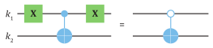

# Kvantiniai loginiai vartai ir grandinės {#kvantiniai-loginiai-vartai-grandines}

Šiame skyriuje pateikiame įprastinių kvantinių loginių elementų
arsenalą. Juos pasitelkus formuojami žemiausio loginio lygio kvantiniai
algoritmai. Matysime, kaip loginės registro būsenų operacijos yra
pavaizduojamos grafiškai ir kaip iš jų sekų formuojamos kvantinės
grandinės.

## Vieno kubito loginiai vartai {#vieno-kubito-vartai}

Pradėkime nuo paprasčiausių loginių
elementų, atliekančių 1 kubito būsenų transformacijas. Kaip pamename,
kvantiniai loginiai vartai yra nusakomi unitariniais operatoriais. Tokio
operatoriaus veiksmas būsenai $|\psi\rangle$ yra
pavaizduojamas grafiškai (žr. \@ref(fig:loginiu-vartu-veikimas-kubita) pav.).

```{r loginiu-vartu-veikimas-kubita, echo=FALSE, fig.cap="Loginių vartų $U$ veiksmas kubito būsenai $|\\psi\\rangle$.", out.width='41%', fig.align='center'}
knitr::include_graphics("media/image4_1.svg")
```

Kiekvienam kubitui yra priskiriama atskira
grandis -- horizontali linija. Kvantinė grandis pati nedaro įtakos
kubito būsenai ir nusako jo laisvą evoliuciją laike. Grandys yra
skaitomos iš kairės į dešinę ir atspindi laike atliekamas loginių vartų
sekas. Kairėje pusėje nusakoma pradinė kubito būsena, čia
$|\psi\rangle$, jai atliekami loginiai vartai $U$ ir
dešinėje išvedama pakitusi būsena $U|\psi\rangle$. Visi
1 kubito loginiai vartai turi vieną įvedimą ir vieną išvedimą, o bendras
kubitų skaičius algoritmo metu nesikeičia. Žinoma, ne visi kubitai
registre turi būti panaudojami.

Čia pateikiame loginius vartus ir jų efektą skaičiuojamiesiems baziniams
vektoriams $|0\rangle$ ir $|1\rangle$.
Norint nusakyti, kaip loginiai vartai keičia kubito būseną, esančią
superpozicijoje, pakanka žinoti, kaip loginiai vartai keičia
$|0\rangle$ ir $|1\rangle$ atskirai, nes
operatoriai veikia tiesiniu būdu kiekvieną vektorių superpozicijoje:
\begin{equation}
U\big(|0\rangle + |1\rangle\big) = U|0\rangle + U|1\rangle\,.
(\#eq:loginiai-vartai-superpozicija)
\end{equation}
Skaičiavimuose galima atlikti bazinių vektorių transformaciją ir naudoti
kitų bazinių vektorių rinkinį, pavyzdžiui Pauli-$X$ tikrinius vektorius
$|0_x\rangle$ ir $|1_x\rangle$.
Svarbu prisiminti, kad loginių vartų efektas, pateiktas
$|0\rangle$ ir $|1\rangle$ baziniams
vektoriams, bus bendrai kitoks, jeigu tie patys vartai pritaikomi,
pavyzdžiui, $|0_x\rangle$ ir
$|1_x\rangle$ ir jais išreikštoms būsenoms.

\@ref(fig:dvieju-kubitu-grandine) pav. matome dviejų kubitų registro
kvantinės grandinės pavyzdį.

```{r dvieju-kubitu-grandine, echo=FALSE, fig.cap="2 kubitų registro kvantinė grandinė. Matomi individualius kubitus veikiantys loginiai vartai ir abu kubitus vienu metu veikiantys $U_3$", out.width='57%', fig.align='center'}
knitr::include_graphics("media/image4_2.svg")
```

Standartiškai algoritmo pradžioje kubitai yra inicijuojami į
$|0\rangle$ būsenas (nurodome *ket* juodame fone), o
atskiri kubitai sunumeruojami simboliais $k_1, k_2,\ldots$ . Viršuje
kubitui $k_1$ yra atliekama 1 kubito loginių vartų seka $U_1$,
$U_2$, abu kubitus veikiantis $U_3$ ir galiausiai $U_4$.
Atkreipiame dėmesį, kad tiesinėje algebroje pirmo kubito loginių vartų
sekos efektas yra apskaičiuojamas taip:
$U_4 U_3 U_2 U_1 |0\rangle$. Tai yra, pirmiausiai
operatorius $U_1$ iš kairės daugina dešinėje vektorių
$|0\rangle$, toliau jis dauginamas su $U_2$, $U_3$,
ir galiausiai $U_4$. Ši atvirkštinė tvarka tarp matematinio
skaičiavimo ir atvaizdavimo kvantinėse grandinėse gali būti klaidinanti.
Kadangi tai yra plačiai paplitusi ir standartine tapusi vartosena, šį
skirtumą belieka tik įsiminti. Norėdami formaliai išsamiai aprašyti
parodytas logines operacijas, veikiančias du kubitus
$|k_1\rangle\otimes |k_2\rangle$,
rašytume jas taip
$(U_4\otimes U_4)(U_3)(U_2\otimes I)(U_1\otimes U_1)(|0\rangle\otimes |0\rangle)$.
Operatorius $U_3$ veikia abu kubitus, o $U_2$ atlikimo metu kubitui
$k_2$ nepritaikoma jokia loginė operacija (laukimo stadija) -- tai
nusakoma vienetiniu operatoriumi $I$.

Pradėsime nuo Pauli-$X$, $Y$ ir $Z$
loginių vartų, kurių matematinės išraiškos ir savybės buvo pristatytos
II skyriuje. Pauli-$X$ loginiai vartai yra klasikinių NE loginių vartų
atitikmuo, jie sukeičia 0 ir 1 vertes (žr. \@ref(fig:pauli-x-vartai) pav.)

```{r pauli-x-vartai, echo=FALSE, fig.cap="Pauli-$X$ loginių vartų efektas skaičiuojamiesiems baziniams vektoriams", out.width='37%', fig.align='center'}

```

Pauli-$Y$ vartai taip pat sukeičia 0 ir 1
vertes, tačiau dar prideda $\pm \pi/2$ fazę
($\mathrm{e}^{\pm\mathrm{i}\pi/2} = \pm\mathrm{i}$), nusakomą menamuoju skaičiumi
$\mathrm{i}$ (žr. \@ref(fig:pauli-y-vartai) pav.)

```{r pauli-y-vartai, echo=FALSE, fig.cap="Pauli-$Y$ loginių vartų efektas", out.width='40%', fig.align='center'}

```
Pauli-$Z$ vartai (žr. \@ref(fig:pauli-z-vartai) pav.) nekeičia
įvedamos $|0\rangle$ būsenos, tačiau prideda $\pi$ fazę
$|1\rangle$ būsenai ($\mathrm{e}^{\mathrm{i}\pi} = -1$).

```{r pauli-z-vartai, echo=FALSE, fig.cap="Pauli-$Z$ loginių vartų efektas", out.width='39%', fig.align='center'}
knitr::include_graphics("media/image4_5.svg")
```

Hadamardo vartai (žr. \@ref(fig:hadamardo-vartai) pav.) suformuoja
lygią $|0\rangle$ ir $|1\rangle$ bazinių
vektorių superpoziciją.

```{r hadamardo-vartai, echo=FALSE, fig.cap="Hadamardo loginių vartų efektas skaičiuojamiesiems baziniams vektoriams", out.width='51%', fig.align='center'}
knitr::include_graphics("media/image4_6.svg")
```

Kaip pamename, Blocho sferoje 1 kubito būsena yra parametrizuojama dviem
kampais $\theta$ ir $\varphi$. Čia $\theta$ nusako kampą su
$z$ ašimi, o $\varphi$ kampas yra skaičiuojamas nuo $x$ ašies imant
Blocho vektoriaus projekciją į $x$--$y$ plokštumą. Tačiau praktikoje
atliekant Blocho vektoriaus posūkius kvantiniame kompiuteryje yra dažnai
naudojami loginiai vartai, kurie nusako posūkį apie vieną iš trijų
Blocho sferos ($x, y, z$) ašių. Šie loginiai vartai yra vadinami
$R_x(\theta)$, $R_y(\theta)$ ir $R_z(\theta)$, parametras $\theta$
nusako, kad posūkis atliekamas apie nurodytą ašį kampu $\theta$:
\begin{align}
R_{x}(\theta) \equiv & \mathrm{e}^{-\frac{\mathrm{i}\theta X}{2}} =
\cos\left(\frac{\theta}{2}\right)I - \mathrm{i}\sin\left(\frac{\theta}{2}\right)X = \begin{bmatrix}
\cos(\theta/2) & -\mathrm{i}\sin(\theta/2) \\
-\mathrm{i}\sin(\theta/2) & \cos(\theta/2) \\
\end{bmatrix}\,;(\#eq:posukis-x)\\
R_y(\theta) \equiv & \mathrm{e}^{-\frac{\mathrm{i}\theta Y}{2}} =
\cos\left(\frac{\theta}{2}\right)I - \mathrm{i}\sin\left(\frac{\theta}{2}\right)Y =
\begin{bmatrix}
\cos(\theta/2) & -\sin(\theta/2) \\
\sin(\theta/2) & \cos(\theta/2) \\
\end{bmatrix}\,;(\#eq:posukis-y)\\
R_z(\theta) \equiv & \mathrm{e}^{-\frac{\mathrm{i}\theta Z}{2}} =
\cos\left(\frac{\theta}{2}\right)I - \mathrm{i}\sin\left(\frac{\theta}{2}\right)Z =
\begin{bmatrix}
\mathrm{e}^{-\frac{\mathrm{i}\theta}{2}} & 0 \\
0 & \mathrm{e}^{\frac{\mathrm{i}\theta}{2}} \\
\end{bmatrix}\,.(\#eq:posukis-z)
\end{align}

Panagrinėkime šiek tiek plačiau
$R_z(\theta)$ loginius vartus (žr. \@ref(fig:posukis-blocho-z) pav.), kuriuos kvantinėje
grandinėje ir supaprastinta matricos bei diadų forma išreiškiame:


```{r posukis-blocho-z, echo=FALSE, fig.cap="Posūkio apie Blocho sferos $z$ ašį $R_z(\\theta)$ loginių vartų efektas skaičiuojamiesiems baziniams vektoriams", out.width='42%', fig.align='center'}
knitr::include_graphics("media/image4_7.svg")
```

\begin{align}
R_z(\theta) \equiv & \begin{bmatrix}
1 & 0 \\
0 & \mathrm{e}^{\mathrm{i}\theta} \\
\end{bmatrix}\,;(\#eq:r-z-matrica)\\
R_z(\theta) = & |0\rangle\langle 0| +
\mathrm{e}^{\mathrm{i}\theta}|1\rangle\langle 1|\,.(\#eq:r-z-diada)
\end{align}
Supaprastinome $R_z(\theta)$ išraišką iškeldami bendrą
$\mathrm{e}^{-\mathrm{i}\theta/2}$ narį, kurį toliau ištrynėme. Šį narį 1 kubito
loginiuose vartuose galima ignoruoti, kadangi jis daugina bendrą kubito
būseną ir nusako įtakos neturinčią globalią fazę. Dėl šio supaprastinimo
kampas, kuriuo vartais $R_z(\theta)$ pasukamas Blocho vektorius apie
$z$ ašį, yra, kaip nurodyta, $\theta$, o ne $\theta/2$.

Kaip matome, $R_z(\theta)$ neturi įtakos $|0\rangle$
būsenai, bet prideda fazę $\theta$ būsenai $|1\rangle$.
Pavyzdžiui, jeigu ši būsena būtų
$|\psi\rangle = a|0\rangle + \mathrm{e}^{\mathrm{i}\alpha}b|1\rangle$,
tada
$R_z(\theta)|\psi\rangle = a|0\rangle + \mathrm{e}^{\mathrm{i}(\alpha + \theta)}
b|1\rangle$,
tai yra $\alpha \rightarrow \alpha + \theta$. Dėl šios savybės
$R_z(\theta)$ yra dažnai vadinami 1 kubito **fazės vartais**
(angl. *phase gate*). Pauli-$Z$ loginiai vartai yra ne kas kita, kaip
$R_z(\theta)$ su $\theta=\pi$ (iki globalios fazės). Algoritmuose
taip pat dažnai naudojami $R_z(\pi/4)$ ir $R_z(\pi/2)$, kurie
standartiškai yra nurodomi raidėmis $T$ ir $S$, atitinkamai:
\begin{align}
T = & \begin{bmatrix}
1 & 0 \\
0 & e^{i\pi/4} \\
\end{bmatrix}\,;(\#eq:t-posukis) \\
S = & \begin{bmatrix}
1 & 0 \\
0 & e^{i\pi/2} \\
\end{bmatrix} = \begin{bmatrix}
1 & 0 \\
0 & i \\
\end{bmatrix}\,.(\#eq:s-posukis)
\end{align}
Loginiai vartai $S$ yra dar vadinami $\sqrt{Z}$, kadangi $S^2 = Z$.

Naudojant trijų operatorių su trimis skirtingais parametrais seką,
$R_x(\theta)R_y(\gamma)R_z(\varphi)$, galima formaliai išreikšti
bet kokią 1 kubito būsenos unitariąją transformaciją
$U_3(\theta,\gamma,\varphi)$. Tačiau praktikoje dažniau aptinkamos
vadinamosios **Oilerio dekompozicijos** $N$-$M$-$N$ (angl. *Euler
decomposition*)*,* kuriose $N,M \in \{ R_z, R_y, R_z\}$.
Pavyzdžiui, $Z$-$Y$-$Z$ dekompozicija, naudojanti du skirtingus rotacijos
operatorius:
\begin{equation}
U_3(\theta,\gamma,\varphi) =
R_z(\theta)R_y(\gamma)R_z(\varphi) =
\begin{bmatrix}
\mathrm{e}^{-\mathrm{i}(\theta + \varphi)/2}\cos(\gamma/2) &
-\mathrm{e}^{\mathrm{i}(-\theta + \varphi)/2}\sin(\gamma/2) \\
\mathrm{e}^{\mathrm{i}(\theta - \varphi)/2}\sin(\gamma/2) &
\mathrm{e}^{\mathrm{i}(\theta + \varphi)/2}\cos(\gamma/2) \\
\end{bmatrix}\,.
(\#eq:z-y-z-dekompozicija)
\end{equation}

## Kvantinių grandinių lygybės ir atvirkštiniai loginiai vartai

Yra begalė būdų pasukti vektorių Blocho sferoje į norimą orientaciją
naudojant skirtingus loginius vartus. Pavyzdžiui, Hadamardo
transformacija gali būti išreikšta rotacijų seka apie $x$, $y$, $z$ ašis.
Keletas būdų tai atlikti:
\begin{align}
H = & R_x(\pi)R_y\left(-\frac{\pi}{2}\right)\,; (\#eq:hadamard-1)\\
H = & R_x\left(-\frac{\pi}{2}\right)R_z\left(-\frac{\pi}{2}\right)\,.(\#eq:hadamard-2)
\end{align}
Antrąją išraišką iliustruojame \@ref(fig:ekvivalentinis-h-realizavimas) pav., kaip trajektoriją Blocho sferos
paviršiuje, pradedant nuo $|0\rangle$ būsenos iki
galutinės $|0_x\rangle$. Atkreipiame dėmesį, kad
žvelgiant į teigiamą $x$, $y$, ar $z$ ašį nuo sferos centro į jos išorę,
posūkis teigiamu kampu $+\theta$ apibūdinamas prieš laikrodžio rodyklę,
o neigiamas $-\theta$ pagal laikrodžio rodyklę.


```{r ekvivalentinis-h-realizavimas, echo=FALSE, fig.cap="Ekvivalentinis $H$ loginės operacijos realizavimas naudojant rotacijos loginius vartus $R_x$ ir $R_z$ pavaizduojant kubito $|0\\rangle$ vektoriaus sukimo trajektoriją Blocho sferoje. Šalia $x, y, z$ ašių pažymėti atitinkami posūkio operatoriai ir nurodytos teigiamos $+\\theta$ sukimo kryptys", out.width='43%', fig.align='center'}
knitr::include_graphics("media/image4_8.svg")
```

Skirtingose kvantinių procesorių architektūrose gali būti apribotas tam
tikrų 1 kubito loginių vartų naudojimas. Todėl gali atsirasti poreikis
sukompiliuoti kvantinę grandinę kitomis loginių vartų sekomis ar ją
supaprastinti sumažinant bendrą loginių vartų skaičių. Pateikiame keletą
svarbesnių 1 kubito loginių vartų lygybių pavyzdžių:
\begin{align}
HXH = & Z\,,\quad HYH = -Y\,,\quad HZH = X\,; (\#eq:1-kubito-lygybes-1)\\
ZXZ = & -X\,,\quad ZYZ = -Y\,,\quad ZZZ = Z\,;(\#eq:1-kubito-lygybes-2) \\
SXS^{\dagger} = & Y\,,\quad SYS^{\dagger} = -X\,,\quad SZS^{\dagger} = Z\,.(\#eq:1-kubito-lygybes-3)
\end{align}
Kaip galime pastebėti, viršuje pateikiamos tokios operatorių sekos:
$KPK^{\dagger} = P'$. Čia $P$ ir $P'$ yra Pauli operatoriai {$X$, $Y$, $Z$},
o $K$ ir ermitinė jungtis $K^{\dagger}$ yra parenkama iš vadinamosios
**Klifordo grupės** (angl. *Clifford group*) operatorių. Įprasti
1 kubito Klifordo grupės operatoriai yra Pauli {$I$, $X$, $Y$, $Z$}, taip
pat $H$ ir $S$. Viena iš Klifordo grupės savybių yra ta, kad jie
transformuoja vieną Pauli operatorių į kitą ir gali pridėti tik fazę
$\pm 1$. Ši operatorių grupė yra itin svarbi kvantiniuose algoritmuose
bei klaidų taisymo koduose, pagrįstuose būsenų stabilizatoriais.
Atkreipiame dėmesį, kad vien Klifordo vartais $H$ ir $S$ galima
realizuoti Pauli operatorius {$X$, $Y$, $Z$}:
\begin{equation}
HSSH = X\,,\quad SXS^{\dagger} = Y\,,\quad SS = Z\,.
(\#eq:pauli-per-h-s)
\end{equation}
Norėdami patikrinti, ar lygybės egzistuoja tarp skirtingų vartų sekų,
galime jas nusakančias matricas papračiausiai sudauginti ir palyginti,
ar jos vienodos, pavyzdžiui:
\begin{equation}
HXH = \frac{1}{2}\begin{bmatrix}
1 & 1 \\
1 & - 1 \\
\end{bmatrix} \begin{bmatrix}
0 & 1 \\
1 & 0 \\
\end{bmatrix} \begin{bmatrix}
1 & 1 \\
1 & - 1 \\
\end{bmatrix} = \begin{bmatrix}
1 & 0 \\
0 & - 1 \\
\end{bmatrix} = Z\,.
(\#eq:patikrinimas-hxh)
\end{equation}
Klifordo vartais taip pat galima tarpusavyje transformuoti tolydžiai
parametrizuotus loginius vartus $R_z(\theta)$ ir $R_x(\theta)$:
\begin{equation}
HR_z(\theta)H = R_x(\theta)\,.
(\#eq:hrzh)
\end{equation}
Naudodami matricų funkcijos $R_z(\theta)$ išraišką, lygybę viršuje
patikriname:
\begin{equation}
\begin{aligned}
H\big\lbrack \cos(\theta/2)I - \mathrm{i}\sin(\theta/2)Z \big\rbrack H
= & \cos(\theta/2)HIH - \mathrm{i}\sin(\theta/2)HZH \\
= & \cos(\theta/2)I - \mathrm{i}\sin(\theta/2)X = R_x(\theta)\,.
\end{aligned}
(\#eq:patikrinimas-hrzh)
\end{equation}
Trys Pauli bei Hadamardo loginiai vartai yra ermitiniai operatoriai
($U=U^{\dagger}$) ir todėl patys sau atvirkštiniai. Atliekant du ermitinius
operatorius vieną po kito anuliuojamas jų efektas, pavyzdžiui, $ZZ = I$,
$HH = I$. Kitaip nei Pauli ir Hadamardo vartai, dauguma kitų kvantinių
loginių vartų nėra sau atvirkštiniai. Pavyzdžiui, jau minėti $S$ ir $T$
nėra ermitiniai operatoriai, nes $S\ne S^{\dagger}$ ir $T\ne T^{\dagger}$.
Tačiau, kaip
ir visi unitariniai operatoriai, jie turi sau atvirkštinius operatorius.
Tai yra jų ermitinės jungties operatoriai, žymimi su durklu, pavyzdžiui
$T^{\dagger}$ ir $S^{\dagger}$:
\begin{align}
T^{\dagger} = & \begin{bmatrix}
1 & 0 \\
0 & \mathrm{e}^{-\mathrm{i}\pi/4} \\
\end{bmatrix}\,; (\#eq:t-inverse)\\
S^{\dagger} = & \begin{bmatrix}
1 & 0 \\
0 & \mathrm{e}^{-\mathrm{i}\pi/2} \\
\end{bmatrix} = \begin{bmatrix}
1 & 0 \\
0 & -\mathrm{i} \\
\end{bmatrix}\,.(\#eq:s-inverse)
\end{align}
Matome, kad ermitinėje jungtyje atsiranda minuso ženklas prie nario,
nusakančio kampą. Atvirkštinių vartų efektą galima interpretuoti kaip
Blocho vektoriaus sukimą apie tą pačią ašį priešinga kryptimi tokiu
pačiu kampu. Dėl šios priežasties atlikus operaciją
$UU^{\dagger}|\psi\rangle = I|\psi\rangle = |\psi\rangle$
būsena nepakinta. Tai savo ruožtu reiškia, kad kvantinėse
transformacijose, nusakytose unitariaisiais operatoriais, visada įmanoma
grąžinti kvantinę būseną į pradinę (kitaip tariant, atsukti laiką
atgal). Tam tereikia atlikti atvirkštinius loginius vartus atbuline
seka.

## Kubitų būsenų matavimas

Norint sužinoti kubito būseną, algoritmo vykdymo metu ar jo pabaigoje
atliekamas matavimas. Matavimo operacija yra žymima pusapskritimiu su
rodyklyte, nukreipta į klasikinį registrą, žymimą brūkšniuota linija ir
raide $c$. Taip pat taikomas principas, kad algoritmo gale visi kubitai
yra pamatuojami, net jeigu tai nėra parodoma simboliais kvantinės
grandinės pabaigoje. Matavimai standartiškai atliekami santykinai su
Pauli-$Z$ operatoriaus tikriniais vektoriais, tai yra skaičiuojamaisiais
baziniais vektoriais $|0\rangle$ ir
$|1\rangle$. Esant šių bazinių vektorių superpozicijos
būsenai, galimi matavimo rezultatai yra Pauli-$Z$ tikrinės vertės +1
arba -1. Radus +1 indikuojama, kad būsena yra
$|0\rangle$, bei $|1\rangle$, jeigu
tikrinė vertė yra -1. Tai nusako vieną klasikinį bitą informacijos, o
atlikus matavimą gautas rezultatas yra įrašomas klaisikiniame bitų
registre.

```{r grandine-bito-matavimas, echo=FALSE, fig.cap="Loginė grandinė sukuria kubito $k_1$ lygią superpoziciją ir atlieka jo būsenos matavimą. Rezultatas įrašomas klasikiniame registre $c$", out.width='39%', fig.align='center'}
knitr::include_graphics("media/image4_9.svg")
```

Grandinėje \@ref(fig:grandine-bito-matavimas) pav. yra pateiktas vienas iš paprasčiausių praktinės
svarbos kvantinių algoritmų, kuris atlieka atsitiktinių skaičių
generavimą (angl. *random number generator*). Atlikę Hadamardo
transformaciją gauname lygią superpoziciją:
\begin{equation}
H|0\rangle = \frac{1}{\sqrt{2}}\big( |0\rangle + |1\rangle \big)\,.
(\#eq:hadamard-superpozicija)
\end{equation}
Pamatavus šią būseną tikimybės rasti $|0\rangle$ arba
$|1\rangle$ yra lygios:
\begin{equation}
\big|\langle 0|\psi\rangle\big|^2 = \big|\langle 1|\psi\rangle\big|^2 = \frac{1}{2}\,.
(\#eq:matavimas-lygios-tikimybes)
\end{equation}
Tad po kiekvieno šio algoritmo įvykdymo yra sugeneruojama atsitiktinė
dvejetainė 0 ir 1 skaičių seka. Dėl kvantinio atsitiktinumo matavimo
procese, šios sekos fundamentaliai neįmanoma nuspėti.

## Dviejų kubitų loginiai vartai *CNOT*

Dviejų kubitų vartai, veikdami
$|k_1\rangle\otimes |k_2\rangle$
būseną, atlieka sąlygines logines operacijas: „Jeigu kubitas $k_1$ yra
būsenoje $|x\rangle$, tada su kubitu $k_2$ atliekama
operacija $U$". Čia $U$ gali būti bet kokia 1 kubito būsenos unitarioji
transformacija. Vienas iš plačiausiai naudojamų 2 kubitų vartų yra
*CNOT* (angl. *controlled not,* trumpinys *CNOT*), kuriuos grandinėse
vadinsime $cX$. Pasirinktas pirmas kubitas yra naudojamas kaip
**kontrolinis** (angl. *control*), nuo kurio būsenos priklauso ar
antram, adresatiniam kubitui, bus taikomi Pauli-$X$ loginiai vartai.
Vartai $cX$ yra iliustruojami \@ref(fig:cnot-vartai) pav.

```{r cnot-vartai, echo=FALSE, fig.cap="2 kubitų sąlyginiai loginiai vartai $cX$ (arba *CNOT*)", out.width='33%', fig.align='center'}
knitr::include_graphics("media/image4_10.svg")
```

*CNOT* vartus galime išreikšti diadomis ir matricos forma:
\begin{align}
cX = &|0\rangle\langle 0|\otimes I + |1\rangle\langle 1|\otimes X\,;(\#eq:cnot-diada)\\
cX = & \begin{bmatrix}
1 & 0 & 0 & 0 \\
0 & 1 & 0 & 0 \\
0 & 0 & 0 & 1 \\
0 & 0 & 1 & 0
\end{bmatrix}\,.(\#eq:cnot-matrica)
\end{align}
Kaip pavyzdį imkime $cX$, kuriame pirmas kubitas yra kontrolinis, ir
pritaikykime jį
$|1\rangle\otimes|0\rangle$ būsenai:
\begin{align}
cX|1\rangle\otimes|0\rangle = &
|0\rangle\langle 0|1\rangle\otimes I|0\rangle +
|1\rangle\langle 1|1\rangle\otimes X|0\rangle =
|1\rangle\otimes X|0\rangle = |1\rangle\otimes|1\rangle\,;(\#eq:cx-0-diadom)\\
cX|1\rangle\otimes|0\rangle = & \begin{bmatrix}
1 & 0 & 0 & 0 \\
0 & 1 & 0 & 0 \\
0 & 0 & 0 & 1 \\
0 & 0 & 1 & 0
\end{bmatrix} \begin{bmatrix}
0 \\
0 \\
1 \\
0 \\
\end{bmatrix} = \begin{bmatrix}
0 \\
0 \\
0 \\
1 \\
\end{bmatrix}\,.(\#eq:cx-0-matrica)
\end{align}
Apibendrinus, $cX$ vartų efektas 2 kubitų skaičiuojamiesiems baziniams
vektoriams:
\begin{align}
cX|0\rangle\otimes|0\rangle = & |0\rangle\otimes|0\rangle\,;(\#eq:cx-efektas-00) \\
cX|0\rangle\otimes|1\rangle = & |0\rangle\otimes|1\rangle\,;(\#eq:cx-efektas-01) \\
cX|1\rangle\otimes|0\rangle = & |1\rangle\otimes|1\rangle\,;(\#eq:cx-efektas-11) \\
cX|1\rangle\otimes|1\rangle = & |1\rangle\otimes|0\rangle\,.(\#eq:cx-efektas-10)
\end{align}
Matome, kad kai kontrolinis kubitas yra $|0\rangle$,
antro kubito būsena nesikeičia, o jeigu kontrolinis kubitas yra
$|1\rangle$, antro kubito vertė apverčiama. Tai lengva
pamatyti žvelgiant į diadų formą, kurioje Pauli-$X$ vartai veikia kartu
tik su pirmo kubito $|1\rangle$ būsena. $cX$ vartų
efektą baziniams vektoriams galima interpretuoti ir kaip modulio(2) bitų
sudėtį ($0 + 0 = 0$, $0 + 1 = 1$, $1 + 0 = 1$, $1 + 1 = 0$), naudojančią simbolį
$\oplus$. Pritaikius $cX$ tarp kubitų $k_1$ ir $k_2$, kurių vertės
yra bet kuri iš 0 ir 1 kombinacijų, tada mod(2) sudėtis yra užrašoma
antro kubito būsenoje:
\begin{equation}
cX|k_1 \rangle\otimes |k_2 \rangle = |k_1 \rangle\otimes |k_1 \oplus k_2 \rangle\,.
(\#eq:cx-mod2)
\end{equation}
Galima atsakymą užrašyti ir pirmo kubito būsenoje naudojant $cX$ vartus,
kuriuose antras kubitas yra kontrolinis, o pirmas adresatinis.

Norint aiškiau pateikti matematines lygtis gali būti pravartu indikuoti
operatoriuose kontrolinį ir adresatinį kubitus. Šioje knygoje, kai bus
tą pravartu daryti, *CNOT* vartuose nurodysime kaip pirmą skaičių
kontrolinį kubitą, antrą adresatinį, pavyzdžiui $cX_{12}$.
Formulėse \@ref(eq:cnot-diada)--\@ref(eq:cnot-matrica) pateikėme diadų ir matricų formas $cX_{12}$,
sukeitus juos vietomis, $cX_{21}$, atitinkamai pasikeistų ir matematinės
išraiškos:
\begin{align}
cX_{21} = & I\otimes|0\rangle\langle 0| + X\otimes|1\rangle\langle 1|\,;(\#eq:cx-21-diada)\\
cX_{21} = & \begin{bmatrix}
1 & 0 & 0 & 0 \\
0 & 0 & 0 & 1 \\
0 & 0 & 1 & 0 \\
0 & 1 & 0 & 0
\end{bmatrix}\,.(\#eq:cx-21-matrica)
\end{align}
Matėme, kaip 2 kubitų būsena keičiasi pritaikius $cX$, kai kubitai yra
viename iš bazinių vektorių. Gauti rezultatai yra identiški klasikiniams
$cX$ vartams. Tačiau kvantinėje kompiuterijoje kontrolinio kubito būsena
gali būti $|0\rangle$ ir $|1\rangle$
superpozicijoje. Koks yra $cX$ efektas, šiuo atveju panagrinėsime
žvelgdami į \@ref(fig:dvieju-kubitu-supynimo-grandine) pav. grandinę.

```{r dvieju-kubitu-supynimo-grandine, echo=FALSE, fig.cap="Kvantinį 2 kubitų supynimą atliekanti grandinė", out.width='38%', fig.align='center'}
knitr::include_graphics("media/image4_11.svg")
```

Po Hadamardo transformacijos kontrolinis $k_1$ kubitas yra lygioje
superpozicijoje. Toliau yra $cX$ vartai, kurie veikia tiesiškai
kiekvieną narį superpozicijos būsenoje:
\begin{equation}
\begin{aligned}
cX\frac{1}{\sqrt{2}}\big(|0\rangle + |1\rangle\big)\otimes|0\rangle = &
\frac{1}{\sqrt{2}}\big(cX|0\rangle\otimes|0\rangle + cX|1\rangle\otimes|0\rangle\big) \\
= & \frac{1}{\sqrt{2}}\big(|0\rangle\otimes|0\rangle + |1\rangle\otimes|1\rangle\big)\,.
\end{aligned}
(\#eq:cx-nuo-superpozicijos)
\end{equation}
Matome, kad po šių dviejų loginių vartų sekos gavome supintą 2 kubitų
būseną $|\chi^{+}\rangle$ Belo bazinį vektorių.
Naudojant Hadamardo ir $cX$ vartus šia tvarka galima unikaliai
konvertuoti skaičiuojamuosius 2 kubitų bazinius vektorius į Belo
bazinius vektorius:
\begin{equation}
|00 \rangle \rightarrow |\chi^{+}\rangle\,,\quad
|10 \rangle \rightarrow |\chi^{-}\rangle\,,\quad
|01 \rangle \rightarrow |\eta^{+}\rangle\,,\quad
|11 \rangle \rightarrow |\eta^{-}\rangle\,.
(\#eq:skaiciuojamieji-i-belo)
\end{equation}
Pavyzdžiui, norėdami paruošti Belo $|\eta^{-}\rangle$
būseną, pirmiausia pakeičiame $k_1$ ir $k_2$ pradines būsenas į
$|11\rangle$ naudodami Pauli-$X$ vartus ir tada vėl
atliekame $H$ ir $cX$.

Kadangi $cX$ operatorius yra ermitinis, atlikus vieną po kito du $cX$ su
tais pačiais kontroliniu ir adresatiniu kubitais, jų būsenos nepakinta.
Kvantinio supynimo panaikinimas tarp dviejų kubitų taip pat yra
atliekamas naudojant $cX$ vartus. Pavyzdžiui, atliekant $cX$ vartus
supintajai $|\chi^{+}\rangle$ Belo būsenai supynimas yra
panaikinamas ir grįžtame į faktorizuojamąją būseną:
\begin{equation}
cX|\chi^{+}\rangle = \frac{1}{\sqrt{2}}\big(|0\rangle + |1\rangle\big)\otimes
|0\rangle\,.
(\#eq:cx-belo)
\end{equation}

```{r ghz-grandine, echo=FALSE, fig.cap="Kvantinį 2 kubitų supynimą atliekanti grandinė", out.width='49%', fig.align='center'}

```

Kita gerai žinoma visiškai supinta
3 kubitų GHZ būseną (angl. *Greenberger-Horne-Zeilinger*) galima gauti
atlikę \@ref(fig:ghz-grandine) pav. parodytą grandinę.

```{r cx0-grandine, echo=FALSE, fig.cap="2 kubitų salyginių loginių vartų $cX$ variacija, kurioje antro kubito būsena keičiama, jeigu pirmojo būsena $|0\\rangle$", out.width='72%', fig.align='center'}

```

\begin{equation}
|\mathrm{GHZ}\rangle = \frac{1}{\sqrt{2}}\big(|000\rangle +|111\rangle\big)\,.
(\#eq:ghz-busena)
\end{equation}

Užbaigdami šį poskyrį paminėsime naudingą $cX$ loginių vartų variaciją,
kurioje adresatiniam kubitui pritaikomi Pauli-$X$ vartai, jeigu
kontrolinio kubito būsena yra $|0\rangle$, o ne
$|1\rangle$. Šio operatoriaus, vadinsime jį
$cX_0$, išraiška yra:
\begin{equation}
cX_0 = |0\rangle\langle 0|\otimes X + |1\rangle\langle 1|\otimes I\,.
(\#eq:cx0-israiska)
\end{equation}

Kvantinėje grandinėje $cX_0$ vartai yra
žymimi su tuščiu apskritimu kontroliniame kubite, bei gali būti
paprastai konvertuojami iš standartinio $cX$ pasitelkiant dvejus Pauli-$X$
vartus (žr. \@ref(fig:cx0-grandine) pav.). Pirmieji Pauli-$X$ sukeičia kontrolinio kubito būsenas
$|0\rangle \leftrightarrow |1\rangle$, o antrieji atstato jas atgal po atliktų standartinių $cX$.

## Tofoli loginiai vartai

Trijų kubitų sąlyginiai loginiai vartai,
kuriuose du kubitai naudojami kaip kontroliniai, yra vadinami
***CCNOT*** (angl. *controlled controlled NOT*, trumpinys *CCNOT*) ir
yra geriau žinomi, kaip **Tofoli vartai** (angl. *Toffoli*). Grandinėse
juos žymėsime $ccX$. Kubito vertė yra apverčiama, jeigu abu kontroliniai
kubitai yra $|1\rangle$ būsenose. \@ref(fig:toffoli-vartai) pav.
iliustruojame šiuos vartus, veikiančius būseną
$|k_1\rangle\otimes|k_2\rangle\otimes|k_3\rangle$
su $k_1$ ir $k_2$ kontroliniais bei $k_3$ adresatiniu kubitu. Išreiškus $ccX$ vartus diadomis:
\begin{equation}
ccX = \big(|00\rangle\langle 00| +|01\rangle\langle 10| + |10\rangle\langle 01|\big)
\otimes I + |11\rangle\langle 11|\otimes X\,.
(\#eq:tofoli-vartai-diadom)
\end{equation}
Kvantiniuose kompiuteriuose $ccX$ vartai paprastai nėra elementarūs,
tačiau sukompiliuojami iš 1 kubito ir 2 kubitų loginių vartų sekų.

```{r toffoli-vartai, echo=FALSE, fig.cap="Toffoli loginiai vartai", out.width='32%', fig.align='center'}
knitr::include_graphics("media/image4_14.svg")
```

## SWAP ir Fredkin loginiai vartai

Loginiai vartai SWAP, grandinėse žymimi sutrumpintai $W$, veikdami tarp
dviejų kubitų $k_1$ ir $k_2$ sukeičia jų būsenas vietomis:
\begin{equation}
W|\psi_1\rangle\otimes |\psi_2\rangle = |\psi_2\rangle\otimes |\psi_1\rangle\,.
(\#eq:swap-vartai)
\end{equation}
Šie loginiai vartai efektyviai sukeičia kubitus vietomis ir todėl gali
būti naudojami pergrupuoti kubitus registre. Tai yra itin naudinga
situacijose, kuriuose kvantinis procesorius neturi fizinės galimybės
atlikti, pavyzdžiui, $cX$ loginių vartų tarp tam tikrų kubitų porų.
Siekiant apeiti šį apribojimą galima naudoti SWAP operacijas kaskadų
principu sukeičiant kubitų pozicijas į vietas, kuriuose $cX$ loginiai
vartai yra leidžiami, bei vėl grąžinti kubitus į pradines pozicijas.
Šiuos vartus galima išreikšti diadomis arba matricos pavidalu taip:
\begin{align}
W = & |0\rangle\otimes|0\rangle\langle 0|\otimes\langle 0| +
|0\rangle\otimes|1\rangle\langle 1|\otimes\langle 0| +
|1\rangle\otimes|0\rangle\langle 0|\otimes\langle 1| +
|1\rangle\otimes|1\rangle\langle 1|\otimes\langle 1| \nonumber\\
= & |00\rangle\langle 00| + |01\rangle\langle 10| + |10\rangle\langle 01|
+ |11\rangle\langle 11|\,; (\#eq:swap-diadom) \\
W = &\begin{bmatrix}
\begin{matrix}
1 & 0 \\
0 & 0 \\
\end{matrix} & \begin{matrix}
0 & 0 \\
1 & 0 \\
\end{matrix} \\
\begin{matrix}
0 & 1 \\
0 & 0 \\
\end{matrix} & \begin{matrix}
0 & 0 \\
0 & 1 \\
\end{matrix} \\
\end{bmatrix}\,. (\#eq:swap-matrica)
\end{align}
SWAP vartai iliustruojami \@ref(fig:swap-vartai) pav.

```{r swap-vartai, echo=FALSE, fig.cap="SWAP loginiai vartai", out.width='40%', fig.align='center'}

```

SWAP taip pat galima įkomponuoti į sąlyginius loginius vartus, kurie yra
vadinami Fredkin vartais. Lygtyse juos žymėsime $cW$. \@ref(fig:fredkin-vartai) pav.
pavaizduoti Fredkin vartai sukeičia kubitų $k_2$ ir $k_3$ būsenas,
jeigu kontrolinis kubitas $k_1$ yra būsenoje
$|1\rangle$.
\begin{equation}
cW = |0\rangle\langle 0|\otimes I\otimes I + |1\rangle\langle 1|\otimes W\,.
(\#eq:fredkin-vartai)
\end{equation}

```{r fredkin-vartai, echo=FALSE, fig.cap="Fredkin, arba kontroliuojami SWAP, loginiai vartai", out.width='30%', fig.align='center'}

```

Kaip ir Tofoli loginiai vartai, SWAP bei
Fredkin paprastai nėra elementarios kubitų transformacijos fiziniame
lygmenyje, tačiau yra konstruojami iš 1 kubito ir 2 kubitų loginių vartų
sekų. Vienas būdas atlikti SWAP 2 kubitų būsenai naudojant $cX$ vartus
parodytas \@ref(fig:swap-realizavimas) pav.:

```{r swap-realizavimas, echo=FALSE, fig.cap="SWAP loginių vartų realizavimas pasitelkiant tris *cX* loginius vartus", out.width='65%', fig.align='center'}

```

## Bendro tipo sąlyginiai loginiai vartai $\boldsymbol{cU}$ {#bendro-tipo-salyginiai-vartai}

Bendro tipo 2 kubitų sąlyginiuose vartuose
$cU$ adresatiniam kubitui pritaikoma bet kokia 1 kubito unitarinė
transformacija $U$, jeigu pirmas kubitas yra $|1\rangle$
būsenoje. Šiuos vartus  diadų forma ir grandinėje išreiškiame:
\begin{equation}
cU = |0\rangle\langle 0|\otimes I + |1\rangle\langle 1|\otimes U\,.
(\#eq:bendri-salyginiai-diadom)
\end{equation}

```{r bendro-tipo-salyginiai-vartai, echo=FALSE, fig.cap="Bendro tipo 2 kubitų loginiai vartai $cU$, kuriuose antram kubitui pritaikomi bendro tipo 1 kubito loginiai vartai $U$, kontroliuojant pirmu kubitu", out.width='30%', fig.align='center'}

```
Prieš pereidami prie kitų temų, atkreipsime dėmesį į 1 kubito globalios
fazės svarbą 2 kubitų (ir bendrai $n$ kubitų) loginiuose vartuose.
Bendro tipo 2 kubitų transformacijose $cU$ globali pavienių kubitų fazė
tampa svarbi santykinė fazė tarp atskirų kubitų. Kaip matėme šio
skyriaus pirmoje dalyje, bendriausio tipo 1-kubito loginius vartus
$U_3(\theta,\gamma,\varphi)$ galime išreikšti tokia matricos forma:
\begin{equation}
U_3 = \begin{bmatrix}
a & - b^{*} \\
b & a^{*}
\end{bmatrix}\,.
(\#eq:bendro-tipo-1-kubito-vartai)
\end{equation}
Čia $a$ ir $b$ yra kompleksiniai skaičiai, o matricos $U_3$
determinantas $\det U_3 = |a|^{2} + |b|^{2} = 1$. Visos unitarinės
$(2 \times 2)$ dydžio matricos $U$, kurių determinantas lygus vienetui, sudaro
specialiają unitarinių matricų grupę $\mathrm{SU}(2)$. Ši grupė išsamiai apibūdina
visas 1 kubito transformacijas, tačiau yra platesnės unitarinių matricų
$\mathrm{U}(2)$ grupės pogrupis,
$\mathrm{SU}(2) \subset \mathrm{U}(2)$. Unitarinę matricą $U$,
priklausančią $\mathrm{U}(2)$, galime išreikšti sudauginant $\mathrm{SU}(2)$ matricą $V$ su
fazės nariu, $U = \mathrm{e}^{\mathrm{i}\eta}V$. Globalios fazės narys
$\mathrm{e}^{\mathrm{i}\eta}$,
veikiantis 1 kubito būseną nedaro fizinės įtakos, nes
$\mathrm{e}^{\mathrm{i}\eta}V|\psi\rangle = V|\psi\rangle$.
Todėl jį 1-kubito transformacijose ignoruojame. Tačiau sąlyginiuose
2 kubitų loginiuose vartuose unitarinė (1 kubito) transformacija $U$,
pritaikoma adresatiniam kubitui, gali priklausyti $U \in \mathrm{U}(2)$, o ne
$U \in \mathrm{SU}(2)$ grupei. Pabrėždami šį aspektą toliau pateikiame sąlyginius
posūkio apie $z$ ašį vartus $cR_z(\theta)$ bei fazės vartus
$cP(\theta)$ (angl. *controlled phase gate*).

```{r salyginia-2-kubitu-vartai, echo=FALSE, fig.cap="Salyginiai 2 kubitų loginiai vartai $cR_z(\\theta)$", out.width='34%', fig.align='center'}
knitr::include_graphics("media/image4_19.svg")
```

Vartai $cR_z(\theta)$ pritaiko antram
kubitui posūkio operatorių $R_z(\theta)$, jeigu pirmojo būsena yra
$|1\rangle$. Grandinėje, diadų ir matricos formoje
$cR_{z}(\theta)$ atrodo taip (žr. \@ref(fig:salyginia-2-kubitu-vartai) pav.):
\begin{align}
cR_z(\theta) = & |0\rangle\langle 0|\otimes I
+ |1\rangle\langle 1|\otimes R_z(\theta)\,; (\#eq:salyginiai-z-diadom) \\
cR_{z}(\theta) = & \begin{bmatrix}
1 & 0 & 0 & 0 \\
0 & \mathrm{e}^{-\mathrm{i}\theta/2} & 0 & 0 \\
0 & 0 & 1 & 0 \\
0 & 0 & 0 & \mathrm{e}^{\mathrm{i}\theta/2} \\
\end{bmatrix}\,.  (\#eq:salyginiai-z-matrica)
\end{align}
Pritaikę $cR_z(\theta)$ 2 kubitų bazinių vektorių superpozicijos
būsenai
$|\psi\rangle = \big(|00\rangle + |10\rangle + |01\rangle + |11\rangle\big)/2$
randame:
\begin{equation}
\begin{aligned}
cR_z(\theta)|\psi\rangle = &
\frac{1}{2}\Big\lbrack \big(|00\rangle + |01\rangle\big)
+ |1\rangle\otimes R_z(\theta)\big(|0\rangle + |1\rangle\big)\Big\rbrack \\ 
= & \frac{1}{2}\left\lbrack |00\rangle + \mathrm{e}^{-\mathrm{i}\theta/2}|10\rangle
+ |01\rangle + \mathrm{e}^{\mathrm{i}\theta/2}|11\rangle \right\rbrack\,.
\end{aligned}
(\#eq:salyginiai-z-superpozicija)
\end{equation}
Šio skyriaus pirmoje dalyje analizuodami 1 kubito vartus $R_z(\theta)$
iškėlėme fazės narį $\mathrm{e}^{-\mathrm{i}\theta/2}$. Tačiau šioje situacijoje
$\mathrm{e}^{-\mathrm{i}\theta/2}$ nusako svarbią santykinę fazę tarp 2 kubitų bazinių
vektorių, o ne globalią visos 2 kubitų būsenos
$|\psi\rangle$ fazę. Globali 2 kubitų fazė būtų vėlgi
būtų nusakoma $\mathrm{e}^{\mathrm{i}\eta}$, dauginančiu visą
$|\psi\rangle$ būseną kartu.

Sąlyginiai fazės vartai $cP(\theta)$ matricos forma atrodo taip:
\begin{equation}
cP(\theta) = \begin{bmatrix}
1 & 0 & 0 & 0 \\
0 & 1 & 0 & 0 \\
0 & 0 & 1 & 0 \\
0 & 0 & 0 & \mathrm{e}^{\mathrm{i}\theta} \\
\end{bmatrix}\,.
(\#eq:salyginiai-fazes)
\end{equation}
Pritaikę juos tai pačiai visų 2 kubitų bazinių vektorių superpozicijos
būsenai $|\psi\rangle$ randame, kad fazė suteikiama tik
$|11\rangle$ baziniam vektoriui:
\begin{equation}
cP(\theta)|\psi\rangle = \frac{1}{2}\big\lbrack |00\rangle + |10\rangle +
|01\rangle + \mathrm{e}^{\mathrm{i}\theta}|11\rangle\big\rbrack\,.
(\#eq:salyginiai-fazes-superpozicija)
\end{equation}
Vartų $cP(\theta)$ efektas skiriasi nuo $cR_z(\theta)$ santykine
2 kubitų faze, kuri yra „globali" antrojo kubito fazė. Norėdami
formaliau perteikti 1 kubito „globalią" fazę $\mathrm{e}^{\mathrm{i}\eta}$, tokius
1 kubito fazės vartus žymime $\Phi(\eta)$:
\begin{equation}
\Phi(\eta) = \begin{bmatrix}
\mathrm{e}^{\mathrm{i}\eta} & 0 \\
0 & \mathrm{e}^{\mathrm{i}\eta} \\
\end{bmatrix} = \mathrm{e}^{\mathrm{i}\eta}\begin{bmatrix}
1 & 0 \\
0 & 1 \\
\end{bmatrix} = \mathrm{e}^{\mathrm{i}\eta}I\,.
(\#eq:vieno-kubito-fazes-vartai)
\end{equation}
Sąlyginiai $c\Phi(\eta)$ vartai, kurie perteikia „globalią" $\mathrm{e}^{\mathrm{i}\eta}$
fazę adresatinio kubito $|0\rangle$ ir
$|1\rangle$ būsenoms, jeigu kontrolinis kubitas
$|1\rangle$ būsenoje, yra:
\begin{align}
c\Phi(\eta) = & \begin{bmatrix}
1 & 0 & 0 & 0 \\
0 & \mathrm{e}^{\mathrm{i}\eta} & 0 & 0 \\
0 & 0 & 1 & 0 \\
0 & 0 & 0 & \mathrm{e}^{\mathrm{i}\eta}
\end{bmatrix}\,; (\#eq:salyginiai-globali-faze) \\
c\Phi(\eta) = & |0\rangle\langle 0|\otimes I + |1\rangle\langle 1|\otimes\Phi(\eta)
= \big( |0\rangle\langle 0| +
\mathrm{e}^{\mathrm{i}\eta}|1\rangle\langle 1| \big)\otimes I\,.
(\#eq:salygine-globali-dekompozicija)
\end{align}
Iš diadinės $c\Phi(\eta)$ dekompozicijos galima atkreipti dėmesį, kad iš
tiesų nereikia vykdyti 2 kubitų sąlyginių vartų. Šie loginiai vartai
susiprastina į 1 kubito loginius vartus, veikiančius vien kontrolinį
kubitą, su identitetu $\otimes I$ adresatiniam kubitui:
\begin{equation}
\begin{aligned}
\Phi(\eta/2)R_z(\eta) = & \big(\mathrm{e}^{\mathrm{i}\eta/2}|0\rangle\langle 0|
+ \mathrm{e}^{\mathrm{i}\eta/2}|1\rangle\langle 1|\big)
\big(\mathrm{e}^{-\mathrm{i}\eta/2}|0\rangle\langle 0| +
\mathrm{e}^{\mathrm{i}\eta/2}|1\rangle\langle 1|\big) \\
= & |0\rangle\langle 0| + \mathrm{e}^{\mathrm{i}\eta}|1\rangle\langle 1|\,.
\end{aligned}
(\#eq:salyginiai-glbali-supaprastinimas)
\end{equation}
Tad sąlyginius 2 kubitų fazės vartus $c\Phi(\eta)$ galime perteikti
1 kubito vartais, $\Phi(\eta/2)R_z(\eta) \equiv D$:
\begin{equation}
c\Phi(\eta) = D\otimes I\,.
(\#eq:salyginiai-D)
\end{equation}
Dabar akivaizdu, kad sąlyginius 2 kubitų santykinės fazės vartus
$cP(\theta)$ galime realizuoti pasitelkdami $cR_z(\theta)$ ir
$c\Phi(\eta)$. \@ref(eq:salyginiai-z-superpozicija) lygtyje gautai būsenai
$cR_z(\theta)|\psi\rangle$ pritaikome $c\Phi(\eta)$ su
faze $\eta = \theta/2$:
\begin{equation}
c\Phi(\theta/2)cR_z(\theta)|\psi\rangle = cP(\theta)|\psi\rangle\,.
(\#eq:salyginiai-faze-realizavimas)
\end{equation}
Realiame kvantiniame kompiuteryje 2 kubitų sąlyginių loginių vartų
asortimentas gali būti itin ribotas, o bendro tipo sąlyginiai vartai
$cU$ yra veikiau aukštesnio lygio loginių operacijų abstrakcija. Šios
operacijos bus sudarytos iš kvantiniame kompiuteryje prieinamų
elementariųjų loginių vartų. Dažnai daroma prielaida, kad iš 2 kubitų
vartų yra prieinami tik $cX$. Tad norint įvykdyti visas įmanomas
$n$ kubitų registro transformacijas universaliame kompiuteryje
reikalingas būdas, kaip perteikti $cU$ naudojant tik 1 kubito bendrus
loginius vartus bei $cX$.

Pirma dekompozicija, realizuojanti $cU$, yra:
\begin{equation}
cU = AcXBcXC\,.
(\#eq:dekompozicija-realizuojanti-cu)
\end{equation}
Čia $A$, $B$ ir $C$ yra 1 kubito loginiai vartai, kurie veikdami būseną
$|\psi\rangle$ tenkina lygybę
$ABC|\psi\rangle = I|\psi\rangle$. Ši
dekompozicija yra pagrįsta teiginiu, kad bet kokį 1 kubito operatorių
$U \in \mathrm{SU}(2)$ galima išreikšti $U = AXBXC$. Operatoriai $A$, $B$, $C$
turi būti rasti kiekvienam norimam $U$ ir yra bendrai sudaryti iš posūkio
operatorių $R_x(\theta)$, $R_y(\theta)$, $R_z(\theta)$.

```{r abc-dekompozicija, echo=FALSE, fig.cap="Sąlyginių loginių vartų $cU$ realizavimas naudojant ABC dekompoziciją", out.width='82%', fig.align='center'}

```

\@ref(fig:abc-dekompozicija) pav. grandinėje matome, kad jeigu kontrolinis kubitas yra
$|0\rangle$ būsenoje, tada adresatiniam kubitui
pritaikomi paeiliui trys operatoriai,
$ABC|\psi\rangle = I|\psi\rangle$ ir
todėl nepakeičia jo būsenos. O štai jeigu kontrolinis kubitas yra
$|1\rangle$ būsenoje,
$AXBXC|\psi\rangle = U|\psi\rangle$,
kaip ir norima.

Taip pat, jeigu sąlyginiuose vartuose $cU$ unitarusis operatorius
$U \in \mathrm{U}(2)$, tada
$(D\otimes I)AXBXC|\psi\rangle = U|\psi\rangle$.
Papildomi fazės vartai $D$, veikiantys kontrolinį kubitą šios grandinės
pabaigoje, leidžia teisingai perteikti norimą santykinę 2 kubitų būsenos
fazę.

```{r ccu-realizavimas, echo=FALSE, fig.cap="3 kubitų sąlyginių loginių vartų $ccU$ realizavimas", out.width='82%', fig.align='center'}

```

Loginiuose vartuose gali būti daugiau nei
vienas kontrolinis kubitas. Ši aukštesnio lygio operacijų abstrakcija
yra itin pravarti konstruojant logines grandines, tačiau praktikoje taip
pat reikia dekompozicijos į elementarius loginius vartus jai realizuoti.
\@ref(fig:ccu-realizavimas) pav. pateikti 3 kubitų bendro tipo $ccU$ ir jų dekompozicija
naudojant elementarius $cX$, 1 kubito loginius vartus $V$ ir
atvirkštinius $V^{\dagger}$, $V^{\dagger}V = I$. Jie yra parenkami, kad
tenkintų lygybę $VV = U$.

```{r ccu-realizavimas-tofoli, echo=FALSE, fig.cap="3-kubitų sąlyginių loginių vartų *ccU* realizavimas pasitelkiant Tofoli loginius vartus", out.width='84%', fig.align='center'}

```

Pavyzdžiui, Tofoli loginiai vartai gali
būti išreikšti šia dekompozicija pasirinkus $V = (1 - \mathrm{i})(I + \mathrm{i}X)/2$, nes
$VV = X$. Tofoli loginiai vartai $ccX$ yra plačiai naudojami kvantinėse
grandinėse ir juos pasitelkus galima lengvai išreikšti $k$ skaičiumi
kubitais kontroliuojamus $c^{k}U$ loginius vartus. \@ref(fig:ccu-realizavimas-tofoli) pav. parodyta
$ccU$ dekompozicija, naudojanti Tofoli sekas.

Tofoli vartais pagrįstu metodu naudojami papildomi kubitai, vadinami
**ancilomis** (angl. *ancilla qubits*), kurios atlieka juodraščio
funkciją kvantinėse grandinėse. Ancilos yra inicijuojamos į
$|a_1 a_2 \rangle = |00\rangle$
būsenas, o atlikus norimą operaciją vėl grąžinamos į pradines
$|00\rangle$. Imkime konkretų pavyzdį, kuriame
$ccU = ccP(\theta)$ nusako minėtus, tačiau dvigubai kontroliuojamus,
sąlyginius 3 kubitų fazės vartus. Tad pritaikius $ccP(\theta)$ 3-kubitų
registrui būsena
$|k_1 k_2 k_3\rangle = |111\rangle$
įgauna fazę, $\mathrm{e}^{\mathrm{i}\theta}|111\rangle$, o štai visi kiti
baziniai vektoriai nėra paveikiami.

Sakysime, kad 3 kubitų registras yra pradinėje lygioje visų bazinių
vektorių superpozicijoje, tad kartu su dviem ancilomis (kubitais) jų
būsena formoje
$|k_1 k_2 k_3 \rangle\otimes|a_1 a_2 \rangle$
yra:
\begin{equation}
|\psi\rangle = \frac{1}{\sqrt{8}}\big(|000\rangle + |001\rangle + |010\rangle +
|011\rangle + |100\rangle + |101\rangle + |110\rangle + |111\rangle\big)\otimes
|00\rangle\,.
(\#eq:3-lygi-superpozicija)
\end{equation}
Paskutiniai du kubitai yra minėtos ancilos, atskirtos tenzorių daugybos
ženklu dėl aiškumo. Tolesniuose žingsniuose pritaikysime dvejus Tofoli
loginius $ccX$ vartus. Pirmas $ccX_1$ naudoja įvesties registro
kubitus $k_1$ ir $k_2$ kaip kontrolinius, o adresatinis yra pirmasis
ancila kubitas $a_1$. Iš to randame:
\begin{equation}
\begin{split}
ccX_1|\psi\rangle = &
\frac{1}{\sqrt{8}}\big(|000\rangle + |001\rangle + |010\rangle + |011\rangle +
|100\rangle + |101\rangle\big)\otimes|00\rangle \\
& + \frac{1}{\sqrt{8}}\big(|110\rangle + |111\rangle\big)\otimes|10\rangle\,.
\end{split}
(\#eq:tofoli-3-superpozicija)
\end{equation}
Šie vartai parenka būsenas $|11k_3\rangle$ ir jas
supina su pirmu ancila kubitu, kuriam būsena pakeičiama į
$|1\rangle$. Tolesnis $ccX_2$ naudoja įvesties
registro kubitą $k_3$ ir ancilą $a_1$ kaip kontrolinį kubitą, o
adresatinis yra antrasis ancila kubitas $a_2$:
\begin{equation}
\begin{split}
(ccX_2)(ccX_1)|\psi\rangle = &
\frac{1}{\sqrt{8}}\big(|000\rangle + |001\rangle + |010\rangle + |011\rangle +
|100\rangle + |101\rangle\big)\otimes|00\rangle \\
& + \frac{1}{\sqrt{8}}|110\rangle\otimes|10\rangle
+ \frac{1}{\sqrt{8}}|111\rangle\otimes|11\rangle\,.
\end{split}
(\#eq:2-tofoli-3-superpozicija)
\end{equation}
Šie vartai supina $|111\rangle$ būseną su ancilų
$|11\rangle$ būsena. Trečiame žingsnyje pritaikome
kontroliuojamuosius fazės vartus $cP(\theta)$, kuriuose kontrolinis
kubitas yra antra ancila $a_2$, o adresatinis šiuo atveju gali būti
bet kuris iš trijų įvesties kubitų, sakysime, $k_3$:
\begin{equation}
\begin{split}
cP(\theta)(ccX_2)(ccX_1)|\psi\rangle = &
\frac{1}{\sqrt{8}}\big(|000\rangle + |001\rangle + |010\rangle + |011\rangle +
|100\rangle + |101\rangle\big)\otimes|00\rangle \\
& + \frac{1}{\sqrt{8}}|110\rangle\otimes|10\rangle
+ \frac{\mathrm{e}^{\mathrm{i}\theta}}{\sqrt{8}}|111\rangle\otimes|11\rangle\,.
\end{split}
(\#eq:faze-tofoli-tofoli-superpozicija)
\end{equation}
Šie trys loginiai žingsniai efektyviai pritaikė fazę $\mathrm{e}^{\mathrm{i}\theta}$
būsenai $|111\rangle$. Tolesniuose dviejuose žingsniuose
pritaikome Tofoli vartus atbuline tvarka siekdami atstatyti abiejų
ancila kubitų būsenas atgal į $|00\rangle$, taip
paruošiant jas potencialiai tolimesniems skaičiavimams:
\begin{equation}
\begin{split}
(ccX_1)(ccX_2)(cP(\theta))(ccX_2) & (ccX_1)|\psi\rangle = 
\frac{1}{\sqrt{8}}\big(|000\rangle + |001\rangle + |010\rangle \\
& + |011\rangle + |100\rangle + |101\rangle + |110\rangle +
\mathrm{e}^{\mathrm{i}\theta}|111\rangle\big)\otimes|00\rangle\,.
\end{split}
(\#eq:tofoli-atbuline-tvarka)
\end{equation}
Bet kokia ­$k$ kontroliuojamų sąlyginių loginių vartų $c^{k}U$
dekompozicija, pagrįsta Tofoli vartais $ccX$, paremta iliustruotu
kaskadų principu. Šiam metodui reikalingi $2(k - 1)$ skaičius Tofoli
vartų ir papildomų $k - 1$ ancila kubitų.

Kvantinių ryšių protokoluose, klaidų
taisymo ir kituose algoritmuose galima aptikti mišrių
kvantinių-klasikinių loginių operacijų. \@ref(fig:misri-grandine) pav. parodytas grandinės
pavyzdys, kuriame $cU = cX$ yra kontroliuojami klasikinio registro
būsenos.

```{r misri-grandine, echo=FALSE, fig.cap="Mišri kvantinė-klasikinė loginė grandinė, kurioje $k_2$ kubitui pritaikomi Pauli-$X$, kontroliuojami klasikiniu registru", out.width='48%', fig.align='center'}

```

Šioje grandinėje po Hadamardo vartų kubitas $k_1$ yra lygioje būsenų
superpozicijoje, o bendra būsena:
\begin{equation}
|\psi\rangle = \frac{1}{\sqrt{2}}\big(|0\rangle + |1\rangle\big)\otimes|0\rangle\,.
(\#eq:busena-pries-matavima)
\end{equation}
Atlikus būsenos matavimą su $k_1$ kubitu, yra lygi tikimybė rasti jį
$|0\rangle$ arba $|1\rangle$ būsenoje.
Šis atsakymas yra įregistruojamas klasikiniame bitų registre $c$ kaip
atitinkamai 0 arba 1 bito vertė. Jeigu bito vertė yra 1, kubitui $k_2$
atliekami $X$ vartai ir pakeičia būseną į $|1\rangle$.
Tad dviejų kubitų būsena tampa
$|1\rangle\otimes|1\rangle$. O štai,
jeigu pirmo kubito matavimo rezultatas nusako
$|0\rangle$ būseną, tada galutinė abiejų kubitų būsena
lieka $|0\rangle\otimes|0\rangle$.
Grandinė generuoja mišrią kvantinę būseną, kurią galima užrašyti tankio
operatoriumi:
\begin{equation}
\rho = \frac{1}{2}|00\rangle\langle 00| + \frac{1}{2}|11\rangle\langle 11|\,.
(\#eq:generuota-misri-busena)
\end{equation}
Atkreipiame dėmesį, kad $\rho$ yra nekoherentinė būsena, nes $1/2$
nusako klasikines tikimybes, o ne kvantines amplitudes. Tačiau, jeigu
realizuotume šią grandinę daug kartų ir atliktume Pauli-$Z$ matavimus,
rezultatuose matytume idealią koreliaciją tarp kubitų būsenų. Nežinant
visos loginės procedūros tokiais matavimais būtų neįmanoma pasakyti, ar
stebima supintoji 2 kubitų grynoji būsena nusakoma
$\rho = |\chi^{+}\rangle\langle\chi^{+}|$,
ar faktorizuojamoji mišrioji $\rho$. Kvantinių koreliacijų nebuvimas
pasimatytų, pavyzdžiui, jeigu vietoj Pauli-$Z$ matavimo atliktume
nelokalųjį Belo tipo matavimą. Prie to sugrįšime kitame poskyryje.

## Bendro tipo būsenų matavimai

Projekciniai kubitų būsenų matavimai gali būti atliekami bet kokių
vektorių bazėje. Niekaip ypatingai neišsiskiria standartiškai naudojama
Pauli-$Z$ bazė {$|0\rangle$, $|1\rangle$}.
Kvantinės kriptografijos protokoluose dažnai aptinkami projekciniai
matavimai Pauli-$Z$ ir Pauli-$X$ tikrinių vektorių bazėje. Norint
atlikti Pauli-$X$ matavimus praktiškai, nebūtina naudoti skirtingą
fizinį matavimo įrenginį. Tam tereikia standartinius Pauli-$Z$ bazinius
vektorius transformuoti į tuos, kurių atžvilgiu norima matuoti būsenas,
ir atlikti įprastinį Pauli-$Z$ matavimą. Ekvivalentiškumas čia atsiranda
dėl to, kad vidinės sandaugos modulio kvadrato reikšmė, randama
skaičiuojant projekcinio matavimo tikimybes, nepriklauso nuo eiliškumo:
$\big|\langle\psi |\chi\rangle\big|^2 = \big|\langle\chi |\psi\rangle\big|^2$.

Kaip konkretų pavyzdį atlikime būsenos, išreikštos Pauli-$Z$ tikriniais
vektoriais
$|\psi\rangle = a|0\rangle + b|1\rangle$,
projekcinius matavimus Pauli-X tikrinių vektorių bazėje:
\begin{equation}
|0_x\rangle = \frac{1}{\sqrt{2}}\big(|0\rangle + |1\rangle\big)\,,\quad
|1_x\rangle = \frac{1}{\sqrt{2}}\big(|0\rangle - |1\rangle\big)\,.
(\#eq:pauli-x-tikrines-4)
\end{equation}
Hadamardo loginiai vartai atlieka norimą transformaciją tarp šių bazinių
vektorių: $H|0\rangle = |0_x\rangle$,
$H|1\rangle = |1_x\rangle$. Atlikus
kubito esančio $|\psi\rangle$ būsenoje projekcinį
matavimą {$|0_x\rangle$, $|1_x\rangle$} Pauli-$X$ bazėje, tikimybės randamos
$p = \big|\langle 0_x |\psi\rangle\big|^2 = |a + b|^2 /2$
ir
$p = \big|\langle 1_x |\psi\rangle\big|^2 = |a - b|^2 /2$.
Tą patį gauname pirmiausiai atlikę $|\psi\rangle$
būsenos transformaciją,
$H|\psi\rangle \equiv |\psi_x\rangle$,
ir toliau matuodami įprastiniu būdu Pauli-$Z$ bazėje:
$\big|\langle 0 |\psi_x \rangle\big|^2 = \big|\langle 0_x |\psi\rangle\big|^2$,
$\big|\langle 1 |\psi_x \rangle\big|^2 = \big|\langle 1_x |\psi\rangle\big|^2$.

Kadangi pabaigoje vis tiek atliekame
Pauli-$Z$ matavimą, galutinės būsenos bus tikriniai vektoriai
$|0\rangle$ arba $|1\rangle$. Todėl,
jeigu norima pilnai imituoti Pauli-$X$ matavimą, reikia atlikti dar
vieną Hadamardo transformaciją gautai būsenai po matavimo. Tokiu atveju,
gavus bitą 0 arba 1, galutinė būsena bus deterministiškai pakeičiama į
$|0_x \rangle$ arba $|1_x \rangle$,
atitinkamai. Grandinė, atliekanti Pauli-$X$ matavimą
$|0\rangle$ būsenai, iliustruota \@ref(fig:grandine-pauli-x-matavimas) pav.

```{r grandine-pauli-x-matavimas, echo=FALSE, fig.cap="Grandinė, atliekanti Pauli-$X$ matavimą $|0\\rangle$ būsenai", out.width='48%', fig.align='center'}
knitr::include_graphics("media/image4_24.svg")
```

Atkreipiame dėmesį į praktikoje pasitaikančius iš eilės atliekamus
skirtingo tipo matavimus. Pavyzdžiui, jeigu pirmiausiai
$|0_x \rangle$ kubito būsenai atliksime Pauli-$X$
matavimus, užtikrintai rasime $|0_x \rangle$ būseną.
Tačiau Pauli-$Z$ matavime rezultatas bus būsena
$|0\rangle$ arba $|1\rangle$ su
$p = 0.5$ tikimybėmis. Po Pauli-$Z$ matavimo sekantys Pauli-$X$
matavimai taip pat suteiktų $|0_x \rangle$ arba
$|1_x \rangle$ su $p = 0.5$ tikimybe, kadangi Pauli-$Z$
matavimas pakeičia $|0_x \rangle$ būseną į
$|0\rangle$ arba $|1\rangle$. Tai
formaliai išplaukia iš Haizenbergo neapibrėžtumo principo (angl.
*Heisenberg uncertainty principle*), kuris teigia, kad dviejų (ar
daugiau) nekomutatyvių ermitinių operatorių $A$ ir $B$,
$\lbrack A, B\rbrack \neq 0$, matavimuose, pirmojo operatoriaus matavimo
rezultatas turi įtakos antrojo operatoriaus matavimo rezultatams. Kaip
pamename, Pauli {$X$, $Y$, $Z$} operatoriai yra visi tarpusavyje
nekomutatyvūs.

Belo projekcinis matavimo būdas (angl. *Bell measurement*) yra svarbus
siekiant unikaliai atskirti supintąsias 2 kubitų būsenas. Vien tik
1 kubito transformacijomis ir standartiniais lokaliais matavimais
neįmanoma atskleisti Belo būsenų. Šiame skyriuje minėjome, kad
skaičiuojamuosius 2 kubitų bazinius vektorius galima unikaliai
asocijuoti su Belo būsenomis. Belo matavimas yra pagrįstas atvirkštine
kvantinio supynimo grandine, kurioje kiekviena būsena pakeičiama atgal į
su ja asocijuotą 2 kubitų skaičiuojamąjį bazinį vektorių:
\begin{equation}
|\chi^{+}\rangle \rightarrow |00\rangle\,,\quad
|\chi^{-}\rangle \rightarrow |10\rangle\,,\quad
|\eta^{+}\rangle \rightarrow |01\rangle\,,\quad
|\eta^{-}\rangle \rightarrow |11\rangle\,.
(\#eq:belo-matavimas)
\end{equation}
Po šios transformacijos, atlikus Pauli-$Z$
projekcinius matavimus su abiem kubitais galima užtikrintai sužinoti,
kokia tai Belo būsena. Tai yra nedestruktyvus matavimo būdas, nes po
matavimo galime vėl deterministiškai atstatyti pradinę Belo būseną.
Kvantinė grandinė, atliekanti Belo matavimą, yra parodyta \@ref(fig:2-belo-matavimas) pav.

```{r 2-belo-matavimas, echo=FALSE, fig.cap="2 kubitų Belo matavimas", out.width='41%', fig.align='center'}
knitr::include_graphics("media/image4_25.svg")
```
Užbaigdami šį poskyrį sugrįžtame palyginti, kokie yra Belo matavimo
rezultatai šio skyriaus ankstesniame poskyryje minėtai mišriai būsenai
$\rho$, kuri pasižymi klasikinėmis, o ne kvantinėmis koreliacijomis kaip
grynoji supintoji būsena. Atlikę mišriąjai būsenai $\rho$ Belo matavime
aptinkamą $cX$ ir $H$ transformacijų seką randame:
\begin{equation}
\begin{aligned}
(H\otimes I)(cX)\rho(cX)^{\dagger}(H^{\dagger}\otimes I) = &
\frac{1}{2}|00\rangle\langle 00| + \frac{1}{2}|10\rangle\langle 10| \\
= & \frac{1}{2}\big(|0\rangle + |1\rangle\big)\big(\langle 0| + \langle 1|\big)\otimes
|0\rangle\langle 0|\,.
\end{aligned}
(\#eq:belo-matavimas-misriai)
\end{equation}
Akivaizdu, kad šis tankio operatorius yra faktorizuojamas
$\rho = \rho_1\otimes\rho_2$. Atlikus Pauli-$Z$ matavimą, antras
kubitas visada bus rastas $|0\rangle$ būsenoje, nes
$\rho_2 = |0\rangle\langle 0|$. O štai
pirmas kubitas gali būti rastas $|0\rangle$ arba
$|1\rangle$ būsenoje su $p = 0.5$ tikimybe, tad galutinė
dviejų kubitų būsena bus $|00\rangle$ arba
$|10\rangle$. Čia ir matome skirtumą, nes supintajai
grynąjai būsenai
$\rho = |\chi^{+}\rangle\langle\chi^{+}|$
atlikus tą pačią loginių vartų seką, kubitų pora bus visada randama
$|00\rangle$ būsenoje. Galimybė aptikti
$|10\rangle$ būseną pradingsta dėl destruktyvios
interferencijos loginėse Belo matavimo operacijose.

## Universalių loginių vartų rinkinys

Skirtingų loginių vartų rinkinys, leidžiantis įvykdyti bet kokią
*n *kubitų registro būsenų transformaciją norimu tikslumu, yra vadinamas
universaliu. Barenko teorema (angl. *Barenco theorem*) teigia, kad
kvantinių loginių vartų rinkinys
$\big\{ U_3(\theta,\gamma,\varphi), cX\big\}$ yra universalus. Todėl
1 kubito $U_3(\theta,\gamma,\varphi)$ bei 2 kubitų $cX$ loginių vartų
kombinacijomis galima įvykdyti bet kokį suformuluojamą algoritmą
kvantiniame kompiuteryje. Matematiškai tai reiškia, kad bet kokią
$(2^n\times 2^n)$ dydžio unitarinę matricą $U$, nusakančią vektoriaus
transformaciją kompleksinėje $d = 2^n$ dimensijų vektorių erdvėje
$V^d$, galima išskaidyti į paprastesnes $(2^n \times 2^n)$ matricas,
kurių kiekviena netrivialiai veikia tik 1 kubito (2 dimensijų) ir
2 kubitų (4 dimensijų) poerdvius. Jos yra vadinamos **dviejų lygių
unitariosiomis matricomis** (angl. *two-level unitary matrix*).
Tiksliau, $U$ galima išskaidyti į $U = U_1 U_2\cdots U_N$, čia
$U_i$ yra 2 lygių unitariosios matricos, atlikti dekompozicijai
reikalingas jų skaičius $N$ tenkina $N \leq d(d - 1)/2$.

Norint įvykdyti visas įmanomas 1 kubito unitarines transformacijas
$U_3(\theta,\gamma,\varphi)$ reikia, kad parametrizuoti loginiai
vartai galėtų tolydžiai pasukti Blocho vektorių. Tačiau nėra žinoma,
kaip atlikti tolydžiąsias transformacijas su begaliniu tikslumu turint
ribotus išteklius. Tai yra viena iš priežasčių, kodėl klaidų taisymo
algoritmai tokie svarbūs kvantinei kompiuterijai. Praktiškai yra
naudingiau pakeisti riboto tikslumo tolydžiai parametrizuotas
transformacijas diskrečiosiomis, bet tiksliau sukalibruotomis
transformacijomis. Solovėjaus-Kitaevo teorema (angl. *Solovay-Kitaev
theorem*) teigia, kad tolydžias 1 kubito transformacijas galima
apytikriai pakeisti naudojant vien tik $H$, $S$, ir $T$ loginių vartų
kombinacijas. Pageidaujamai mažo dydžio 1 kubito loginių vartų paklaida
$\varepsilon$ (angl. *arbitrarily small error*) gali būti pasiekta su
$O\big(\log^2(1/\varepsilon)\big)$ skaičiumi loginių vartų iš šio rinkinio.
Tai bendrai yra priimtinas loginių vartų skaičiaus padidėjimas. Keturių
loginių vartų rinkinys {$H$, $S$, $T$, $cX$}, vadinamas **Klifordo-*T* grupe**
(angl. *Clifford-T group*), yra universalus ir dažnai aptinkamas
praktikoje. Egzistuoja ir kitų universaliųjų rinkinių, pavyzdžiui, {$H$,
$ccX$} ir {$H$, $S$, $cX$, $ccX$}.

Svarbi Gotsmano-Nilo teorema (angl. *Gottesman-Knill theorem*) teigia,
kad kvantiniai algoritmai, naudojantys vien tik Klifordo grupės 1 ir
2 kubitų loginius vartus {$H$, $S$, $cX$} gali būti efektyviai modeliuojami
klasikiniu kompiuteriu su polinominiu laiko kompleksiškumu. Nors
Klifordo grupe pagrįsti kvantiniai algoritmai gali sukurti daug įvairių
supintųjų registro būsenų, tačiau šie algoritmai nesuteikia pranašumo
prieš klasikinius algoritmus. Yra gerai žinoma, kad Klifordo grupė
nesudaro universalaus loginių vartų rinkinio. Būtent $T$ loginiai
vartai, įtraukti Klifordo-*T* grupėje, negali būti pageidaujamai
tiksliai išreikšti vien su {$H$, $S$, $cX$}.
