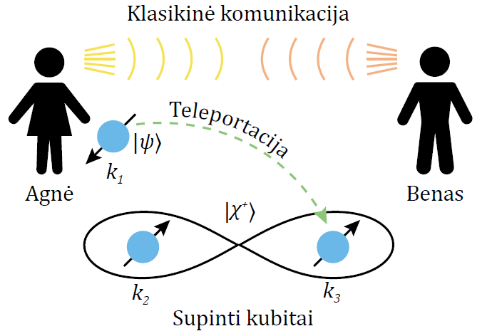
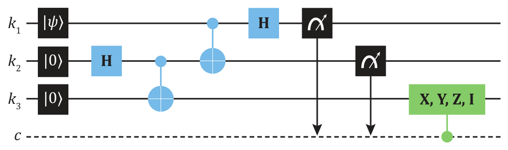
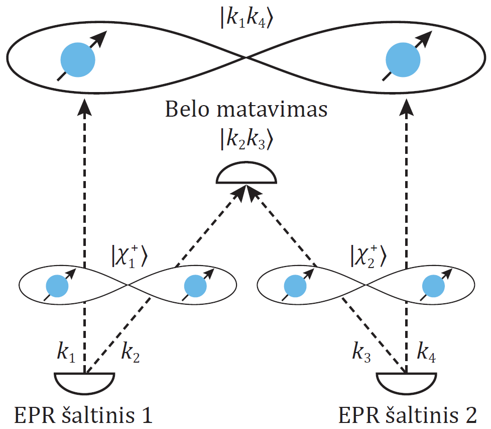
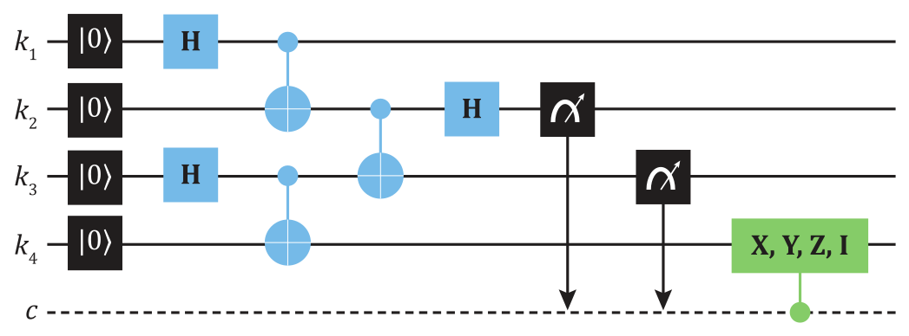
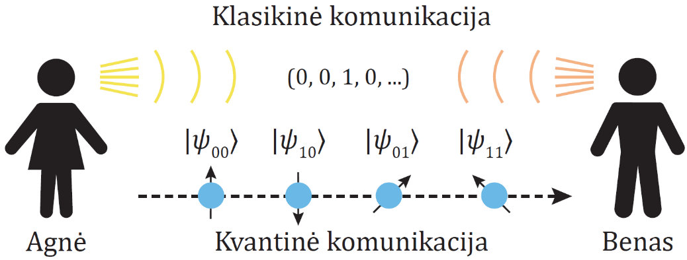
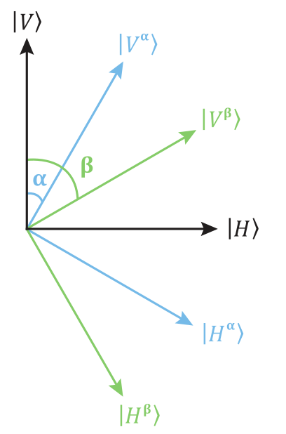

# Kvantinė informacija ir ryšiai 

## Kvantinės informacijos kopijavimas 

Klasikinės informacijos kopijavimas (skaitmeniniu ar kitokiu pavidalu)
yra kasdieninis dalykas. Tai atliekame kopijuodami failus kompiuterio
atminties laikmenose, informacijos kopijomis yra apsikeičiama tarp
kompiuterių naudojant internetą. Nors skamba paradoksaliai, tačiau
kvantinės informacijos kopijavimas yra fundamentaliai neįmanomas.
**Uždraustojo kopijavimo teorema** (angl. *no-cloning theorem*) nusako,
kad neįmanoma sukurti nežinomos bendros kvantinės būsenos identiškos
kopijos (klono). Dėl šios teoremos svarbos bei gan paprastų argumentų
pateiksime jos įrodymą.

**Įrodymas:** darome prielaidą, kad vis dėlto egzistuoja tokia unitarinė
transformacija $U$, kuri gali sukurti identišką nežinomos kvantinės
būsenos $|\psi\rangle$ kopiją. Kopijavimui atlikti
naudojame kvantinį registrą, esantį sutartinėje būsenoje
$|\phi\rangle$, o $U$ veikia tarp šio registro ir
kopijuojamos kvantinės sistemos. Pagal kopijavimo apibūdinimą, $U$
formaliai atlieka:
\begin{equation}
U|\psi\rangle\otimes |\phi\rangle = |\psi\rangle\otimes |\psi\rangle\,.
(\#eq:kopijavimo-apibrezimas)
\end{equation}
Kitaip tariant, antrojo registro būsena yra pakeičiama į identišką
pirmojo registro $|\psi\rangle$ būsenos kopiją,
$|\phi\rangle \rightarrow |\psi \rangle$.
Toliau imkime bet kokias dvi normuotas būsenas
$|\kappa\rangle$ ir $|\tau\rangle$,
kurių kopijavimą norime atlikti. Kopijuojančios unitarinės
transformacijos efektas šioms būsenoms individualiai yra:
\begin{equation}
U|\kappa\rangle\otimes |\phi\rangle = |\kappa\rangle\otimes |\kappa\rangle\,,\quad
U|\tau\rangle\otimes |\phi\rangle = |\tau\rangle\otimes |\tau \rangle\,.
(\#eq:kopijavimo-efektas)
\end{equation}
Tolesniame žingsnyje įvertinkime
$|\kappa\rangle\otimes|\kappa\rangle$
ir $|\tau\rangle\otimes |\tau\rangle$
būsenų vidinę sandaugą:
\begin{equation}
\begin{aligned}
\big(\langle\kappa |\otimes\langle\kappa |\big)\big(|\tau\rangle\otimes |\tau\rangle\big) = &
\langle\kappa |\tau\rangle^2 = \langle\phi|\otimes\langle\kappa |U^{\dagger}U|\tau\rangle\otimes |\phi\rangle \\
= & \langle\kappa |\tau\rangle\langle\phi |\phi\rangle = \langle\kappa |\tau\rangle\,.
\end{aligned}
(\#eq:kopijavimas-vidine-sandauga)
\end{equation}
Viršuje, neprarasdami bendrumo, panaudojome unitarumą $U^{\dagger}U = I$
bei registro būsenos normuotumą
$\langle\phi |\phi\rangle = 1$. Tad randame šią
lygtį:
\begin{equation}
\langle\kappa | \tau\rangle^2 = \langle\kappa | \tau\rangle\,.
(\#eq:lygtis-vidinei-sandaugai)
\end{equation}
Tai yra formaliai kvadratinė lygtis, $x^2 = x$, kuri turi du
sprendinius: $x = 0$ ir $x = 1$. Pirmasis sprendinys ($x = 0$) nusako,
kad $|\kappa\rangle$ ir $|\tau\rangle$
yra ortogonaliosios būsenos
$\langle\kappa |\tau\rangle = 0$. Antrasis
sprendinys ($x = 1$) nusako, kad jos vienodos
$\langle\kappa |\tau\rangle = 1$,
$\rightarrow |\kappa\rangle = |\tau\rangle$
(iki nesvarbios globalios fazės $\mathrm{e}^{\mathrm{i}\alpha}$). Antrasis sprendinys mūsų
nedomina, nes pasirinkome skirtingas būsenas,
$|\kappa\rangle \neq |\tau \rangle$.
Pirmasis sprendinys rodo, kad transformacija $U$ gali atlikti tik
ortogonaliųjų būsenų kopijavimą ir todėl prieštarauja prielaidai, kad
egzistuoja universali unitarioji transformacija $U$, galinti kopijuoti
bet kokią būseną.

Kvantiniu kompiuteriu galima kopijuoti klasikinę informaciją. Jau žinome
tokį $U$, kuris sugeba kopijuoti bazinių vektorių būsenas
$|0\rangle$ ir $|1\rangle$, tai $cX$
loginiai vartai. Tačiau $cX$ negali nukopijuoti 1 kubito būsenos, kuri
yra $|0\rangle$ ir $|1\rangle$
superpozicijoje. Imkime pirmąjį kubitą, esantį lygioje
$|0 \rangle$ ir $|1 \rangle$
superpozicijoje, taip pat antrojo registro kubitą
$|0\rangle$ būsenoje. Randame:
\begin{equation}
cX\frac{1}{\sqrt{2}}\big(|0\rangle + |1\rangle\big)\otimes |0\rangle =
\frac{1}{\sqrt{2}}\big(|00\rangle + |11\rangle)\,.
(\#eq:cx-superpozicija-2)
\end{equation}
Šiuo atveju gauname supintąją Belo būseną. Tačiau, jeigu $cX$ iš tiesų
atliktų kopijavimą į antrojo kubito vietą, mes turėtume gauti:
\begin{equation}
\frac{1}{2}\big(|0\rangle + |1\rangle\big)\otimes\big(|0\rangle + |1\rangle\big) =
\frac{1}{2}\big(|00\rangle + |01\rangle + |10\rangle + |11\rangle\big)\,.
(\#eq:tikro-kopijavimo-rezultatas)
\end{equation}
Be unitariųjų transformacijų taip pat yra matavimų tipo
nedeterministinės transformacijos. Jos irgi nėra tinkamos atlikti
kopijavimą, nes matavimų rezultatai yra atsitiktiniai.

## Kvantinė teleportacija

Klasikinė skaitmeninė informacija ryšiuose yra perduodama siunčiant
signalus tuščia erdve, elektros kabeliais bei šviesolaidžiais. Norint
persiųsti kvantinę informaciją, kuri yra koduojama kubito būsenoje
$|\psi\rangle = a|0\rangle + b|1\rangle$,
reikia, kad perduotume amplitudžių vertes $a$ ir $b$. Jeigu žinome
$|\psi \rangle$ būsenos paruošimo žingsnius, tada taip
pat galime klasikiniu būdu komunikuoti būsenos loginių operacijų seką,
kurią atkartojęs gavėjas turės efektyviai identišką kvantinę informaciją
savo kubite. Didesnis keblumas iškyla norint persiųsti informaciją,
laikomą nežinomoje kvantinėje būsenoje. Šios informacijos iš esmės
sužinoti negalime, tad ir ją komunikuoti klasikiniu būdu neįmanoma.

Egzistuoja keletas būdų, kaip persiųsti nežinomo turinio kvantinę
informaciją. Pirmasis būdas  -- kubitų fizinis apsikeitimas tarp
lokacijų kvantinio ryšio priemonėmis. Kvantinis ryšys įprastai naudoja
fotonus, dar vadinamus **skraidančiaisiais kubitais** (angl. *flying
qubits*) ir, pavyzdžiui, jų poliarizacijos būsenas, kuriose koduojama
informacija. Fotonus galima siųsti dideliais atstumais naudojant
įprastus telekomunikacijoms skirtus šviesolaidžius bei tuščia erdve.
Tačiau delikačios fotonų būsenos yra lengvai pažeidžiamos siunčiant juos
dideliais atstumais. Atsirandanti depoliarizacijos tikimybė gali
pakeisti amplitudes ir įvesti klaidas į siunčiamą informaciją. Didėjant
atstumui, taip pat didėja fotonų praradimo tikimybė dėl absorbcijos ir
sklaidos. Kitaip nei klasikiniuose ryšiuose, siunčiamo kvantinio signalo
stiprinti neįmanoma dėl uždrausto kvantinių būsenų kopijavimo. Jeigu šie
neigiami efektai nėra per daug žymūs, tada kvantinių klaidų taisymo
algoritmais sėkmingo ryšio tikimybę galima itin padidinti.

Kvantinė teleportacija yra praktinės svarbos metodas siunčiant
informaciją, koduojamą nežinomoje kubitų būsenoje. Šis metodas
nereikalauja tiesioginio dvipusio kvantinių ryšių kanalo tarp
bendraujančių šalių, tačiau jos turi turėti kvantinį ryšį su joms bendru
supintųjų fotonų šaltiniu. Tai leidžia persiųsti kvantinę informaciją
pasitelkiant klasikinių ryšių kanalą tarp bendraujančių šalių, o
supintųjų kubitų poros atlieka teleportacijos ištekliaus vaidmenį.
Klasikiniu kanalu tereikia nusiųsti po du bitus informacijos siekiant
teleportuoti kiekviename kubite tolydžiai kintančiose amplitudėse
koduojamą informaciją. Pirmiausiai įvardinkime, ką šiame kontekste
reiškia žodis „teleportacija".

Pagal kvantinę mechaniką dalelės, turinčios vienodas vidines fizikines
savybes tokias kaip krūvis, masė ar sukinys, yra **identiškos**
(angl. *identical particles*) ir negali būti atskirtos viena nuo kitos.
Elektronai gali būti atskirti nuo pozitronų, nes pirmieji turi
neigiamąjį, o antrieji -- teigiamąjį krūvį; tačiau elektronai negali
būti atskirti vienas nuo kito. Tad, jeigu turime du elektronus
skirtingose lokacijose, tačiau identiškose sukinio būsenose, sukeitus
juos vietomis fundamentaliai neįmanoma pasakyti, kad jie buvo sukeisti.
Teleportacijos pavyzdys būtų, jeigu pradėdami nuo dviejų elektronų
skirtingose lokacijose ir sukinio būsenose identiškai atkurtume pirmojo
elektrono sukinio būseną antrajame elektrone. Teleportacija nėra
ribojama vien tik vidiniams laisvės laipsniams, nors ir dažniausiai
nagrinėjama jų kontekste. Šis procesas išsaugo visus fizikos
principus -- čia aktualūs kvantinės informacijos kopijavimo draudimas,
energijos tvermė ir kad niekas negali keliauti greičiau už šviesos
greitį. Fizinės sistemos akimirksniu nepradingsta ir kitur
neatsiranda -- tik pakeičia savo būsenas.

```{r kvantine-teleportacija, echo=FALSE, fig.cap="Kvantinė $k_1$ kubito būsenos $|\\psi\\rangle$ teleportacija į $k_3$ kubitą.", out.width='80%', fig.align='center'}

```

Standartiniame teleportacijos scenarijuje
(žr. \@ref(fig:kvantine-teleportacija) pav.) Agnė turi kubitą $k_1$ būsenoje
$|\psi\rangle = a|0\rangle + b|1\rangle$,
$|a|^2 + |b|^2 = 1$, kurio amplitudžių $a$ ir $b$ ji nežino, tačiau
nori $|\psi\rangle$ nusiųsti Benui. Agnė ir Benas turi
galimybę tarpusavyje komunikuoti klasikiniu būdu ir tam naudoja bitus.
Jie taip pat turi prieigą prie išorinio šaltinio, kuris proceso
pradžioje sugeneruoja 2 kubitų supintą Belo būseną
$|\chi^{+}\rangle = \frac{1}{\sqrt{2}}\big(|00\rangle + |11\rangle\big)$
ir išsiunčia pirmą kubitą ($k_2$) Agnei, o antrą ($k_3$) Benui. Abu
žino, kad yra gavę vieną iš $|\chi^{+}\rangle$ būsenos
kubitų. Viso proceso pabaigoje Agnės $|\psi\rangle$
kubito būsena yra teleportuojama į Beno turimą $k_3$ kubitą.

Bendrą pradinę šių trijų kubitų būseną galime užrašyti taip:
\begin{equation}
\begin{aligned}
|\Psi\rangle = & |\psi\rangle\otimes |\chi^{+}\rangle =
\frac{1}{\sqrt{2}}\Big\lbrack a|0\rangle\otimes\big(|00\rangle + |11\rangle\big)
+ b |1\rangle\otimes\big(|00\rangle + |11\rangle\big)\Big\rbrack \\
= & \frac{1}{\sqrt{2}}\Big\lbrack a\big(|000\rangle + |011\rangle\big)
+ b\big(|100\rangle + |111\rangle\big)\Big\rbrack\,.
\end{aligned}
(\#eq:bendra-pradine-3-busena)
\end{equation}
Superpozicijos būsenose kubitai yra sunumeruoti taip:
$|k_1 k_2 k_3 \rangle$. Pradinėje būsenoje
$|\Psi \rangle$ nėra nei klasikinių, nei kvantinių
koreliacijų tarp Agnės $k_1$ kubito būsenoje
$|\psi\rangle$ ir Belo poros kubitų $k_2$ ir $k_3$.
Agnė atlieka dvejus kvantinius loginius vartus savo turimiems kubitams.
Pirmiausia ji atlieka $cX$ vartus, kuriame
$|\psi \rangle$ kubitas yra „kontrolinis". Randame naują
būseną $|\Psi'\rangle$:
\begin{equation}
|\Psi'\rangle = (cX_{12}\otimes I)|\Psi\rangle =
\frac{1}{\sqrt{2}}\Big\lbrack a\big(|000\rangle + |011\rangle\big)
+ b\big(|110\rangle + |101\rangle\big)\Big\rbrack\,.
(\#eq:busena-po-cx)
\end{equation}
Kitame žingsnyje ji atlieka norimam nusiųsti
$|\psi\rangle$ kubitui Hadamardo transformaciją:
\begin{equation}
\begin{aligned}
|\Psi''\rangle = & (H\otimes I\otimes I)|\Psi'\rangle \\
= & \frac{1}{2}\Big\lbrack a\big(|000\rangle + |011\rangle + |100\rangle + |111\rangle\big) \\
& + b\big(|010\rangle + |001\rangle - |110\rangle - |101\rangle\big)\Big\rbrack\,.
\end{aligned}
(\#eq:busena-po-h-cx)
\end{equation}
Nedarant jokių kitų transformacijų, šią būseną galima pergrupuoti
atskiriant Agnės ir Beno kubitus tenzorių ženklu:
\begin{multline}
|\Psi''\rangle = \frac{1}{2}\Big\lbrack |00\rangle\otimes\big(a|0\rangle + b|1\rangle\big)
+ |10\rangle\otimes\big(a|0\rangle - b|1\rangle\big) \\
+ |01\rangle\otimes\big(b|0\rangle + a|1\rangle\big)
+ |11\rangle\otimes\big( -b|0\rangle + a|1\rangle\big)\Big\rbrack\,.
(\#eq:busena-pergrupavimas)
\end{multline}
Tai leidžia lengviau pamatyti, kad Agnei atlikus dvi minėtas
transformacijas Beno kubito $k_3$ būsena šioje trijų kubitų
superpozicijoje jau primena $|\psi\rangle$. Toliau Agnė
atlieka savo dviejų kubitų būsenos matavimą. Ji gali rasti vieną iš
keturių skirtingų dviejų bitų kombinacijų su lygiomis 0.25 tikimybėmis.
Pagal tai, kurią kombinaciją Agnė aptiks savo kubituose
$|k_1 k_2 \rangle$, tai automatiškai turės įtakos,
kokia bus galutinė Beno kubito $|k_3 \rangle$ būsena:
\begin{align}
|k_1 k_2\rangle = & |00\rangle\rightarrow |k_3 \rangle = a|0\rangle + b|1\rangle\,;(\#eq:busna-po-matavimo-1) \\
|k_1 k_2\rangle = & |10\rangle\rightarrow |k_3 \rangle = a|0\rangle - b|1\rangle\,;(\#eq:busna-po-matavimo-2) \\
|k_1 k_2\rangle = & |01\rangle\rightarrow |k_3 \rangle = b|0\rangle + a|1\rangle\,;(\#eq:busna-po-matavimo-3) \\
|k_1 k_2\rangle = & |11\rangle\rightarrow |k_3\rangle = - b|0\rangle + a|1\rangle\,.(\#eq:busna-po-matavimo-4)
\end{align}
Norėdama užbaigti teleportaciją, Agnė klasikiniu kanalu nusiunčia du
bitus informacijos Benui pranešti, kokį rezultatą gavo. Jeigu ji rado
$|00\rangle$, siunčiami bitai 00, jeigu
$|01\rangle$ -- bitai 01, ir atitinkamai su kitais
dviem. Jeigu Benas gavo bitus 00, jam daryti nieko nereikia,
$|\psi\rangle$ jau yra teleportuota ir jo „rankose".
Visais kitais atvejais Beno kubitas $k_3$ yra susietas su norima
teleportuoti būsena $|\psi\rangle$ paprasta
transformacija -- Blocho vektoriaus posūkiu 180° kampu aplink $x$, $y$,
arba $z$ ašis. Pavyzdžiui, jeigu Benas gavo bitus 01, savo kubitui
$k_3$ jis atlieka kvantinius loginius vartus $X$, kurie sukeičia
amplitudes vietomis ir taip gaunama $|\psi\rangle$.
Jeigu gauti bitai yra 10, jis atlieka $Z$ loginius vartus, o jeigu 11 --
$Y$ vartus.

Panagrinėkime, kas šiame procese įvyko. Pirmiausiai matome, kad Agnės
kubito $k_1$ būsena $|\psi\rangle$, esanti bendrai
$|0\rangle$ ir $|1\rangle$
superpozicijoje, matavimo metu yra panaikinama. Pas ją lieka kubitai
$k_1$ ir $k_2$, esantys viename iš skaičiuojamųjų bazinių vektorių.
Todėl $|\psi\rangle$ būsenos kopijavimas neįvyksta ir
Agnė nesužino $|\psi\rangle$ būsenos $a$ ir $b$
amplitudžių, taip patvirtinama uždraustojo kopijavimo teorema.
Teleportacijoje pagrindinį vaidmenį atlieka supintoji kubitų pora, kuria
Agnė ir Benas pasidalijo proceso pradžioje. Agnės atliekama $cX$
transformacija tarp jos supinto kubito $k_2$ bei teleportuojamo $k_1$
supina ir šiuos kubitus. Taip sukuriama trijų kubitų supintoji būsena.
Dėl naujai įvestų trijų kubitų kvantinių koreliacijų, Agnės atliekami
Hadamardo vartai jos kubitui nelokaliai paveikia bendrą trijų kubitų
būseną. Tai ir yra matoma lygtyje Beno kubito amplitudėse. Prieš Agnei
atliekant savo kubitų matavimą, Beno kubitas yra superpozicijoje,
sudarytoje iš keturių skirtingų būsenų. Dėl įvestų koreliacijų, Agnės
matavimas nulemia Beno kubito būsenos pasikeitimą į vieną iš šių keturių
galimų. Tai galime interpretuoti kaip projekcinį Belo būsenų matavimą --
antri $cX$ ir $H$ vartai tai formaliai realizuoja. Galutinė Beno
transformacija $k_3$ kubitui atlieka minimalius pataisymus atstatyti
$|\psi\rangle$.

Teleportacija yra praktinis būdas siųsti kvantinę informaciją ryšių
tikslais ar skaičiavimams kvantinių kompiuterių tinkluose. Galime
įsivaizduoti scenarijų, kuriame Agnės turimas kvantinis procesorius yra
pranašesnis už Beno. Nors Beno kompiuteris turi ribotas skaičiavimų
galimybes, tačiau gali patikimai atlikti Pauli-$X$, $Y$ ir $Z$
transformacijas kubitams. Tad Benas gali atlikti jam rūpimus kvantinius
skaičiavimus pas Agnę kvantiniame debesyje. Parsisiųsti
$|\psi\rangle$ būseną tolimesniam apdorojimui Benui
tereikia bendros prieigos su Agne prie Belo būsenų generavimo šaltinio
ir klasikinių ryšių kanalo. Teleportacijos metodas gali būti naudojamas
persiųsti ne vien pavienių kubitų būsenoms, bet ir sudėtinėms kubitų
supintosioms kvantinėms būsenoms.

```{r kvantine-teleportacija-2, echo=FALSE, fig.cap="Loginė grandinė, realizuojanti kvantinę teleportaciją.  Paskutiniame žingsnyje kubitui $k_3$ pritaikomi sąlyginiai Pauli loginiai vartai, kontroliuojami klasikinio registro, kurio būseną nulemia pirmų dviejų kubitų matavimo rezultatai.", out.width='80%', fig.align='center'}

```

Teleportaciją galime atlikti ir
kvantiniame procesoriuje tarp kubitų. Vienas būdas tai užrašyti
loginiais vartais yra parodytas \@ref(fig:kvantine-teleportacija-2) pav. Matome Agnės kubitą $k_1$
pradinėje $|\psi\rangle$ būsenoje,
$|\chi^{+}\rangle$ Belo būsenos generavimą tarp $k_2$
ir $k_3$, bei Belo matavimą. Pagal 2 bitų kombinaciją, gautą atlikus
Agnės kubitų $k_1$ ir $k_2$ matavimus, kubitui $k_3$ pritaikomi
klasiškai kontroliuojami atitinkami sąlyginiai vartai Pauli-$X$, $Y$, $Z$,
arba $I$.

## Kvantinio supynimo sukeitimas

Norint atlikti supynimą tarp dviejų kubitų, paprastai yra naudojama
2 kubitų unitarinė transformacija, pavyzdžiui, $cX$ loginiai vartai.
**Kvantinio supynimo sukeitimo metodas** (angl. *entanglement swapping*)
leidžia supinti vieną nuo kito nutolusius kubitus nereikalaujant jų
tiesioginės tarpusavio sąveikos. Čia taip pat pasitelkiamos supintosios
Belo būsenos, atliekančios svarbią rolę kvantiniuose ryšiuose, jų
generatorius įprasta vadinti EPR šaltiniais (angl. *EPR source*,
trumpinys nuo *Einstein-Podolsky-Rosen*).

```{r kvantinio-supynimo-sukeitimas, echo=FALSE, fig.cap="Kvantinio supynimo sukeitimo protokolo iliustracija.  Supintosios Belo būsenos kubitų porose $(k_1 , k_2)$.", out.width='80%', fig.align='center'}

```

Kvantinio supynimo sukeitimas praktiškai
pritaikomas kvantiniuose tinkluose, nes gali atlikti **signalo kartotuvo
funkciją** (angl. *quantum repeater*). Norint išvengti signalo sumenkimo
nuostolių ir padidinti atstumą tarp kvantinės komunikacijos galutinių
taškų, viena išeitis yra pastatyti tarpinius signalo kartotuvus. Gavę
supintus kubitus iš nutolusių EPR šaltinių kartotuvai atlieka supynimo
sukeitimą (žr. \@ref(fig:kvantinio-supynimo-sukeitimas) pav.). Tai leidžia efektyviai padidinti kvantinio
ryšio atstumą ir realizuoti teleportaciją ar kitus protokolus,
naudojančius supintąsias būsenas.

Supynimo sukeitimo scenarijuje dalyvauja Agnė, Benas ir Cita. Panašiai
kaip ir kvantinėje teleportacijoje, Agnė ir Benas turi pasidaliję po
vieną kubitą iš supintos $|\chi_1^{+}\rangle$ Belo
būsenos. Benas ir Cita taip pat turi po vieną kubitą iš antros
sugeneruotos Belo būsenos $|\chi_2^{+}\rangle$.
Protokolo pradžioje tarp šių dviejų Belo porų nėra jokių koreliacijų.
Kvantinio supynimo sukeitimo tikslas yra supinti Agnės ir Citos kubitus.
Bendrą pradinę 4 kubitų būseną galime užrašyti taip:
\begin{equation}
\begin{aligned}
|\Psi\rangle = & |\chi_1^{+}\rangle\otimes|\chi_2^{+}\rangle
= \frac{1}{\sqrt{2}}\Big\lbrack\big(|00\rangle + |11\rangle\big)\otimes\big(|00\rangle + |11\rangle\big)\Big\rbrack \\
= & \frac{1}{2}\big\lbrack |0000\rangle + |0011\rangle + |1100\rangle + |1111\rangle\big\rbrack\,.
\end{aligned}
(\#eq:pradine-4-busena)
\end{equation}
Superpozicijos būsenose kubitai sunumeruoti
$|k_1 k_2 k_3 k_4 \rangle$. Agnės kubitas $k_1$ yra
supintas su Beno kubitu $k_2$, Beno kubitas $k_3$ yra supintas su
Citos kubitu $k_4$. Stebint kvantinės teleportacijos žingsnius, Benas
atlieka $cX$ loginius vartus tarp savo turimos kubitų poros $k_2$ ir
$k_3$, kuriuose kubitas $k_2$ atlieka „kontrolinę" rolę. Randame naują
būseną $|\Psi'\rangle$:
\begin{equation}
|\Psi'\rangle = (I\otimes cX_{23}\otimes I)|\Psi\rangle =
\frac{1}{2}\big\lbrack |0000\rangle + |0011\rangle + |1110\rangle + |1101\rangle\big\rbrack\,.
(\#eq:cx-2-3-busena)
\end{equation}
Kitame žingsnyje Benas atlieka Hadamardo transformaciją savo kubitui
$k_2$:
\begin{equation}
|\Psi''\rangle = (I\otimes I\otimes H\otimes I)|\Psi'\rangle\,.
(\#eq:h-k2-busena)
\end{equation}
Norėdami lengviau pamatyti rezultatą, sugrupuosime narius
$|\Psi''\rangle$ skliausteliuose:
\begin{multline}
|\Psi''\rangle = \frac{1}{\sqrt{8}}\Big\lbrack\big(|0\rangle\otimes |00\rangle\otimes |0\rangle
+ |1\rangle\otimes |00\rangle\otimes |1\rangle\big) \\
+ \big(|0\rangle\otimes |01\rangle\otimes |1\rangle
+ |1\rangle\otimes |01\rangle\otimes |0\rangle\big) \\
+ \big(|0\rangle\otimes |10\rangle\otimes |0\rangle
- |1\rangle\otimes |10\rangle\otimes |1\rangle\big) \\
+ \big(|0\rangle\otimes |11\rangle\otimes |1\rangle
- |1\rangle\otimes |11\rangle\otimes |0\rangle\big)\Big\rbrack\,.
(\#eq:busena-sugrupavimas-4)
\end{multline}
Kiekvienoje šios superpozicijos būsenoje 4 kubitai yra užrašyti šia
forma
$|k_1 \rangle\otimes |k_2 k_3 \rangle\otimes |k_4 \rangle$.
Benas galiausiai atlieka savo abiejų kubitų matavimą, taigi gali rasti
vieną iš keturių kombinacijų $|k_2 k_3 \rangle$ su
lygiomis 0.25 tikimybėmis. Matome, kad pagal jo rastą kubitų būseną
galutinė Agnės ir Citos kubitų būsena
$|k_1 k_4 \rangle$ pasikeičia:
\begin{align}
|k_2 k_3 \rangle = & |00\rangle\rightarrow |k_1 k_4 \rangle = \frac{1}{\sqrt{2}}\big(|00\rangle + |11\rangle\big) = |\chi^{+}\rangle\,;(\#eq:k1k4-pasikeitimas-1)\\
|k_2 k_3 \rangle = & |01\rangle\rightarrow |k_1 k_4 \rangle = \frac{1}{\sqrt{2}}\big(|01\rangle + |10\rangle\big) = |\eta^{+}\rangle\,;(\#eq:k1k4-pasikeitimas-2)\\
|k_2 k_3 \rangle = & |10\rangle\rightarrow |k_1 k_4 \rangle = \frac{1}{\sqrt{2}}\big(|00\rangle - |11\rangle\big) = |\chi^{-}\rangle\,;(\#eq:k1k4-pasikeitimas-3)\\
|k_2 k_3 \rangle = & |11\rangle\rightarrow |k_1 k_4 \rangle = \frac{1}{\sqrt{2}}\big(|01\rangle - |10\rangle\big) = |\eta^{-}\rangle\,.(\#eq:k1k4-pasikeitimas-4)
\end{align}
Agnės ir Citos kubitai $|k_1 k_4 \rangle$ visais
atvejais lieka vienoje iš supintųjų Belo būsenų. Benas matavimo
rezultatus perduoda Agnei ir Citai klasikiniu būdu; tai leidžia
sužinoti, kokią supintąją būseną jos turi. Kad Agnė ir Cita pakeistų
savo gautą būseną į bet kurią kitą Belo būseną, jos gali atlikti
atitinkamas lokalias Pauli transformacijas savo turimiems kubitams.
Atkreipiame dėmesį, kad šio proceso metu kvantiniai supynimai tarp Agnės
ir Beno kubitų poros $k_1$ ir $k_2$, taip pat Beno ir Citos kubitų
$k_3$ ir $k_4$ yra panaikinami.

```{r kvantinio-supynimo-sukeitimas-2, echo=FALSE, fig.cap="Kvantinio supynimo sukeitimo realizacija loginėje grandinėje.", out.width='80%', fig.align='center'}

```

Kvantinė grandinė, atliekanti supynimo sukeitimo algoritmą, yra
pavaizduota \@ref(fig:kvantinio-supynimo-sukeitimas-2) pav. Grandinės pabaigoje įdėti klasiškai kontroliuojami
loginiai vartai, atliekantys $k_4$ kubito transformaciją. Ši
transformacija leidžia pakeisti Agnės ir Citos supintąją būseną į bet
kurią kitą Belo būseną. Kaip matysime vėliau šiame skyriuje, pakanka
vienos lokaliosios transformacijos, atliekamos bet kuriam kubitui
supintoje poroje, norint pakeisti jų bendrą Belo būseną į bet kurią kitą
Belo būseną.

## Kvantinė kriptografija

Įsivaizduokime scenarijų, kuriame Agnė ir Benas ketina apsikeisti
svarbia informacija. Norint užtikrinti, kad Evelina, kuri yra
slapukavusi tarp jų anksčiau, nepamatytų ryšių turinio, Agnė ir Benas
nusprendžia jį užšifruoti. Tokiu atveju, nors Evelina ir perimtų
siunčiamą turinį, ji negalėtų suprasti, kas jame sakoma. Siekdami
užšifruoti turinį Agnė ir Benas naudoja raktą. Kaip paprastą to pavyzdį
imkime, kad turinys ($t$) yra išreikštas dvejetaine forma $t =
001011010$, o šifravimas atliekamas sudedant kiekvieną turinio bitą
modulo(2) su atitinkamu rakto $r = 011101100$ bitu. Taip turinys
pasikeičia į šią šifruotą seką: $t\oplus r = 0101110110$. Norint
turinį iššifruoti, tereikia vėl mod(2) sudėti šifruotą turinį su tuo
pačiu raktu, nes $(t\oplus r)\oplus r = t$.

Agnė ir Benas gali pasirinkti, ar jie naudos privataus, ar atvirojo
rakto kriptografinę sistemą. Privataus rakto kriptografijoje Agnė ir
Benas susitikę pasirenka raktą, arba paprašo, kad raktą jiems perduotų
trečiasis asmuo, Cita. Nors privataus rakto metodas yra saugus
(naudojant pakankamai ilgą raktą), jam reikalingas apsikeitimas nėra
praktiškas ir turi savo saugumo spragų. Pavyzdžiui, gali būti neįmanoma
susitikti apsikeisti raktu ar tai atlikti kiekvieną kartą prieš
inicijuojant ryšį. Antraip jie dar turėtų užtikrinti ilgai laikomo ir
naudojamo rakto saugumą nuo įsibrovimų. Trečiojo asmens naudojimas
apsikeitimui irgi neužtikrina saugumo, nes Cita gali raktą pasidalyti ar
perduoti Evelinai.

Atvirojo rakto kriptografijos metodas buvo sukurtas 1970-aisiais ir yra
plačiai taikomas interneto tinkluose. Šiuo metodu naudojamas asimetrinis
rakto pasidalijimas. Norėdama suteikti Benui galimybę saugiai nusiųsti
informaciją jai, Agnė atvirai paskelbia raktą, kuriuo reikia užšifruoti
siunčiamą turinį. Tačiau Agnė pas save turi kitą raktą, žinomą tik jai,
kuriuo galima iššifruoti turinį užšifruotu jos viešai paskelbtu raktu.
Šie raktai yra sugeneruojami automatiškai kiekvienos sesijos metu, ir
tam naudojamas atsitiktinių skaičių generatorius. Atvirojo rakto
kriptografijos saugumas yra pagrįstas matematiškai sunkiai
apskaičiuojamomis funkcijomis. Vis dėlto yra parodyta, kad plačiai
paplitusi **RSA kriptografijos sistema**
(angl. *Rivest-Shamir-Adleman*), pagrįsta pirminių skaičių
faktorizacija, yra efektyviai įveikiama Šoro algoritmu kvantiniuose
kompiuteriuose. Agnė ir Benas tiki, kad Evelina dar neturi pakankamai
galingo kvantinio kompiuterio įveikti RSA, ir todėl yra linkę naudoti šį
kriptografijos protokolą. Tačiau, jeigu Evelina tokį įrenginį turės
artimoje ateityje, perimtą Agnės ir Beno ryšį ji galės nuskaityti ir
vėliau.

Trečiasis būdas, apie kurį sužinojo Agnė ir Benas, yra naudoti privatų
**kvantinį rakto pasidalijimo protokolą** (angl. *quantum key
distribution*, trumpinys QKD). Šiame protokole užšifruoti ir iššifruoti
turiniui taip pat naudojamas klasikinis raktas (dvejetainis kodas),
tačiau rakto pasidalijimui yra naudojami kvantiniai ryšiai. Privatų
rakto pasidalijimą jie gali atlikti per atvirą kanalą nebijodami, kad
Evelina raktą sužinos, kadangi kvantiniuose ryšiuose rakto atskleidimas
pakeičia raktą, na, o kopijuoti kvantinio rakto fundamentaliai
neįmanoma. Atlikę kvantinį rakto pasidalijimą jie gali toliau naudoti
klasikinį ryšių kanalą simetriškai užšifruodami ir iššifruodami
siunčiamą turinį. Toliau pateikiame BB84 ir EPR kvantinius rakto
pasidalijimo protokolus.

### BB84 kvantinis rakto pasidalijimo protokolas

Dvejetainio rakto persiuntimui **BB84** (angl. *C. Bennet ir G.
Brassard,* 1984) protokole yra naudojamas vienpusis kvantinis kanalas
nuo Agnės iki Beno ir klasikinis dvipusis ryšių kanalas. Klasikinis
kanalas yra viešas ir gali būti pasiklausomas, kvantiniu kanalu
siunčiama informacija taip pat gali būti perimta. Kaip matysime, tai
netrukdo inicijuoti saugų ryšį.

Jeigu norimo rakto ilgis yra $n$ bitų, tada Agnė, pirmiausiai naudodama
atsitiktinių skaičių generatorių, sugeneruoja dvi $4n$ bitų ilgio sekas,
kurias vadinsime $a_A$ ir $b_A$. Pirmoji bitų seka $a_A$ nusako patį
raktą, o antroji $b_A$ -- kokią šifravimo sistemą naudoti kiekvienam
$a_A$ rakto bitui. Šias dvi vienodo ilgio sekas galima sugrupuoti
poromis $\{a_A , b_A\}=\{(a_1 , b_1 ), (a_2, b_2 ),\ldots,
(a_{4n}, b_{4n})\}$, pagal kurias Agnė paruoš $4n$ kubitų siųsti Benui.
Jeigu $b_A$ bitas yra 0, tada išreikšti $a_A$ bitui (kurio
sugeneruota vertė yra 0 arba 1) Agnė taiko Pauli-$Z$ bazinių vektorių
šifravimą. Tai yra, jeigu rakto bito vertė yra $a_A= 0$, jis
perteikiamas kubito $|0\rangle$ būsena, o $a_A= 1$
bitas perteikiamas būsena $|1\rangle$. Jeigu šifravimo
bitas $b_A = 1$, Agnė išreiškia atitinkamą $a_A$ rakto bitą Pauli-$X$
baziniais vektoriais {$|0_x \rangle$,
$|1_x \rangle$}. Taip Agnė nusiunčia Benui $4n$ kubitų
$|\psi_{ab}\rangle$, kurių kiekvienas yra vienoje iš šių
būsenų:
\begin{align}
|\psi_{00}\rangle = & |0\rangle\,;(\#eq:psi-00-bb84) \\
|\psi_{10}\rangle = & |1\rangle\,;(\#eq:psi-10-bb84) \\
|\psi_{01}\rangle = & |0_x \rangle = \frac{1}{\sqrt{2}}\big(|0\rangle + |1\rangle\big)\,;(\#eq:psi-01-bb84) \\
|\psi_{11}\rangle = & |1_x \rangle = \frac{1}{\sqrt{2}}\big(|0\rangle - |1\rangle\big)\,.(\#eq:psi-11-bb84)
\end{align}
Gavęs kubitus Benas neturi informacijos, kokiose būsenose jie yra. Benas
imasi atlikti kubitų būsenų matavimus ir atsitiktiniu būdu pasirenka
atlikti Pauli-$Z$ arba Pauli-$X$ projekcinius matavimus. Kaip minėjome
IV skyriuje, norint atlikti Pauli-$X$ projekcinį matavimą tereikia
atlikti Hadamardo transformaciją su gautais kubitais ir toliau jiems
vykdyti standartinį (Pauli-$Z$) matavimą. Atkreipiame dėmesį, kad šios
keturios kubitų būsenos nėra visos viena kitai ortogonalios, todėl
negali būti patikimai atskirtos atliekant tik vieno tipo matavimą.
Matome, kad (atsitiktinai) atlikęs Pauli-$Z$ matavimą kubitams,
esantiems $|\psi_{00}\rangle$ arba
$|\psi_{10}\rangle$ būsenose, Benas (pats nežinodamas)
teisingai išmatuoja šias būsenas ir gauna sutapimą su jais, koduojamais
Agnės rakto $a$ bitais. Tačiau, jeigu būsenos yra
$|\psi_{01}\rangle$ arba
$|\psi_{11}\rangle$, tikimybė, kad atlikdamas Pauli-$Z$
matavimą Benas teisingai iššifruos rakto bitus, tėra 0.5, kadangi
$|0_x \rangle$ ir $|1_x \rangle$ yra
lygios $|0\rangle$ ir $|1\rangle$
superpozicijos. Analogiška situacija atsiranda, kai Benas atlieka
Pauli-$X$ matavimą. Jis gauna sutapimus su atitinkamais Agnės rakto
bitais, jeigu matuoja $|\psi_{01}\rangle$ ir
$|\psi_{11}\rangle$ būsenas, tačiau atsiranda 0.5 rakto
iššifravimo paklaidos tikimybė matuojant
$|\psi_{00}\rangle$ ir
$|\psi_{10}\rangle$ būsenas. Taip atlikęs matavimus
Benas sugeneruoja {$a_B$, $b_B$} bitų porų seką, kurioje $a_B$ bitas
(0 arba 1) nusako gautą būsenos matavimo rezultatą, o $b_B$ bitas
užrašo, ar šis matavimas naudojo Pauli-$Z$ (bito vertė 0) ar Pauli-$X$
(bito vertė 1).

Kitame žingsnyje Agnė ir Benas, komunikuodami per atvirą klasikinį
kanalą, palygina šifravimo $4n$ bitų $b_A$ ir $b_B$ sekas. Taip jie
turėtų rasti, kad tarp jų bitų vidutiniškai $2n$ buvo atsitiktiniu būdu
pasirinkti vienodai. Tai reiškia, kad Beno naudojamas matavimo būdas bei
Agnės bitų šifravimo būdas šiais $2n$ atvejais sutapo, ir jie abu žino,
kad buvo teisingai iššifruoti šie atitinkami $a$ rakto bitai. Jie
atsikrato $a_A$ ir $a_B$ bitų, kurių porose esantys $b_A$ ir $b_B$
nesutampa ir pasilieka likusią $2n$ raktų seką ($a_A = a_B$)
neatskleisdami jos.

Norėdami patikrinti, kad Evelina
neslapukavo perimdama Agnės siunčiamus kubitus, jiedu atsitiktinai
pasirenka iš turimų $2n$ rakto bitų $n$ bitų ir per klasikinį kanalą
palygina, ar jie sutampa. Jeigu priimtinas bitų skaičius sutampa, jiedu
užbaigia rakto apsikeitimo protokolą ir gali saugiai naudoti likusius
$n$ bitų šifruoti ryšių turiniui.

```{r bb84-iliustracija, echo=FALSE, fig.cap="BB84 protokolo iliustracija.", out.width='80%', fig.align='center'}

```

Panagrinėkime BB84 protokolo (žr. \@ref(fig:bb84-iliustracija) pav.) saugumą. Pirmiausia,
uždraustojo kvantinių būsenų kopijavimo teorema garantuoja, kad Evelina
negali patikimai kopijuoti Agnės siunčiamų kubitų. Jeigu tai būtų
įmanoma, turėdama siunčiamų kubitų būsenų kopijas ir perėmus $b_A$ ir
$b_B$ sekų komunikavimą tarp Agnės ir Beno ji galėtų atkurti raktą bei
turinį. Sakykime, kad Evelina visgi pamėgina atlikti Agnės siunčiamų
kubitų kopijavimą naudodama $cX$ vartus. Jos pradinės kubitų būsenos yra
$|0\rangle$, o po $cX$ vartų ji toliau persiunčia Agnės
kubitus Benui. Po šios transformacijos 2-kubitų būsenos yra:
\begin{align}
cX|\psi_{00}\rangle = & |00\rangle\,;(\#eq:cx-psi-00-bb84) \\
cX|\psi_{10}\rangle = & |11\rangle\,;(\#eq:cx-psi-10-bb84) \\
cX|\psi_{01}\rangle = & \frac{1}{\sqrt{2}}\big(|00\rangle + |11\rangle\big)\,;(\#eq:cx-psi-01-bb84) \\
cX|\psi_{11}\rangle = & \frac{1}{\sqrt{2}}\big(|00\rangle - |11\rangle\big)\,.(\#eq:cx-psi-11-bb84)
\end{align}
Evelina laukia, kol Benas atliks kubitų matavimą, galiausiai tai
paveikia ir jos kubitų būseną. Toliau ji perima Agnės ir Beno klasikinę
komunikaciją, kurioje jiedu atskleidžia, kokie baziniai vektoriai buvo
naudojami šifruoti raktui ir atlikti matavimams. Evelina kartu su Agne
ir Benu atmeta tuos kubitus, kuriuose $b_A$ ir $b_B$ nesutampa. Jos
strategija yra toliau atlikti tokius pačius matavimus su savo turimais
kubitais, kuriuos atliko Benas. Matome, kad Evelina sėkmingai atkuria
$|\psi_{00}\rangle$ ir
$|\psi_{10}\rangle$ būsenas, kurioms Benas atliko
Pauli-$Z$ matavimus. Deja, kvantinis supynimas paveikia Benui
$|\psi_{01}\rangle$ ir
$|\psi_{11}\rangle$ būsenų matavimo rezultatus, kurioms
teisingai atkurti jis (atsitiktinai) pasirinktų Pauli-$X$ matavimus.
Pažvelkime į galimus Beno matavimo rezultatus, prieš tai atlikę $H$
transformaciją:
\begin{equation}
\begin{aligned}
(H\otimes I)|\psi_{01}\rangle
= & \frac{1}{\sqrt{2}}\Big\lbrack\big(|0\rangle + |1\rangle\big)\otimes |0\rangle
+ \big(|0\rangle - |1\rangle\big)\otimes |1\rangle\Big\rbrack \\
= & \frac{1}{\sqrt{2}}\Big\lbrack |0\rangle\otimes\big(|0\rangle + |1\rangle)
+ |1\rangle\otimes\big(|0\rangle - |1\rangle\big)\Big\rbrack\,.
\end{aligned}
(\#eq:h-psi01-bb84)
\end{equation}
Antroje eilutėje pergrupavome narius, norėdami parodyti, kad yra 0.5
tikimybė, jog Benas atlikdamas matavimus ras
$|0_x \rangle$ arba $|1_x \rangle$,
nes $|0\rangle$ ir $|1\rangle$ yra
lygios $|0_x \rangle$ ir
$|1_x \rangle$ superpozicijos. Tačiau atlikdamas
teisingą matavimą Agnės siųstai $|\psi_{01}\rangle$
būsenai jis turėtų rasti $|0_x \rangle$ kiekvieną
kartą. Šis nesutapimas tarp jųdviejų turimų $a_A$ ir $a_B$ bitų bus
aptiktas Agnei ir Benui atliekant atsitiktinių $a$ rakto bitų palyginimą
protokolo pabaigoje. Tad nors Evelina šioje BB84 protokolo atakoje
sugeba teisingai atkurti kiekvieną iš keturių skirtingų būsenų, kurias
Benas randa pas save, tačiau kvantinis supynimas pakeičia Beno
rezultatus ir įveda neatitikimus.

Kadangi unitariosios transformacijos neatitinka norimo tikslo, antra
galima Evelinos taktika -- naudoti matavimo tipo transformacijas. BB84
protokolas uždaro ir šią spragą, kadangi naudoja neortogonaliąsias
kvantines būsenas. Nežinodama, kokį matavimo būdą naudoti, Evelina gali
pasirinkti, pavyzdžiui, visus perimtus Agnės kubitus pamatuoti Pauli-$Z$
projekcija. Atlikus matavimą Evelina šiuos kubitus toliau persiunčia
Benui, norėdama neišsiduoti, kad pasiklauso ryšio. Tačiau Pauli-$Z$
matavimas, atliekamas $|0_x \rangle$ ir
$|1_x \rangle$ būsenoms, neleidžia atskleisti, kokia
yra būsena, kadangi atsitiktinai randamas $|0\rangle$
arba $|1\rangle$ su vienodomis tikimybėmis. Dar blogiau,
kad Evelinos Pauli-$Z$ matavimas negrįžtamai pakeičia
$|0_x \rangle$ ir $|1_x \rangle$
kubitų būsenas į $|0\rangle$ arba
$|1\rangle$. Agnė ir Benas, atlikdami atsitiktinai
pasirinktų rakto bitų palyginimą protokolo pabaigoje, gali įvertinti, ar
jų buvo pasiklausoma ir nutraukti arba kartoti protokolą iš naujo esant
dideliam bitų nesutapimui.

### EPR kvantinis rakto pasidalijimo protokolas

```{r epr-rakto-iliustracija, echo=FALSE, fig.cap="EPR protokolo iliustracija.", out.width='80%', fig.align='center'}
knitr::include_graphics("media/image5_6.png")
```

EPR protokolas (žr. \@ref(fig:epr-rakto-iliustracija) pav.) yra dauguma aspektų panašus į BB84, tačiau
tarp Agnės ir Beno nėra tiesioginio kvantinio ryšio kanalo. Vietoj jo
naudojamas EPR šaltinis, paskirstantis tarp jų supintuosius kubitus. EPR
protokole šis šaltinis paruošia $4n$ supintąsias
$|\chi^{+}\rangle$ kubitų poras ir iš kiekvienos poros
nusiunčia po vieną kubitą Agnei ir Benui. Pradžioje jie abu turi po $4n$
supintųjų kubitų, kurių kiekvienas yra būsenoje:
\begin{equation}
|\chi^{+}\rangle = \frac{1}{\sqrt{2}}\big(|00\rangle + |11\rangle\big)\,.
(\#eq:chi-plus-epr)
\end{equation}
Agnė ir Benas atsitiktiniu būdu pasirenka išmatuoti savo visus turimus
kubitus santykinai su Pauli-$Z$ arba Pauli-$X$ baziniais vektoriais.
Taip jie sugeneruoja bitų sekas {$a_A$, $b_A$} ir {$a_B$, $b_B$};
čia $b$ bitas nusako, ar buvo pasirinktas Pauli-$Z$ (0) ar Pauli-$X$ (1)
matavimas, o $a$ bitas nusako gautą rezultatą (0 arba 1). Iš to matome,
kad jeigu Agnės ir Beno atsitiktiniai matavimo būdo pasirinkimai sutapo,
šių kubitų porų būsenas jie visada ras vienodas, ir todėl jų atitinkami
rakto bitai sutaps. Tai akivaizdu žvelgiant į
$|\chi^{+}\rangle$ ir naudojant Pauli-$Z$ matavimus.
Norėdami atlikti Pauli-$X$ matavimus abiem kubitams
$|\chi^{+}\rangle$ Belo būsenoje pirmiausia atlikime
Hadamardo vartus:
\begin{equation}
\begin{aligned}
H\otimes H|\chi^{+}\rangle
= & \frac{1}{2\sqrt{2}}\Big\lbrack\big(|0\rangle + |1\rangle\big)\otimes\big(|0\rangle + |1\rangle\big)
+ \big(|0\rangle - |1\rangle\big)\otimes\big(|0\rangle - |1\rangle\big)\Big\rbrack \\
= & \frac{1}{\sqrt{2}}\big\lbrack|0\rangle\otimes |0\rangle
+ |1\rangle\otimes |1\rangle\big\rbrack\,.
\end{aligned}
(\#eq:h-h-chi-plus)
\end{equation}
Matome, kad Pauli-$X$ matavimuose taip pat yra ideali
koreliacija tarp dviejų kubitų būsenų, tad atlikus norimus matavimus jų
vertės visada sutaps. Tolimesni žingsniai paremti BB84 protokolu: Agnė
ir Benas per klasikinį kanalą palygina $b_A$ ir $b_B$ šifravimo bitus
ir pasilieka tuos $2n$ rakto bitų, kuriems šifravimo bitai sutapo,
$a_A = a_B$. Galiausiai jiedu atsitiktinai pasirenka iš turimų $2n$
rakto bitų $n$ bitų ir palygina, ar jie sutampa, siekdami įvertinti, ar
ryšys patikimas.

Šiuo atveju Evelina gali pabandyti įsiterpti perimdama abu kubitus
poroje, skirtus Agnei ir Benui. Evelina atlieka kubitų būsenų matavimą
ir toliau jiems persiunčia jau nebesupintus, o klasiškai koreliuotus
kubitus, taip tiksliai žinodama, kokie bus Agnės ir Beno rezultatai.
Tačiau Evelinos įsiterpimas pakeičia jų rezultatus. Pavyzdžiui, jeigu
Evelina atlikusi Pauli-$Z$ matavimus randa $|00\rangle$
kubitų būseną, tada Agnė ir Benas, atlikę Pauli-$Z$ neaptinka
nesutapimų. Na, o jeigu jie atsitiktinai abu pasirenka Pauli-$X$
matavimą $|00\rangle$ būsenai, tada 0.5 jų matavimų
rezultatai nesutaps, nes yra lygi tikimybė rasti
$|0_x \rangle$ arba $|1_x \rangle$
būsenas. Atlikdami šifravimo ir rakto bitų patikrą Agnė ir Benas tai
gali pastebėti ir nutraukti protokolą.

Agnės ir Beno matavimo rezultatų nesutapimai gali atsirasti ir dėl kitų
išorinių veiksnių, kurie įveda ryšio signalui triukšmą. Praktikoje jiems
reikia būdo patikrinti supintosios kvantinės būsenos tikslumą. Kituose
poskyriuose smulkiau panagrinėsime supintųjų kubitų savybes ir
aptarsime, kaip įmanoma patikrinti būsenų tikslumą, taip pat ar jos
pasižymi ryšiuose pageidaujamomis kvantinėmis koreliacijomis.

## Lokalios operacijos ir klasikiniai ryšiai

EPR šaltiniai kvantiniuose tinkluose yra nepamainomi, ir dėl to svarbu
įvertinti jų tikslumą. Jeigu yra galimybė tai atlikti kubitams vos
palikus EPR šaltinį, tada galime apskaičiuoti **tikslumą**
(angl. *fidelity*) palygindami sugeneruotą 2-kubitų būseną su grynąja
Belo būsena $|\psi\rangle$, kuri, tikimasi, turėtų būti
ir EPR šaltinio sugeneruota. Vienas būdas tai apskaičiuoti:
\begin{equation}
F\lbrack\rho ,|\psi\rangle\rbrack = \sqrt{\langle\psi |\rho |\psi\rangle}\,.
(\#eq:fidelity-apibrezimas)
\end{equation}
Tikslumas $F$ nusako būsenų persiklojimą ir yra apibrėžtas intervale
$0 \leq F \leq 1$. $F = 0$ reiškia, kad būsenos yra ortogonaliosios
(maksimaliai skirtingos), o $F = 1$ -- kad jos fiziškai vienodos. Čia
išreiškiame EPR sugeneruotą būseną tankio operatoriumi
$\rho = |\phi\rangle\langle\phi |$, nes
dėl paruošimo netikslumų ar kitų mums nežinomų veiksnių ji gali būti
mišri. Matome, kad tikslumas $F$ nusako persiklojimo tarp būsenų $\rho$
ir $|\psi\rangle$ šaknį.

Supintųjų kubitų patikrinimą taip pat galima atlikti teleportuojant Beno
kubitą pas Agnę, šitaip ji atliktų Belo matavimą. Tačiau tam reikalinga
dar viena Belo būsena. Jeigu Agnė ir Benas yra galutiniai Belo būsenų
vartotojai, neturintys tokios galimybės, tada patikrinti šaltinio
tikslumui ar kvantinio ryšio kanalo švarumui jiems reikalingas kitas
būdas. Imkime standartinį scenarijų, kuriame Agnė ir Benas neturi
tarpusavyje kvantinio kanalo ir gali savo individualiems kubitams,
gautiems iš EPR šaltinio, atlikti tik lokalias unitariąsias
transformacijas bei matavimus ir tarpusavyje komunikuoti klasikiniu
būdu. Pavyzdžiui, atlikęs norimą matavimą Benas gali rezultatą pranešti
Agnei. Pagal gautą rezultatą, ji savo ruožtu pasirenka norimą
transformaciją ar matavimo būdą, siekdama sužinoti kuo daugiau
informacijos apie jų turimą kvantinę būseną. Tai yra vadinamasis
**lokalių operacijų ir klasikinių ryšių metodas kvantinėje
informatikoje** (angl. *local operations classical communication*,
trumpinys LOCC). Toliau aptarkime, kokias LOCC operacijas Agnė ir Benas
gali atlikti norėdami patikrinti keturias Belo būsenas:
\begin{align}
|\chi^{+}\rangle = & \frac{1}{\sqrt{2}}\big(|00\rangle + |11\rangle\big)\,,\quad
|\chi^{-}\rangle =   \frac{1}{\sqrt{2}}\big(|00\rangle - |11\rangle\big)\,;(\#eq:loc-belo-1)\\
|\eta^{+}\rangle = & \frac{1}{\sqrt{2}}\big(|01\rangle + |10\rangle\big)\,,\quad
|\eta^{-}\rangle =   \frac{1}{\sqrt{2}}\big(|01\rangle - |10\rangle\big)\,.(\#eq:loc-belo-2)
\end{align}
Kaip ir skaičiuojamieji 2 kubitų baziniai vektoriai
{$|00\rangle$, $|01\rangle$,
$|10\rangle$, $|11\rangle$}, Belo
baziniai vektoriai {$|\chi^{+}\rangle$,
$|\chi^{-}\rangle$, $|\eta^{+}\rangle$,
$|\eta^{-}\rangle$} kiekvienas individualiai savyje
koduoja maksimaliai du bitus klasikinės informacijos. Standartiniame
rinkinyje kiekvieną iš dviejų kubitų unikaliai nusako jų reikšmės 0
ir 1. Norint nusakyti supintąsias Belo būsenas akivaizdu, kad tai
netinka dėl esamų superpozicijų. Belo rinkinyje pirmasis bitas nusako
**būsenų lyginumą** (angl. *parity bit*), kuris parodo, ar kubitų
būsenos nariuose vienodos, ar skirtingos. Lyginį lyginumą (angl. *even*
*parity*) turi $|\chi^{+}\rangle$ ir
$|\chi^{-}\rangle$ būsenos, nes abu kubitai jų nariuose
$|00\rangle$ ir $|11\rangle$ yra lygūs.
Nelyginius lyginumus (angl. *odd* *parity*) turi
$|\eta^{+}\rangle$ ir
$|\eta^{-}\rangle$, sudaryti iš
$|01\rangle$ ir $|10\rangle$ narių
superpozicijos nelygiose būsenose. Antrasis bitas informacijos Belo
būsenose yra vadinamas **fazės bitu** (angl. *phase bit*). Būsenos
$|\chi^{+}\rangle$ ir $|\eta^{+}\rangle$
turi tokį patį fazės bitą (+), nes nariai yra sudedami (santykinė fazė
lygi nuliui). Būsenose $|\chi^{-}\rangle$ ir
$|\eta^{-}\rangle$ nariai yra atimami (santykinė fazė
$\pi$) ir todėl jų fazės bitas yra priešingas
$|\chi^{+}\rangle$ ir $|\eta^{+}\rangle$
būsenoms (-). Tad norėdami nusakyti Belo būsenas dviem bitais
informacijos galime susieti lyginį ir nelyginį lyginumą su pirmo bito 0
ir 1 vertėmis, taip pat + ir -- fazės bitus su antro bito 0 ir 1
vertėmis. Tai leidžia unikaliai įvardyti visas keturias Belo būsenas.

Kitas svarbus aspektas yra tai, kad supintosiose Belo būsenose lyginumo
ir fazės bitus galima keisti atliekant vien lokalias unitariąsias
transformacijas vienam iš pasirinktų kubitų, nepaisant atstumo tarp
dviejų kubitų. Pavyzdžiui, Agnė, turinti
$|\chi^{+}\rangle$ būseną, gali pakeisti lyginumo bitą
iš 0 į 1 atlikdama savo kubitui Pauli-$X$ transformaciją. Arba tą patį
gali padaryti Benas. Norėdami pakeisti fazės bitą iš 0 į 1, bet kuris iš
jų atliktų Pauli-$Z$ transformaciją. Pauli-$Y$ transformacija pakeistų
lyginumo ir fazės bitus kartu. Apačioje pateikiame lyginumo ir fazės
bitų keitimo transformacijas pirmam kubitui
$|\chi^{+}\rangle$ būsenoje:
\begin{align}
(X\otimes I)|\chi^{+}\rangle = &            |\eta^{+}\rangle\,;(\#eq:keitmas-pirmam-kubitui-1) \\
(Y\otimes I)|\chi^{+}\rangle = & -\mathrm{i}|\eta^{-}\rangle\,;(\#eq:keitmas-pirmam-kubitui-2) \\
(Z\otimes I)|\chi^{+}\rangle = &            |\chi^{-}\rangle\,.(\#eq:keitmas-pirmam-kubitui-3)
\end{align}
Primename, kad globali būsenos fazė nėra svarbi, tad
$-\mathrm{i}|\eta^{-}\rangle$ ir
$|\eta^{-}\rangle$ nusako identiškas kvantines būsenas.
Tad vien lokaliomis transformacijomis viena iš dalyvaujančių šalių gali
Belo būseną pakeisti į bet kurią kitą Belo būseną. Atkreipiame dėmesį,
kad lokalios unitarinės trasformacijos negali panaikinti supynimo, tad
pradedant iš Belo būsenų visos taip pasiekiamos būsenos yra supintosios.
Šį rezultatą galima palyginti su faktorizuojamomis būsenomis
standartiniuose baziniuose vektoriuose, pavyzdžiui,
$|00\rangle$. Agnė gali keisti savo turimo kubito vertę
tarp 0 ir 1, todėl jos lokalios transformacijos leidžia pasiekti
$|00\rangle$ ir $|10\rangle$ būsenas.
Tačiau be Beno pagalbos ji negali globaliai pakeisti
$|00\rangle$ būsenos į $|01\rangle$ arba
$|11\rangle$. Individualiomis lokaliomis
transformacijomis nesupintojoje būsenoje šiuo atveju įmanoma keisti tik
vieną bitą informacijos, o ne du, kaip supintosiose.

Grįžtant prie būsenų patikros, imkime situaciją, kurioje Agnė ir Benas,
turėdami po vieną kubitą iš nežinomos Belo būsenos ir taikydami LOCC
metodą nori sužinoti, kokia tai būsena. Pradėdama paprasčiausiu būdu,
Agnė pasirenka atsitiktinai pamatuoti savo kubitą naudodama
$P = |0\rangle\langle 0| \otimes I$.
Dėl šios priežasties nežinoma Belo būsena pasikeis į
$|00\rangle$ arba $|01\rangle$.
Akivazdu, kad nežiūrint, kokį matavimą pasirinks Benas, jie galės
pasakyti tik turimos Belo būsenos lyginumo bitą. Fazės bito šiais
matavimais jie sužinoti negali, tad ir įvardyti Belo būsenos nepavyks.
Agnė ir Benas vis dėlto gali sužinoti supintosios būsenos lyginumo ir
fazės bitus LOCC metodu paaukodami dvi supintąsias būsenas, o ne vieną.
Tam darome prielaidą, kad EPR šaltinis siunčia identiškas būsenas. Gavę
po vieną kubitą iš pirmosios Belo būsenos poros, jie abu atlieka
Pauli-$Z$ matavimą savo kubitams, o tikrines vertes sudaugina.
Primename, kad atliekant Pauli-$Z$ matavimus individualiems kubitams
galimos tikrinės vertės yra +1 ($|0\rangle$ būsena) arba
-1 ($|1\rangle$ būsena). Matome, kad jeigu Belo būsenos
lyginumas yra lyginis, tada Pauli-$Z$ tikrinių verčių sandauga yra 1, o
jeigu nelyginis, gaunama -1. Naudojant Pauli-$X$ matavimą antrajai
(identiškai) Belo būsenai jie gali rasti ir fazės bitą. Šiuo atveju,
jeigu būsenos fazė yra 0, tada tikrinių verčių sandauga yra 1, o jeigu
$\pi$ -- gaunama -1. Norėdami pademonstruoti fazės bitų matavimą imkime
$|\chi^{+}\rangle$ ir $|\chi^{-}\rangle$
būsenas. Pauli-$X$ matavimas atliekamas pirmiausia pritaikius abiems
kubitams Hadamardo vartus:
\begin{align}
(H\otimes H)|\chi^{+}\rangle = & \frac{1}{\sqrt{2}}\big\lbrack|0\rangle\otimes |0\rangle
+ |1\rangle\otimes |1\rangle\big\rbrack\,;(\#eq:h-abiems-kubitams-1)\\
(H\otimes H)|\chi^{-}\rangle = & \frac{1}{\sqrt{2}}\big\lbrack|0\rangle\otimes |1\rangle
+ |1\rangle\otimes |0\rangle\big\rbrack\,.(\#eq:h-abiems-kubitams-2)
\end{align}
Tada atlikę įprastą Pauli-$Z$ matavimą matome, kad
$|\chi^{+}\rangle$ ir $|\chi^{-}\rangle$
būsenose tikrinių verčių sandauga bus +1 ir -1, atitinkamai. Agnė ir
Benas, paaukoję dalį supintųjų kubitų, gali dviem matavimo būdais ir
tarpusavio ryšiu tiksliai pasakyti, kokią būseną jiems siunčia EPR
šaltinis. Neatitikimai tarp Agnės ir Beno matavimų yra indikatorius, kad
šaltinis nėra tikslus ar būsenos yra pažeidžiamos duomenims keliaujant
kvantiniu kanalu.

Pabandykime suprasti, kodėl LOCC metodu reikia paaukoti du kubitus. Kaip
žinome, 1 kubito skaičiuojamieji baziniai vektoriai yra Pauli-$Z$
operatoriaus tikriniai vektoriai,
$Z|0\rangle = |0\rangle$,
$Z|1\rangle =  -|1\rangle$. Todėl
Pauli-$Z$ matavimas, atliekamas vienam iš jo bazinių vektorių,
nepakeičia šio vektoriaus ir užtikrintai nusako, kokia tai būsena.
Tačiau lokalūs Pauli matavimai vienam iš kubitų Belo būsenose pakeičia
bendrą 2 kubitų būseną ir sunaikina supynimą, kadangi jos nėra lokaliųjų
Pauli operatorių tikriniai vektoriai. Tad reikalingos dvi supintosios
būsenos kopijos ir du lokalūs matavimai, nusakantys lyginumo ir fazės
bitus.

Belo būsenos yra operatorių $\bar{X} = X\otimes X$,
$\bar{Y} = Y\otimes Y$ ir $\bar{Z} = Z\otimes Z$
tikriniai vektoriai:
\begin{align}
\bar{X}|\chi^{\pm}\rangle = & \pm |\chi^{\pm}\rangle\,,\quad
\bar{Y}|\chi^{\pm}\rangle =   \mp |\chi^{\pm}\rangle\,,\quad
\bar{Z}|\chi^{\pm}\rangle =       |\chi^{\pm}\rangle\,;(\#eq:belo-busenos-kaip-tikriniai-1)\\
\bar{X}|\eta^{\pm}\rangle = & \pm |\eta^{\pm}\rangle\,,\quad
\bar{Y}|\eta^{\pm}\rangle =   \pm |\eta^{\pm}\rangle\,,\quad
\bar{Z}|\eta^{\pm}\rangle =      -|\eta^{\pm}\rangle\,.(\#eq:belo-busenos-kaip-tikriniai-2)
\end{align}
Trys operatoriai $\bar{X}, \bar{Y}$ ir $\bar{Z}$ yra
tarpusavyje komutatyvūs, todėl atlikus $\bar{X}$ ir $\bar{Z}$
matavimus sekoje Belo būsenai dvi gautos tikrinės vertės ją unikaliai
atskirtų nuo kitų nesugriaunant pačios būsenos. Tačiau
$\bar{X}, \bar{Y}$ ar $\bar{Z}$ projekciniai matavimai
yra nelokalūs -- tai yra ne tas pats, kas atlikti du lokalius matavimus
ir tikrines vertes sudauginti. Kvantiniame kompiuteryje projekciniai
Belo būsenų matavimai atliekami kombinacija, susidedančia iš nelokalios
unitarinės transformacijos $cX$, lokalių $H$ bei įprastinio Pauli-$Z$
matavimo abiem kubitams.

## Belo nelygybės testas

A. Einšteinas nepasidavė idėjai, kad gamtoje fundamentaliai gali
egzistuoti **nedeterminizmas ir nuotolinė įtaka** (angl. *spooky action
at a distance*), apsireiškiantys supintų kvantinių būsenų matavimuose.
Dėl to jis laikėsi pozicijos, kad kvantinė mechanika nors ir teisinga,
bet vis dėlto negali būti išsami teorija. Siekdamas patikrinti, ar
alternatyvios deterministinės teorijos, įkomponuojančios paslėptus
lokalius kintamuosius, sugebėtų atkurti kvantinių koreliacijų efektus,
Johnas Bellas 1970-aisiais išvedė vadinamąją **Belo nelygybę**
(angl. *Bell inequality*).

Be fundamentaliųjų tyrimų srities, Belo nelygybių klasės testai yra
taikomi praktiškai siekiant patikrinti, ar sugeneruotos 2 kubitų būsenos
yra supintosios. Eksperimentuose standartiškai naudojama Belo nelygybės
versija, vadinama CHSH (angl. *J. Clauser, M. Horne, A. Shimony,
R. Holt*), kuri labiau tinka atlikti testams su šviesos nešėjais
fotonais. Toliau pateikiame CHSH nelygybės supaprastintą įrodymą ir jos
testo protokolą, naudojantį supintuosius fotoninius kubitus.

Įsivaizduokime scenarijų, kuriame Cita paruošia dvi sistemas ir
neatskleisdama paruošimo būdo pateikia vieną Agnei, o kitą Benui. Šioje
stadijoje nedarome jokių prielaidų, kokios tai sistemos ir kokiaiss
gamtos dėsniais jos paremtos. Agnė ir Benas, abu gavę po vieną sistemą,
atsitiktiniu būdu renkasi pamatuoti šių sistemų vieną iš savybių. Šitos
savybės yra objektyvios ir gali būti atskleistos atlikus matavimus.
Klasikinės savybės būtų, pavyzdžiui, geometrinė forma ar svoris. Agnės
galimus pasirinkimus vadinsime $A_1$ ir $A_2$, Beno -- $B_1$ ir
$B_2$. Kiekvienos iš šių keturių savybių galimi matavimų rezultatai yra
įvardijami skaitmeniškai, +1 arba -1. Beno sistema bei jos matuojamos
savybės $B_1$ ir $B_2$ gali skirtis nuo Agnės $A_1$ ir $A_2$, tai
nėra svarbu. Svarbu tik tai, kad Cita gali paruošti šias dvi sistemas
identiškai $n$ kartų. Kiekvieno paruošimo metu ji savo nuožiūra
pasirenka, kokios bus matuojamų sistemų savybės ($A_1$ ar $A_2$,
$B_1$ ar $B_2$). Agnė ir Benas atlieka atsitiktiniu būdu pasirinktos
savybės matavimus tuo pačiu metu ir būdami labai toli vienas nuo kito.

Agnė ir Benas pakartoja šiuos matavimus $n$ kartų ir susitikę
apskaičiuoja aritmetinius vidurkius keturių skirtingų narių:
$A_1 B_1$, $A_2B_1$, $A_1 B_2$, $A_2 B_2$. Pavyzdžiui,
jeigu vienam iš bandymų Agnė pasirinko $A_1$ savybės matavimą
(rezultatas +1 arba -1), o Benas $B_2$ matavimą (rezultatas +1 arba
-1), tada šios $A_1 B_2$ matavimų poros rezultatus jie sudaugina ir
gauna +1 arba -1. Aritmetinį $A_1 B_2$ matavimo porų vidurkį,
vadinsime jį $\langle A_1 B_2 \rangle$, jie randa sudėję
visus šios atsirandančios sandaugos rezultatus ir padaliję iš skaičiaus,
kuris nusako, kiek kartų $A_1 B_2$ matavimo pora buvo atlikta. Nariai
$\langle A_1 B_2 \rangle$ nusako koreliacijas tarp šių
matuojamų savybių. Jeigu, pavyzdžiui, $A_1$ ir $B_2$ matavimais rastos
savybės idealiai koreliuoja (antikoreliuoja), tada jų sandauga
$A_1 B_2$ ir vidurkis $\langle A_1 B_2 \rangle$ visada
bus +1 (-1). Tačiau, jeigu $A_1$ ir $B_2$ matavimų rezultatai ir todėl
jų sandaugų vertės vis atsitiktinai keičiasi tarp +1 ir -1, tada
koreliacija tarp šių pamatuotų savybių bus mažesnė arba koreliacijos
išvis nebus.

Nežiūrėdami į Agnės ir Beno rezultatus pabandykime įvertinti Citos
paruoštos vienos atskiros serijos galimus atsakymus. Tam sudėsime tris
pirmus narius bei atimsime paskutinįjį:
\begin{equation}
C = A_1 B_1 + A_2 B_1 + A_1 B_2 - A_2 B_2 = (A_1 + A_2)B_1 + (A_1 - A_2)B_2\,.
(\#eq:belo-nelygybe-c)
\end{equation}
Matome, kad jeigu $A_1$ ir $A_2$ vertės yra skirtingos, gausime
$A_1 + A_2 = 0$ ir $A_1 - A_2 = \pm 2$. Tačiau, jeigu jos yra
vienodos, $A_1 + A_2 = \pm 2$ ir $A_1 - A_2 = 0$. Todėl,
priklauso nuo rastų $A_1$ ir $A_2$ verčių, $C$ gali būti tik +2 arba
-2. Akivaizdu, kad atskirų $C$ serijų vidurkio absoliučioji vertė
$|\langle C\rangle|$ gali būti ir mažiau nei 2, tad bendrai
$|\langle C\rangle| \leq 2$. Panaudodami vidurkių
apibrėžimą,
$\langle C\rangle = \langle A_1 B_1 \rangle + \langle A_2 B_1 \rangle
+ \langle A_1 B_2 \rangle - \langle A_2 B_2 \rangle$,
gauname CHSH nelygybę:
\begin{equation}
|\langle A_1 B_1 \rangle + \langle A_2 B_1 \rangle + \langle A_1 B_2 \rangle - \langle A_2 B_2 \rangle| \leq 2\,.
(\#eq:chsh-nelygybe)
\end{equation}
Agnė ir Benas, po daugelio matavimų radę individualius vidurkius
$\langle A_i B_j \rangle,$ gali įvertinti, ar koreliacijos
tarp jų matuojamų sistemų savybių tenkina CHSH nelygybę.

CHSH nelygybė buvo išvesta darant dvi prielaidas apie sistemas, kurių
koreliacijas ji analizuoja. Pirmoji prielaida, vadinama **realizmu**
(angl. *realism*), įvardija, kad sistemos savybės yra tiksliai
apibrėžtos ir egzistuoja nepriklausomai nuo to, ar jos yra stebimos, ar
ne. Tai matome iš prielaidos, kad visos keturios savybės
$\{A_1 , A_2 , B_1 , B_2 \}$ jau prieš Agnei ir Benui jas
atskleidžiant turi deterministines vertes +1 arba -1, nustatytas iš
anksto Citos. Antra, vadinamoji **lokalumo** (angl. *locality*),
prielaida įvardija, kad tik artimoji sistemos aplinka gali daryti įtaką
jos būsenai ( to reikalauja reliatyvumo teorija). Dėl didelio atstumo
tarp Agnės ir Beno lokacijų, kuriose jiedu atlieka sistemos savybių
matavimus, jų rasti rezultatai negali paveikti vienas kito. Antraip
reliatyvumo teorijos pamatinė aksioma, tvirtinanti, kad niekas negali
sklisti greičiau už šviesos greitį, būtų pažeista. Priimant realizmą bei
lokalumą, visos gamtoje egzistuojančios sistemos turėtų tenkinti CHSH
nelygybę. Klasikinės sistemos tenkina šias, mums visiems intuityvias,
prielaidas.

Panagrinėkime, ar šią nelygybę tenkina kvantinės sistemos. Imkime dviejų
fotonų Belo būseną $|\chi^{+}\rangle$, kurioje kubitų
būsenos $|0\rangle$ ir $|1\rangle$
nusako fotono vertikalią ir horizontalią poliarizacijas, atitinkamai.
Pervadiname būsenas taip
$|0\rangle\rightarrow |V\rangle$,
$|1\rangle\rightarrow |H\rangle$:
\begin{equation}
|\chi^{+}\rangle = \frac{1}{\sqrt{2}}\big(|VV\rangle + |HH\rangle\big)\,.
(\#eq:poliarizaciju-superpozicija)
\end{equation}
Siekdami patikrinti CHSH nelygybę, Agnė ir
Benas taiko keturias detektorių poliarizacijos matavimo konfigūracijas,
kurios yra $A_1 , A_2 , B_1 , B_2$ sistemos savybių atitikmuo.
Šiame eksperimente atstumai tarp Agnės ir Beno detektorių vėlgi yra
dideli, užtikrinant, kad gauti poliarizacijos rezultatai negali paveikti
vienas kito. Kiekvienam bandymui Agnė savo detektoriuje atsitiktiniu
būdu pasirenka kampą $\alpha_1$ arba $\alpha_2$, o Benas $\beta_1$
arba $\beta_2$. \@ref(fig:pasukti-detektoriai) pav. iliustruojame dvi tokias detektorių
konfigūracijas, pasuktas kampu $\alpha$ ir $\beta$:

```{r pasukti-detektoriai, echo=FALSE, fig.cap="Koordinačių sistemos pasukimas kampais $\\alpha$ ir $\\beta$ pradinės koordinačių sistemos atžvilgiu.  Pradinė koordinačių sistema apibrėžia horizontaliosios ir vertikaliosios poliarizacijos kryptis.", out.width='60%', fig.align='center'}

```

Matome, kad poliarizacijos matavimai Agnės ir Beno detektoriuose yra
pasukami pagal laikrodžio rodyklę nurodytais kampais vertikalios ašies
lygiagrečios $|V\rangle$ atžvilgiu, išlaikant statųjį
kampą tarp naujų $|V\rangle$ ir
$|H\rangle$ ašių. Naujos vertikali ir horizontali
poliarizacijos būsenos, pasuktos kampu $\alpha$ pradinių būsenų
$|V\rangle$ ir $|H\rangle$ atžvilgiu yra
lengvai randamos:
\begin{align}
|V^{\alpha}\rangle = &  \cos(\alpha)|V\rangle + \sin(\alpha)|H\rangle\,;(\#eq:vertikali-alpha) \\
|H^{\alpha}\rangle = & -\sin(\alpha)|V\rangle + \cos(\alpha)|H\rangle\,.(\#eq:horizontali-alpha)
\end{align}
Tada ermitinis operatorius $P(\alpha)$, nusakantis poliarizacijos
dydžius išilgai naujų, pasuktų kampu $\alpha$ ašių, išreikštas
spektrinėje dekompozicijoje, yra:
\begin{equation}
P(\alpha) = |V^{\alpha}\rangle\langle V^{\alpha}| - |H^{\alpha}\rangle\langle H^{\alpha}|\,.
(\#eq:p-alpha)
\end{equation}
Lygtyje \@ref(eq:p-alpha)
$|V^{\alpha}\rangle\langle V^{\alpha}|$
ir
$|H^{\alpha}\rangle\langle H^{\alpha}|$
yra diados, nusakančios projekcijas į vertikaliai ir horizontaliai
poliarizuotų būsenų poerdves. Šie operatoriai nusako
$|V\rangle$ ir $|H\rangle$ būsenų
matavimą skirtinguose baziniuose vektoriuose -- analogišku principu
naudojami ir Pauli-$Z$ arba Pauli-$X$ matavimai kriptografijos
protokoluose. Kaip ir Pauli-$Z$ operatoriuje, jeigu randama vertikali
$|V^{\alpha}\rangle$ arba horizontali
$|H^{\alpha}\rangle$ poliarizacija, tada fiksuojama
atitinkamai +1 arba -1 vertės. Identiškai randami ir kiti trys matavimo
operatoriai, nusakantys skirtingus Agnės ir Beno detektoriaus pasukimo
kampus $\alpha$ ir $\beta$. Siekdami įvertinti
$\langle AB\rangle$ koreliacijų koeficientus skirtingose
fotonų matavimo konfigūracijose apskaičiuojame:
\begin{equation}
\langle\alpha\beta\rangle = \langle\chi^{+}|P(\alpha)\otimes P(\beta)|\chi^{+}\rangle\,.
(\#eq:alpha-beta-koreliacija)
\end{equation}
Panaudoję viršuje išreikštus $P(\alpha)$ ir atlikę šiek tiek algebros
veiksmų randame, kad dviejų matavimų tikrinių verčių sandaugos vidurkis
priklauso tik nuo skirtumo tarp detektorių pasukimo kampų:
\begin{equation}
\langle\alpha\beta\rangle = \cos\lbrack 2(\alpha - \beta)\rbrack\,.
(\#eq:alpha-beta-koreliacija-2)
\end{equation}
Fotoninėse Belo būsenose CHSH nelygybė yra pažeidžiama didžiausia verte,
kai skirtumai tarp kampų keturiose konfigūracijose skiriasi $22.5^{\circ}$
laipsnio. Čia renkamės $\alpha_1 = 22.5^{\circ}$,
$\alpha_2 = 45^{\circ}$, $\beta_1 = 67.5^{\circ}$,
$\beta_2 = 90^{\circ}$. Tada koreliacijos koeficientai yra
$\langle\alpha_1 \beta_1 \rangle = \langle\alpha_2 \beta_1 \rangle = \langle\alpha_1 \beta_2 \rangle = 1/\sqrt{2}$,
$\langle\alpha_2 \beta_2 \rangle = - 1/\sqrt{2}$, ir
randame $|\langle C \rangle$\|:
\begin{equation}
|\langle\alpha_1 \beta_1 \rangle + \langle\alpha_2 \beta_1 \rangle
+ \langle\alpha_1 \beta_2 \rangle - \langle\alpha_2 \beta_2 \rangle | = 2\sqrt{2}\,.
(\#eq:alpha-beta-koreliacija-max)
\end{equation}
Akivaizdu, kad CHSH nelygybė, $|\langle C\rangle| \leq 2$,
nėra tenkinama supintosiose kvantinėse sistemose. Tai parodo, kad CHSH
nelygybės įrodyme daromos realizmo ir lokalumo prielaidos apie sistemą
negali būti teisingos. Realizmo prielaida atsiremia į kvantinės
mechanikos trečiąjį postulatą, kuris teigia, kad matavimas priverčia
sistemą, esančią būsenų superpozicijoje, pasirinkti (nedeterministiškai)
vieną iš galimų būsenų. Kvantinė mechanika taip pat meta iššūkį mums
suprantam lokalumui.

Belo nelygybės eksperimentiniai testai ne kartą parodė, kad kvantinei
mechanikai alternatyvios deterministinės lokalios paslėptų kintamųjų
teorijos nesugeba atkurti stebimų koreliacijų. Tai palaiko argumentą,
kad nėra paslėptų ar kažkaip mums pro pirštus praslydusių veiksnių,
kuriuos įtraukus būtų galima visada tiksliai atspėti būsenų matavimo
rezultatus. Kadangi koreliacijų supintuosiuose kubituose negali imituoti
jokia klasikinė sistema ar klasiškai koreliuota kvantinė sistema, CHSH
nelygybės testas suteikia būdą įvertinti kvantinio supynimo
egzistavimui, reikalingą vykdyti kvantinių ryšių protokolus.
