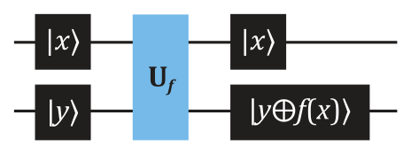
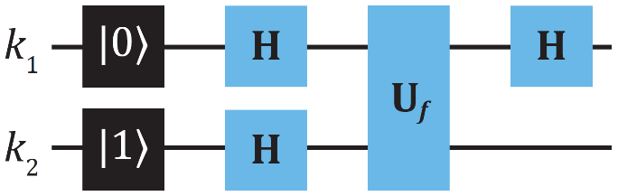
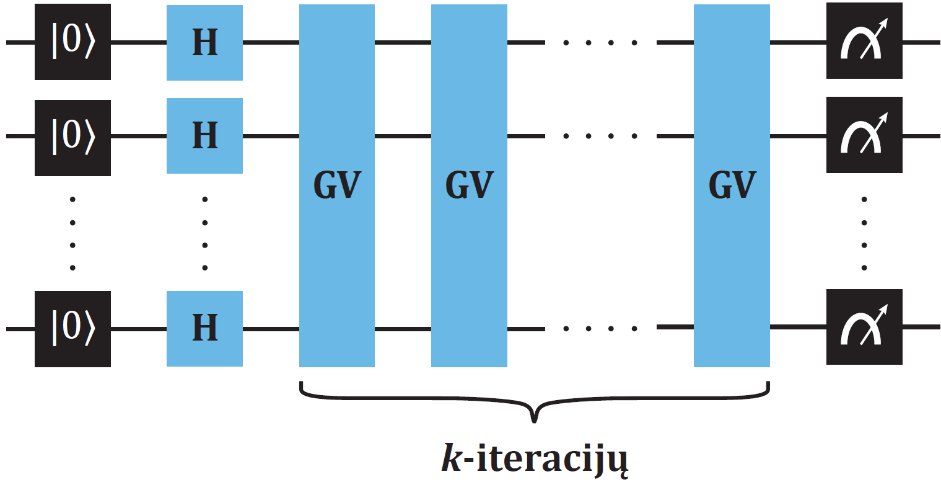
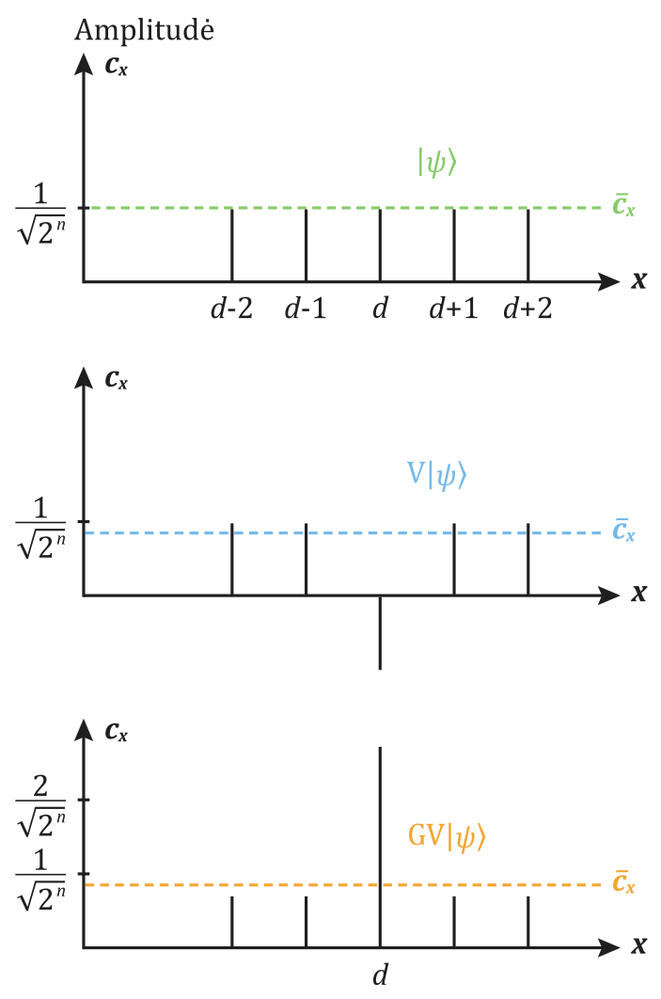
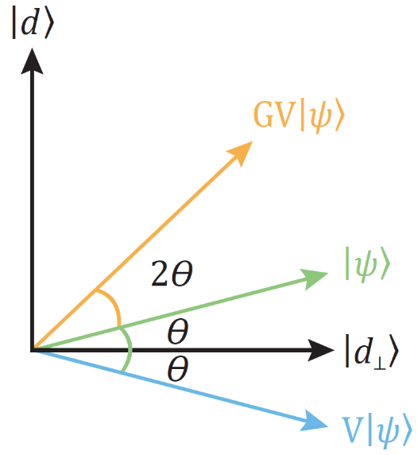
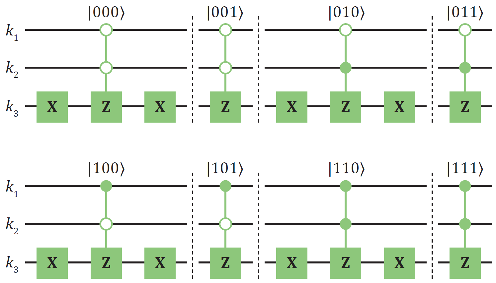
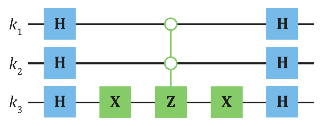
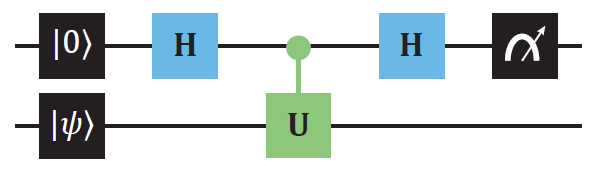
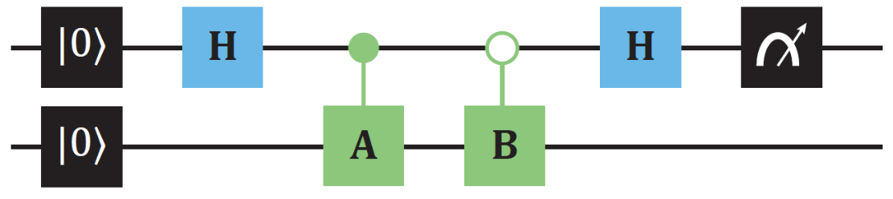
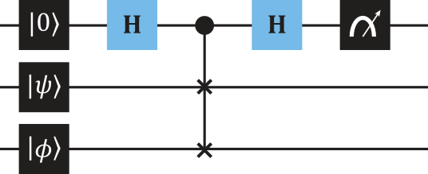

# Skaičiavimai kvantiniu kompiuteriu

Šiame skyriuje supažindiname su funkciniais skaičiavimais kvantiniu
kompiuteriu ir parodome keletą žymių kvantinių algoritmų. Šie algoritmai
leidžia geriau suprasti kvantinį skaičiavimo modelį ir naudojamus
triukus bei ugdyti „kvantinę intuiciją" sudėtingesnėms užduotims
spręsti. Pirmiausiai pristatysime nomenklatūras, naudojamas numeruoti
­*n-*kubitų registro baziniams vektoriams, ir jų konvertavimą tarp
dvejetainės ir dešimtainės skaičių sistemų.

## Bazinių vektorių numeracija 

Kvantinio registro, sudaryto iš $n$ kubitų, bendra būsena
$|\psi\rangle$ yra $2^n$ ortogonaliųjų bazinių vektorių
superpozicija. Praeitų skyrių pavyzdžiuose dažnai naudojome 2 kubitų
skaičiuojamąjį rinkinį {$|00\rangle$,
$|01\rangle$, $|10\rangle$,
$|11\rangle$}. Esant dideliam kubitų skaičiui taip
rašyti vektorius tampa nepraktiška, nes kiekvienas bazinis vektorius
$|\cdots\rangle$ bus sudarytas iš ilgos $n$ dvejetainių
skaičių sekos. Be to, neretai atsiranda poreikis perteikti ar atlikti
operacijas su dešimtainiais skaičiais.

Kvantinėje kompiuterijoje dažnai naudojami du skirtingi būdai
konvertuoti tarp šių skaičių sistemų. Kubitų numeracija juose skiriasi,
ir todėl loginių vartų išraiškos skirsis. Fizikoje yra įprasta atlikti
$n$ kubitų numeraciją taip:
$|k_1 k_2 \cdots k_{n - 1} k_n \rangle$; čia
$k_i \in \{0,1\}$. Pirmojo kubito, nusakyto pačios viršutinės
kvantinės grandinės, būsena $k_1$ yra rašoma *ket* kairėje ir paeiliui
užbaigiama paskutiniuoju kubitu $k_n$ dešinėje. Šį būdą mes naudojome
knygoje iki šiol. Norint perteikti tokią būseną dešimtaine forma
$|x\rangle$, $x \in \mathbb{N}$:
\begin{equation}
|x\rangle = |k_1 k_2 \cdots k_{n - 1}k_n \rangle
(\#eq:busena-desimtaine-forma)
\end{equation}
taikome formulę, konvertuojančią dešimtainį skaičių į dvejetainį:
\begin{equation}
x = k_1 2^{n - 1} + k_2 2^{n - 2} + \cdots + k_{n - 1}2^1 + k_n 2^0 = \sum_{i = 1}^n k_i 2^{n - i}
(\#eq:konversija-is-dvejetaines)
\end{equation}
Pavyzdžiui, dvejetainis skaičius 011 paverčiamas į dešimtainį
$x = 0\cdot 2^2 + 1\cdot 2^1 + 1\cdot 2^0 = 3$.
Standartiniai 2 kubitų baziniai vektoriai dešimtainėje sistemoje tampa
$\{|00\rangle , |01\rangle ,
|10\rangle , |11\rangle\} \rightarrow \{|0\rangle,
|1\rangle , |2\rangle, |3\rangle\}$.

Tačiau kompiuterių moksle ši nomenklatūra skiriasi dviem aspektais.
Kubitai yra numeruojami pradedant nuo 0, o ne nuo 1, ir rašomi
vektoriuose atvirkštine eiliškumo tvarka,
$|k_{n - 1}k_{n - 2}\cdots k_1 k_0 \rangle$. Tai yra,
pirmas kubitas žymimas $k_{0}$ ir rašomas dešinėje bei užbaigiama
paskutiniuoju $k_{n - 1}$ kairėje. Dešimtaine forma išreiškę vektorių
$|x\rangle$:
\begin{equation}
|x\rangle = |k_{n - 1} k_{n - 2}\cdots k_1 k_0 \rangle
(\#eq:desimtaine-busena-2)
\end{equation}
taikytume šią formulę:
\begin{equation}
x = k_0 2^0 + k_1 2^1 + \cdots + k_{n - 2}2^{n - 2} + k_{n - 1}2^{n - 1} = \sum_{i = 0}^{n - 1} k_i 2^i\,.
(\#eq:konversija-is-dvejetaines-2)
\end{equation}
Nepriklausomai nuo to, kuris būdas taikomas dvejetainę formą paverčiant
dešimtaine, rezultatas yra vienodas. Pavyzdžiui, skaičius 011
paverčiamas į dešimtainį
$x = 1\cdot 2^0 + 1\cdot 2^1 + 0\cdot 2^2 = 3$.
Tačiau, $n$-kubitų loginių vartų išraiška skiriasi, pavyzdžiui, *CNOT*
su pirmu kubitu, atliekančiu kontrolinio vaidmenį
$|k_1 k_2 \cdots k_{n - 1}k_n \rangle$ numeracijoje
yra
$cX = |0\rangle\langle 0|\otimes I + |1\rangle\langle 1|\otimes X$.
Antruoju būdu,
$|k_{n - 1}k_{n - 2}\cdots k_1 k_0 \rangle$, jie yra
$cX = I\otimes|0\rangle\langle 0| + X\otimes|1\rangle\langle 1|$.
Tai nusako skirtingas matricas. Šioje knygoje vartojame fizikoje įprastą
numeraciją $|k_1 k_2 \cdots k_{n - 1}k_n \rangle$,
nebent iš anksto įspėjama, kad naudojamas kompiuterių moksle įprastas
būdas.

Iš $n$ kubitų sudarytas $2^n$ skaičiuojamųjų bazinių vektorių rinkinys
dešimtaine forma yra $\{|0\rangle , |1\rangle , |2\rangle , \cdots ,|2^{n} - 1\rangle\}$. Bendra būsena
$|\psi \rangle$, normavimo sąlyga ir ortogonalumas yra
išreiškiami:
\begin{gather}
|\psi\rangle = c_0|0\rangle + c_1|1\rangle + c_2|2\rangle + \cdots + c_{2^{n} - 1}|2^n - 1\rangle
= \sum_{x = 0}^{2^{n} - 1} c_x|x\rangle\,;(\#eq:bendra-busena-n-kubitu)\\
\langle x'|x\rangle = \delta_{x',x}\,;(\#eq:ortogonalumas-desimtaine-busena)\\
|c_0|^2 + |c_1|^2 + |c_2|^2 + \cdots + |c_{2^{n} - 1}|^2
= \sum_{x = 0}^{2^{n} - 1} |c_x|^2 = 1\,.(\#eq:normavimas-desimtaine-busena)
\end{gather}

## Funkcinis skaičiavimas

Skaitmeniniuose skaičiavimuose kintamieji turi dvi reikšmes
$\{0, 1\}$. Tad galima traktuoti, kad visuose tokiuose skaičiavimuose
yra įvertinamos Būlio funkcijos (angl. *Boolean function*)
$f:\{0, 1\}^n \rightarrow \{0, 1\}^m$. Ši išraiška nusako,
kad Būlo funkcija $f$ transformuoja $n$ bitų ilgio seką į kitą $m$ bitų
ilgio seką, kurioje $m$ ir $n$ gali būti vienodi arba skirtis.
Kvantinėje kompiuterijoje norima funkcija $f$ turi būti perteikiama
unitariuoju operatoriumi $U_f$. Veikiantis $n$ kubitų registro būseną
$U_f$ transformuoja ją į kitą $n$ kubitų būseną. Tai yra fundamentaliai
invertuojamas procesas, atlikus šiam registrui atvirkštinį operatorių
$U_f^{\dagger}$ bus grąžinta pradinė registro būsena. Visgi didelė dalis
skaičiavimuose mus dominančių funkcijų nėra invertuojamos. Funkcija
$f(x)$ yra invertuojama, jeigu su kiekvienu jos argumentu $x$ galima
unikaliai susieti vieną reikšmę, tai yra 1:1 funkcijos. Pavyzdžiui,
funkcija $f:\{0, 1\}^n \rightarrow \{0, 1\}$ nėra invertuojama,
nes su $n$ skirtingų argumentų yra asocijuojamos tik dvi skirtingos
reikšmės. Taip pat egzistuoja ir
$f:\{0, 1\}^n \rightarrow \{0, 1\}^n$ neinvertuojamų
funkcijų. Pavyzdžiui, parabolė $f(x) = x^2$, apibrėžta visiems
argumentams $x$, nėra invertuojama, nes $(+x)^2 = (-x)^2$ ir
todėl kiekvienai $f$ reikšmei yra du skirtingi argumentai ($+x$ ir
$-x$). Dėl šių priežasčių kvantinėje kompiuterijoje funkciniams
skaičiavimams atlikti yra dažnai pasitelkiami du kubitų registrai,
vadinami **įvesties** (angl. *input register*) ir **išvesties**
(angl. *output register*) registrais. Kvantinis skaičiavimas, naudojant
du registrus, dažnai turi tokią formą:
\begin{equation}
U_f|x\rangle\otimes|0\rangle = |x\rangle\otimes|f(x)\rangle\,.
(\#eq:skaiciavimas-du-registrai)
\end{equation}
Unitarinė transformacija $U_f$ čia veikia abu registrus. Kiekvienas
bazinis vektorius $|x\rangle$ įvesties registre atlieka
funkcijos argumento rolę $x$, o funkcijos reikšmė $f(x)$ yra užrašoma
išvesties registro būsenoje $|f(x)\rangle$. Jeigu
išvesties registras yra ne $|0\rangle$, o kitoje
pradinėje būsenoje $|y\rangle$, tada:
\begin{equation}
U_f|x\rangle\otimes|y\rangle = |x\rangle\otimes|y\oplus f(x)\rangle\,.
(\#eq:skaiciavimas-du-registrai-y)
\end{equation}

```{r kvantine-grandine-u-f, echo=FALSE, fig.cap="Kvantinė grandinė, realizuojanti funkcinį skaičiavimą $U_f|x\\rangle\\otimes|y\\rangle = |x\\rangle\\otimes|y\\oplus f(x)\\rangle$.", out.width='80%', fig.align='center'}

```

Šiuo atveju naudojame dvejetainę formą, tad išvesties
registre yra atliekama $y$ ir $f(x)$ mod(2) bitų sudėtis, žymima ženklu
$\oplus$. Paprasčiausią funkcinio skaičiavimo pavyzdį matėme
IV skyriuje naudojant $U_f = cX$, kuris atlieka mod(2) bitų sudėtį.
\@ref(fig:kvantine-grandine-u-f) pav. iliustruojame šį bendrą skaičiavimo principą kvantine grandine.


## Kvantinis paralelizmas

Norint klasikiniu kompiuteriu apskaičiuoti funkcijos $f(x)$ reikšmes
$n$ skirtingų argumentų $x_1 , x_2 , \ldots , x_n$, reikia šią
funkciją pateikti ir įvertinti $n$ kartų. Kvantinis kompiuteris leidžia
$f(x)$ įvertinti lygiagrečiai visuose $n$-argumentuose vienu funkcijos
iškvietimu. Norėdami tai pamatyti, pradėkime vėl nuo 2 kubitų sistemos,
turinčios po vieną kubitą įvesties ir išvesties registre siekiant
apskaičiuoti funkciją argumentuose $f(0)$ ir $f(1)$. Unitarusis
operatorius $U_f$ atlieka funkcijos $f$ įvertinimą, randame:
\begin{equation}
U_f\frac{1}{\sqrt{2}}\big(|0\rangle + |1\rangle\big)\otimes|0\rangle
= \frac{1}{\sqrt{2}}\big(|0\rangle\otimes|f(0)\rangle + |1\rangle\otimes|f(1)\rangle\big)\,
(\#eq:u-f-superpozicija)
\end{equation}
Matome, kad jeigu įvesties registras yra paruoštas į
$|0\rangle$ ir $|1\rangle$
superpoziciją, tada dėl operatorių tiesiškumo yra lygiagrečiai
įvertinamos $f(0)$ ir $f(1)$ vertės vienu funkcijos $f$ pritaikymu. Šį
principą galima praplėsti ir atlikti funkcijos įvertinimą $2^n$
argumentų paruošiant pradinę įvesties registro būseną į lygią visų
$n$-kubitų $2^n$ skaičiuojamųjų bazinių vektorių superpoziciją. Tai
atliekama kiekvienam kubitui registre pritaikius Hadamardo loginius
vartus. Pavyzdžiui, registre sudarytame iš 2-kubitų
$H\otimes H|00\rangle$:
\begin{equation}
\begin{aligned}
\frac{1}{\sqrt{2}}\big(|0\rangle + |1\rangle\big)\otimes\frac{1}{\sqrt{2}}\big(|0\rangle + |1\rangle\big)
= & \frac{|00\rangle + |01\rangle + |10\rangle + |11\rangle}{2} \\
= & \frac{|0\rangle + |1\rangle + |2\rangle + |3\rangle}{2}\,.
\end{aligned}
(\#eq:2-kubitu-superpozicija)
\end{equation}
Lokaliomis $H$ transformacijomis paruoštos būsenos superpozicijoje yra
faktorizuojamos, tad galime išmatuoti kiekvieną kubitą nepaveikdami kitų
būsenos. Jeigu rašysime
$H^{\otimes n} = H\otimes H\otimes\cdots\otimes H$
nusakyti Hadamardo transformaciją kiekvienam iš $n$-kubitų, kurių bendra
pradinė būsena dešimtainėje sistemoje yra $|0\rangle$,
tada gausime lygią visų $2^n$ būsenų superpoziciją:
\begin{equation}
H^{\otimes n}|0\rangle = \frac{1}{\sqrt{2^{n}}}\sum_{x = 0}^{2^{n} - 1}|x\rangle\,.
(\#eq:n-kubitu-superpozicija)
\end{equation}
Atkreipiame dėmesį, kad eksponentiškai didelės $2^{n}$ bazinių vektorių
superpozicijos sukūrimas reikalauja tik tiesinio *n *skaičiaus Hadamardo
transformacijų. Skaičiavimo išteklių atžvilgiu tai yra itin efektyvus
metodas.

Norint įvertinti $f(x)$ funkciją jos $2^n$ skirtingų argumentų $x$,
superpozicijai pritaikome $U_f$:
\begin{equation}
U_{f}\frac{1}{\sqrt{2^{n}}}\sum_{x = 0}^{2^{n} - 1}|x\rangle\otimes|0\rangle
= \frac{1}{\sqrt{2^{n}}}\sum_{x = 0}^{2^{n} - 1}|x\rangle\otimes|f(x)\rangle\,.
(\#eq:u-f-n-kubitu)
\end{equation}
Šis įspūdingas rezultatas yra vadinamasis kvantinis paralelizmas.
Pavyzdžiui, jeigu turime 100 kubitų kiekviename registre, sukūrus jų
lygią superpoziciją ir atlikus $U_f$ transformaciją paraleliai yra
įvertinamas astronominis skaičius $\sim 10^{30}$ funkcijos $f$ verčių.

Tačiau šioje stadijoje dar nėra užtikrinta, kad kvantiniu kompiuteriu
bus paspartintas skaičiavimas. Norėdami sužinoti skaičiavimo rezultatą
bendrai turime išmatuoti visus kubitus įvesties ir išvesties
registruose. Sakykime, kad $f(x)$ yra invertuojama funkcija.
Kadangi $|x\rangle$ būsena yra supinta su
$|f(x)\rangle$, nesvarbu, kurį registrą pasirinksime
matuoti pirmą, tad pradėkime nuo įvesties. Įvesties registras yra
lygioje visų $2^n$ skirtingų $|x\rangle$ būsenų
superpozicijoje, todėl yra lygi $\frac{1}{2^n}$ tikimybė rasti bet
kurią vieną iš šių būsenų. Atlikus įvesties registro kubitų matavimą ir
radus $|x_0 \rangle$, bendra įvesties ir išvesties
registrų būsena tampa
$|x_0 \rangle\otimes|f(x_0)\rangle$.
Kitame žingsnyje išmatuojame išvesties registrą, taip sužinodami
$f(x_0)$ reikšmę. Jeigu $f(x)$ yra neinvertuojamoji funkcija, tada
keletas skirtingų $|x\rangle$ būsenų gali būti supintos
su ta pačia $|f(x_0)\rangle$. Šiuo atveju taip pat
nėra svarbu, kurį registrą pasirinksime matuoti pirmą. Pavyzdžiui,
pirmiausia išmatavus išvesties registro kubitus ir radus
$|f(x_0)\rangle$, bendra būsena tampa
$\big(|x_m\rangle + \cdots + |x_l\rangle\big)\otimes|f(x_0)\rangle$.
Matome įvesties registrą, esantį būsenų superpozicijoje, kurios nusako
argumentus su vienodomis funkcijos reikšmėmis $f(x_0)$. Tikimybė rasti
bet kurią vieną būseną yra lygi kitoms. Tad šiame procese atsitiktiniu
būdu randame vieną iš $f(x)$ reikšmių, negalėdami pasirinkti, kuriame
argumente $x$ norime įvertinti $f$.

Pirmiausiai atkreipiame dėmesį, kad atliekant funkcinius skaičiavimus
retai yra būtinybė nuskaityti visas funkcijos reikšmes. Praktiškai
įrašyti minėtų $\sim 10^{30}$ bitų informacijos, kurias saugo superpozicijoje
100 kubitų, nepakaktų visos pasiekiamos klasikinės kompiuterių
atminties. Dažnai yra svarbiau nustatyti tam tikras funkcijos savybes --
jos globalius parametrus, minimalias ar maksimalias vertes, periodiškumą
ir panašiai. Kvantinių skaičiavimų užduotis yra išnaudoti jų
fundamentalų masišką paralelizmą bei papildomais algoritminiais triukais
padidinti tikimybę rasti būsenas, koduojančias ieškomus atsakymus. Viena
tokia algoritminė strategija yra vadinama **amplitudės amplifikacija**
(angl. *amplitude amplification*), kuri leidžia padidinti dominančių
registro būsenų amplitudes. To pavyzdį matysime Groverio paieškos
algoritme. Kitas būdas yra tiesiogiai įvertinti globalius funkcijos
parametrus taikant interferenciją ar koreliacijas tarp kvantinių būsenų.
Šią strategiją taiko nemaža dalis algoritmų, įskaitant Doičo bei Šoro
algoritmus, Hadamardo ir SWAP testus, fazės nustatymo algoritmą, kai
kuriuos mašininio mokymosi metodus, kvantinių klaidų taisymo kodus.

## Duomenų kodavimo būdai

Skaičiavimo procesą kvantiniame kompiuteryje galima apibūdinti trimis
žingsniais:

Duomenų kodavimas $\rightarrow$ Duomenų apdorojimas $\rightarrow$ Būsenų matavimas

Norint pateikti duomenis pirmiausia reikia juos koduoti kubitais. Tai
nusako specifinį kubitų registro **būsenos paruošimo procesą**
(angl. *state preparation*). Analizuojant kvantinių algoritmų
sudėtingumą tenka atsižvelgti į tai, kad būsenos paruošimo žingsniai
gali savaime pareikalauti daug resursų. Blogiausiu atveju, perteikti
bendrai $n$ kubitų būsenai gali prireikti eksponentiškai didelio
$O(2^n)$ loginių operacijų skaičiaus nustatant visiems $2^n$
skaičiuojamiesiems baziniams vektoriams skirtingas amplitudes. Koduojant
yra pageidautinas tiesiškai arba logaritmiškai su kubitų skaičiumi
augantis operacijų skaičius.

Duomenų tipas bei kodavimo metodas nulemia kodavimo žingsnio
sudėtingumą. Egzistuoja ne vienas kodavimo metodas -- plačiausiai
taikomi yra **bazinių vektorių kodavimas** (angl. *basis encoding*) ir
**amplitudžių kodavimas** (angl. *amplitude encoding*). Bazinių vektorių
metodas tinka koduoti informaciją dvejetainėje formoje. Visa klasikinė
duomenų bazė $D$, kurioje kiekvienas atskiras įrašas $l$ yra $N$-bitų
seka
$b^{(l)} = (b_1 ,b_2 , \ldots , b_N )$, $b_i \in \{0, 1\}$,
tiesiogiai perteikiama normuota skaičiuojamųjų bazinių vektorių
$b^{(l)} \rightarrow |b^{(l)}\rangle$ lygia
superpozicija:
\begin{equation}
|D\rangle = \frac{1}{\sqrt{L}} \sum_{l = 1}^L |b^{(l)}\rangle\,.
(\#eq:amplitudziu-kodavimas)
\end{equation}
Čia $L$ nusako įrašų skaičių ir todėl naudojamų bazinių vektorių skaičių duomenų
bazėje $|D\rangle$. Kubitų skaičius $n$ turi būti ne
mažesnis nei ilgiausios duomenų bazės įrašo $b^{(l)}$ bitų skaičius $N$,
tad $L \leq 2^N$. Visų kitų galimai nekoduojančių $2^N - L$ bazinių
vektorių amplitudės lygios nuliui. Pavyzdžiui, duomenų bazę, turinčią du
įrašus {00110, 10100}, perteiktume 5 kubitų būsena
$|D \rangle$:
\begin{equation}
|D\rangle = \frac{|00110\rangle + |10100\rangle}{\sqrt{2}}\,.
(\#eq:baziniu-vektoriu-kodavimas)
\end{equation}
Čia vėl naudojame įprastą fizikoje kubitų numeraciją perteikti
dvejetainiams skaičiams. Šis kodavimo būdas nėra itin efektyvus kubitų
skaičiaus atžvilgiu, tačiau natūraliai tinka atlikti skaitmenines
aritmetines operacijas ir funkcinius skaičiavimus. Nemažai algoritmų
naudoja bazinių vektorių kodavimo būdą: Groverio, kvantinė Furjė
transformacija, Šoro pirminių skaičių faktorizavimas.

Kaip pavadinimas indikuoja, amplitudžių kodavimo metode duomenys yra
koduojami bazinių vektorių amplitudėse. Imkime vieną klasikinį duomenų
bazės įrašą $x^{(l)} = (x_1 , x_2 , \ldots , x_N )$
turintį $N$ elementų. Bendrai toks įrašas nusako $N$ dimensijų vektorių
ar duomenis su $N$ skaičiumi savybių. Kiekvienas elementas $x_i$ gali
būti bet kokios formos skaičiai -- dešimtainėje formoje realieji ar
kompleksiniai. Reikalaujama, kad visi elementai $x_i$ būtų
normalizuojami: $x_i \rightarrow x_i/\sqrt{N}$. Kiekvienas įrašas
$x^{(l)}$ yra perteikiamas skaičiuojamųjų bazinių vektorių
$|i\rangle$ superpozicijos amplitudėse $x_i$:
\begin{equation}
|x^{(l)}\rangle = \sum_{i = 1}^N x_i |i\rangle\,.
(\#eq:amplitudziu-kodavimas-2)
\end{equation}
Šis kodavimo būdas yra kubitų skaičiaus atžvilgiu efektyvus, nes
$N$ elementų įrašas reikalauja tik $\log_2 (N)$ kubitų. Duomenų bazę
$D$, turinčią $M$ skaičių su $N$ elementų ilgio įrašais $x^{(l)}$,
$D = (x^{(1)} , x^{(2)} , \ldots , x^{(M)})$, galima
perteikti $(M\times N)$ dimensijų vektoriumi kubitų registre:
\begin{equation}
|D\rangle = \sum_{i = 1}^{MN} x_i |i\rangle\,.
(\#eq:m-n-dydzio-registras)
\end{equation}
Tai reikalauja $n \geq \log_2 (MN)$ kubitų skaičiaus. Kitaip tariant,
norint koduoti visus $MN$ įrašus bazinių vektorių skaičius $2^n$ turi
būti $2^n \geq MN$. Potencialų nekoduojančių elementų perteklių
būsenose irgi galima užpildyti nuliais. Amplitudžių kodavimas taikomas
daugelyje kvantinio mašininio mokymosi algoritmų ir kvantinių sistemų
modeliavime. Šio metodo trūkumas tas, kad skaičiavimo pabaigoje
amplitudžių $x_i$ tiesiogiai negalima nuskaityti. Reikalingas kitas
būdas panaudoti juose koduojamą informaciją, pavyzdžiui, apskaičiuojant
tam tikrą amplitudžių funkciją $f(x_i)$, išreikštą kvantiniu
operatoriumi $U$ taip realizuojant
$f(x_i ) = \langle x_i |U| x_i \rangle$.
Hadamardo testas (žr. \@ref(hadamardo-swap-testai) poskyrį) leidžia efektyviai apskaičiuoti šiuos
narius.

## Doičo algoritmas

Doičo algoritmas (angl. *Deutsch algorithm*) yra vienas iš pirmųjų ir
paprasčiausių pavyzdžių, iliustruojantis kvantinio algoritmo pranašumą
prieš klasikinį. Doičo algoritmas nėra savaime ypač naudingas, tačiau
parodo esminį būsenų superpozicijos ir interferencijos panaudojimą
kvantiniuose skaičiavimuose. Įsivaizduokime scenarijų, kuriame Agnė turi
juodąją dėžę, atliekančią vieno bito manipuliacijas. Ši dėžė
apskaičiuoja funkciją $f$, kuriai pateikus bitą su verte 0 arba 1, ji
išveda kitą bitą, taip pat 0 arba 1. Egzistuoja iš viso keturios
skirtingos 1 bito funkcijos $f:\{0, 1\}\rightarrow\{0, 1\}$:
\begin{align}
f_1(0) = & f_1(1) = 0\,,\quad f_2(0) = f_2(1) = 1\,;(\#eq:vieno-bito-func-1) \\
f_3(0) = & 0\,,\quad f_3(1) = 1\,,\quad f_4(0) = 1\,,\quad f_4(1) = 0\,.(\#eq:vieno-bito-func-2)
\end{align}
Matome, kad pirmose dviejose funkcijose $f_1$ ir $f_2$ reikšmės
nepriklauso nuo pateiktų argumentų, $f(0) = f(1)$. Šias dvi funkcijos
vadiname pastoviosiomis. Funkcijose $f_3$ ir $f_4$ reikšmės
priklauso nuo argumentų, $f(0) \neq f(1)$. Jas vadiname
subalansuotosiomis.

Agnė turi tik vieną bandymą, skirtą sužinoti, ar juodojoje dėžėje
slepiasi pastovioji, ar subalansuotoji funkcija. Akivaizdu, kad dviem
bandymais ji galėtų tai lengvai padaryti. Turint tik klasikinius
išteklius neįmanoma vienu juodosios dėžės panaudojimu atlikti norimą
funkcijos klasifikaciją, tačiau kvantiniu kompiuteriu pakanka vieno.

Kvantiniame kompiuteryje juodosios dėžės funkciją
$f:\{0, 1\} \rightarrow \{0, 1\}$ atlieka unitarioji transformacija
minėtu principu:
$U_f|x\rangle\otimes |y\rangle = |x\rangle\otimes |y\oplus f(x)\rangle$.
Naudojama po 1-kubitą įvesties ($k_1$) ir išvesties ($k_2$)
registruose. Doičo algoritmas pasitelkia vadinamąjį **fazės atatrankos**
(angl. *phase kickback*) metodą. Prieš panaudojant juodosios dėžės
funkciją, šiame metode išvesties registro būsena yra paruošiama į
superpoziciją $H|1\rangle$. Tada abiem registrams
pritaikius $U_f$ gaunama:
\begin{equation}
U_f|x\rangle\otimes\left(\frac{|0\rangle - |1\rangle}{\sqrt{2}}\right)
= (-1)^{f(x)}|x\rangle\otimes\left(\frac{|0\rangle - |1\rangle}{\sqrt{2}}\right)\,.
(\#eq:u-f-abiem-registram)
\end{equation}
Matome, kad fazės atatrankoje išvesties registro būsena nepakinta,
tačiau bendrai būsenai
$|x\rangle\otimes H|1\rangle$ yra
perteikiama santykinė fazė $(-1)^{f(x)}$ priklausomai nuo įvesties
būsenos $|x\rangle$, $x\in\{0, 1\}$. Tad
$(-1)^{f(x) = 0} = 1$ ir $(-1)^{f(x) = 1} = -1$. Kitaip nei
įprastiniame funkciniame skaičiavime, galime traktuoti, kad $U$
transformacija efektyviai perkelia būsenos pokytį, šiuo atveju fazę, į
įvesties registrą. Tai yra vadinama **fazės atatranka** (angl. *phase
kickback*), ji aptinkama ne viename algoritme.

Pradedant Doičo algoritmą, įvesties ir išvesties registro kubitams,
esantiems atitinkamai $|0\rangle$ ir
$|1\rangle$ būsenose, pirmiausiai pritaikome Hadamardo
transformacijas:
\begin{equation}
|\psi\rangle = (H\otimes H)|0\rangle\otimes|1\rangle
= \frac{1}{2}\big(|0\rangle + |1\rangle\big)\otimes\big(|0\rangle - |1\rangle\big)\,.
(\#eq:h-ivesties-isvesties-deutsch)
\end{equation}
Toliau panaudojame juodosios dėžės funkciją $f$, nusakančią unitariąją
transformaciją $U_f$:
\begin{equation}
U_f|\psi\rangle = \frac{1}{2}\big\lbrack (-1)^{f(0)}|0\rangle + (-1)^{f(1)}|1\rangle\big\rbrack\otimes
\big(|0\rangle - |1\rangle\big)\,.
(\#eq:u-f-deutsch)
\end{equation}
Skliausteliuose matome fazės atatrankos efektą įvesties registro
kubitams, esantiems superpozicijoje. Kadangi išvesties registro būsena
nebeturi įtakos likusio algoritmo žingsniams, ją pašaliname iš
tolimesnės analizės. Įvesties registro kubitui pritaikome dar vieną
Hadamardo transformaciją $H\otimes I$:
\begin{equation}
(H\otimes I)U_f|\psi\rangle
= \frac{1}{2}\big\{ \lbrack (-1)^{f(0)} + (-1)^{f(1)}\rbrack|0\rangle
+ \lbrack (-1)^{f(0)} - (-1)^{f(1)}\rbrack|1\rangle\big\}\,.
(\#eq:h-gale-deutsch)
\end{equation}

```{r deutsch-logine-grandine, echo=FALSE, fig.cap="Doičo algoritmo loginė grandinė.", out.width='80%', fig.align='center'}

```

Jeigu juodosios dėžės funkcija yra
pastovioji $f(0) = f(1)$, tada $(-1)^{f(0)} - (-1)^{f(1)} = 0$, ir
viršuje išlieka tik $|0\rangle$ būsena. Jeigu funkcija
subalansuota, $f(0) \neq f(1)$, tada išlieka tik
$|1\rangle$ būsena (iki nesvarbios globalios fazės).
Įvesties registro būseną, prieš atliekant matavimą, galima glaustai
užrašyti $|f(0)\oplus f(1)\rangle$. Matavimo
rezultatas užtikrintai klasifikuoja šią funkciją, o procese juodoji dėžė
panaudojama tik vieną kartą. Doičo algoritmą nusakanti kvantinė grandinė
yra pateikta \@ref(fig:deutsch-logine-grandine) pav.

Doičo algoritmas leidžia palyginti, ar funkcijos vertė skirtinguose
argumentuose yra vienoda, ar skirtinga, neatskleidžiant, kokios yra tos
vertės. Tai skaičiavimo pavyzdys, panaudojantis paralelumą bei būsenų
interferenciją, siekiant nusakyti globalią funkcijos savybę. Paralelumas
matomas $f(0)$ ir $f(1)$ funkcijos įvertinime vienu metu. O štai
konstruktyvios ir destruktyvios būsenų interferencijos efektai matomi,
kai pasitelkus Hadamardo transformaciją atliekama narių sudėtis su
$(-1)^{f(x)}$ amplitudėse, dėl kurios panaikinama
$|0\rangle$ arba $|1\rangle$ būsena.

**Doičo-Jodžos** **algoritmas** (angl. *Deutsch-Josza algorithm*), kurio
čia plačiau neanalizuosime, paprastai praplečia Doičo algoritme
naudojamos funkcijos $f$ dydį nuo 2 iki $2^n$ argumentų ir leidžia
vienu juodosios dėžės panaudojimu klasifikuoti ją kaip esančią
pastoviąją arba subalansuotąją. Pastovioji $f$ funkcija $2^n$ argumentų
yra tokia, kurios vertės skirtinguose argumentuose yra vienodos.
Subalansuotojoje funkcijoje pusė jos visų verčių ($2^n/2$) yra 0 ir
pusė 1. Tad klasikiniame kompiuteryje gali reikėti iki $2^{n-1}+1$
funkcijos $f$ įvertinimų norint atlikti šią klasifikaciją.

## Kvantinė paieška ir Groverio algoritmas

Kvantinis kompiuteris gali reikšmingai paspartinti įrašų paieškos
procesą nestruktūrizuotose duomenų bazėse. Vienas tokios paieškos
pavyzdys būtų „vardenio-pavardenio" paieška telefonų knygoje žinant
telefono numerį, nes telefonų knyga yra struktūrizuota pagal vardus.
Jeigu imsime, kad duomenų bazė turi $N$ įrašų, klasikiniu algoritmu nėra
kito būdo, kaip tik tikrinti visus įrašus, tad blogiausiu atveju gali
prireikti $N - 1$ patikrų, o tikimybė rasti įrašą po $k$-skaičiaus
bandymų yra $k/N$. Bet štai kvantiniu kompiuteriu pakanka $\sqrt{N}$
įrašų patikrinimų norint rasti norimą su praktiškai 100 % tikimybe. Šis
kvadratinis paspartinimas gali suteikti esminį pranašumą didėjant įrašų
skaičiui duomenų bazėje.

Įrodyta, kad Groverio algoritmas yra optimaliausias kvantinės paieškos
nestruktūrizuotoje duomenų bazėje algoritmas. Bet koks kitas gali nebent
pakeisti $O(\sqrt{N})$ algoritmo laiko sudėtingumą bendrąja
konstanta. Groverio paieškoje naudojamas amplitudžių amplifikacijos
metodas yra taikomas kaip modulis įvarios paskirties kvantiniuose
algoritmuose, įskaitant mašininio mokymosi, ir kvantinėje
kriptografijoje.

Paieškos problemą galima formaliai apibūdinti Būlio funkcija
$f:\{0, 1\}^n \rightarrow\{0, 1\}$, kuriai pateikus $n$-bitų
seką (funkcijos argumentą) funkcijos reikšmė yra 1, jeigu $x$ argumentas
atitinka paieškomą, vadinsime jį $d$. Visais kitais atvejais, kai
$x \neq d$, funkcijos reikšmė yra 0:
\begin{equation}
f(x)=\begin{cases}
1\,, & x=d\,,\\
0\,, & x\neq d\,.
\end{cases}
(\#eq:paieskos-orakulas)
\end{equation}
Tokio tipo funkcijos yra vadinamos **orakulu** (angl. *oracle*).
Orakulas savaime negali pasakyti ieškomo įrašo, tačiau atpažįsta, kai
šis yra jam pateiktas. Paieškos algoritmo užduotis -- rasti norimą įrašą
$d$ su kuo mažiau kreipimųsi į orakulą (funkcijos $f$ panaudojimų).

Groverio algoritme orakulas yra visa duomenų bazė su $N = 2^n$ įrašų.
Tarp jų yra vienas elementas $d$, kurį norima rasti. Ieškomų įrašų
Groverio algoritmo taikymuose gali būti ir daugiau negu vienas, tačiau
čia iliustruojame pavyzdį, kai yra tik vienas. Pirmame šio algoritmo
žingsnyje visi $2^n$ įrašai yra perteikiami įvesties registro
būsenomis $|x\rangle$ dešimtainėje sistemoje sukuriant
lygią superpoziciją:
\begin{equation}
|\psi\rangle = H^{\otimes n}|0\rangle = \frac{1}{\sqrt{2^{n}}}\sum_{x = 0}^{2^n - 1}|x\rangle\,.
(\#eq:lygi-superpozicija-grover)
\end{equation}
Išvesties registras yra sudarytas iš vieno kubito ir inicijuojamas į
$H|1\rangle$ būseną siekiant panaudoti fazės atatrankos
metodą. Orakulo funkcijos, vadinsime ją $U_f$, efektas vienai tokiai
būsenai yra:
\begin{equation}
U_f|x\rangle\otimes H|1\rangle = (-1)^{f(x)}|x\rangle\otimes H|1\rangle\,.
(\#eq:orakulo-efektas-grover)
\end{equation}
Tad jeigu orakului pateikiama neteisinga būsena
$|x\rangle \neq |d\rangle$, tada
$f(x) = 0$ ir abiejų registrų būsena nepakinta. Pateikus ieškomą būseną
$|x\rangle = |d\rangle$, bendra būsena
tampa
$-|d\rangle\otimes H|1\rangle$.
Kitaip tariant, orakulas paženklina teisingą būseną įvesdamas jai fazę
$|d\rangle\rightarrow -|d\rangle$.

Matome, kad išvesties ir įvesties registrai nėra supinti nei prieš, nei
po $U_f$ panaudojimo. Kadangi Groverio paieškos algoritme $U_f$ yra
vienintelė transformacija, veikianti abu registrus, tačiau ji nekeičia
išvesties registro būsenos, toliau analizuojant šį algoritmą galima
koncentruotis vien į įvesties registrą. Orakulo transformaciją $U_f$
pakeisime kita efektyvia transformacija, vadinkime ją $V$, kuri veikia
vien tik įvesties registrą (vienetinis operatorius $\otimes I$
išvesties registrui), ir atlieka jam tokią pačią funkciją kaip ir
$U_f$. Tai užrašome:
\begin{equation}
V|x\rangle = (-1)^{f(x)}|x\rangle =
\begin{cases}
-|x\rangle\,, & x=d\,,\\
|x\rangle\,, & x\neq d\,.
\end{cases}
(\#eq:V-transformacija-grover)
\end{equation}
Nors matricos forma $V$ operatoriaus čia tiesiogiai nenaudosime, tačiau
verta atkreipti dėmesį, kad tai yra diagonalioji transformacija:
\begin{equation}
V = \begin{bmatrix}
(-1)^{f(0)} & \cdots & 0 \\
 \vdots & \ddots & \vdots \\
0 & \cdots & (-1)^{f(2^n - 1)}
\end{bmatrix}\,.
(\#eq:V-matrica-grover)
\end{equation}
Nenuliniai skaičiai yra tik išilgai pagrindinės įstrižainės. Jeigu
ieškoma tik viena būsena, tada vienas atitinkamas skaičius įstrižainėje
yra -1, o visi kiti 1. Pritaikę operatorių $V$ visam įvesties registrui
pradinėje būsenoje randame:
\begin{equation}
V|\psi\rangle = -\frac{1}{\sqrt{2^n}}|d\rangle + \frac{1}{\sqrt{2^n}}\sum_{x \neq d}^{2^{n - 1} - 1}|x\rangle\,.
(\#eq:V-ivesties-registrui)
\end{equation}
Antrame naryje matome visų būsenų išskyrus $|d\rangle$
sumą, tad sumuojama $2^{n - 1} - 1$ narių. Šiek tiek ilgėliau pažiūrėjus
į išraišką \@ref(eq:V-ivesties-registrui) tampa aišku, kad $V$ transformacija turi šią formą:
\begin{equation}
V = - 2|d\rangle\langle d| + I\,.
(\#eq:V-diadom)
\end{equation}
Čia $I$ -- vienetinis operatorius, o
$|d\rangle\langle d|$ yra projekcinis
operatorius į $|d\rangle$ vektoriaus poerdvį. Skaičius
-2 atspindį tai, kad viršuje vektorius $|d\rangle$ yra
atimamas du kartus -- iš būsenų sumos nario, o pavienis
$|d \rangle$ narys yra su minuso ženklu.

Siekiant atlikti paiešką, Groverio algoritmas naudoja unitariąją
transformaciją, vadinkime ją $G$, kuri nereikalauja orakulo panaudojimo.
Jos išraiška nepriklauso ir nuo paieškomo $|d\rangle$
vektoriaus bei turi šią formą:
\begin{equation}
G = 2|\psi\rangle\langle\psi| - I\,.
(\#eq:g-grover)
\end{equation}

```{r grover-grandine, echo=FALSE, fig.cap="Groverio algoritmo bendrą principą nusakanti loginė grandinė.", out.width='80%', fig.align='center'}

```

Čia $|\psi\rangle\langle\psi |$ yra
projekcinis operatorius į pradinės būsenos
$|\psi\rangle$ poerdvį. Groverio algoritmas
(žr. \@ref(fig:grover-grandine) pav.) pakartotinai pritaiko, arba iteruoja, $GV$ operatorius, o
tai lemia $|d \rangle$ būsenos amplitudės amplifikaciją
likusių būsenų sąskaita:
\begin{equation}
|d\rangle\approx GVGV\cdots GV|\psi\rangle\,.
(\#eq:amplitudes-stiprinimas-grover)
\end{equation}
Toliau parodysime, kaip ši iteracija atlieka paieškos užduotį
amplifikuojant ieškomosios būsenos amplitudę ir kiek kartų reikia
iteruoti norint užtikrinti, kad $|d \rangle$ bus rasta su
didele tikimybe. Galima pažvelgti į Groverio algoritmą dviem būdais:
algebriškai analizuojant amplitudžių pokyčius kiekviename iteracijos
žingsnyje, arba geometriškai atsižvelgiant į būsenos vektoriaus posūkį
2 dimensijų erdvėje. Šie būdai savaip apšviečia algoritmo esmę, tad
panagrinėkime juos abu.

### Algebrinė interpretacija

Viršuje pateikėme transformacijos $V$ efektą įvertindami
$V|\psi\rangle$. Norėdami pamatyti vienos $GV$
iteracijos efektą bendrai būsenai $|\phi\rangle$, toliau
įvertinsime $G|\phi\rangle$. Būseną
$|\phi\rangle$ galima traktuoti esant tarpinę tarp
pradinės $|\psi\rangle$ ir visų kitų galimų registro
būsenų algoritmo metu. Ji išreiškiama tais pačiais $2^n$
skaičiuojamaisias baziniais vektoriais, bet kitomis amplitudėmis
$c_x$:
\begin{equation}
|\phi\rangle = \sum_{x = 0}^{2^{n - 1}} c_x|x\rangle\,.
\end{equation}
Kadangi pradinėje $|\psi\rangle$ būsenoje visos
amplitudės yra realieji skaičiai, o $V$ ir $G$ operacijos jas tokias
išlaiko, viso algoritmo metu amplitudės $c_x$ išlieka realiaisiais
skaičiais. Apskaičiuodami
$G|\phi\rangle = 2|\psi\rangle\langle\psi |\phi\rangle - |\phi\rangle$,
pirmiausiai įvertinsime vidinę sandaugą
$\langle\psi |\phi\rangle$:
\begin{equation}
\langle\psi |\phi\rangle = \frac{1}{\sqrt{2^n}}\sum_{x',x = 0}^{2^{n - 1}} c_x\langle x'|x\rangle
= \frac{\sqrt{2^n}}{2^n}\sum_{x = 0}^{2^{n - 1}} c_x = \sqrt{2^n} \bar{c}_x\,.
\end{equation}
Pirmoje eilutėje vidinių sandaugų suma yra atliekama su
$|\psi\rangle$ ir $|\phi\rangle$
baziniais vektoriais $\{|x\rangle\}$,
indeksuotais $x'$ ir $x$, atitinkamai. Kadangi
$\{|x\rangle\}$ yra ortogonaliųjų normuotųjų vektorių
rinkinys,
$\langle x'|x\rangle = \delta_{x,x'}$,
panaikinamas vienas suminis indeksas. Antroje dalyje identifikavome
$\bar{c}_x$, nusakantį visų $2^n$ amplitudžių $c_x$ vidurkį:
\begin{equation}
\bar{c}_x = \frac{1}{2^n}\sum_{x = 0}^{2^{n - 1}} c_x\,.
\end{equation}
Dabar galima rasti $G|\phi\rangle$:
\begin{equation}
G|\phi\rangle = 2\left(\sum_{x = 0}^{2^{n - 1}}|x\rangle\right)\bar{c}_x - \sum_{x = 0}^{2^{n - 1}} c_x|x\rangle
= \sum_{x = 0}^{2^{n - 1}} (2\bar{c}_x - c_x)|x\rangle\,.
\end{equation}
Palyginę su $|\phi \rangle$ būsena matome, kad jai
pritaikius $G$ operatorių visos amplitudės pakeičiamos
$c_x \rightarrow 2\bar{c}_x - c_x$.

Pradinėje $|\psi\rangle$ būsenoje visos
$c_x = 1/\sqrt{2^n}$, tad ir jų vidurkis
$\bar{c}_x = 1/\sqrt{2^n}$. Atlikus
$V|\psi\rangle$, ieškomos būsenos
$|d\rangle$ amplitudė tampa
$c_{x = d} = -1/\sqrt{2^n}$, todėl vidurkis $\bar{c}_x$
sumažėja. Tolesniame žingsnyje $GV|\psi\rangle$ ieškomos
būsenos amplitudė tampa vėl teigiama (dėl atimties ženklo
$2\bar{c}_x - c_x$ išraiškoje) ir didesnė nei prieš tai, nes
pridedamas vidurkis, padaugintas iš dviejų,
$2\bar{c}_x + 1/\sqrt{2^n}$. Tačiau visų likusių būsenų
amplitudės sumažėja, nes jų amplitudės yra atimamos iš sumažėjusio
vidurkio (padauginto iš dviejų). Pirmos iteracijos žingsniai iliustruoti
6.4 pav.



**6.4 pav.** Būsenų $|x\rangle$ amplitudžių $c_x$ pokytis pirmos Groverio iteracijos $GV$ metu.
Ieškomosios būsenos $|d\rangle$ amplitudė žymima $d$, visų būsenų amplitudžių vidurkis
$\bar{c}_x$ nurodytas brūkšniuota linija

Antrosios iteracijos pirmame žingsnyje
$VGV|\psi\rangle$, būsenos $|d\rangle$
amplitudė vėl padaroma neigiamąja, taip sumažinant vidurkį, o
$GVGV|\psi\rangle$ vėl amplifikuoja
$|d\rangle$ padarant ją teigiamąja ir pridedant vidurkį.
O štai visų kitų būsenų amplitudės vėl sumažinamos. Pakartojus $GV$
iteraciją apytiksliai $(\pi/4)\sqrt{N}$ kartų, tikimybė pamatavus
registro būseną rasti $|d\rangle$, kai $N$ yra didelis
skaičius, gali būti pageidaujamai artima 100 %. Geometrinė Groverio
algoritmo interpretacija leidžia intuityviau pademonstruoti, kodėl yra
reikalingas būtent toks skaičius iteracijų.

### Geometrinė interpretacija

Nors bendra registro būsena $|\phi\rangle$ yra
apibūdinama $2^n$ dimensijų erdvėje, viso Groverio algoritmo metu
$|\phi\rangle$ pokyčiai vyksta tik 2 dimensijų vektorių
poerdvyje, ir tai leidžia atlikti paprastą geometrinę analizę. Norint
tai pamatyti, transformaciją $V$ pradinei būsenai
$|\psi\rangle$ bei ieškomajai
$|d\rangle$ perteikiame taip:
\begin{align}
V|\psi\rangle = & |\psi\rangle - \frac{2}{\sqrt{2^n}}|d\rangle\,; \\
V|d\rangle = & -|d\rangle\,.
\end{align}
Operatoriaus $G$ efektas:
\begin{align}
G|\psi\rangle = & |\psi\rangle\,; \\
G|d\rangle = & \frac{2}{\sqrt{2^n}}|\psi\rangle - |d\rangle\,.
\end{align}
Matome, kad individualūs $V$ ir $G$ (todėl ir bendra $GV$), veikdami
$|\psi\rangle$ ir $|d\rangle$, sukuria
kitas šių būsenų tiesines kombinacijas išlaikant amplitudes realiaisiais
skaičiais. Visos tiesinės dviejų vektorių kombinacijos realioje vektorių
erdvėje apibrėžia 2 dimensijų plokštumą. Yra pravartu iliustruoti šią
plokštumą identifikuojant ortogonaliuosius vektorius
$\big\{|d\rangle , |d_{\bot}\rangle\big\}$;
čia $|d_{\bot}\rangle$ yra statmenas ieškomajam
$|d\rangle$ vektoriui. Tad pradinę būseną
$|\psi\rangle$ perteikiame jų sudėtimi:
$|\psi\rangle = \langle\psi |d\rangle |d\rangle + \langle\psi |d_{\bot}\rangle|d_{\bot}\rangle$.
Jeigu imsime, kad $\theta$ yra kampas tarp
$|\psi\rangle$ ir $|d_{\bot}\rangle$,
tada $\langle\psi |d_{\bot}\rangle = \cos(\theta)$
ir
$\langle\psi |d\rangle = \cos\left(\frac{\pi}{2} - \theta\right) = \sin(\theta)$.
Taigi bendrą būseną $|\phi\rangle$ šioje 2 dimensijų
plokštumoje galima išreikšti ir taip:
\begin{equation}
|\phi\rangle = \sin(\theta)|d\rangle + \cos(\theta)|d_{\bot}\rangle\,.
\end{equation}
Groverio algoritme $GV$ iteracijos atlieka registro būseną nusakančio
vektoriaus $|\phi\rangle$ posūkį link
$|d\rangle$ vektoriaus. Tikimybė rasti
$|d\rangle$ būseną yra
$p = |\langle\phi | d\rangle |^{2} = \sin^2(\theta)$,
todėl tikslas yra pasiekti kampą $\theta$, kuo artimesnį
$\frac{\pi}{2}$, padarant $p \approx 1$. Kadangi
$\langle\psi |d\rangle = \frac{1}{\sqrt{2^n}}$
yra artimas nuliui kai $2^n \gg 1$, $|\psi\rangle$ ir
$|d\rangle$ yra beveik lygiagretieji vektoriai. Kampas
$\theta$ tokiu atveju yra labai mažas ir todėl
$\langle\psi | d\rangle = \sin(\theta)\approx\theta$.
Taip randame pradinį kampą $\theta$ tarp $|\psi\rangle$
ir $|d_{\bot} \rangle$. Kampas tarp
$|d\rangle$ ir būsenos $|\psi\rangle$
yra $\frac{\pi}{2} - \theta$, tad reikalingas iteracijų skaičius $k$
randamas iš lygybės $2\theta k = \frac{\pi}{2} - \theta$, arba
$k = \frac{\pi}{4\theta} - \frac{1}{2} \approx \frac{\pi}{4}\sqrt{2^n}$,
suapvalinus $k$ iki artimiausio sveikojo skaičiaus.

Sugrįžkime dar kartą prie $V$ ir pritaikykime šią transformaciją
vektoriais
$\big\{|d\rangle , |d_{\bot}\rangle\big\}$
perteiktai pradinei būsenai,
$V|\psi\rangle = -\langle\psi | d\rangle |d\rangle + \langle\psi |d_{\bot}\rangle|d_{\bot}\rangle$.
Ši išraiška parodo, kad vektoriaus komponentas lygiagretus
$|d_{\bot}\rangle$ lieka nepakeistas, o komponentas
lygiagretus $|d\rangle$ įgauna minuso ženklą,
$\langle\psi |d\rangle\rightarrow -\langle\psi |d\rangle$.
Kadangi $\langle\psi |d\rangle\approx\theta$,
matome, kad $V|\psi\rangle$ dabar sudaro kampą
$-\theta$ su ašimi, nusakyta $|d_{\bot}\rangle$, tad ši
transformacija pasuko $|\psi\rangle$ kampu $2\theta$
pagal laikrodžio rodyklę. Jeigu pradinis kampas būtų $-\theta$, $V$
pasuktų $|\psi\rangle$ kampu $2\theta$ prieš laikrodžio
rodyklę. Toks simetriškas vektoriaus pasukimas apie ašį (ar plokštumą)
yra dar vadinamas **atspindžiu** (angl. *reflection*). Pritaikius $V$
bendrai būsenai $|\phi\rangle$, kurią galima išreikšti
vektoriais $|d\rangle$ ir
$|d_{\bot}\rangle$, $V|\phi\rangle$
geometriškai nusako $|\phi\rangle$ atspindį ašies
nusakytos $|d_{\bot}\rangle$ vektoriumi, atžvilgiu.

Transformacijos $G$ efektas yra taip pat atspindėti
$|\phi\rangle$ šioje plokštumoje, tačiau atžvilgiu ašies
lygiagrečios pradinės būsenos $|\psi\rangle$ vektoriui.
Norėdami tuo įsitikinti, išreikškime $|\phi\rangle$
komponentais paraleliai ir statmenai pradinei būsenai
$|\psi\rangle$,
$|\phi\rangle = |\psi_{\parallel}\rangle + |\psi_{\bot}\rangle$.
Lygiagretus komponentas randamas
$|\psi_{\parallel}\rangle = \langle\psi |\phi\rangle|\psi\rangle$,
tad statmenas
$|\psi_{\bot}\rangle = |\phi\rangle - \langle\psi |\phi\rangle|\psi\rangle$.
Norėdami rasti $|\phi\rangle$ vektoriaus atspindį
$|\psi\rangle$ atžvilgiu, atimame iš jo du statmenus
komponentus:
\begin{equation}
\begin{aligned}
|\phi\rangle - 2|\psi_{\bot}\rangle
= & |\phi\rangle - 2\big(|\phi\rangle - \langle\psi |\phi\rangle|\psi\rangle\big)
= 2|\psi\rangle\langle\psi |\phi\rangle - |\phi\rangle \\
= & \big(2|\psi\rangle\langle\psi| - I\big)|\phi\rangle\,.
\end{aligned}
\end{equation}
Paskutinėje eilutėje atpažįstame skliausteliuose $G$ operatorių, tai
patvirtina atspindžio efektą. Tad $GV$ iteracija pritaiko du atspindžius
arba, kitaip tariant, du vektorių pasukimus, vieną apie
$|d_{\bot}\rangle$ ašį ir kitą apie
$|\psi\rangle$.



**6.5 pav.** Geometrinė Groverio algoritmo iliustracija.
Pradinės registro būsenos (vektoriaus) $|\psi\rangle$ pasukimas vienos
iteracijos *GV* metu link ieškomosios būsenos $|d\rangle$.
Ieškomoji būsena, kartu su jai statmena $|d_{\bot}\rangle$, apibūdina
2 dimensijų realų poerdvį (plokštumą) visoje $2^n$ dimensijų kubitų
registro būsenų erdvėje

Pradedant algoritmą ir atlikus
$V|\psi\rangle$, $|\psi\rangle$ yra
pasukamas $2\theta$ kampu pagal laikrodžio rodyklę (žr. 6.5 pav.).
Toliau pritaikius $G$ šiai būsenai, ji yra dar kartą atspindima, šį
kartą apie $|\psi\rangle$, todėl vektorius pasukamas
prieš laikrodžio rodyklę. Kadangi kampas tarp
$V|\psi\rangle$ ir $|\psi\rangle$ yra
$2\theta$, kampas tarp $GV|\psi\rangle$ ir
$V|\psi\rangle$ yra $4\theta$. Tad vienos iteracijos
$GV$ dėka pradinė $|\psi\rangle$ pasisuka $2\theta$
kampu link $|d\rangle$.

Tolesnėje iteracijoje $V$ vėl atspindi $GV|\psi\rangle$
būseną apie $|d_{\bot}\rangle,$ ir ši pasisuka $6\theta$
pagal laikrodžio rodyklę, nes sudaro $3\theta$ kampą su
$|d_{\bot}\rangle$. Tada pritaikius G būsenai
$VGV|\psi\rangle$, ši atspindima apie
$|\psi\rangle$ ir dėl šios priežasties pasisuka dar
$2\theta$ kampu link $|d\rangle$. Taip kiekviena $GV$
iteracija pasuka registro būseną $2\theta$ kampu arčiau ieškomosios
$|d \rangle$.

### Groverio paieška su $N = 8$ 

Čia iliustruojame Groverio paieškos algoritmą duomenų bazėje, sudarytoje
iš $N = 8$ elementų pasitelkiant 3 kubitų registrą. Sakykime, kad
$|d\rangle  = |101\rangle = |5\rangle$
yra ieškomoji būsena. Orakulo funkcija, pažyminti
$|101\rangle$ būseną matricos forma:
\begin{equation}
V = \begin{bmatrix}
1 & 0 & 0 & 0 & 0 & 0 & 0 & 0 \\
0 & 1 & 0 & 0 & 0 & 0 & 0 & 0 \\
0 & 0 & 1 & 0 & 0 & 0 & 0 & 0 \\
0 & 0 & 0 & 1 & 0 & 0 & 0 & 0 \\
0 & 0 & 0 & 0 & 1 & 0 & 0 & 0 \\
0 & 0 & 0 & 0 & 0 & -1 & 0 & 0 \\
0 & 0 & 0 & 0 & 0 & 0 & 1 & 0 \\
0 & 0 & 0 & 0 & 0 & 0 & 0 & 1
\end{bmatrix}\,.
\end{equation}
Naudosime dvejetainę sistemą siekdami aiškiau iliustruoti orakulo
funkcijos efektą. Tiesiogiai pritaikę orakulo funkciją
$V = - 2|d\rangle\langle d| + I$,
pakeičiančią ieškomosios būsenos
$|d\rangle\  = |101\rangle$ fazę,
randame:
\begin{equation}
V|\psi\rangle = \frac{|000\rangle + |001\rangle + |010\rangle + |011\rangle + |100\rangle - |101\rangle + |110\rangle + |111\rangle}{\sqrt{8}}\,.
\end{equation}



**6.6 pav.** Visos galimos 3 kubitų registro orakulo funkcijas ($V$ operatorių)
realizuojančios loginės grandinės, atskirtos viena nuo kitos brūkšniuota linija.
Viršuje pažymėtos būsenos, kurioms atitinkama grandinė pritaiko santykinę fazę

Visos įmanomos 3 kubitų orakulo funkcijos,
atliekančios diagonaliąją transformaciją ir pažyminčios vieną
skaičiuojamąjį bazinį vektorių iš 8 skirtingų, yra iliustruotos 6.6 pav.
loginiais vartais. Juose 3 kubitų loginiai vartai gali būti perteikti,
pavyzdžiui, Tofoli vartų dekompozicijos metodu, parodytu IV skyriuje.


Operatoriaus
$G = 2|\psi\rangle\langle \psi| - I$
išraišką galima rasti pirmiausiai atkreipiant dėmesį, kad
$|\psi\rangle = H^{\otimes 3}|000\rangle$,
tad $G$, veikiantis 3 kubitų registrą, užrašomas taip:
\begin{equation}
G = 2H^{\otimes 3}|000\rangle\langle 000|H^{\otimes 3} - I
= H^{\otimes 3}\big(2|000\rangle\langle 000| - I\big)H^{\otimes 3}\,.
\end{equation}
6.45 eilutėje panaudojome
$(H^{\otimes 3})^{\dagger} = H^{\otimes 3}$ ir
$H^{\otimes 3}IH^{\otimes 3} = I$. Skliausteliuose matome
transformaciją
$(2|000\rangle\langle 000| - I)$, kuri
veikdama bazinius vektorius įveda santykinę $\pi$ fazę tarp
$|000\rangle$ ir visų likusių būsenų. Norėdami
realizuoti šį operatorių kvantinėje grandinėje, atkreipiame dėmesį, kad
galima identiškai perrašyti šį operatorių
$(2|000\rangle\langle 000| - I ) \rightarrow - (I - 2|000\rangle\langle 000|)$,
faktorizuojant globalią (neturinčią įtakos) fazę. Šioje formoje minuso
ženklas priskiriamas $|000\rangle$ būsenai, o ne visoms
likusioms būsenoms. Kvantinėje grandinėje $G$ operatorius 3 kubitų
registrui yra perteikiamas 6.7 pav.:



**6.7 pav.** Groverio 3 kubitų paieškos algoritme $G$ operatorių realizuojanti loginė grandinė.

Turime visus ingredientus atlikti Groverio paiešką. Norint rasti
reikiamą $GV$ iteracijų skaičių, pirmiausiai nustatome pradinį kampą
$\theta$:
\begin{equation}
\langle\psi |d\rangle = \cos\left(\frac{\pi}{2} - \theta\right) = \sin(\theta) = 1/\sqrt{8}\,.
\end{equation}
Randame
$\theta = \arcsin\left(\frac{1}{\sqrt{8}}\right) \approx 20.7^{\circ}$
ir todėl 3-kubitų dydžio registro atveju pasiekti $90^{\circ}$ kampą
tiksliai neišeis. Po vienos $GV$ iteracijos kampas tampa
$\theta \approx 62.1^{\circ}$, o dviejų $\theta \approx 103.5^{\circ}$.
Tikimybė rasti $|d\rangle = |101\rangle$
būseną yra $p = \sin^{2}(\theta)$, todėl po vienos iteracijos ji yra $p
= 0.78$, o po dviejų $p = 0.95$ ir toliau pradeda mažėti, nes vektorius
yra prasukamas per toli.

Praktiniuose taikymuose mus domina paieška didelėje duomenų bazėje.
Šioje situacijoje būtent ir galime rasti atsakymą vienu matavimu su
praktiškai $p = 1$ tikimybe. Mat didėjant įvesties būsenų skaičiui $N$,
pradinis kampas $\theta$ mažėja. Na, o kadangi kiekviena $GV$ iteracija
pasuka vektorių $2\theta$ kampu, mažesnis pradinis kampas $\theta$
leidžia tiksliau priartinti $|\phi\rangle$ prie
ieškomosios $|d\rangle$ būsenos ir ją amplifikuoti.

## Hadamardo ir SWAP testai {#hadamardo-swap-testai}

Šioje dalyje pristatome plačiai žinomus ir algoritmuose aptinkamus
Hadamardo ir *SWAP* testus (angl. *Hadamard, SWAP tests*). Jie yra
naudojami kaip moduliai ir procedūros kvantiniuose algoritmuose,
leidžiantys apytikriai apskaičiuoti tokių narių reikšmes: unitariojo
operatoriaus $U$ tikrinių verčių vidurkį
$\langle U\rangle = \langle\psi |U|\psi\rangle$,
dviejų būsenų vidinę sandaugą
$\langle\phi |\psi\rangle$, ir vidinės
sandaugos kvadratą
$|\langle\phi |\psi\rangle |^2$.

### Hadamardo testas



**6.8 pav.** Hadamardo testą atliekanti loginė grandinė

Kvantinės grandinės, realizuojančios Hadamardo,
modifikuotą Hadamardo ir SWAP testus panaudoja ancila 1 kubito registrą
bei papildomą registrą (ar registrus) koduojančius būsenas, kurių
atžvilgiu apskaičiuojami minėti nariai. Šios grandinės pasižymi
identiška loginių vartų seka: Hadamardo vartai yra pritaikomi ancila
kubitui prieš ir po sąlyginių loginių vartų $cU$, kontroliuojamų ancila
kubito būsenų, taip pat išmatuojama ancila kubito būsena. Hadamardo
testą realizuojanti grandinė yra iliustruota 6.8 pav.

Matome ancila kubitą pradinėje $|0\rangle$ būsenoje ir
antrą kubitas bendroje $|\psi\rangle$ būsenoje, tad
turime faktorizuojamą
$|0\rangle\otimes|\psi\rangle$.
Darome prielaidą, kad galime pakartotinai paruošti
$|\psi\rangle$. Atlikus Hadamardo loginius vartus
ancilai randame:
\begin{equation}
H\otimes I\big(|0\rangle\otimes|\psi\rangle\big)
= \frac{1}{\sqrt{2}}\big(|0\rangle + |1\rangle\big)\otimes|\psi\rangle\,.
\end{equation}
Toliau atliekami kontroliuojami $U$ antrajam kubitui, vadinkime juos
$cU$:
\begin{equation}
cU\frac{1}{\sqrt{2}}\big(|0\rangle + |1\rangle\big)\otimes|\psi\rangle
= \frac{1}{\sqrt{2}}\big(|0\rangle\otimes|\psi\rangle + |1\rangle\otimes U|\psi\rangle\big)\,.
\end{equation}
Ir dar vieni $H$ ancila kubitui:
\begin{equation}
H\otimes I\frac{1}{\sqrt{2}}\big(|0\rangle\otimes|\psi\rangle + |1\rangle\otimes U|\psi\rangle\big)
= \frac{1}{2}\Big(\big(|0\rangle + |1\rangle\big)\otimes|\psi\rangle
+ \big(|0\rangle - |1\rangle\big)\otimes U|\psi\rangle\Big)\,.
\end{equation}
Šią būseną, vadinkime ją $|\chi\rangle$, galime
pergrupuoti taip:
\begin{equation}
|\chi\rangle = |0\rangle\otimes\left(\frac{I + U}{2}\right)|\psi\rangle +
|1\rangle\otimes\left(\frac{I - U}{2}\right)|\psi\rangle\,.
\end{equation}
Sekant parodytą kvantinę grandinę, išmatuojame ancila kubito būseną.
Toliau apskaičiuosime neselektyvaus būsenų matavimo rezultatą,
suteikiantį ancila kubito tikrinių verčių $\lambda_k \in \{ 1, -1\}$
**vidurkį** (angl. *expectation value*). Tam formaliai naudojame
operatorių $Z\otimes I$, tad turėsime apskaičiuoti
$\langle\chi |Z\otimes I|\chi\rangle$.
Taikant projekcinę dekompoziciją:
\begin{equation}
Z\otimes I = \sum_k \lambda_k P_k \otimes I
= \lambda_0|0\rangle\langle 0|\otimes I
+ \lambda_1|1\rangle\langle 1|\otimes I
= |0\rangle\langle 0|\otimes I - |1\rangle\langle 1|\otimes I\,.
\end{equation}
Randame
$\langle\chi |Z\otimes I |\chi\rangle$:
\begin{multline}
\langle\chi |Z\otimes I |\chi\rangle
= \left\lbrack\langle 0|\otimes\langle\psi|\left(\frac{I + U^{\dagger}}{2}\right)
+ \langle 1|\otimes\langle\psi|\left(\frac{I - U^{\dagger}}{2}\right)\right\rbrack
(Z\otimes I)\\
\times\left\lbrack |0\rangle\otimes\left(\frac{I + U}{2}\right)|\psi\rangle
+ |1\rangle\otimes\left(\frac{I - U}{2}\right)|\psi\rangle\right\rbrack\,.
\end{multline}
Atlikus vidines sandaugas:
\begin{equation}
\langle\chi |Z\otimes I|\chi\rangle
= \frac{1}{2}\langle\psi |\psi\rangle + \frac{1}{2}\langle\psi |U + U^{\dagger}|\psi\rangle
= \frac{1}{2}\langle\psi |\psi\rangle + \mathrm{Re}\big\lbrack\langle\psi |U|\psi\rangle\big\rbrack\,.
\end{equation}
Primename, kad unitariojo operatoriaus $U$ tikrinės vertės $\lambda_k$
yra kompleksiniai skaičiai su vienetiniu moduliu ir forma
$\lambda_k = \mathrm{e}^{\mathrm{i}\theta_k}$. Paskutinėje eilutėje panaudojome
$\langle\psi |U^{\dagger}|\psi\rangle = (\langle\psi |U|\psi\rangle)^{\dagger}$,
tad bendrai, sudėję kompleksinį skaičių
$z\equiv\langle\psi |U|\psi\rangle = a + \mathrm{i}b$
ir jo kompleksinę jungtį
$z^{*} \equiv\langle\psi |U^{\dagger}|\psi\rangle = a - \mathrm{i}b$
gauname realiąją $z$ skaičiaus dalį ($2a$). Kaip matome, šis rezultatas
tiesiogiai leidžia apskaičiuoti $U$ operatoriaus tikrinių verčių
vidurkio realiąją dalį
$\mathrm{Re}\big\lbrack\langle\psi |U|\psi\rangle\big\rbrack$.

Žinoma, mus gali taip pat dominti ir menamoji
$\langle\psi |U|\psi\rangle$ nario dalis,
$\mathrm{Im}\langle\psi |U|\psi\rangle$. Ją irgi
paprastai randame pakoregavę Hadamardo testo grandinę. Po pirmųjų
Hadamardo loginių vartų, pritaikytų ancila kubitui, pritaikome jam
papildomus vartus $S^{\dagger}$, suteikiančius
$|1\rangle$ būsenai fazę,
$|1\rangle\rightarrow -\mathrm{i}|1 \rangle$:
\begin{equation}
S^{\dagger} = \begin{bmatrix}
1 & 0 \\
0 & -\mathrm{i}
\end{bmatrix}\,.
\end{equation}
Tada vėl atliekami vartai $cU$ ir $H\otimes I$:
\begin{equation}
\begin{aligned}
(H\otimes I)cU\frac{1}{\sqrt{2}}\big(|0\rangle - \mathrm{i}|1\rangle\big)\otimes|\psi\rangle
= & (H\otimes I)\frac{1}{\sqrt{2}}\big(|0\rangle\otimes|\psi\rangle - \mathrm{i}|1\rangle\otimes U|\psi\rangle\big) \\
= & |0\rangle\otimes\left(\frac{I - iU}{2}\right)|\psi\rangle + |1\rangle\otimes\left(\frac{I + iU}{2}\right)|\psi\rangle\,.
\end{aligned}
\end{equation}
Vadindami šią būseną $|\chi\rangle$, apskaičiuojame
$\langle\chi |Z\otimes I |\chi\rangle$:
\begin{equation}
\langle\chi |Z\otimes I|\chi\rangle
= \frac{1}{2}\langle\psi |\psi\rangle + \frac{i}{2}\langle\psi |U^{\dagger} - U|\psi\rangle
= \frac{1}{2}\langle\psi |\psi\rangle + \mathrm{Im}\big\lbrack\langle\psi |U|\psi\rangle\big\rbrack\,.
\end{equation}
Viršuje irgi pritaikėme kompleksinių skaičių aritmetiką,
$\mathrm{i}(z^{*} - z) = \mathrm{i}(-2\mathrm{i}b) = 2b$, taip rasdami menamąją dalį
$\mathrm{Im}\big\lbrack\langle\psi |U|\psi\rangle\big\rbrack$.
Skaičiavimo išteklių atžvilgiu Hadamardo testas bus įvykdytas
efektyviai, jeigu galime efektyviai paruošti
$|\psi\rangle$ ir atlikti $cU$. Atkreipiame dėmesį, kad
antrojo registro būsena po ancilos matavimo yra žinoma kaip
$\left(\frac{I \pm \mathrm{i}U}{2}\right)|\psi\rangle$, su
ženklu + arba -, kuris priklauso nuo rastos ancila kubito būsenos.
Hadamardo testo algoritmo laiko sudėtingumas auga kaip $O(1/\epsilon)$
su norimu pasiekti tikslumu $\epsilon$.

### Modifikuotas Hadamardo testas

Šis testas suteikia būdą apytikriai apskaičiuoti dviejų kvantinių
būsenų,
$\{|\psi\rangle ,|\phi\rangle\} \in V$,
kurių kiekviena yra sudaryta iš $n$ kubitų, vidinę sandaugą
$\langle\psi |\phi\rangle$. Dviejų normuotųjų
būsenų vidinės sandaugos reikšmė yra bendrai kompleksinis skaičius, o
modulis
$|\langle\psi |\phi\rangle |\leq 1$.



**6.9 pav.** Modifikuotą Hadamardo testą atliekanti loginė grandinė

Turime du registrus, kurių pradinė būsena
yra $|0\rangle\otimes|0\rangle$.
Pirmasis registras yra 1 kubito ancila, o štai antrasis registras turi
$n$ kubitų ir naudojamas paruošti $|\psi\rangle$ bei
$|\phi\rangle$ būsenų superpozicijai. Darome prielaidą,
kad galime įvykdyti unitariąsias transformacijas $A$ ir $B$ pradinei
registro būsenai $|0\rangle$, kurios leidžia paruošti
norimas
būsenas: $A|0\rangle = |\psi\rangle$ ir
$B|0\rangle = |\phi\rangle$. Šis
algoritmas skiriasi nuo Hadamardo testo tuo, kad $cU$ tarp Hadamardo
vartų yra pakeičiamas dvejais sąlyginiais loginiais vartais $cA$ ir $cB$
(žr. 6.9 pav.).

Pirmiausiai atliekame Hadamardo vartus ancila kubitui:
\begin{equation}
(H\otimes I)|0\rangle\otimes|0\rangle = \frac{1}{\sqrt{2}}\big(|0\rangle + |1\rangle\big)\otimes|0\rangle\,.
\end{equation}
Toliau atliekami dveji sąlyginiai vartai $cA$ ir $cB$ antrajam
registrui, tačiau kontroliuojame skirtingose ancilos būsenose.
Pritaikome $A$, jeigu ancilos kubito būsena yra
$|0\rangle$, ir $B$, jeigu ancilos būsena yra
$|1\rangle$. Kadangi ancila yra superpozicijoje,
randame:
\begin{equation}
cBcA\frac{1}{\sqrt{2}}\big(|0\rangle + |1\rangle\big)\otimes|0\rangle
= \frac{1}{\sqrt{2}}\big(|0\rangle\otimes|\psi\rangle + |1\rangle\otimes|\phi\rangle\big)\,.
\end{equation}
Atliekame $H$ ancilai:
\begin{equation}
\begin{aligned}
(H\otimes I)\frac{1}{\sqrt{2}}\big(|0\rangle\otimes|\psi\rangle + |1\rangle\otimes|\phi\rangle\big)
= & \frac{1}{2}|0\rangle\otimes\big(|\psi\rangle + |\phi\rangle\big)
+ \frac{1}{2}|1\rangle\otimes\big(|\psi\rangle - |\phi \rangle\big) \\
\equiv & |\chi\rangle\,.
\end{aligned}
\end{equation}
Galiausiai išmatuojame ancilos būseną, apskaičiuodami tikrinių verčių
vidurkį
$\langle\chi |Z\otimes I |\chi\rangle$:
\begin{equation}
\langle\chi |Z\otimes I|\chi\rangle = \mathrm{Re}\big\lbrack\langle\psi |\phi\rangle\big\rbrack\,.
\end{equation}
Šis modifikuotas Hadamardo testas suteikia realiąją vidinės sandaugos
$\langle\psi |\phi\rangle$ dalį. Menamąją dalį
$\mathrm{Im}\big\lbrack\langle\psi |\phi\rangle\big\rbrack$
galime rasti analogiškai kaip ir Hadamardo teste, pritaikę ancila
kubitui papildomus vartus $S^{\dagger}$.

###  SWAP testas



**6.10 pav.** SWAP testo loginė grandinė

Šis testas (žr. 6.10 pav.) leidžia apskaičiuoti dviejų $n$ kubitų
kvantinių būsenų,
$\{|\psi\rangle , |\phi\rangle\} \in V$,
vidinės sandaugos kompleksinį kvadratą
$|\langle\phi |\psi\rangle |^2$.
Šis neneigiamasis skaičius,
$|\langle\phi |\psi\rangle |^2 \leq 1$,
parodo, kiek būsenos persikloja ir yra panašios. Kvantinė grandinė
realizuojant šią procedūrą yra sudaryta iš trijų registrų: 1 kubito
ancilos ir dviejų $n$ kubitų registrų, koduojančių būsenas
$|\psi\rangle$ ir $|\phi\rangle$. Galime
daryti prielaidą, kad šios dvi būsenos yra mums pateikiamos po prieš tai
atlikto skaičiavimo, arba iš trečiosios šalies, pavyzdžiui, atsiųstos
kvantiniu ryšiu. Tad pradinė faktorizuojama 3 kubitų būsena yra
$|0\rangle\otimes|\psi\rangle\otimes|\phi\rangle$.
Be šių skirtumų tarp Hadamardo testo, $cU$ čia yra sąlyginiai SWAP
(*Fredkin*) loginiai vartai, $cW$, kontroliuojami ancila kubito.

Pirmiausiai, atlikę Hadamardo vartus ancila kubitui, turime:
\begin{equation}
\frac{1}{\sqrt{2}}\big(|0\rangle\otimes|\psi\rangle\otimes|\phi\rangle
+ |1\rangle\otimes|\phi\rangle\otimes|\psi\rangle\big)\,.
\end{equation}
Toliau atliekami *Fredkin* loginiai vartai, sukeičiantys antrojo ir
trečiojo registro būsenas vietomis:
\begin{equation}
cW\frac{1}{\sqrt{2}}\big(|0\rangle\otimes|\psi\rangle\otimes|\phi\rangle + |1\rangle\otimes|\phi\rangle\otimes|\psi\rangle\big)
= \frac{1}{\sqrt{2}}\big(|0\rangle\otimes|\phi\rangle\otimes|\psi\rangle + |1\rangle\otimes|\psi\rangle\otimes|\phi\rangle\big)\,.
\end{equation}
Pritaikius antrus Hadamardo loginius vartus ancila kubitui
$H\otimes I\otimes I$, galutinė būsena
$|\chi\rangle$ yra:
\begin{equation}
|\chi\rangle = \frac{1}{2}|0\rangle\otimes\big(|\psi\rangle\otimes|\phi\rangle + |\phi\rangle\otimes|\psi\rangle\big)
+ \frac{1}{2}|1\rangle\otimes\big(|\psi\rangle\otimes|\phi\rangle - |\phi\rangle\otimes|\psi\rangle\big)\,.
\end{equation}
Išmatuojame ancilos būseną, apskaičiuodami tikrinių verčių vidurkį
$\langle\chi |Z\otimes I|\chi\rangle$:
\begin{equation}
\langle\chi |Z\otimes I|\chi\rangle = |\langle\phi|\psi\rangle |^2\,.
\end{equation}
Tai tiesiogiai suteikia norimą reikšmę. Jos tikslumas gali būti
pasiektas pageidaujamo dydžio didinant SWAP testo skaičių pateikiamoms
identiškoms būsenoms
$\{|\psi\rangle , |\phi\rangle\}$. SWAP
testo algoritmo laiko sudėtingumas auga kaip $O(1/\epsilon^{2})$ su
siekiamu tikslumu $\epsilon$. Norint atlikti SWAP testą dviem $n$ kubitų
būsenoms, klasikinių algoritmų laiko sudėtingumas auga eksponentiškai su
kubitų skaičiumi $n$, o štai kvantinės SWAP testo grandinės gylis auga
tiesiškai. Tai suteikia eksponentinį paspartinimą.

Pabaigoje trumpai pakomentuosime stebimą Hadamardo ir SWAP testų
kvantinės grandinės bendrąjį efektą. Ancila kubitas, pasitelkus
Hadamardo vartus, yra pastatomas į būsenų superpoziciją, ir šios dvi
būsenos supinamos su skirtingomis antrojo registro būsenomis,
koduojančiomis
$\{|\psi\rangle , |\phi\rangle\}$.
Kvantinės optikos požiūriu, tai padalija antrą registrą į du skirtingus
optinius „kelius", kuriuose kvantinės būsenos patiria skirtingus
loginius vartus $U$. Antrieji Hadamardo vartai, pritaikyti ancila
kubitui, šiuos du kelius vėl sugrąžina į vieną. Tai priverčia antrojo
registro kvantinę būseną patirti interferencinius efektus, kurie
matavimuose seka iš vidinės sandaugos-tipo atsirandančių narių,
$\langle\chi |U|\chi\rangle$ ir
$\langle\phi |\psi\rangle$.
