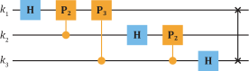
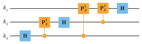
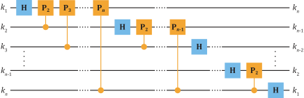
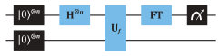
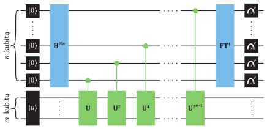

# Furjė transformacija ir jos taikymai

Šiame skyriuje toliau tęsiame kvantinių skaičiavimų apžvalgą
pristatydami **Furjė transformaciją** (angl. *Fourier transform*) ir ja
pagrįstus algoritmus. Klasikinė Furjė transformacija yra plačiai
naudojama atliekant duomenų ir signalų analizę bei apdorojimą ir yra
esminės reikšmės įrankis matematinėje funkcijų analizėje. Kaip praktinį
Furjė naudojimo pavyzdį, nebūtinai sunkų skaičiavimo išteklių atžvilgiu,
imkime funkciją $f(t)$, kuri nusako garso šaltinio kitimą laike. Šios
funkcijos Furjė transformacija, žymima
$\mathrm{FT}\lbrack f(t)\rbrack = f(v)$, išreiškia ją dažnių ($v$)
spektro pavidale $f(v)$. Norėdami atlikti pasirinktų dažnių filtravimą,
pavyzdžiui, siekiant nuslopinti aukštojo dažnio garsus, galime
užmaskuoti šias amplitudes dažnio srities funkcijoje $f(v)$. Atlikę
atvirkštinę $f(v)$ funkcijos Furjė transformaciją, žymimą
${\mathrm{FT}}^{-1}\lbrack f(v)\rbrack = f(t)$, grąžiname ją atgal
į laiko sritį, taip atstatydami modifikuotą garso įrašą.

## Kvantinė Furjė transformacija

**Kvantinė Furjė transformacija** (angl. *quantum Fourier transform*)
yra klasikinės Furjė transformacijos kvantinis realizavimas. Palyginus
su vadinamuoju **greituoju klasikiniu Furjė transformacijos algoritmu**
(angl. *fast Fourier transform*), naudojamu diskretiesiems
(skaitmenizuotiems) signalams, kvantinė jos versija pasiekia
eksponentinį pagreitinimą loginių operacijų skaičiaus atžvilgiu. Todėl
kvantinė Furjė transformacija atveria galimybes paspartinti aibę
skaičiavimo užduočių. Tarp jų yra kvantinių sistemų modeliavimas,
tiesinių lygčių sprendinių paieška, kvantinio mašininio mokymosi
algoritmai, Šoro pirminių skaičių faktorizavimas.

Kvantinė Furjė transformacija (vartosime trumpinį FT) priima kaip įvestį
$n$ elementų vektorių ir pateikia išvestyje kitą $n$ elementų vektorių.
FT yra realizuojama unitariąja transformacija, vadinkime ją $U_{\mathrm{FT}}$,
kurios efektas $n$ kubitų skaičiuojamiesiems baziniams vektoriams
$|x\rangle$ nusakomas:
\begin{equation}
U_{\mathrm{FT}}|x\rangle =\frac{1}{\sqrt{2^n}}\sum_{y = 0}^{2^n - 1}\mathrm{e}^{\mathrm{i}2\pi xy/2^n}|y\rangle\,.
(\#eq:u-ft)
\end{equation}
Čia $x$ ir $y$ yra skaičiai, išreikšti dešimtaine sistema. Iš to gaunama
$U_{\mathrm{FT}}$ operatoriaus matematinė išraiška diadomis:
\begin{equation}
U_{\mathrm{FT}} =\frac{1}{\sqrt{2^n}}\sum_{x = 0}^{2^{n} - 1}\sum_{y = 0}^{2^n - 1} \mathrm{e}^{\mathrm{i}2\pi xy/2^n}|y\rangle\langle x|\,.
(\#eq:u-ft-diadom)
\end{equation}
Matome, kad $U_{\mathrm{FT}}$, veikiantis bet kurį bazinį vektorių
$|x\rangle$, transformuoja jį į lygią visų standartinių
bazinių vektorių superpoziciją. Šie vektoriai yra perindeksuojami raide
$y$ ir kartu nešasi skirtingus fazės narius $\mathrm{e}^{\mathrm{i}2\pi xy/2^n}$. Šios
eksponentės argumentuose $xy$ yra daugyba, pavyzdžiui, jeigu
$|x\rangle = |5\rangle$ ir
$|y\rangle = |3\rangle$, tada $xy = 15$.
Operatorių $U_{\mathrm{FT}}$, žinoma, galima išreikšti ir $(2^n \times 2^n)$
dydžio matrica. Jos $y$ stulpelio ir $x$ eilutės įrašai yra fazės
nariai $\mathrm{e}^{\mathrm{i}2\pi xy/2^n}/\sqrt{2^n}$.

Būdama unitarioji transformacija, FT išlaiko vektorių normuotumą ir
ortogonalumą
$\langle x'| U^{\dagger}_{\mathrm{FT}}U_{\mathrm{FT}}|x\rangle =\langle x'|x\rangle = 0$.
Tad $U_{\mathrm{FT}}$ leidžia sukurti naują $n$ kubitų bazinių vektorių rinkinį,
vadinamą **Furjė bazinių vektorių rinkiniu** (angl. *Fourier basis*).
Viršuje $U^{\dagger}_{\mathrm{FT}}$ yra $U_{\mathrm{FT}}$ operatoriaus ermitinė jungtis
ir nusako atvirkštinę Furjė transformaciją, dar žymimą $\mathrm{FT}^{\dagger}$ arba
$\mathrm{FT}^{-1}$. Pritaikius $U^{\dagger}_{\mathrm{FT}}|x\rangle$
skirtumas nuo viršuje parodytos išraiškos bus tik kompleksinėje fazės
narių jungtyje $\mathrm{e}^{\mathrm{i}2\pi xy/2^n} \rightarrow\mathrm{e}^{-\mathrm{i}2\pi xy/2^n}$. Ar
minuso ženklas vartojamas $U^{\dagger}_{\mathrm{FT}}$, ar $U_{\mathrm{FT}},$ neturi
esminės įtakos, svarbu tik sistemiškai juos vartoti.

Pritaikę FT bendrai būsenai $|\psi\rangle$, esančiai
bazinių vektorių $|x\rangle$ superpozicijoje, randame:
\begin{equation}
U_{\mathrm{FT}}|\psi\rangle = U_{\mathrm{FT}}\sum_{x = 0}^{2^n - 1} c_x|x\rangle
= \frac{1}{\sqrt{2^n}}\sum_{x = 0}^{2^n - 1} \sum_{y = 0}^{2^n - 1} c_x \mathrm{e}^{\mathrm{i}2\pi xy/2^n}|y\rangle\,.
(\#eq:u-ft-bendrai-busenai)
\end{equation}
Atkreipiame dėmesį, kad $U_{\mathrm{FT}}|\psi\rangle$ nusako
faktorizuojamą kvantinę $n$ kubitų būseną. Šią išraišką galima
supaprastinti:
\begin{equation}
U_{\mathrm{FT}}|\psi\rangle = \sum_{y = 0}^{2^n - 1} b_y|y\rangle\,.
(\#eq:u-ft-bendrai-supaprastinimas)
\end{equation}
Čia $b_y$ yra gaunamas laikant $y$ fiksuotą ir atliekant sumą $x$
atžvilgiu, tai formaliai nusako funkciją, priklausančią tik nuo
argumento $y$:
\begin{equation}
b_y =\frac{1}{\sqrt{2^n}}\sum_{x = 0}^{2^n - 1} c_x \mathrm{e}^{\mathrm{i}2\pi xy/2^n}\,.
(\#eq:b-y-apibrezimas)
\end{equation}
Toliau pateikiame keletą kvantinės Furjė transformacijos pavyzdžių.
Vieno kubito FT, $n = 1$, yra randama:
\begin{equation}
U_{\mathrm{FT}}|x\rangle =
\frac{1}{\sqrt{2}}\sum_{y = 0}^1 \mathrm{e}^{\mathrm{i}2\pi xy/2}|y\rangle
=\frac{1}{\sqrt{2}}\big(|0\rangle + \mathrm{e}^{\mathrm{i}\pi x}|1\rangle\big)\,.
(\#eq:vieno-kubito-ft)
\end{equation}
Fazės narys $\mathrm{e}^{\mathrm{i}\pi x} = 1$, jeigu $U_{\mathrm{FT}}$ veikia
$|x\rangle = |0\rangle$, ir
$\mathrm{e}^{\mathrm{i}\pi x} = -1$, jeigu $U_{\mathrm{FT}}$ veikia
$|x\rangle = |1\rangle$. Tad $n = 1$
Furjė transformaciją galima išreikšti tiesiog Hadamardo loginiais
vartais, $U_{\mathrm{FT}} = H$. Taip pat matome ir kitą specifinę situaciją, kai
Furjė transformacija pritaikoma $n$ kubitų registrui, esančiam
$|0\rangle$ būsenoje (dešimtainėje sistemoje):
\begin{equation}
U_{\mathrm{FT}}|0\rangle =\frac{1}{\sqrt{2^n}}\sum_{y = 0}^{2^n - 1}|y\rangle\,.
(\#eq:u-ft-0-busenoje)
\end{equation}
Jos efektą galima taip pat nusakyti kiekvienam iš $n$ kubitų pritaikant
Hadamardo vartus, $H^{\otimes n}$, taip sukuriant lygią visų bazinių
vektorių superpoziciją.

Paskutiniame pavyzdyje imkime vieno iš bazinių vektorių
$|x\rangle$, nusakančio $n = 3$ kubitų registro būseną,
Furjė transformaciją:
\begin{equation}
\begin{aligned}
U_{\mathrm{FT}}|x\rangle = & \frac{1}{\sqrt{8}}\sum_{y = 0}^{7} \mathrm{e}^{\mathrm{i}2\pi xy/8}|y\rangle \\
= & \frac{1}{\sqrt{8}}\big(|0\rangle + \mathrm{e}^{\mathrm{i}\pi x/4}|1\rangle
+ \mathrm{e}^{\mathrm{i}\pi x/2}|2\rangle + \mathrm{e}^{\mathrm{i}\pi x3/4}|3\rangle \\
& + \mathrm{e}^{\mathrm{i}\pi x}|4\rangle + \mathrm{e}^{\mathrm{i}\pi x5/4}|5\rangle
+ \mathrm{e}^{\mathrm{i}\pi x3/2}|6\rangle + \mathrm{e}^{\mathrm{i}\pi x7/4}|7\rangle\big)\,.
\end{aligned}
(\#eq:u-ft-3-kubitai)
\end{equation}
Toliau pateikiame itin naudingą $n$ kubitų bazinio vektoriaus
$|x\rangle$ kvantinės Furjė transformacijos formą
naudojant pavienių kubitų $n$ tenzorinę sandaugą:
\begin{equation}
\begin{aligned}
U_{\mathrm{FT}}|x\rangle = & \frac{1}{\sqrt{2^n}}\prod_{k = 1}^n \big(|0\rangle + \mathrm{e}^{\frac{\mathrm{i}2\pi x}{2^k}}|1\rangle\big) \\
= & \big(|0\rangle + \mathrm{e}^{\mathrm{i}2\pi x/2}|1\rangle\big)\otimes\big(|0\rangle + \mathrm{e}^{\mathrm{i}2\pi x/4}|1\rangle\big)
\otimes\cdots\otimes\big(|0\rangle + \mathrm{e}^{\mathrm{i}2\pi x/2^n}|1\rangle\big)\,.
\end{aligned}
(\#eq:u-ft-n-kubitu)
\end{equation}
Tai nusako $n$ kubitų, kurių kiekvienas yra superpozicijoje, tenzorinę
sandaugą ir todėl -- faktorizuojamąją būseną. Šią išraišką galima taip
pat perteikti dvejetaine forma pasitelkiant kubitų numeraciją
$|x\rangle = |k_1 k_2 \cdots k_n\rangle$
su $k_i \in\{0, 1\}$ ir dvejetainės trupmenos
apribrėžimą:
\begin{equation}
0.k_1 k_2 \cdots k_n =\frac{k_1}{2} +\frac{k_2}{4} +\cdots +\frac{k_n}{2^n} =\sum_{i = 1}^n k_i 2^{-i}\,.
(\#eq:dvejetaine-trupmena)
\end{equation}
Keletas dvejetainių trupmenų pavyzdžių: 0.1=1/2, 0.001=1/8, 0.011=3/8.
Viską sudėjus kartu, $U_{\mathrm{FT}}|x\rangle$ dvejetaine forma
yra:
\begin{equation}
\begin{split}
U_{\mathrm{FT}}|k_1 k_2\cdots k_n\rangle = & \big(|0\rangle + \mathrm{e}^{\mathrm{i}2\pi 0.k_{n}}|1\rangle\big)
\otimes\big(|0\rangle + \mathrm{e}^{\mathrm{i}2\pi 0.k_{n - 1}k_n}|1\rangle\big)
\otimes\cdots \\
 & \otimes\big(|0\rangle + \mathrm{e}^{\mathrm{i}2\pi 0.k_1 k_2 \cdots k_n}|1\rangle\big)\,.
\end{split}
(\#eq:u-ft-dvejetaine-forma)
\end{equation}

## Furjė transformacijos realizavimas kvantinėje grandinėje

Kvantinė Furjė transformacija yra
efektyviai realizuojama kvantinėje grandinėje naudojant 1 kubito ir
2 kubitų loginius vartus. Pirmiausiai pateikiame kaip pavyzdį 3 kubitų
registrui $U_{\mathrm{FT}}$ atliekančią kvantinę grandinę (žr. \@ref(fig:3-kubitu-ft-grandine) pav.):


```{r 3-kubitu-ft-grandine, echo=FALSE, fig.cap="3 kubitų registrui kvantinę Furjė transformaciją atliekanti loginė grandinė", out.width='70%', fig.align='center'}

```

Čia matome Hadamardo, 2-kubitų $cP_k$ bei SWAP loginių vartų
kombinaciją. Joje $cP_k$ yra \@ref(kvantiniai-loginiai-vartai-grandines) skyriuje minėti sąlyginiai fazės
vartai $cP_k(\theta)$ su $\theta = \mathrm{e}^{\mathrm{i}2\pi/2^k}$, $k$ -- sveikasis
skaičius. Matricos forma atrodo taip:
\begin{equation}
cP_{k} =\begin{bmatrix}
1 & 0 & 0 & 0\\
0 & 1 & 0 & 0\\
0 & 0 & 1 & 0\\
0 & 0 & 0 & \mathrm{e}^{\mathrm{i}2\pi/2^k}
\end{bmatrix}\,.
(\#eq:cp-matricos-forma)
\end{equation}
Vartai $W$ panaudojami grandinės pabaigoje, kadangi FT algoritmas
sukeičia kubitų indeksavimą aplink centrinius kubitus. Šiuo atveju
$k_1$ sukeičiamas su $k_3$, tad $W$, panaudoti grandinės pabaigoje,
atstato juos atgal į standartinę $\{k_1, k_2, k_3\}$ seką. Aišku,
nebūtina to daryti, jeigu toliau atliekami loginiai vartai atsižvelgiant
į indeksavimo pasikeitimą.

Atvirkštinė Furjė transformacija $\mathrm{FT}^{\dagger}$ yra realizuojama atvirkštine
loginių vartų seka panaudojant atvirkštinius loginius vartus. Hadamardo
bei SWAP loginiai vartai yra patys sau atvirkštiniai, o štai
atvirkštiniai $cP_k$ vartai yra jų ermitinė jungtis
${cP}_k^{\dagger}$. Atvirkštinę 3 kubitų transformaciją $\mathrm{FT}^{\dagger}$
atliekanti grandinė yra pateikta \@ref(fig:atvirkstine-3-kubitu-ft) pav.

```{r atvirkstine-3-kubitu-ft, echo=FALSE, fig.cap="Atvirkštinė 3 kubitų kvantinė Furjė transformacija", out.width='73%', fig.align='center'}

```

Furjė transformacijoje, atliekamoje $n$-kubitų registrui,
galime įžvelgti loginių vartų seką. Pradedant nuo viršutinio kubito
$k_1$, jam atliekami $H$ bei sąlyginiai $cP_k$ vartai poromis su
visais $n-1$ likusiais kubitais. Tai kartojama su $k_2, k_3, \ldots$ ir
likusiais kubitais, paskutiniajam atliekant tik $H$.

```{r kvantine-ft-grandine-n-kubitu, echo=FALSE, fig.cap="Loginė grandinė, atliekanti kvantinę Furjė transformaciją $n$ kubitų registrui", out.width='94%', fig.align='center'}

```

Kaip minėjome, galima FT užbaigti $W$ loginiais vartais siekiant
atstatyti visų kubitų indeksavimo eiliškumą. Apibendrinus, norint
atlikti FT $n$ kubitų registrui yra panaudojami $n$ $H$ vartų,
$n(n - 1)/2$ sąlyginių $cP_k$, ir ne daugiau nei $n/2$ $W$
vartų. Šie vartai gali būti realizuojami trimis $cX$, o $cP_k$ galima
realizuoti pasitelkus ne daugiau negu 6 elementariuosius loginius
vartus. Tad kvantinės $n$ kubitų Furjė transformacijos sudėtingumas yra
nulemtas $O(n^2)$ elementarių loginių operacijų, o štai klasikinei
diskrečiajai Furjė transformacijai prireiks eksponentiškai daugiau
operacijų, $O(n2^n)$.

Galima pastebėti, kad sąlyginiuose 2 kubitų vartuose $cP_k$
adresatiniam kubitui pritaikoma fazė $\theta = \mathrm{e}^{\mathrm{i}2\pi/2^k}$ vis
mažėja su didėjančiu $k$. Todėl FT atliekama registrui, sudarytam iš
didelio skaičiaus kubitų, nuo tam tikro $k$ skaičiaus galima
atitinkamiems kubitams nebetaikyti $cP_k$, nes $\theta$ bus
nereikšmingai maža. Tai leidžia dar labiau sumažinti loginių vartų
skaičių, atkreipiant dėmesį, kad didėjantis $k$ nusako atliekamus
$cP_k$ tarp vis toliau vienas nuo kito esančių kubitų.

## Funkcijos periodiškumo paieška 

Pirmame Furjė transformacijos taikymo pavyzdyje parodysime funkcijos
periodiškumo nustatymo algoritmą. Funkcija $f(x)$ yra periodinė su
periodu $P$, jeigu $f(x) = f(x + P)$ visiems $x$ funkcijos $f$
apibrėžimo intervale. Vienas periodinės funkcijos pavyzdys būtų
trigonometrinė funkcija $f(x) =\cos(2\pi x/P)$, nusakanti osciliacijas
su periodu $P$. Klasikiniai algoritmai gali nustatyti $P$ su
eksponentiniu laiko sudėtingumu, augančiu didėjant įvesties dydžiui $N$.
O štai paprastas kvantinis algoritmas, naudojantis FT, leidžia pasiekti
eksponentinį paspartinimą.

Imkime šio algoritmo pavyzdį su įvesties bei išvesties registrais,
turinčiais po 3 kubitus, ir funkciją $f(x)$, kurios periodas yra
$P = 2$. Dėl šio periodiškumo funkcijos reikšmės lyginiuose ir
nelyginiuose argumentuose yra nusakytos $y'$ ir $y''$ vertėmis:
$y' = f(0) = f(2) = f(4) = f(6)$ ir
$y'' = f(1) = f(3) = f(5) = f(7)$. Pirmiausia pradinės būsenos
$|\psi_0\rangle = |0\rangle\otimes|0\rangle$
įvesties registrui pritaikome Hadamardo vartus $H^{\otimes 3}$, kurie
sukuria lygią visų bazinių vektorių superpoziciją:
\begin{equation}
(H^{\otimes 3}\otimes I)|\psi_0\rangle =\frac{1}{\sqrt{8}}\sum_{x = 0}^7 |x\rangle\otimes|0\rangle\,.
(\#eq:h-3-pradinei-busenai)
\end{equation}
Kitame žingsnyje pritaikome abu registrus veikiančią transformaciją
$U_f$, kuri nusako periodinę funkciją $f(x)$:
\begin{equation}
|\psi_1\rangle = U_f\frac{1}{\sqrt{8}}\sum_{x = 0}^7 |x\rangle\otimes|0\rangle
= \frac{1}{\sqrt{8}}\sum_{x = 0}^7 |x\rangle\otimes|f(x)\rangle\,.
(\#eq:antras-zingsnis-u-f)
\end{equation}
Atliekame Furjė transformaciją įvesties registrui:
\begin{equation}
(U_{\mathrm{FT}}\otimes I)|\psi_1\rangle
= \frac{1}{8}\sum_{x = 0}^7 \sum_{y = 0}^7 \mathrm{e}^{\mathrm{i}2\pi xy/8}|y\rangle\otimes|f(x)\rangle\,.
(\#eq:ft-ivesties-registrui)
\end{equation}
Šią dvigubą sumą apskaičiuosime pirmiausia sudėdami $x$ indeksuotuosius
narius ir laikant $y$ fiksuotus, nes norime išnaudoti supaprastinimą,
atsirandantį dėl $f(x)$ periodiškumo. Vadindami šioje stadijoje bendrą
būseną $|\psi_2\rangle$ randame:
\begin{equation}
\begin{split}
|\psi_2\rangle = & \frac{1}{8}\sum_{y = 0}^7 |y\rangle\otimes\big(|f(0)\rangle
+ \mathrm{e}^{\frac{\mathrm{i}\pi y}{4}}|f(1)\rangle
+ \mathrm{e}^{\frac{\mathrm{i}\pi y}{2}}|f(2)\rangle
+ \mathrm{e}^{\frac{\mathrm{i}\pi y3}{4}}|f(3)\rangle \\
& + \mathrm{e}^{\mathrm{i}\pi y}|f(4)\rangle
+ \mathrm{e}^{\frac{\mathrm{i}\pi y5}{4}}|f(5)\rangle
+ \mathrm{e}^{\frac{\mathrm{i}\pi y3}{2}}|f(6)\rangle
+ \mathrm{e}^{\frac{\mathrm{i}\pi y7}{4}}|f(7)\rangle\big)\,.
\end{split}
(\#eq:psi-2-periodiskumas)
\end{equation}
Toliau panaudojame $f(x)$ periodiškumą identifikuodami anksčiau minėtas
vertes $y'$ ir $y''$ ir sugrupuojame šiuos narius:
\begin{equation}
|\psi_2\rangle =\frac{1}{8}\sum_{y = 0}^7 |y\rangle\otimes\Big(\big(1 + \mathrm{e}^{\frac{\mathrm{i}\pi y}{2}}
+ \mathrm{e}^{\mathrm{i}\pi y} + \mathrm{e}^{\frac{\mathrm{i}\pi y3}{2}}\big)|y'\rangle
+ \big(\mathrm{e}^{\frac{i\pi y}{4}} + \mathrm{e}^{\frac{\mathrm{i}\pi y3}{4}}
+ \mathrm{e}^{\frac{\mathrm{i}\pi y5}{4}} + \mathrm{e}^{\frac{\mathrm{i}\pi y7}{4}}\big)|y''\rangle\Big)\,.
(\#eq:psi-2-nariu-sugrupavimas)
\end{equation}
Būsenos $|\psi_2\rangle$ išraiška taip pat
susiprastina dėl atsirandančių destruktyviųjų interferencijų sudedant
skliausteliuose fazės narius. Pavyzdžiui, jeigu $y = 1$, tada:
\begin{align}
\left(1 + \mathrm{e}^{\frac{\mathrm{i}\pi}{2}} + \mathrm{e}^{\mathrm{i}\pi} + \mathrm{e}^{\frac{\mathrm{i}\pi 3}{2}}\right)|y'\rangle
=  & (1 + \mathrm{i} - 1 - \mathrm{i})|y'\rangle = 0\,.(\#eq:narys-1-periodiskumas) \\
\left(\mathrm{e}^{\frac{\mathrm{i}\pi}{4}} + \mathrm{e}^{\frac{\mathrm{i}\pi 3}{4}} + \mathrm{e}^{\frac{\mathrm{i}\pi 5}{4}}
+ \mathrm{e}^{\frac{\mathrm{i}\pi 7}{4}}\right)|y''\rangle
= & \Bigg(\frac{1}{\sqrt{2}} +\frac{\mathrm{i}}{\sqrt{2}}
- \frac{1}{\sqrt{2}} + \frac{\mathrm{i}}{\sqrt{2}}  \nonumber\\
& - \frac{1}{\sqrt{2}} - \frac{\mathrm{i}}{\sqrt{2}}
+ \frac{1}{\sqrt{2}} - \frac{\mathrm{i}}{\sqrt{2}}\Bigg)|y''\rangle = 0\,.(\#eq:narys-2-periodiskumas) 
\end{align}
Taip patikrinę visas $y$ vertes sumoje matome, kad konstruktyvioji
interferencija atsiranda tik įvesties registro būsenose
$|y\rangle = |0\rangle$ ir
$|y\rangle = |4\rangle$. Visų kitų
būsenų amplitudės susideda į 0. Galutinė abiejų registrų būsena
$|\psi_3\rangle$ yra:
\begin{equation}
|\psi_3\rangle =\frac{1}{2}|0\rangle\otimes\big(|y'\rangle + |y''\rangle\big)
+ \frac{1}{2}|4\rangle\otimes\big(|y'\rangle - |y''\rangle\big)\,.
(\#eq:galutine-busena-periodiskumas)
\end{equation}
Kadangi $\langle y'|y''\rangle =\delta_{y'y''}$,
pamatavę įvesties registrą rasime būsenas $|0\rangle$
arba $|4\rangle$ su $p(0) = p(4) = 0.5$ tikimybe. Būsena
$|0\rangle$ nepriklauso nuo periodo, tad radus ją nėra
suteikiama informacijos, tad teks kartoti žingsnius kol, šiuo atveju,
bus rasta $|4\rangle$. Tai prisideda prie algoritmo
laiko sudėtingumo. Būsena $|4\rangle$ tiesiogiai
atspindi $P = 2$ periodiškumą, nes pritaikius šį algoritmą $n$ kubitų
sistemai įvesties registre (žr. \@ref(fig:periodiskuma-nustatanti-grandine) pav.) bendrai išlieka tik šių būsenų
superpozicija:
\begin{equation}
|0\rangle\,, |1\cdot 2^n/P\rangle\,, |2\cdot 2^n/P\rangle\,, |3\cdot 2^n/P\rangle\,,\ldots\,, |(P - 1)\cdot 2^n/P\rangle\,.
(\#eq:isliekanti-superpozicija)
\end{equation}
Darome prielaidą, kad $2^n/P$ yra sveikasis skaičius, tad jeigu
randama būsena $|y\rangle$, periodas yra
$P = k(2^n/y)$. Čia $k = 0, 1, 2,\ldots, (P - 1)$ yra sveikasis
neneigiamasis skaičius, o $2^n$ nusako sistemos dimensiją ir yra
žinomas skaičius. Taikydami šią formulę matome, kad minėta būsena
$|4\rangle$ indikuoja $P =\frac{2^3}{4} = 2$ periodą.
Bendrai, jeigu perteiksime sąryšį taip $P/k = 2^n/y$, tada atlikus
$2^n/y$ naryje abiejų skaičių padalijimą iš jų didžiausio bendrojo
daliklio, gautas vardiklis bus periodas $P$. Taip pat galima parodyti,
kad jeigu $2^n/P$ ir nėra sveikasis skaičius, amplitudės vis tiek
išlieka tik tų būsenų $|y\rangle$, kurios yra artimos
$k2^n/P$ sveikajam skaičiui.

```{r periodiskuma-nustatanti-grandine, echo=FALSE, fig.cap="Funkcijos periodiškumą nustatanti loginė grandinė. Furjė transformacija $n$ kubitų registrui glaustai užrašyta kaip modulis FT", out.width='60%', fig.align='center'}

```

## Kvantinis fazės nustatymo algoritmas {#kvantinis-fazes-nustatymas}

Šis algoritmas (angl. *quantum phase estimation*) pasitelkia kvantinę
Furjė transformaciją ir aptinkamas kaip modulis kituose
algoritmuose. Tarp jų yra kvantinis tiesinių lygčių sprendimo
algoritmas, kurį pristatome kitame poskyryje. Fazės nustatymo algoritmo
sudėtingumas yra nulemtas FT modulio, kuriam prireiks $O(n^2)$
elementariųjų operacijų. Fazės nustatymo algoritmo užduotis yra rasti
unitariojo operatoriaus $U$ tikrines vertes. Unitariųjų operatorių
tikrinės vertės $\lambda_u$ turi bendrą formą
$\lambda_u = \mathrm{e}^{\mathrm{i}2\pi\theta_u}$ ir tenkina lygtį:
\begin{equation}
U|u\rangle = \mathrm{e}^{\mathrm{i}2\pi\theta_u}|u\rangle\,.
(\#eq:unitariojo-tikrines-funkcijos)
\end{equation}
Čia $U$ yra unitarusis operatorius, kurio tikrinė vertė
$\lambda_u = \mathrm{e}^{\mathrm{i}2\pi\theta_u}$ asocijuota su tikriniu vektoriumi
$|u\rangle$ (darome prielaidą, kad tikriniai vektoriai
yra neišsigimę). Parametras, įvardijantis $U$ skirtingas tikrines vertes
$\lambda_u$, yra fazė $\theta_u$ (realusis skaičius) ir
$0\leq\theta_u < 1/2\pi$ dėl periodiškumo. Literatūroje galima
rasti pervadintą $\theta_u$ įkomponuojant $2\pi$, tada
$\lambda_{u} = \mathrm{e}^{\mathrm{i}\theta_u}$ ir
$\theta_u \rightarrow\theta_u/2\pi$.

Fazės nustatymo algoritmas leidžia, skaičiavimo išteklių atžvilgiu,
efektyviai apskaičiuoti $\theta_u$ pageidaujamu tikslumu. Šiuo metodu
naudojamas fazės atatrankos triukas, kurį jau matėme Doičo ir Groverio
algoritmuose. Imkime paprastą 2 kubitų būsenos pavyzdį:
\begin{equation}
|k_1\rangle\otimes|k_2\rangle =\frac{1}{\sqrt{2}}\big(|0\rangle + |1\rangle\big)\otimes|u\rangle\,.
(\#eq:2-kubitu-busena-faze)
\end{equation}
Čia kubitas $k_2$ yra $U$ operatoriaus tikrinio vektoriaus būsenoje
$|u\rangle$. Pritaikome šiems dviem kubitams sąlyginį
2 kubitų operatorių $cU$, kuriame $k_2$ kubitas yra adresatinis:
\begin{equation}
cU|k_1\rangle\otimes|k_2\rangle
= \frac{1}{\sqrt{2}}\big(|0\rangle\otimes|u\rangle + |1\rangle\otimes U|u\rangle\big)
= \frac{1}{\sqrt{2}}\big(|0\rangle + \mathrm{e}^{\mathrm{i}2\pi\theta_{u}}|1\rangle\big)\otimes|u\rangle\,.
(\#eq:cu-faze)
\end{equation}
Matome, kad amplitudė, nusakanti $|u\rangle$ būsenos 
tikrinę vertę $\lambda_u = \mathrm{e}^{\mathrm{i}2\pi\theta_u}$, yra perkeliama
kubitui $k_1$. Fazės nustatymo algoritmas pasikliauja gebėjimu
paruošti $U$ operatoriaus tikrinį vektorių $|u\rangle$
ir atlikti sąlyginius $cU^{2^n}$ vartus, kai $U^{2^n}$ yra $U$
pritaikytas $2^n$ kartų (pakeltas $2^n$ laipsniu). Pavyzdžiui,
$U^2|u\rangle = UU|u\rangle = \mathrm{e}^{\mathrm{i}2\pi\theta_u}U|u\rangle = \mathrm{e}^{\mathrm{i}2\pi 2\theta_u}|u\rangle$.
Taip tęsdami matome:
\begin{equation}
U^{2^n}|u\rangle = \mathrm{e}^{\mathrm{i}2\pi 2^n\theta_u}|u\rangle\,.
(\#eq:2-n-pakartojimu)
\end{equation}
Kvantinė grandinė, realizuojanti fazės nustatymą, yra parodyta \@ref(fig:grandine-fazes-nustatymui) pav.

```{r grandine-fazes-nustatymui, echo=FALSE, fig.cap="Bendra loginė grandinė, realizuojanti fazės nustatymo algoritmą", out.width='94%', fig.align='center'}

```

Pirmasis registras yra sudarytas iš $n$ kubitų, čia skaičius $n$ yra
parenkamas pagal tai, kokį norima pasiekti fazės $\theta$ tikslumą
bitais. Atkreipiame dėmesį, kad naudojamas bazinių vektorių kodavimo
metodas (žr. 6.4 poskyrį). Antrasis registras sudarytas iš $m$ kubitų,
reikalingų $U$ operatoriaus tikriniam vektoriui
$|u\rangle$ perteikti. Pritaikę $H^{\otimes n}$ bei
$cU^{2^n}$ vartų sekas, randame šią bendrą būseną:
\begin{equation}
\begin{aligned}
|\psi\rangle = & \frac{1}{\sqrt{2^n}}\big(|0\rangle + \mathrm{e}^{\mathrm{i}2\pi 2^{n - 1}\theta_u}|1\rangle\big)
\otimes\big(|0\rangle + \mathrm{e}^{\mathrm{i}2\pi 2^{n - 2}\theta_u}|1\rangle\big)
\otimes\cdots \\
& \otimes\big(|0\rangle + \mathrm{e}^{\mathrm{i}2\pi 2^{0}\theta_u}|1\rangle\big)\otimes|u\rangle \\
= & \frac{1}{\sqrt{2^n}}\sum_{y = 0}^{2^n - 1} \mathrm{e}^{\mathrm{i}2\pi y\theta_u}|y\rangle\otimes|u\rangle\,.
\end{aligned}
(\#eq:h-n-cu-2-n-busena)
\end{equation}
Antroje eilutėje atlikome supaprastinimą, išskleisdami visas $n$ kubitų
tenzorines sandaugas. Tada, atpažindami $n$ kubitų superpoziciją,
pervadinome $|y\rangle$ bazinius vektorius dešimtainėje
sistemoje. Antrasis $m$ kubitų registras $|u\rangle$
būsenoje nebeturi įtakos likusiems algoritmo žingsniams. Atliekame
atvirkštinę $\mathrm{FT}^{\dagger}$ pirmam $n$ kubitų registrui:
\begin{equation}
(U_{\mathrm{FT}}^{\dagger}\otimes I)\frac{1}{\sqrt{2^n}}\sum_{y = 0}^{2^n - 1}
\mathrm{e}^{\mathrm{i}2\pi y\theta_u}|y\rangle\otimes|u\rangle
= \frac{1}{2^n}\sum_{l = 0}^{2^n - 1} \sum_{x = 0}^{2^n - 1}
\mathrm{e}^{\frac{-\mathrm{i}2\pi l(x - 2^n \theta_u)}{2^n}}|x\rangle\otimes|u\rangle\,.
(\#eq:atvirkstine-ft-pirmam-registrui)
\end{equation}
Atlikus dvigubą indeksų $l$ ir $x$ sudėtį, pirmojo registro amplitudė
turi didelę vertę tik ties $x\approx 2^n \theta_u$, tai yra
$|x\rangle = |2^n \theta_u\rangle$
būsenai. Galutinę $|\psi\rangle$ galima užrašyti:
\begin{equation}
|\psi\rangle\cong |2^n\theta_u\rangle\otimes|u\rangle\,.
(\#eq:galutine-busena-fazei)
\end{equation}
Todėl pirmojo registro būsenos matavimas su didele tikimybe grąžins
$|2^n \theta_u\rangle$ būseną. Fazė yra randama
$\theta_u = x/2^n$, čia $x$ nusako pirmojo registro matavimo
rezultatą. 

Atvirkštinės $\mathrm{FT}^{\dagger}$ naudojimo reikšmę šiame algoritme galima pamatyti,
jeigu fazę perteiksime dvejetainės trupmenos forma,
$\theta_u = 0.k_1 k_2 \cdots k_n$ su $n$­bitų tikslumu. Tada,
pritaikius $H^{\otimes n}$ ir $cU^{2^n}$ sekas, būsena
$|\psi\rangle$ įgauna formą dvejetainėje sistemoje, kuri
yra identiškai nusakoma FT atlikimu
$U_{\mathrm{FT}}|2^n k_1 k_2 \cdots k_n\rangle$. Iškvietę
atvirkštinę $\mathrm{FT}^{\dagger}$, randame
$U_{\mathrm{FT}}^{\dagger}U_{\mathrm{FT}}|2^n k_1 k_2 \cdots k_n\rangle = |2^n k_1 k_2 \cdots k_n\rangle$,
ir tai vėl tiesiogiai įvardija $\theta_u$ dvejetainėje formoje.

Fazės nustatymo algoritme reikalinga paruošti pradinę registrų būseną į
$|0\rangle^{\otimes n}\otimes|u\rangle$.
Tačiau itin tiksliai paruošti $U$ operatoriaus tikrinį vektorių
$|u\rangle$ gali būti keblu. Kaip tada veiks algoritmas?
Atkreipiame dėmesį, kad bendrą būseną $|\phi\rangle$
visada galima perteikti $U$ operatoriaus tikriniais vektoriais
$|u\rangle$:
\begin{equation}
|\phi\rangle =\sum_u c_u |u\rangle\,.
(\#eq:busena-isreiksta-u-tikriniais)
\end{equation}
Čia amplitudės $c_u =\langle u|\phi\rangle$
nusako šių būsenų persiklojimą. Pritaikius fazės nustatymo algoritmą
(FN), realizuojamą $U_{\mathrm{FN}}$ būsenai $|\phi\rangle$,
rezultatas bus superpozicija:
\begin{equation}
U_{\mathrm{FN}}|\phi\rangle\cong\sum_u c_u |2^n \theta_u \rangle\otimes|u\rangle\,.
(\#eq:u-fn-rezultatas)
\end{equation}
Tikimybė rasti būseną $|u\rangle$ bei su ja supintą
pirmojo registro būseną $|2^n \theta_u\rangle$, kuri
nusako tikrinę vertę, yra $|c_u|^2$. Kitaip tariant, netikslus
$|u\rangle$ paruošimas gali įvesti atsitiktinumo į
rezultatą, dėl šios priežasties bus rasta kita $U$ operatoriaus tikrinė
vertė su tikimybe $|c_u|^2 (1 -\epsilon)$. Faktorius
$(1 -\epsilon)$ atsiranda dėl tikslumo, kuriuo pasirenkama nustatyti
fazę. Todėl nebūtina idealiai tiksliai paruošti
$|u\rangle$, pakanka pradinę būseną
$|\phi\rangle$ padaryti kuo panašesnę į norimą
$|u\rangle$ maksimizuojant jų persiklojimą
$|\langle u |\phi\rangle|$.

Jeigu $2^n \theta_u$ ir nėra sveikasis skaičius, šis
algoritmas vis tiek grąžina ieškomąją fazę su didesne nei $p = 0.4$
tikimybe. Tikimybė rasti ieškomą rezultatą ir $\theta$ skaičiaus
tikslumas gali būti padidinti pasitelkus daugiau $n$ kubitų pirmajame
registre. Galima formaliai parodyti, kad kubitų skaičius $n$ grandinėje auga kaip $O(\log(1/\epsilon))$ siekant $\epsilon$ paklaidos 
bei reikalauja $O(1/\epsilon)$ sąlyginių loginių vartų $cU$.

## Tiesinių lygčių sprendimas HHL algoritmu

**Kvantinis HHL algoritmas** (jo kūrėjų *Harrow-Hassidim-Lloyd*
pavardžių trumpinys) leidžia spręsti tiesinių lygčių sistemas ir
suteikia žymų paspartinimą prieš klasikinius algoritmus: **Gauso
pašalinimą** (angl. *Gauss elimination*) ir **konjuguotojo gradiento
metodą** (angl. *conjugate gradient method*). Vadinamasis **matricos
sąlygos skaičius** (angl. *condition number*) nusako didžiausios ir
mažiausios matricos $A$ tikrinių verčių santykį,
$\kappa =\lambda_{\max}/\lambda_{\min}$. Didėjant $\kappa$ tampa
sunkiau invertuoti matricą $A$, ir todėl mažėja HHL algoritmo
stabilumas. HHL algoritmo laiko vykdymo trukmė auga kaip
$O(\kappa^2\log 2^m)$ ir suteikia eksponentinį paspartinimą sistemos
dydžio atžvilgiu $2^m$ prieš klasikinius algoritmus, kurie pasižymi
$O(\kappa 2^m)$. HHL algoritmas yra aptinkamas kaip modulis kituose
kvantiniuose algoritmuose, įskaitant mašininio mokymosi ir kvantinių
sistemų modeliavimo, savo ruožtu leidžia paspartinti šiuos skaičiavimus.
Pirmiausiai apžvelgsime šio algoritmo bendruosius veikimo principus ir
pateiksime jo realizaciją kvantinėje grandinėje.

Tiesinių lygčių sistema yra išreiškiama lygtimi:
\begin{equation}
A|x\rangle = |b\rangle\,.
(\#eq:tiesiniu-lygciu-sistema)
\end{equation}
Sprendžiant lygčių sistemą kvantiniu kompiuteriu, operatorius $A$
tiesinėje algebroje yra ermitinė $(2^m \times 2^m)$ dydžio matrica,
$|x\rangle$ ir $|b\rangle$ yra $2^m$
dimensijų normuotieji vektoriai. Matrica $A$ bei vektorius
$|b\rangle$ yra nurodyti, algoritmo užduotis -- rasti
vektorių $|x\rangle$, tenkinantį šią lygčių sistemą.
Bendrai ši sistema nusako $2^m$ skaičių lygčių ir $2^m$ skaičių
nežinomųjų, kurie yra $|x\rangle$ vektoriaus amplitudės.
Sprendimas $|x\rangle$ randamas invertuojant $A$
matricą, tai yra apskaičiuojant $A^{-1}$ ($A^{-1}A = I$), nes:
\begin{equation}
|x\rangle = A^{-1}|b\rangle\,.
(\#eq:lygciu-sistemos-sprendinys)
\end{equation}
Reikalavimas, kad $A$ būtų ermitinė matrica, gali būti sušvelninamas;
mat jeigu $A$ nėra ermitinė, galime apibūdinti naują matricą $B$, kuri
yra ermitinė:
\begin{equation}
B =\begin{pmatrix}
0 & A\\
A^{\dagger} & 0
\end{pmatrix}\,.
(\#eq:ermitines-matricos-sukonstravimas)
\end{equation}
ir išspręsti susijusią lygčių sistemą:
\begin{equation}
B\begin{pmatrix}
0\\
|x\rangle
\end{pmatrix} = \begin{pmatrix}
|b\rangle\\
0
\end{pmatrix}\,.
(\#eq:lygciu-sistema-matricai-b)
\end{equation}
Toliau darome prielaidą, kad $A$ yra ermitinis operatorius, perteikę
spektrine dekompozicija:
\begin{equation}
A =\sum_{k = 0}^{2^m - 1} \lambda_k |a_k\rangle\langle a_k|\,.
(\#eq:spektrine-dekompozicjia-hhl)
\end{equation}
Diados yra sudarytos iš operatoriaus $A$ tikrinių vektorių
$|a_k\rangle,$ asocijuotų su tikrinėmis vertėmis
$\lambda_k$. Tiesinėje algebroje $A$ yra diagonalioji matrica, kurios
įstrižainės yra tikrinės vertės $\lambda_k$. Tad jos atvirkštinė
matrica $A^{-1}$ diadų formoje yra tiesiog:
\begin{equation}
A^{-1} =\sum_{k = 0}^{2^m - 1} \frac{1}{\lambda_k}|a_k\rangle\langle a_k|\,.
(\#eq:atvirkstine-matrica-diadu-formoje)
\end{equation}
Tai irgi diagonalioji matrica su įstrižainės vertėmis
$\lambda_k^{-1}$. Vektorius $|b\rangle$ taip pat gali
būti išreikštas $A$ operatoriaus tikriniais vektoriais
$|a_i\rangle$:
\begin{equation}
|b\rangle =\sum_{i = 0}^{2^m - 1} b_i|a_i\rangle\,.
(\#eq:b-isreikstas-a-tikriniais)
\end{equation}
Sudėjus šias išraiškas ir pritaikius bazinių vektorių ortogonalumą
$\langle a_k | a_i\rangle =\delta_{k,i}$,
sprendinys yra ieškomas tokia forma:
\begin{equation}
|x\rangle =\sum_{k = 0}^{2^m - 1} \lambda_k^{-1} b_k|a_k\rangle\,.
(\#eq:sprendinys-a-tikriniais)
\end{equation}
Tad ieškomasis vektorius $|x\rangle$ bus koduojamas kaip
tikrinių vektorių $|a_k\rangle$ amplitudės (žr. 6.4 poskyrį).
Atkreipiame dėmesį, kad būsenų matavimas galiausiai yra
atliekamas Pauli-$Z$ tikrinių vektorių bazėje
{$|0\rangle, |1\rangle$}, o ne
{$|a_k\rangle$}. Tačiau galima matematiškai
patikrinti, kad šiuo atveju vis tiek bus gautos teisingos amplitudės
tarp šių bazinių vektorių rinkinių saryšio, jeigu kubitai nėra
supintieji.

HHL algoritmo pagrindinis tikslas yra perteikti būseną
$|b\rangle$ operatoriaus $A$ tikriniais vektoriais
$|a_k\rangle$ ir nustatyti jo tikrines vertes
$\lambda_k$. Kadangi $A$ yra ermitinis operatorius, jo eksponentė
nusako unitarinį operatorių, ir todėl galime panaudoti kvantinį fazės
nustatymo algoritmą rasti norimoms vertėms. **Hamiltoniano kodavimo
metodas** (angl. *hamiltonian encoding*) leidžia simuliuoti matricą $A$
unitariuoju operatoriumi ir todėl išreikšti loginiais vartais:
\begin{equation}
U = \mathrm{e}^{\mathrm{i}At}\,.
(\#eq:a-kaip-unitarusis-op)
\end{equation}
Kodavimo pavadinime žodis „hamiltonianas" atsiranda dėl to, kad $A$ yra
ermitinis operatorius ir todėl iš principo nusako tam tikros kvantinės
sistemos energijos lygius. Tad iš $A$ suformuotas unitariusis
operatorius $U$ nusako šios sistemos laiko evoliuciją
(žr. \@ref(kvantines-mechanikos-pagrindai) skyrių),
\@ref(eq:a-kaip-unitarusis-op) lygybėje matome laiko kintamąjį $t$. Ermitinio operatoriaus $A$
matematinė išraiška nusakys, kaip galima realizuoti eksponentę
$\mathrm{e}^{\mathrm{i}At}$. Tai gali būti itin paprasta diagonalioji matrica, kurią
galima išreikšti be aproksimacijų, arba gali prireikti kitų metodų.
Vieną bendrojo tipo aproksimacijos metodą, vadinamą „troterizacija",
pristatome \@ref(sistemu-modeliavimas-ir-qml) skyriuje.

Tęsiant algoritmo apibūdinimą, išreiškus $U$ spektrine dekompozicija:
\begin{equation}
\mathrm{e}^{\mathrm{i}At} =\sum_{k = 0}^{2^m - 1}
\mathrm{e}^{\mathrm{i}\lambda_k t}|a_k\rangle\langle a_k|\,.
(\#eq:u-spektine-dekompozicija-hhl)
\end{equation}

Operatoriaus tikrinės vertės $\mathrm{e}^{\mathrm{i}\lambda_k t}$ yra
asocijuotos su $U$ tikriniais vektoriais
$|a_k\rangle$, kurie čia taip pat yra ir $A$ tikriniai
vektoriai. Pažvelgus į fazės nustatymo algoritme naudojamus tikrinių
verčių apibrėžimus ir lyginant su šiuo,
$\mathrm{e}^{\mathrm{i}2\pi\theta_k} \rightarrow \mathrm{e}^{\mathrm{i}\lambda_k t}$,
ermitinio operatoriaus $A$ tikrinė vertė susieta su faze
$\theta_k =\lambda_k t/2\pi$. Tai yra visi reikalingi matematiniai
įrankiai, naudojami HHL algoritme. Toliau apibūdinkime jo žingsnius,
parodytus kvantinėje grandinėje \@ref(fig:hhl-grandine) pav.

```{r hhl-grandine, echo=FALSE, fig.cap="HHL algoritmo realizavimas loginėje grandinėje.  Daroma prielaida, kad būsena $|b\\rangle$ jau yra paruošta antrajame registre. Sąlyginiai $m + 1$ kubitų loginiai vartai $cR_y(\\theta)$ yra kontroliuojami $m$ kubitais ir keičia adresato ancila kubito būseną. Kartu su parodytomis Furjė transformacijomis ir ancila kubito matavimu ši algoritmo dalis yra kartojama, kol ancila kubitas randamas $|1\\rangle$ būsenoje", out.width='80%', fig.align='center'}

```

HHL naudoja tris kubitų registrus. Pirmųjų dviejų registrų funkcijos čia
yra iš esmės tokios pačios, kaip ir fazės nustatymo algoritme. Pirmasis
registras turi $n$ skaičių kubitų, jame užrašomos tikrinės vertės
dvejetaine forma su atitinkamu bitų tikslumu. Antrasis registras turi
$m$ skaičių kubitų, jame įrašoma ir transformuojama būsena
$|b\rangle$, kurią čia perteikėme tikriniais vektoriais
$|a_k\rangle$. Antrajame registre ir bus galiausiai
užrašomas sprendinys $|x\rangle$. Trečiasis registras
yra 1 kubito ancila, kurios paskirtį iliustruosime toliau. Pradinė
normuotoji trijų registrų būsena $|\phi\rangle$ po
būsenos $|b\rangle$ paruošimo yra:
\begin{equation}
|\phi\rangle =\sum_k b_k|0\rangle\otimes|a_k\rangle\otimes|0\rangle\,.
(\#eq:pradine-busena-hhl)
\end{equation}
Tolesniame žingsnyje pritaikome fazės nustatymo algoritmą tarp pirmų
dviejų registrų, kurio visus žingsnius kompaktiškai žymime $U_{\mathrm{FN}}$.
Randame:
\begin{equation}
U_{\mathrm{FN}}|\phi\rangle =
\sum_k b_k|\tilde{\lambda}_k\rangle\otimes|a_k\rangle\otimes|0\rangle\,.
(\#eq:u-fn-hhl)
\end{equation}
Čia fazė yra koduojama:
$\tilde{\lambda}_k = 2^n \lambda_k t/2\pi$. Tai leidžia
tiesiogiai susieti $|\tilde{\lambda}_k\rangle$
būseną su ieškomosiomis tikrinėmis vertėmis $\lambda_k$. Parametro $t$
dydis yra pasirenkamas pagal $U$ realizavimo metodą, siekiant sumažinti
$U$ atlikimo klaidas ir nepadaryti algoritmo ilgo loginių vartų
atžvilgiu. Šioje stadijoje norima atlikti pirmojo registro
transformaciją:
$|\tilde{\lambda}_k\rangle \rightarrow C\lambda_k^{-1}|\tilde{\lambda}_k\rangle$;
čia $C$ yra konstanta, reikalinga užtikrinti būsenų normavimui, ir ji
turėtų būti mažesnė nei mažiausia tikrinė
vertė, $|C| <\lambda_{\min}$. Tam pasitelkiamas ancila kubitas, kuriam
atliekami sąlyginiai loginiai vartai $cR_y(\theta)$, kontroliuojami
pirmojo registro $|\tilde{\lambda}_k\rangle$
būsenomis, su atitinkamai pasirinktu $\theta$:
\begin{equation}
cR_y(\theta)U_{\mathrm{FN}}|\phi\rangle =
\sum_k b_k|\tilde{\lambda}_k\rangle\otimes|a_k\rangle\otimes
\left\lbrack\sqrt{1 - (C\lambda_k^{-1})^2}|0\rangle + C\lambda_k^{-1}|1\rangle\right\rbrack\,.
(\#eq:cr-y-theta-hhl)
\end{equation}
Matome, kad jeigu išmatuotume ancila kubitą, radus jo būseną esant
$|1\rangle$ bendrai būsenai bus perteikta amplitudė
$C\lambda_k^{-1}$. Atkreipiame dėmesį, kad pirmi du registrai yra
supintieji, tad norint perteikti teisingas amplitudes antrajam registrui
reikia panaikinti supynimą. Paskutiniame žingsnyje pritaikome
atvirkštinę fazės nustatymo rutiną, $U_{\mathrm{FN}}^{\dagger}$, grąžindami
pirmąjį registrą į pradinę būseną ir panaikindami supynimą tarp pirmų
dviejų registrų. Ignoruodami potencialius netikslumus, kylančius iš
$U_{\mathrm{FN}}$ ir $U_{\mathrm{FN}}^{\dagger}$, randame:
\begin{equation}
U_{\mathrm{FN}}^{\dagger} cR_y(\theta)U_{\mathrm{FN}}|\phi\rangle =
\sum_k b_k|0\rangle\otimes|a_k\rangle\otimes
\left\lbrack\sqrt{1 - (C\lambda_k^{-1})^2}|0\rangle + C\lambda_k^{-1}|1\rangle\right\rbrack\,.
(\#eq:u-fn-atvirkstine-hhl)
\end{equation}
Šioje stadijoje atliekame ancila kubito matavimą. Radus jo būseną esant
$|1\rangle$, sprendinys $|x\rangle$
matomas antrajame registre:
\begin{equation}
|0\rangle\otimes|x\rangle\otimes|1\rangle
= \frac{1}{\sqrt{N}}\sum_k |0\rangle\otimes b_k \lambda_k^{-1}|a_k\rangle\otimes|1\rangle\,.
(\#eq:sprendinys-hhl)
\end{equation}
Su būsenos normavimo konstanta $N$:
\begin{equation}
N =\sum_k |b_k \lambda_k^{-1}|^2\,.
(\#eq:normavimas-hhl)
\end{equation}
Radus ancila kubitą $|0\rangle$ būsenoje tektų kartoti
žingsnius iš naujo, tai prisideda prie algoritmo laiko sudėtingumo.
Kadangi taikomas amplitudžių kodavimas, atsakymo
$|x\rangle$ tiesiogiai nuskaityti nepavyks. Vis dėlto
dažnai yra svarbiau sužinoti ne patį atsakymą, bet jo tam tikras
savybes, vidutines vertes, momentus, santykinę būsenos orientaciją
sprendinių erdvėje. Pasitelkdami Hadamardo testą (žr. 6.7 poskyrį) ar
kitą panašų metodą, galime apskaičiuoti sprendinio
funkciją $f(x) =\langle x|M|x\rangle$,
realizuojant ją atitinkamai suformuluotu kvantiniu operatoriumi $M$.

