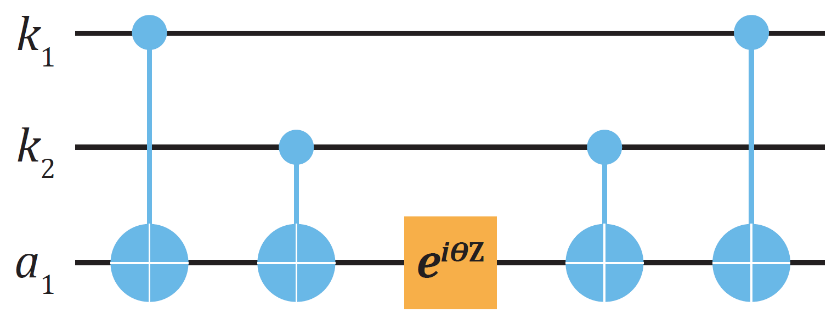
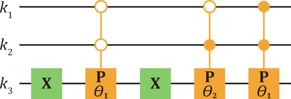
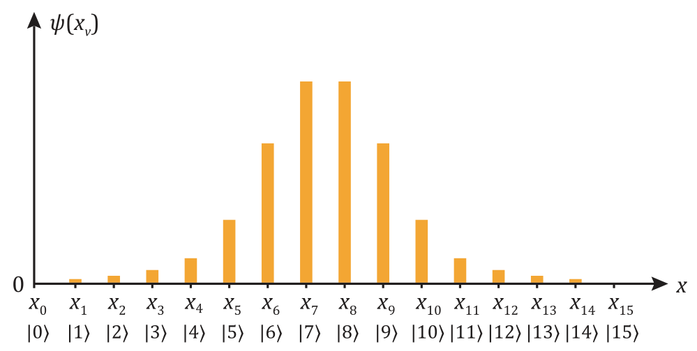
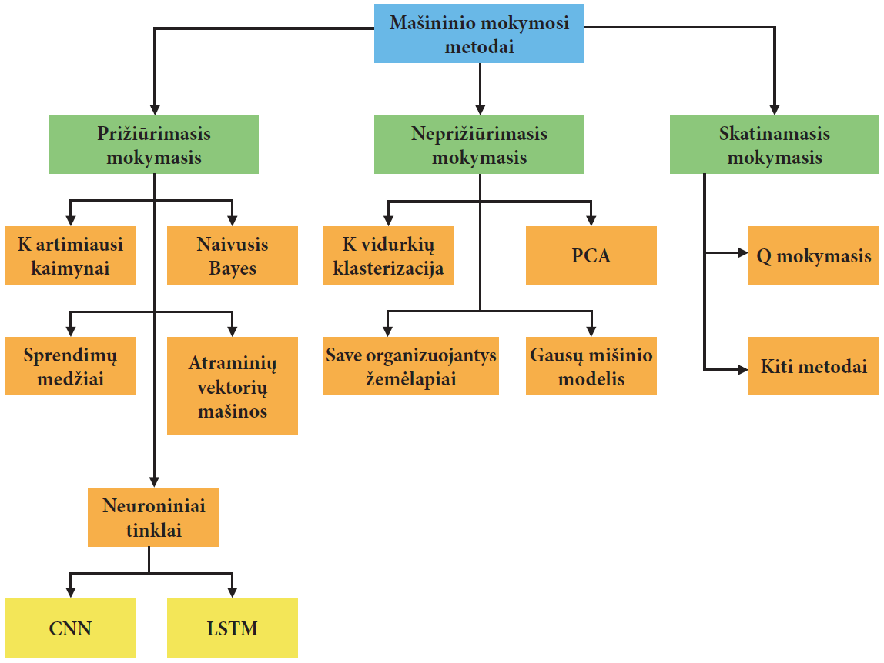
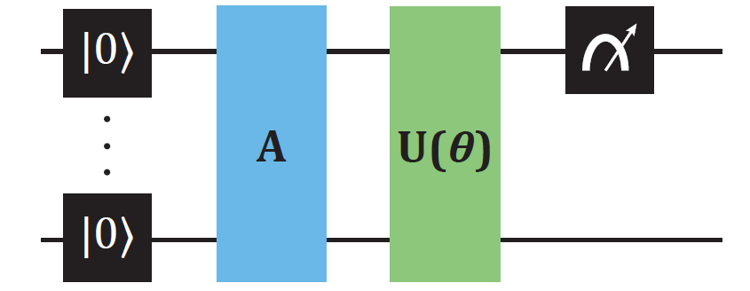
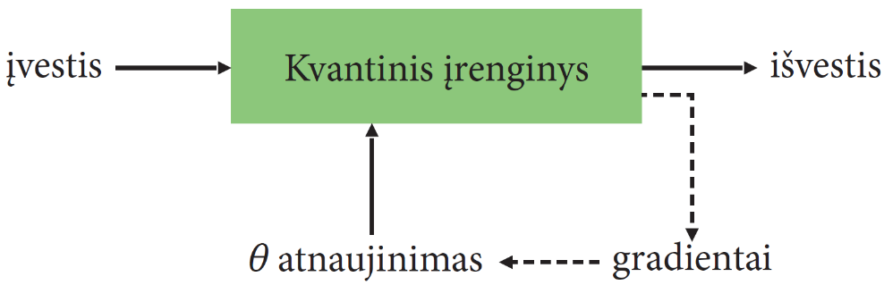
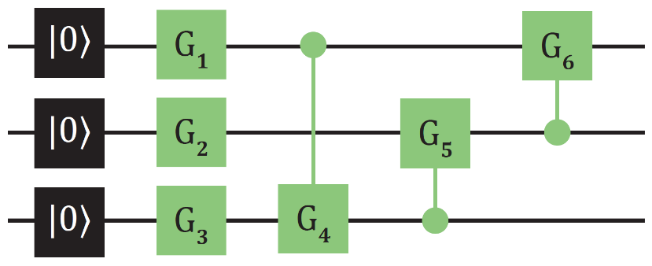

# Kvantinių sistemų modeliavimas ir mašininis mokymasis {#sistemu-modeliavimas-ir-qml}

## Dinaminių sistemų modeliavimas

Klasikinių bei kvantinių sistemų modeliavimas yra pagrįstas
diferencialinių lygčių sprendinių paieška. Diferencialinės lygtys nusako
sistemos dinamiką laike bei erdvėje ir atspindi dėsnius, kuriais šios
sistemos pagrįstos. Klasikinėje fizikoje dažnai aptinkamos Niutono,
Maksvelo ir Einšteino diferencialinės lygtys. Jos apibūdina sistemos
pozicijų konfigūracijas, elektromagnetinių ir gravitacinių laukų kitimą,
atitinkamai. Įprastai kompiuteriniai skaičiavimai diskretizuoja
diferencialinės lygties kintamuosius, tokius kaip laiko ir erdvės. Tada
iteracinė procedūra pradinę sistemos būseną nuveda prie ieškomosios
galutinės. Diskretizavimo žingsnių dydis pasirenkamas atsižvelgiant į
toleruotinus paklaidos dydžius, kuriuos dažnai galima tiksliai
įvertinti. Modeliuojamos sistemos dydis ir jos dinamikos tikslumas bus
nulemti prieinamų skaičiavimo išteklių.

Pavienių ir sudėtinių kvantinių sistemų dinamiką apibūdina III skyriuje
minėta Šriodingerio lygtis:
\begin{equation}
\mathrm{i}\hbar\frac{d|\psi(t)\rangle}{dt} = H|\psi(t)\rangle\,.
\end{equation}
Ši lygtis tinka kvantinėms sistemoms, kuriose reliatyvistiniai efektai
yra nereikšmingi arba gali būti aproksimuojami efektyviu hamiltonianu
$H$. Tokio tipo sistemas čia ir aptarsime.

### Aizingo modelis ir hamiltoniano kodavimas

Pirmiausia pradėkime nuo teiginio, kad sudėtinės kvantinės sistemos,
kurių būsenos matematiškai aprašomos identiškai kubitams, natūraliai
tinka kvantinės kompiuterijos taikymams. Tai iš principo atstoja gerai
kontroliuojamą eksperimentą su šiomis sistemomis. Tarp jų yra medžiagų
magnetizmą nulemiančios elementariosios bei sudėtinės dalelės
(elektronai, protonai, neutronai), turinčios $1/2$ **sūkį** (angl. *spin*).
Šios dalelės magnetiniame lauke elgiasi panašiai kaip magnetiniai
dipoliai. Blocho vektorius, orientuotas į ortogonaliąsias
$|0\rangle$ arba $|1\rangle$ būsenas,
yra atitinkamai magnetinė „šiaurė" arba „pietūs". Vienas pavyzdys --
periodiškai išsidėlioję atomai kristaluose, kuriuose kiekvienoje atomo
pozicijoje yra po vieną nesuporuotą elektroną (kubitą). **Aizingo
modelio** (angl. *Ising model*) hamiltonianas apibūdina sistemos,
sudarytos iš $1/2$ sukinių, dinamiką. **Skersinio lauko Aizingo modelio**
versija (angl. *transverse-field Ising model*) turi šią formą:
\begin{equation}
H = - j\sum_{i = 1}^n Z_i\otimes Z_{i + 1} - g\sum_{i = 1}^n X_i\,.
\end{equation}
Hamiltonianas apibūdina $n$ kubitų, išrikiuotų eilėje. Nariai pirmoje
sumoje nusako magnetines sąveikas tarp vienas šalia kito ($i$, $i + 1$)
esančių kubitų išilgai $z$ ašies, apibūdintas Pauli-$Z$ operatoriais ir
sąveikos stiprumu $j$. Pavyzdžiui, vienas toks narys, veikiantis tarp
antrojo ir trečiojo kubito 4 kubitų sistemoje būtų
$-jI\otimes Z\otimes Z\otimes I$. Antra suma hamiltoniane
apibūdina išorinio magnetinio lauko išilgai $x$ ašies efektą kiekvienam
iš $n$ kubitų. Pavyzdžiui, veikdamas trečią kubitą 4 kubitų sistemoje
jis būtų $-gI\otimes I\otimes X\otimes I$. Nepaisant paprastos
išraiškos, bendras kubitų elgesys šiame Aizingo modelyje pasižymi
fenomenų gausa.

Norėdami apskaičiuoti kubitų evoliuciją laike turime įvertinti
unitariojo operatoriaus $U = \mathrm{e}^{\frac{-\mathrm{i}Ht}{\hbar}}$ veiksmą (žr. III
skyrių):
\begin{equation}
|\psi(t) \rangle = \mathrm{e}^{\frac{-\mathrm{i}Ht}{\hbar}}|\psi(0)\rangle
= U|\psi(0)\rangle\,.
\end{equation}
Čia pradinė būsena $|\psi(0) \rangle$ laiku $t = 0$ yra
bendrai $n$ kubitų superpozicija. Unitariojo operatoriaus formavimas iš
ermitinio operatoriaus, šiuo atveju hamiltoniano $H$, kvantinėje
kompiuterijoje vadinamas **hamiltoniano kodavimu** (angl. *hamiltonian
encoding*). Mat iš bet kokio ermitinio operatoriaus $A$ galime
suformuoti unitarųjį operatorių *U* imdami jo ekponentę $\mathrm{e}^{\mathrm{i}At}$, ir šį
unitarųjį operatorių realizuoti loginiais vartais. Pavyzdžiui, mašininio
mokymosi algoritmuose operatorių realizuojanti matrica $A$ gali nusakyti
mokymosi duomenis, o hamiltoniano kodavimas suteikia vieną būdą duomenis
pateikti kvantiniam kompiuteriui.

### Troterizacija

Daugeliu atvejų hamiltonianą $H$ galime išskaidyti suma:
\begin{equation}
H = \sum_{i = 1}^k H_i\,.
\end{equation}
Minėtame Aizingo modelyje hamiltonianas yra sudarytas iš dviejų narių:
$H_1 = - j\sum_{i = 1}^n Z_i\otimes Z_{i + 1}$ ir
$H_2 = - g\sum_{i = 1}^n X_i$. Atkreipiame dėmesį, kad nors visi
nariai $H_1$ ir $H_2$ sumose yra komutatyvūs, tačiau $H_1$ ir
$H_2$ yra tarpusavyje nekomutatyvūs,
$\lbrack H_1 , H_2\rbrack \neq 0$. Todėl negalime šio unitariojo
operatoriaus tiesiogiai pritaikyti nustatydami sistemos evoliuciją
laike, nes:
\begin{equation}
\mathrm{e}^{\frac{-\mathrm{i}H_1t}{\hbar}}\mathrm{e}^{\frac{-\mathrm{i}H_2t}{\hbar}}
\neq \mathrm{e}^{\frac{-\mathrm{i}(H_1 + H_2)t}{\hbar}}\,.
\end{equation}
Vadinamoji **troterizacija** (angl. *Suzuki-Trotter approximation*)
leidžia apeiti iškilusią kliūtį ir apytikriai realizuoti norimą
operatorių. Ši aproksimacija diskretizuoja laiko intervalą $t$ į
$s$ žingsnių, kai kiekvienas laiko intervalas trunka
$\Delta t = t/s$. Unitarusis operatorius tampa:
\begin{equation}
U = \mathrm{e}^{\frac{-\mathrm{i}(H_1 + H_2)t}{\hbar}} \cong
\left(\mathrm{e}^{\frac{-\mathrm{i}H_1\Delta t}{\hbar}}
\mathrm{e}^{\frac{-\mathrm{i}H_2\Delta t}{\hbar}}\right)^s\,.
\end{equation}
Naudodami pasirinktinai mažą žingsnį $\Delta t$ ir atlikdami
iteraciją $s$ kartų, apskaičiuokime norimą sistemos laiko evoliuciją
visame laiko intervale $t$. 8.6 lygybėje parodyta pirmosios eilės
aproksimacija, joje įterpiamos klaidos yra ne didesnės nei žingsnio
dydžio kvadratas $O(\Delta t^2)$. Troterizacija taip pat
išsaugo laiko evoliucijos operatoriaus unitarumą ir todėl užtikrina, kad
visame procese kvantinė būsena išlieka normuota. Galutinė sistemos
būsena randama
$|\psi(t)\rangle \cong |\psi(s\Delta t)\rangle$:
\begin{equation}
|\psi(s\Delta t)\rangle
= \mathrm{e}^{\frac{-\mathrm{i}H_1 \Delta t}{\hbar}}
\mathrm{e}^{\frac{-\mathrm{i}H_2 \Delta t}{\hbar}}\cdots
\mathrm{e}^{\frac{-\mathrm{i}H_1 \Delta t}{\hbar}}
\mathrm{e}^{\frac{-\mathrm{i}H_2 \Delta t}{\hbar}}|\psi(0)\rangle\,.
\end{equation}
Troterizacija natūraliai tinka realizuoti ir hamiltonianus, kurie kinta
laike. Tai gali nusakyti, pavyzdžiui, periodines sistemos
perturbacijas ar simuliuoti atsitiktinai jaučiamas išorines sąveikas.
Čia taip pat pasirenkamas diskretizuotas laiko žingsnis
$\Delta t$, pagal kurį laiko evoliucijos operatorius $U(t)$
yra strobuojamas, taip pateikiant efektyvią seką:
\begin{equation}
|\psi(s\Delta t)\rangle
= U_s(\Delta t)\cdots U_2(\Delta t)U_1(\Delta t)|\psi(0)\rangle\,.
\end{equation}

### Aizingo modelio realizavimas kvantinėje grandinėje

Aizingo modelyje matome 1 kubito operatorių, turintį formą:
$\mathrm{e}^{\frac{-\mathrm{i}H_2 \Delta t}{\hbar}}
= \mathrm{e}^{-\frac{\mathrm{i}\theta X}{2}} \equiv R_{x}(\theta)$.
Tai yra pažįstamas posūkio operatorius aplink $x$ ašį, čia jis atlieka
Blocho vektoriaus posūkį kampu
$\theta = - \frac{2g\Delta t}{\hbar}$ kiekviename iš
$\Delta t$ dydžio iteracijos laiko žingsnių $s$. Taip pat turime
realizuoti 2 kubitų loginius vartus, nusakytus operatoriumi
$\mathrm{e}^{\frac{-\mathrm{i}H_1 t}{\hbar}}
= \mathrm{e}^{\mathrm{i}\theta Z_k\otimes Z_l}$. Čia
$\theta = \frac{j\Delta t}{\hbar}$, o $Z_k\otimes Z_l$
veikia $k$ ir $l$­kubitus kiekviename žingsnyje. Dėl paprastumo
praleidžiame identitetus, $\otimes I$, kurie veikia likusius kubitus.
Tam galime panaudoti II skyriuje pateiktą tenzorinės operatorių
sanudaugos funkcijos išraišką:
\begin{equation}
\mathrm{e}^{\mathrm{i}\theta Z_k\otimes Z_l}
= \sum_{k,l} \mathrm{e}^{\mathrm{i}\theta\lambda_k\lambda_l}P_k\otimes P_l
= \begin{bmatrix}
\mathrm{e}^{\mathrm{i}\theta} & 0 & 0 & 0 \\
0 & \mathrm{e}^{-\mathrm{i}\theta} & 0 & 0 \\
0 & 0 & \mathrm{e}^{-\mathrm{i}\theta} & 0 \\
0 & 0 & 0 & \mathrm{e}^{\mathrm{i}\theta}
\end{bmatrix}\,.
\end{equation}
8.9 lygybės tenzorinėje sandaugoje
$P_{k,l} \in \big(|0\rangle\langle 0|, |1\rangle\langle 1|\big)$
yra Pauli-$Z$ projekciniai operatoriai, o tikrinių verčių sandauga yra
$\lambda_k\lambda_l \in (1, -1)$. Atkreipiame dėmesį, kad lyginį
lyginumą turinčioms 2 kubitų būsenoms ($|00\rangle$ ir
$|11\rangle$) yra pritaikoma fazė $\mathrm{e}^{\mathrm{i}\theta}$, o štai
nelyginio lyginumo būsenos ($|01\rangle$ ir
$|10\rangle$) įgauna $\mathrm{e}^{-\mathrm{i}\theta}$.

**8.1 pav.** Loginė grandinė, realizuojanti $\mathrm{e}^{\mathrm{i}\theta
Z_1\otimes Z_2}$ operatorių tarp dviejų kubitų. Ancila kubitui pritaikomi
$R_z$ posūkio loginiai vartai

8.1 pav. parodyta kvantinė grandinė,
realizuojanti $\mathrm{e}^{\mathrm{i}\theta Z_k\otimes Z_l}$ operatorių kubitams
$k_1$ ir $k_2$ pasitelkiant ancilą $a_1$.

Pirma kvantinės grandinės užduotis yra atskirti būsenų lyginumą. Tam
iškviečiami dveji $cX$ vartai, supinantys ancilą kubitą $a_1$ su $k_1$
ir $k_2$ kubitais. Norėdami tai aiškiau pamatyti, imkime, kad $k_1$ ir
$k_2$ kubitai yra lygioje 2 kubitų skaičiuojamųjų bazinių vektorių
superpozicijoje. Tad bendra pradinė būsena forma
$|\psi\rangle = |k_1 k_2\rangle\otimes|a_1\rangle$:
\begin{equation}
|\psi\rangle = \frac{1}{2}\big(|00\rangle + |10\rangle + |01\rangle + |11\rangle\big)\otimes|0\rangle\,.
\end{equation}
Pritaikius pirmus dvejus $cX$ vartus su ancila „rezultatiniu" kubitu
$|a_1\rangle$ randame:
\begin{equation}
cXcX|\psi\rangle = \frac{1}{2}\big(|00\rangle + |11\rangle\big)\otimes|0\rangle
+ \frac{1}{2}\big(|10\rangle + |01\rangle\big)\otimes|1\rangle\,.
\end{equation}
Matome, kad tai supina ancilos kubito būseną $|0\rangle$
su lyginio lyginumo $k_1$ ir $k_2$ kubitų būsenomis, o
$|1\rangle$ yra supinama su nelyginėmis. Atskyrę
lyginumo būsenas, kitame žingsnyje pritaikome grandinėje parodytus
$R_z(\theta) = \mathrm{e}^{\mathrm{i}\theta Z}$ posūkio aplink $z$ ašį loginius vartus
ancila kubitui. Pagal IV skyriuje apibūdintus posūkio vartus
$R_z(\varphi) = \mathrm{e}^{-\mathrm{i}\varphi Z/2}$, kampas čia yra
$\theta = -\varphi/2$. Dėl kvantinio supynimo $R_z(\varphi)$
efektyviai suteikia skirtingas fazes skirtingo lyginumo būsenoms:
\begin{equation}
\begin{aligned}
(I\otimes I\otimes \mathrm{e}^{\mathrm{i}\theta Z})cXcX|\psi\rangle
= &\frac{1}{2}\big(|00\rangle + |11\rangle\big)
\otimes\mathrm{e}^{\mathrm{i}\theta}|0\rangle
+ \frac{1}{2}\big(|10\rangle + |01\rangle\big)
\otimes\mathrm{e}^{-\mathrm{i}\theta}|1\rangle \\
= & \frac{1}{2}\big(\mathrm{e}^{\mathrm{i}\theta}|00\rangle
+ \mathrm{e}^{\mathrm{i}\theta}|11\rangle\big)\otimes|0\rangle
+ \frac{1}{2}\big(\mathrm{e}^{-\mathrm{i}\theta}|10\rangle
+ \mathrm{e}^{-\mathrm{i}\theta}|01\rangle\big)\otimes|1\rangle\,.
\end{aligned}
\end{equation}
Ancilos kubito būseną atstatome atgal su dviem $cX$ vartais kartu
panaikindami supynimą su $k_1$ ir $k_2$ kubitais. Gauname galutinę
2 kubitų būseną, realizuojamą operatoriumi
$\mathrm{e}^{\frac{-\mathrm{i}H_1 t}{\hbar}}
= \mathrm{e}^{\mathrm{i}\theta Z_k\otimes Z_l}$:
\begin{equation}
cXcX(I\otimes I\otimes \mathrm{e}^{\mathrm{i}\theta Z})cXcX|\psi\rangle
= \frac{1}{2}\big(\mathrm{e}^{\mathrm{i}\theta}|00\rangle
+ \mathrm{e}^{-\mathrm{i}\theta}|10\rangle
+ \mathrm{e}^{-\mathrm{i}\theta}|01\rangle
+ \mathrm{e}^{\mathrm{i}\theta}|11\rangle)\otimes|0\rangle\,.
\end{equation}
Tad turime visus įrankius realizuoti Aizingo modeliui kvantiniame
kompiuteryje.

## Erdvinės Šriodingerio lygties sprendimo algoritmas

**Banginė funkcija** (angl. *wave function*), kaip ir būseną
apibūdinantis vektorius $|\psi \rangle$, nusako viską, ką
galima žinoti apie kvantinę sistemą. Erdvinė banginė funkcija $\psi(x)$
praktikoje leidžia analizuoti ir aprašyti erdvines kvantinės sistemos
savybes, pavyzdžiui, nusakant jos poziciją, judėjimo kryptį ir greitį,
kiek tai leidžia Haizenbergo neapibrėžtumo principas. Čia verta
įsivaizduoti specifinę sistemą, pavyzdžiui, elektroną. Neprarasdami
bendrumo imsime, kad elektronas juda vienoje erdvinėje dimensijoje --
tai artimai atspindi keletą realių situacijų, kuriose yra apriboti
erdviniai laisvės laipsniai. Norėdami apskaičiuoti, kaip ši sistema
kinta laike, turime išspręsti Šriodingerio lygtį.

### Banginė funkcija

Pirmiausiai perteiksime elektrono kvantinę būseną, išreikštą vektoriumi
$|\psi\rangle$, į erdvinį jos atvaizdavimą. Tam įvesime
erdvinės pozicijos operatorių $\hat{x}$ ir jo tikrinius vektorius
$|x\rangle$, kurie tenkina lygtį:
\begin{equation}
\hat{x}|x'\rangle = x'|x'\rangle
\end{equation}
8.14 lygybėje $\hat{x}$ operatorius, veikiantis vieną iš tikrinių
vektorių $|x'\rangle$, grąžina jo sandaugą su tikrine
verte $x'$. Tikriniai vektoriai $|x'\rangle$
priskiriami kiekvienai erdvės pozicijai $x'$ ir kadangi yra tolydūs, jų
iš principo yra begalybė. Formaliai šios būsenos yra apibūdinamos
pasitelkiant vadinamąją **suklastotą Hilberto erdvę** (angl. *rigged
Hilbert space*). Skirtingų pozicijos tikrinių vektorių ortonormalumas
išreiškiamas **Dirako delta funkcija** (angl. *Dirac delta function*),
$\langle x|x'\rangle = \delta(x - x')$. Kvantinės
sistemos būsena $|\psi\rangle$, išreikšta erdviniais
baziniais vektoriais $\{|x\rangle\}$ ir pasitelkiant
pilnumo savybę (II skyrius), atrodo taip:
\begin{equation}
|\psi\rangle = \int_{-\infty}^{\infty} |x\rangle\langle x|\psi\rangle\,dx
= \int_{-\infty}^{\infty}\psi(x)|x\rangle\,dx\,.
\end{equation}
Pilnumo savybėje naudojame integralą, o ne sumą, kadangi $x$ kinta
tolydžiai. Integrale matome $\psi(x)|x\rangle$ narius,
kuriuose pozicijos vektoriaus $|x\rangle$ kompleksinė
amplitudė yra nusakoma
$\psi(x) = \langle x|\psi\rangle$.
Kvantinių būsenų pozicijos atvaizdavime amplitudžių $\psi(x)$ visuma yra
vadinama bangine funkcija.

Laike besikeičiančios kvantinės sistemos banginė funkcija yra pasklidusi
erdvėje, ir tai formaliai nusako jos pozicijos būsenų superpoziciją.
Banginę funkciją galima apriboti išoriniais veiksniais, pavyzdžiui,
elektroną -- elektrinio lauko barjeru. Todėl tik tam tikrame erdvės
intervale ji turės nenulines vertes, $\psi(x) \neq 0$. Elektroną taip
pat galima lokalizuoti atlikus jo pozicijos matavimą. Matuojant
elektronas yra lokalizuojamas erdvės intervale, nusakytame matavimo
įrenginio savybėmis, pavyzdžiui, jo erdvine skiriamąja geba. Tikimybę
rasti dalelę nykstamai mažo $dx$ dydžio erdvės intervale nusako banginės
funkcijos $\psi(x)$ modulio kvadrato šioje pozicijoje ir intervalo $dx$
sandauga:
\begin{equation}
|\langle x|\psi\rangle |^2 dx = \psi^{*}(x)\psi(x)dx = |\psi(x)|^2 dx\,.
\end{equation}
Susumavę (integravę) tokius narius visoje erdvėje reikalaujame, kad
tikimybė $p$ susidėtų į 1, mat elektronas turi būti vis tiek rastas
kažkur erdvėje:
\begin{equation}
\int_{-\infty}^{\infty}|\psi(x)|^2\,dx = 1\,.
\end{equation}
Praktiniuose taikymuose, banginė kvantinės sistemos funkcija $\psi(x)$
yra išplitusi tik tam tikroje erdvės dalyje ir nesitęsia iki begalybės.
Todėl integraciją pakanka atlikti tik toje erdvės dalyje, kur $\psi(x)$
turi apčiuopiamo dydžio vertes.

### Diskretizavimas

Norėdami kvantiniu kompiuteriu spręsti Šriodingerio lygtį erdvinėje
išraiškoje, pirmiausiai atliksime erdvinių laisvės laipsnių
diskretizavimą. Sakykime, kad mus domina $L$ dydžio erdvės intervalas
$- L/2 \leq x \leq \ L/2$. Šį intervalą diskretizuosime $2^n$
skaičiumi taškų su lygiais $\Delta x = L/2^n$ dydžio
intervalais. Tai reiškia, kad tik šiuose $2^n$ erdvės taškuose bus
įvertintos banginės funkcijos $\psi(x)$ reikšmės. Tokią diskretizacijos
taškų visumą vadinsime **gardele** (angl. *lattice*).

Kiekvienas gardelės taškas yra indeksuojamas vienu iš $n$ kubitų
skaičiuojamųjų bazinių vektorių $|x\rangle$. Norint
išvengti $x$ simbolių dubliavimo su erdviniais simboliais, dešimtainėje
sistemoje naudojamus $x$ simbolius pakeisime į $v$. Jeigu registras yra
sudarytas iš $n$ kubitų, tada turime $2^n$ diskretizacijos taškus,
nusakytus $2^n$ baziniais vektoriais $\{|v\rangle\}$.
Pavyzdžiui, 3 kubitų registras leidžia sukurti 8 taškų gardelę
{$|0\rangle$, $|1\rangle$, $|2\rangle$, $|3\rangle$, $|4\rangle$,
$|5\rangle$, $|6\rangle$, $|7\rangle$}.

Čia natūraliai pasitelkiame amplitudžių kodavimo metodą, kadangi banginė
funkcija, kurios kitimą apskaičiuosime, yra bazinių vektorių
{$|v\rangle$} amplitudės. Atkreipiame dėmesį, kad dėl
eksponentinio būsenų augimo $d$ skaičiui taškų tereikia $\log_2 (d)$
kubitų -- tai yra itin efektyvus diskretizacijos būdas. Kvantinėms
sistemoms yra papildomas privalumas, kadangi kiekviename gardelės taške
kubito būsenos amplitudė yra natūraliai koduojama kompleksiniu
skaičiumi.

Kiekvieną (diskretizuotą) poziciją $x$ unikaliai susiejame su baziniais
vektoriais $|v\rangle$ ir pervadindami ją
$x_v$ turime:
\begin{equation}
x_v = -\frac{L}{2} + v\Delta x\,.
\end{equation}
Diskretizuotąją kvantinę būseną $|\psi\rangle$ šioje
erdvėje išreiškiame taip:
\begin{equation}
|\psi\rangle = \frac{1}{\sqrt{N}}\sum_{v = 0}^{2^n - 1}\psi(x_v)|v\rangle\,.
\end{equation}
Būsena $|\psi\rangle$ yra normuojama $L$-dydžio
intervale faktoriumi $\sqrt{N}$:
\begin{equation}
N = \sum_{v = 0}^{2^n - 1} |\psi(x_v)|^2 \Delta x\,.
\end{equation}
Siekdami supaprastinti simboliką, laikinai praleisime pozicijos $x$
indeksaciją $v$ simboliais. Tolesniame žingsnyje perteikiame
Šriodingerio lygtimi apibūdinamą sistemos dinamiką į matematinę formą,
kuri yra tinkama diskretizacijai. Naudojant
$\psi(x,t) = \langle x|\psi(t)\rangle$:
\begin{equation}
\mathrm{i}\hbar\frac{d\psi(x,t)}{dt} = H\psi(x,t)\,.
\end{equation}
Ši lygtis nusako $\psi(x,t)$ banginės funkcijos (amplitudžių) kitimą
erdvėje ir laike. Hamiltonianas bendrai susideda iš **kinetinės
energijos** (angl. *kinetic energy*) ir **potencinės energijos**
(angl. *potential energy*) operatorių:
\begin{equation}
H = -\frac{\hbar^2}{2m} \frac{d^2}{dx^2} + V(x) \equiv K + V\,.
\end{equation}
Čia $d^2/dx^2$ atlieka banginės funkcijos antros eilės išvestinę,
$m$ yra kvantinės sistemos masė. Potencinės energijos funkcija $V$
nusako sąveikas su išorinėmis sistemomis. Imsime, kad $V(x)$ priklauso
tik nuo erdvinės pozicijos $x$ ir nekinta laike. Pradinės banginės
funkcijos $\psi(x,0)$ evoliucija po laiko intervalo $t$ randama:
\begin{equation}
\psi(x,t) = \mathrm{e}^{\frac{-\mathrm{i}(K + V)t}{\hbar}}\psi(x,0)\,.
\end{equation}
Atkreipiame dėmesį, kad
$\mathrm{e}^{\frac{-\mathrm{i}(K + V)t}{\hbar}}
\neq \mathrm{e}^{\frac{-\mathrm{i}Kt}{\hbar}}\mathrm{e}^{\frac{-\mathrm{i}Vt}{\hbar}}$.
Šie išskaidyti unitarieji operatoriai bendroje situacijoje yra
nekomutatyvūs. Tam vėl pasitelksime troterizaciją diskretizuodami laiko
intervalą $t$ į $s$ skaičių žingsnių:
\begin{align}
\mathrm{e}^{\frac{-\mathrm{i}(K + V)t}{\hbar}}
\cong & \left(\mathrm{e}^{\frac{-\mathrm{i}K\Delta t}{\hbar}}
\mathrm{e}^{\frac{-\mathrm{i}V\Delta t}{\hbar}}\right)^s\,;\\
\psi(x,t) = & \mathrm{e}^{\frac{-\mathrm{i}K\Delta t}{\hbar}}
\mathrm{e}^{\frac{-\mathrm{i}V\Delta t}{\hbar}}\cdots
\mathrm{e}^{\frac{-\mathrm{i}K\Delta t}{\hbar}}
\mathrm{e}^{\frac{-\mathrm{i}V\Delta t}{\hbar}}\psi(x,0)\,.
\end{align}
Šioje stadijoje diskretizavome erdvės ir laiko kintamuosius, taip pat
perteikėme banginę funkciją gardelėje. Toliau parodysime, kaip
apskaičiuoti troterizuoto laiko evoliucijos operatoriaus efektą banginei
funkcijai.

Potencinės energijos $V$ operatoriaus eksponentė
$\mathrm{e}^{\frac{-\mathrm{i}V(x)\Delta t}{\hbar}}$, laiko žingsnyje
$\Delta t$ daugindama banginę funkciją $\psi(x,t)$, suteikia jai
kiekvienoje diskretizuotos erdvės pozicijoje $x_v$ fazę
$\theta_v = \frac{V(x_v)\Delta t}{\hbar}$. Kadangi
naudojame $2^n$ erdvės diskretizacijos taškų, nusakytų kubitų
baziniais vektoriais, šį operatorių galime išreikšti
$(2^n \times 2^n)$ dydžio diagonaliąja matrica:
\begin{equation}
\mathrm{e}^{\frac{-\mathrm{i}V(x)\Delta t}{\hbar}}
= \begin{bmatrix}
\mathrm{e}^{-\mathrm{i}\theta_0} & 0 & \cdots & 0 & 0 \\
0 & \mathrm{e}^{-\mathrm{i}\theta_1} & \cdots & 0 & 0 \\
\vdots & \vdots & \ddots & \vdots & \vdots \\
0 & 0 & \cdots & \mathrm{e}^{-\mathrm{i}\theta_{2^n - 2}} & 0 \\
0 & 0 & \cdots & 0 & \mathrm{e}^{-\mathrm{i}\theta_{2^n - 1}}
\end{bmatrix}\,.
\end{equation}
Kinetinės energijos operatoriaus eksponentės
$\mathrm{e}^{\frac{-\mathrm{i}K\Delta t}{\hbar}}$ efektas banginei funkcijai
lengviausiai apskaičiuojamas banginės funkcijos **judesio kiekio
atvaizdavime** (angl. *momentum space representation*). Pritaikius
pozicijos $x$ ir judesio kiekio $p$ **konjuguojamumą**
(angl. *conjugation*), banginės funkcijos Furjė transformacija
konvertuoja ją tarp šių atvaizdavimų:
\begin{align}
U_{\mathrm{FT}}\psi(x) = & \psi(p)\,;\\
\psi(p) = & \frac{1}{\sqrt{2^n}}\sum_{x = 0}^{2^n - 1}
\psi(x) \mathrm{e}^{\mathrm{i}2\pi xp/2^n}\,.
\end{align}
Jeigu $\psi(x)$ yra normuotoji, tada ir $\psi(p)$ bus normuotoji dėl
$U_{\mathrm{FT}}$ unitarumo. Judesio kiekio operatorius pozicijos atvaizdavime
yra $p = -\frac{\hbar}{\mathrm{i}} \frac{d}{dx}$, tad judesio kiekio
atvaizdavime kinetinė energija yra tiesiog $K = \frac{p^2}{2m}$. Iš to
išplaukia unitarinis operatorius
$\mathrm{e}^{\frac{-\mathrm{i}K\Delta t}{\hbar}}
= \mathrm{e}^{\frac{-\mathrm{i}p^2\Delta t}{2m\hbar}}$,
kuris veikia $\psi(p)$ banginę funkciją:
\begin{equation}
\mathrm{e}^{\frac{-\mathrm{i}K\Delta t}{\hbar}}\psi(x)
= U_{\mathrm{FT}}^{\dagger}\mathrm{e}^{\frac{-\mathrm{i}p^2\Delta t}{2m\hbar}}U_{\mathrm{FT}}\psi(x)\,.
\end{equation}
Atvirkštinė Furjė transformacija $U_{\mathrm{FT}}^{\dagger}$ grąžina banginę
funkciją $\psi(p)$ atgal į pozicijos atvaizdavimą $\psi(x)$. Kinetinės
energijos operatorius yra $(2^n \times 2^n)$ dydžio
diagonalioji matrica šiame atvaizdavime. Jo efektas banginei funkcijai
apskaičiuojamas analogiškai, kaip ir potencinės energijos, tačiau
suteikiant fazę
$\theta_j = \frac{p_j^2\Delta t}{2m\hbar}$ kiekviename
judesio kiekio diskretizacijos taške $j$ ir turi kvadratinę
$p_j^2$ priklausomybę.

Realizuojant šią dalį, judesio kiekio banginę funkciją
$\psi(p) = \langle p|\psi\rangle$
išreiškiame gardelėje. Jis sudarytas iš tų pačių $2^n$ skaičiuojamųjų
bazinių vektorių, gardelės taškus indeksuojame su
$|j\rangle$:
\begin{equation}
|\psi\rangle = \frac{1}{\sqrt{N}}\sum_{j = 0}^{2^n - 1}\psi(p_j)|j\rangle\,.
\end{equation}
Normavimo faktorius vardiklyje $N$ išlieka nepakitęs:
\begin{equation}
N = \sum_{v = 0}^{2^n - 1}|\psi(x_v)|^2 \Delta x
= \sum_{j = 0}^{2^n - 1}|\psi(p_j)|^2 \Delta p\,.
\end{equation}
Nustatę erdvinį intervalo dydį ir erdvinį atstumą tarp $2^n$ taškų,
galime tiesiogiai susieti juos su judesio kiekio gardele (arba
atvirkščiai). Judesio kiekis bus apibrėžtas
$-\pi/\Delta x \leq p \leq \pi/\Delta x$ ir turės
$\Delta p = 2\pi/L$ dydžio intervalus. Judesio kiekio koordinatė
$p_j$ gardelėje yra:
\begin{equation}
p_j = - \pi/\Delta x + j\Delta p\,.
\end{equation}
Judesio kiekio gardelė yra paprastai centruojama apie $p_j = 0$.

Sudėję viską kartu, banginės funkcijos $\psi(x,t)$ evoliuciją laike iki
$t = s\Delta t$ randame iteraciniu algoritmu:
\begin{equation}
\psi(x,t) = U_{\mathrm{FT}}^{\dagger}
\mathrm{e}^{\frac{-\mathrm{i}p^2\Delta t}{2m\hbar}}
U_{\mathrm{FT}}\mathrm{e}^{\frac{-\mathrm{i}V(x)\Delta t}{\hbar}}
\cdots U_{\mathrm{FT}}^{\dagger}\mathrm{e}^{\frac{-\mathrm{i}p^2\Delta t}{2m\hbar}}
U_{\mathrm{FT}}\mathrm{e}^{\frac{-\mathrm{i}V(x)\Delta t}{\hbar}}\psi(x,0)\,.
\end{equation}
Erdvinės funkcijos diskretizacijos gardelė pasirenkama didesnė negu
banginės funkcijos išsiplėtimas skaičiavimo metu, nes Furjė
transformacija automatiškai padaro gardelę periodinę. Mat, jeigu banginė
funkcija plėsdamasi pasieks gardelės kraštą, ji vėl atsiras priešingame
krašte ir plėsis į gardelės vidų, o ten gali įvesti klaidingas
amplitudes ir padaryti banginę funkciją nebenormuotą. Erdvinio ir
judesio kiekio gardelės žingsnių dydžiai parenkami norint pasiekti
reikalaujamą erdvinę skiriamąją gebą ir atkurti norimus didžiausius
sistemoje atsirandančius judesio kiekius, atitinkamai.

### Perteikimas kvantinėje grandinėje

Toliau pažiūrėkime, kaip kvantinėje grandinėje realizuoti
$\mathrm{e}^{\frac{-\mathrm{i}V(x)\Delta t}{\hbar}}$ ir
$\mathrm{e}^{\frac{-\mathrm{i}p^2\Delta t}{2m\hbar}}$ narius. Specifinė
fizinė situacija diktuos, kokia yra potencinės energijos funkcijos
$V(x)$ erdvinė priklausomybė. Kaip paprastą pavyzdį imkime 3 kubitų
gardelės diskretizaciją ir potencinės energijos $V(x)$ funkciją, kuri
nusako $a$ dydžio barjerus (energijos vienetai) kairiajame ir
dešiniajame krašte ($x = 0$ ir $x = 7$), taip pat $b$ dydžio barjerą
$x = 3$ pozicijoje:
\begin{equation}
V(x) = \begin{cases}
a\,, & x = 0\,\mathrm{ir}\,7 \\
b\,, & x = 3 \\
0\,, & \mathrm{likusiems}\,x
\end{cases}\,.
\end{equation}
Kvantinė grandinė, perteikianti
$\theta = \frac{V(x)\Delta t}{\hbar}$ fazes
$\{|0\rangle , |3\rangle , |7\rangle\}$
būsenoms, parodyta 8.2 pav.

**8.2 pav.** Loginė grandinė, atliekanti potencinės energijos funkcijos $V(x)$
su trimis barjerais veiksmą banginei funkcijai $\psi(x)$ viename laiko
intervale

Matome dvigubai kontroliuojamus 3 kubitų fazės $ccP(\theta)$ loginius
vartus, kuriuose „kontrolinės" yra 1 kubito būsenos
$|0\rangle$ (tušti apskritimai) arba
$|1\rangle$ (užpildyti apskritimai). Šiuos aukštesnio
lygio abstrakcijos loginius vartus, selektyviai suteikiančius fazę
pasirinktai būsenai, galima realizuoti IV skyriuje parodytu Tofoli
vartais pagrįstu metodu (žr. 4.7 poskyrį). Šitoks metodas yra bendro
pobūdžio, tačiau geriausiai tinka paprastoms potencinės energijos
funkcijoms. Mat visoms skirtingoms $2^n$ būsenoms selektyviai parinkti
reikėtų daug išteklių: papildomų $n - 1$ ancila kubitų; pritaikyti fazę
vienam gardelės taškui reikalaujama $2(n - 1)$ Tofoli loginių vartų, o
taškų skaičius yra eksponentinis $2^n$.

Potencinės energijos funkcijos, pasižyminčios simetrijomis, gali būti
efektyviau išreikštos loginiais vartais. Vienas pavyzdys yra harmoninio
osciliatoriaus funkcija $V(x) = \gamma x^2$ ($\gamma$ -- realusis
skaičius), turinti veidrodinę simetriją apie $x = 0$. Unitarinį
operatorių $\mathrm{e}^{\frac{-\mathrm{i}\gamma x^2\Delta t}{\hbar}}$,
veikiantį $n$ kubitų registrą, galima realizuoti naudojant tik
$O(n^2)$ kompleksiškumą nulemiančių 2 kubitų loginių vartų.
Kadangi kinetinės energijos unitarusis operatorius
$\mathrm{e}^{\frac{-\mathrm{i}p^2\Delta t}{2m\hbar}}$ taip pat turi identišką
kvadratinę išraišką, pažiūrėsime jo perteikimą loginiais vartais:
\begin{equation}
\mathrm{e}^{\frac{-\mathrm{i}p^2\Delta t}{2m\hbar}}
= \mathrm{e}^{\frac{\mathrm{i}\theta}{2^{2n - 3}}{
\left(1 + \sum_{k = 1}^n 2^{n - k} Z_k\right)}^2}\,.
\end{equation}
Čia $\theta$ nusako efektinę fazę, suteikiamą kiekviename laiko
žingsnyje $\Delta t$, $Z_k$ yra Pauli-$Z$ loginiai vartai,
veikiantys $k$ kubitą. Suma atliekama iki algoritme naudojamų $n$ kubitų
skaičiaus. Norėdami tai iliustruoti, pateikiame 3 kubitų registro
pavyzdį:
\begin{equation}
\mathrm{e}^{\frac{-\mathrm{i}p^2\Delta t}{2m\hbar}}
= \mathrm{e}^{\mathrm{i}\theta\left(Z_1 + \frac{1}{2}Z_2 + \frac{1}{4}Z_3
+ 2Z_1\otimes Z_2 + Z_1\otimes Z_3 + \frac{1}{2}Z_2\otimes Z_3\right)}\,.
\end{equation}

**8.3 pav.** Gauso formos diskretizuota banginė funkcija, perteikta 16-os taškų
gardelėje

Jau žinome, kaip kvantinėje grandinėje
loginiais vartais perteikti visus čia matomus narius. Šriodingerio
lygties sprendime turime paruošti pradinę banginę funkciją $\psi(x,0)$.
Pageidautina, kad šis žingsnis nereikalautų itin didelio loginių
operacijų skaičiaus. Banginės funkcijos, pasižyminčios simetrijomis,
įprastai gali būti efektyviai koduojamos. Pavyzdžiui, dažnai **Gauso
funkcija** (angl. *Gaussian* *function*) yra išreiškiama polinominiu
skaičiumi loginių vartų $O(\mathrm{pol}(n+1/\Delta))$; čia $\Delta$ nusako erdvinę
skiriamąją gebą. Diskretizuota Gauso funkcija
$\psi(x_v)$, koduojama 4 kubitų registro 16-oje jų
amplitudžių, yra pateikta 8.3 pav. Kitas galimas būdas -- pasitelkti
banginės funkcijos transformaciją iš efektyviai koduojamos funkcijos.
Pavyzdžiui, gan komplikuotą **Beselio $J_0$** (angl. *$0^{\mathrm{th}}$-order
Bessel function of the $1^{\mathrm{st}}$ kind*) funkciją galima sukurti atliekant
Furjė transformaciją funkcijai, kurios forma turi lygias amplitudes tam
tikru spinduliu ir yra nulinė visur kitur. Ši Beselio funkcija dažnai
aptinkama ir praktikoje, nes ji nusako apvalios apertūros sukurtą
tolimojo lauko difrakcijos funkciją.

Erdvinės Šriodingerio lygties algoritmo pabaigoje turime banginę
funkciją $\psi(x,t)$ arba, ekvivalentiškai, jos judesio kiekio
atvaizdavimą $\psi(p,t)$. Kadangi taikome amplitudžių kodavimo metodą
perteikti banginei funkcijai, tiesiogiai visos banginės funkcijos vienu
matavimu sužinoti neįmanoma. Pavyzdžiui, galime pasirinkti atlikti
kiekvieno kubito standartinį Pauli-$Z$ matavimą, formaliai toks
$n$ kubitų matavimas nusakomas apskaičiuojant
$\langle\psi |Z^{\otimes n}|\psi\rangle$.
Dešimtainėje sistemoje rasime vieną iš galimų pozicijos būsenų
$|x'\rangle$ su tikimybe
$p(x') = \psi^{*}(x')\psi(x')dx = |\psi(x)|^2 dx$.
Pakartoję algoritmą daug kartų ir atlikę tokį matavimą, apytikriai
rasime visą **tikimybių tankio funciją** $|\psi(x)|^2$
(angl. *probability density function*), kuri nusako tikimybes rasti
kvantinę sistemą kiekviename pozicijos intervale.

Vietoj šio matavimo galima apskaičiuoti ir globalius banginės funkcijos
parametrus, $\langle\psi |M|\psi\rangle$;
čia $M$ yra kvantinis operatorius. Pavyzdžiui, $M$ gali būti
hamiltonianas arba judesio kiekio momento operatorius. Tai suteiks
sistemos, esančios būsenoje $\psi(x),$ vidutinę energiją bei judesio
kiekio momentą, atitinkamai. Globalių parametrų nustatymui gali pakakti
kartoti algoritmą vos keletą kartų.

##  Mašininis mokymasis

> **Mašininis mokymasis** (angl. *machine learning,* ML) yra tyrimų
> sritis, kurianti metodus, įgalinančius vis geriau atlikti nurodytas
> užduotis panaudojant duomenis. Mašininio mokymosi algoritmai,
> remiantis domenų pavyzdžiais, sukuria prognozę atliekantį ar
> sprendimus priimantį modelį, tų užduočių neprogramuojant. Mašininis
> mokymasis yra plačiai taikomas įvairiose srityse, įskaitant kalbos
> atpažinimą, kompiuterinę regą, mašininį vertimą.

### Klasikinis mašininis mokymasis

**8.4 pav.** Klasikinio mašininio mokymosi metodai 

Klasikinio mašininio mokymosi metodai gali
būti sugrupuoti į tris sritis: **prižiūrimasis mokymasis**
(angl. *supervised learning*), **neprižiūrimasis mokymasis**
(angl. *unsupervised learning*) ir **skatinamasis mokymasis**
(angl. *reinforcement learning*). Iš visų mašininio mokymosi metodų
prižiūrimojo mokymosi algoritmai yra labiausiai ištobulinti ir
dažniausiai taikomi praktikoje. Tačiau prižiūrimasis mokymasis turi tą
trūkumą, kad jam reikia sužymėtų duomenų, kuriuos gali būti brangu ar
sunku gauti. Kai kurie dažniausiai taikomi mašininio mokymosi metodai
pavaizduoti 8.4 pav.

Prižiūrimojo mokymosi atveju modelio kūrimui panaudojami duomenys,
kuriuose kiekvienas pavyzdys yra pateikiamas kartu su norima išvestimi.
Optimizuojant tikslo funkciją, kuri nusako, kiek modelio išvestis yra
arti norimos, prižiūrimojo mokymosi algoritmas išmoksta prognozuoti
išvestį, susijusią su nauja įvestimi. Yra sukurta daug prižiūrimojo
mokymosi algoritmų, kai kuriuos jų paminėsime toliau.

**Sprendimų medis** (angl. *decision tree*) ir su juo susijęs
**atsitiktinis miškas** (angl. *random forest*) yra modelis, pagrįstas
srauto diagramomis, kuriose kiekvienas mazgas atitinka duomenų atributo
testą, o šakos vaizduoja testo rezultatus. Sprendimų medžių parametrai
yra norimas medžio gylis ir mazgų skaičius. Šis modelis nereikalauja
išankstinių žinių apie duomenis ir yra atsparus labai nukrypusiems
duomenų įrašams ar triukšmui žymėse. **Atraminių vektorių mašinos**
(angl. *support vector machines*, SVM) naudoja treniravimo duomenis
surasti hiperplokštumai, kuri atskiria dvi duomenų klases taip, kad
atstumas iki kraštinių skirtingų klasių duomenis vaizduojančių taškų
būtų kuo didesnis. Šie taškai yra vadinami atraminiais vektoriais ir
nusako galutinį modelį. Kai gera atskyrimo plokštuma negali būti rasta,
dažniausiai yra pritaikomi branduolio metodai, projektuojantys duomenis
į aukštesnės dimensijos erdvę, kur skirtingos duomenų klasės tampa
tiesiškai atskiriamos. Tinkamas branduolio parametrų parinkimas yra
svarbus geram modelio veikimui; šių parametrų paieška apsunkina metodo
pritaikymą. Atraminių vektorių mašinos pasižymi didele sparta, kai
duomenų nedaug, tačiau skaičiavimo ir atminties išteklių poreikis
sparčiai auga didėjant duomenų apimčiai.

Dabartiniu metu plačiai taikomas dirbtinis neuroninis tinklas yra
modelis, sudarytas iš tarpusvyje sujungtų mazgų, vadinamų neuronais.
Kiekvienas neuronas susumuoja informaciją iš kitų neuronų ir duoda
išvestį, priklausomą nuo neurono netiesinės aktyvacijos funkcijos. Ryšių
tarp skirtingų neuronų stiprumą nusako adaptyvūs svoriai. Neuroninio
tinklo mokymo metu tinklo svoriai yra keičiami tol, kol tinklo išvestis
pasidaro beveik lygi norimai. Pagal neuronų sujungimo pobūdį, dar
vadinamą tinklo architektūra, neuroniniai tinklai skirstomi į tipus.
**Konvoliucinis neuroninis tinklas** (angl. *convolutional neural
network*, CNN) naudoja konvoliucijos operacijas su filtrų rinkiniu,
užuot pilnai sujungus neuronų sluoksnius. Tokie neuroniniai tinklai
naudojami erdviniams duomenims apdoroti, nes konvoliucijos operacijos
išlaiko invariantiškumą duomenų erdvinio poslinkio atžvilgiu. Kitas
neuroninių tinklų tipas yra **rekurentiniai neuroniniai tinklai**
(angl. *reccurent* *neural network*), skirti nuosekliems duomenims
apdoroti. Rekurentiniai neuroniniai tinklai naudoja grįžtamąsias jungtis
tarp neuronų sluoksnio ir prieš jį einančių sluoksnių. Mokant paprastos
architektūros rekurentinius neuroninius tinklus iškyla gęstančių ar
sprogstančių gradientų problemos, kurios apsunkina mokymą. Tam išvengti
yra pasiūlytas specialus rekurentinių tinklų tipas **LSTM** (angl. *long
short-term memory*), kuris į modelį įveda sklendžių rinkinį. Taigi
sujungimas tarp skirtingų neuronų sluoksnių, jungčių svorių atnaujinimo
procesas bei taikomos aktyvacijos funkcijos yra svarbiausi neuroninio
tinklo parametrai. Neuroniniai tinklai pasižymi daugeliu lokalių
minimumų, todėl gali pateikti klaidingus rezultatus įvedant kitokius
duomenis negu treniravimo metu.

Neprižiūrimojo mokymosi atveju yra pateikiami nesužymėti duomenys.
Kuriamo modelio tikslas -- aptikti struktūrą duomenyse, pavyzdžiui, juos
sugrupuoti. Dažniausi neprižiūrimojo mokymosi pritaikymai yra duomenų
klasterizavimas, matmenų sumažinimas bei anomalijų aptikimas.
Klasterizavimo tikslas -- sugrupuoti duomenis. Tarp populiariausių
klasterizavimo metodų yra ***k* vidurkių klasterizacija**
(angl. *k-means clustering*) ir **save organizuojantys žemėlapiai**
(angl. *self-organizing maps*, SOM). *K* vidurkių klasterizavimo metu
duomenys dalijami į klasterius taip, kad kiekvienas duomenų taškas
priklauso klasteriui su artimiausiu taškų vidurkiu, klasterio viduje
taškų dispersija minimizuojama. Klasteriams surasti dažniausiai
naudojamas iteratyvusis algoritmas: sukuriama *k* klasterių, kiekvienas
taškas susiejamas su artimiausiu vidurkiu, tada kiekvieno iš naujų
*k* klasterių centrai tampa naujais vidurkiais. Saveorganizuojančių
žemėlapių metodu duomenys yra pateikiami neuroniniam tinklui, o jis
sukuria duomenų erdvės mažos dimensijos vaizdą. Matmenų sumažinimo
metodai iš didelės dimensijos duomenų sukuria mažos dimensijos modelius.
Pavyzdžiui, **pagrindinių komponentų analizė** (angl. *principal
component analysis*, PCA) sukuria naujas duomenų požymių kombinacijas.
Kombinacijos, turinčios didžiausią dispersiją, yra paliekamos, o visos
kitos pašalinamos, taip sumažinant dimensiją.

Skatinamojo mokymosi tikslas -- programiniam agentui, esančiam
nurodytoje aplinkoje, išmokti pasirinkti veiksmus, maksimizuojančius
gautą atlygį. Skatinamojo mokymosi modelis yra sudarytas iš aplinkos
būsenų, galimų agento veiksmų, perėjimų tarp aplinkos būsenų taisyklių,
atlygių už perėjimus tarp būsenų ir stebėjimo taisyklių. Agentas
sąveikauja su aplinka pasirinkdamas veiksmus. Aplinka keičiasi
atsakydama į tuos veiksmus, ir agentas gauna skaitinį atlygį.
Skatinamajame mokyme agentas siekia maksimizuoti atlygį bėgant laikui.
Mokymasis gali būti sukoncentruotas viename agente, arba paskirstytas
keliuose. Skatinamasis mokymasis yra naudingas kontrolės uždaviniuose,
kai negalima pateikti išreikštų taisyklių, o žinoma tik atlygio
funkcija. Yra daug skatinamojo mokymosi algoritmų. Vienas iš populiarių
metodų yra *Q* mokymasis. Jame algoritmas skaičiuoja tikėtiną atlygį
(*Q*) veiksmo, atlikto esant nurodytai aplinkos būsenai, nepriklausomai
nuo taikomos veiksmų strategijos. Kitas veiksmas yra pasirenkamas
remiantis *Q* verte. Gautas atlygis yra naudojamas *Q* atnaujinimui
imant senos vertės bei naujos informacijos pasvertą vidurkį.

### Kvantinis mašininis mokymasis

Kvantinis mašininis mokymasis panaudoja kvantinį įrenginį mašininio
mokymosi uždaviniams išspręsti su didesniu greičiu ar didesniu tikslumu,
negu leidžia klasikiniai mašininio mokymosi metodai. Yra pasiūlyta
įvairių klasikinio mašininio mokymosi kvantinių analogų, kurie
paspartina klasterizavimą ar atraminių vektorių mašinas. Galimas dar
platesnis apibrėžimas, kai kvantinio mašininio mokymosi algoritmai
naudoja kvantinį įrenginį klasifikuoti kvantinėms būsenoms, o ne
klasikiniams duomenims. Pavyzdžiui, kvantinė pagrindinių komponentų
analizė suranda tikrinius vektorius, atitinkančius didžiausias tikrines
vertes. Nemažai mašininio mokymosi algoritmų taiko tiesinių lygčių
sistemų sprendimą. Kadangi kvantinis HHL algoritmas potencialiai gali
greičiau išspręsti tiesinių lygčių sistemą negu klasikiniai algoritmai,
kvantinis kompiuteris gali būti panaudojamas mašininiam mokymuisi
spartinti. HHL algoritmą naudoja kvantinis *k* vidurkių metodas bei
kvantinės atraminių vektorių mašinos.

Klasikiniai neuroniniai tinklai turi netiesines aktyvacijos funkcijas, o
štai kvantinių sistemų evoliucija, kaip žinome, yra aprašoma tiesinėmis
lygtimis. Kyla klausimas, kaip padaryti kvantinį klasikinio neuroninio
tinklo analogą? Vienas iš sprendimo būdų -- naudoti hibridinius (iš
dalies kvantinius, iš dalies klasikinius) algoritmus. Juose netiesiškumą
į evoliuciją įveda kvantinės sistemos matavimas ir su juo susijęs
būsenos vektoriaus kolapsas.

Nemažai kvantinio mašininio mokymosi metodų naudoja hibridinius
algoritmus: parametrizuotos kvantinės grandinės yra treniruojamos
taikant klasikinius optimizavimo metodus. Tačiau čia iškyla problema:
inicializuojant parametrus visiškai atsitiktinai, dėl eksponentiškai
didelės būsenų erdvės gradientas parametrų atžvilgiu dažniausiai yra
eksponentiškai mažas didėjant kubitų skaičiui. Šis reiškinys, pavadintas
**nederlingų plynaukščių** (angl. *barren plateaus*) buvimu, apsunkina
kvantinių grandinių treniravimą. Toks nykstamai mažų gradientų buvimas
taip pat gali atsirasti dėl triukšmo ar dėl per didelio supynimo tarp
kubitų kvantinėje grandinėje. Kvantinis supynimas informaciją patalpina
nelokaliai, koreliacijose tarp kubitų. Matuojant tik išvesties kubitus,
dalis informacijos prarandama.

Visais atvejais, kai kvantinio mašininio mokymosi algoritmas apdoroja
klasikinius duomenis, iš pradžių reikia duomenis užkoduoti į kvantinę
būseną. Dažniausiai taikomi kodavimo būdai yra bitų kodavimas ir
amplitudžių kodavimas (žr. 6.4 poskyrį). Bitų kodavime $l$-tasis įrašas
yra $N$ bitų seka
$b^{(l)} = (b_1 , b_2, \ldots , b_{N})$, $b_i \in \{ 0, 1\}$.
Operatorius $O$, dar vadinamas kvantiniu orakulu arba kvantine
atmintimi, yra naudojamas iškviesti $l$-tajį įrašą iš duomenų bazės
kvantinėje būsenoje:
\begin{equation}
O|l\rangle\otimes|0\rangle = |l\rangle\otimes|b^{(l)}\rangle\,.
\end{equation}
Toks vaizdavimas taikomas kvantinėse atraminių vektorių mašinose ir
artimiausių kaimynų klasifikatoriuje. Bitų kodavimo privalumas yra tas,
kad jis pateikia duomenis tuo pačiu pavidalu, kaip ir atitinkamam
klasikiniam mašininio mokymosi algoritmui. Tačiau trūkumas  -- didelio
kubitų skaičiaus poreikis, jeigu bitų skaičius $N$ didelis. Kitas
kodavimo būdas -- tai amplitudės kodavimas, kai duomenys pavaizduojami
kvantinės bazinių vektorių $|i\rangle$ superpozicijos
amplitudėse $x_i$.

### Kvantinėmis grandinėmis paremtas klasifikatorius

Kaip pavyzdį panagrinėkime vieną iš kvantinio mašininio mokymosi
algoritmų -- kvantinėmis grandinėmis paremtą klasifikatorių. Tai
prižiūrimojo mokymosi algoritmas, kuriame yra pateikiami treniravimo
duomenys kartu su teisingomis žymomis. Naudojant treniravimo duomenis
klasifikatorius apmokomas priskirti žymę dar nematytiems duomenims. Šis
hibridinis klasikinis-kvantinis algoritmas, pristatytas Shuld, Wiebe ir
bendraautorių iš *Microsoft* nereikalauja didelio kubitų skaičiaus bei
gilių grandinių ir todėl yra tinkamas ankstyvosios raidos kvantiniams
procesoriams. Algoritme yra panaudojamas duomenų amplitudžių kodavimas
(žr. 6.4 poskyrį), tad $N = 2^n$ dydžio duomenų bazė perteikiama tik
su $n$ kubitų. Darant prielaidą, kad duomenis galima efektyviai užrašyti
į kvantinę registro būseną, kvantinis paralelizmas leidžia sparčią šios
būsenos transformaciją ir rezultatų apskaičiavimą. Be to, dėl unitariųjų
būsenų transformacijų, toks klasifikatorius nestiprina triukšmo, esančio
duomenyse ir jų žymose.

Kaip ir dauguma prižiūrimųjų mašininio mokymosi algoritmų, šis
hibridinis algoritmas išmoko modelį, formaliai perteikiamą funkcija
$f(x, \theta) = y$, pateikiant duomenis $x$ ir pažymint juos $y$.
Binariosios klasifikacijos atveju duomenys priklauso grupei $a$ arba
$b$,$y \in a,b$. Tam yra optimizuojamas modelio parametrų rinkinys $\theta$.
Gerai apmokytas modelis $f(x, \theta)$ turėtų gebėti teisingai priskirti
nematytus duomenis $x$ grupei $y \in a,b$.

**8.5 pav.** Kvantinėmis grandinėmis paremtas klasifikatorius. Loginių
operacijų grandinė $A$ atlieka pradinės būsenos paruošimą; ji yra toliau
apdorojama modelio $U(\theta)$ grandinėje optimizuojant klasifikatorių.
Galiausiai, atliekama binarinė klasifikacija išmatuojant pirmojo kubito būseną.

Kvantinėmis grandinėmis paremtas
klasifikatorius yra pavaizduotas 8.5 pav.

Kvantinė grandinė yra parametrizuota parametrų rinkiniu $\theta$. Pradinė
$n$ kubitų būsena $|0\rangle^{\otimes n}$ naudojama
koduoti įvesčiai $x$ pasitelkiant būsenos paruošimo unitarųjį operatorių
$A$. Operatorius $A$ gali būti ir minėta orakulo funkcija, iškviečianti
kvantinėje atmintyje laikomą duomenų bazės įvestį $|\varphi(x)\rangle$. Šios
būsenos transformacija yra aprašoma unitariuoju operatoriumi $U(\theta)$.
Kvantinės grandinės parametrai $\theta$ optimizuojami taip, kad klasifikavimo
rezultatas atitiktų treniravimo duomenyse pateiktą teisingą žymę.
Duomenų klasifikavimo rezultatas $f(x, \theta)$ yra nuskaitomas iš
būsenos $U(\theta)|\varphi(x)\rangle$ atliekant kubitų matavimą. Jeigu
klasifikacija yra binarioji, pakanka išmatuoti tik vieną kubitą,
pavyzdžiui, 8.5 pav. grandinėje parodytą pirmąjį, kurio būsena
$|1\rangle$ indikuoja teisingą pateiktų duomenų
klasifikavimą. Ši būsena bus randama su tam tikra tikimybe, kurią norima
modeliu maksimizuoti. Visgi, norint šią statistiką pamatyti, visą
grandinę reikia atlikti keletą kartų.

Grandinės parametrams $\theta$ optimizuoti yra naudojamas klasikinis
gradientinio nusileidimo algoritmas. Šiam algoritmui reikalingos
unitariojo operatoriaus išvestinės $\partial_{\theta}U(\theta)$ parametrų $\theta$ atžvilgiu.
Kvantinė algoritmo dalis yra naudojama gradientų ir $f(x, \theta)$
rezultatams apskaičiuoti, klasikinė -- parametrams $\theta$ atnaujinti.
Nuodugnus mokymo procesas yra pavaizduotas 8.6 pav. Klasikinė modelio
mokymo dalis pavaizduota brūkšnine linija.

**8.6 pav.** Hibridinis kvantinis-klasikinis mokymo algoritmas. Kvantinis
įrenginys yra naudojamas išvesties ir gradientų suskaičiavimui; kvantinės
grandinės parametrai $\theta$ atnaujinami naudojantis klasikiniu algoritmu

Panagrinėkime algoritmą išsamiau. Įvesties duomenys $x$ yra
pavaizduojami į ­$n$ kubitų pradinę būseną taiknt amplitudžių kodavimą.
Duomenų įrašas $x = (x_1 , x_2 , \ldots, x_N )$,
$x\in\mathbb{R}$, turintis $N = 2^n$ elementų, yra pavaizduojamas
bazinių vektorių $|i\rangle$ superpozicijos amplitudėse
$x_i$:
\begin{equation}
|\varphi(x)\rangle = \frac{1}{\chi} \sum_{i = 1}^N x_i|i\rangle\,,
\end{equation}
kur
\begin{equation}
\chi = \sqrt{\sum_{i = 1}^N x_i^2}\,.
\end{equation}
Prognozuojamos žymos $\ell(x)=\lambda_1 , \lambda_2 ,\ldots$, atitinkančios
duomenis $x$, yra nuskaitomos taikant išvesties būsenos matavimą. Šį
matavimą atitinka ermitinis operatorius $C$, kurio tikrinės vertės yra
$\lambda_{1},\lambda_{2},\ldots$:
\begin{equation}
C = \sum_j \lambda_j P_j\,.
\end{equation}
Čia $P_j$ yra projekcinis operatorius, projektuojantis į atitinkamą
poerdvį. Klasifikatoriaus mokymo tikslas yra teisingos žymos $y$
prognozavimo maksimizavimas. Tam naudojama tikslo funkcija
$\mathcal{L}(\theta)$:
\begin{equation}
\mathcal{L}(\theta)=\frac{1}{M}\sum_{\lambda_j}\sum_{x:\ell(x)=\lambda_j}
\langle\varphi(x)|U^{\dagger}(\theta)P_{\lambda_j}U(\theta)|\varphi(x)\rangle\,,
\end{equation}
čia $M$ -- duomenų rinkinio dydis. Binariosios klasifikacijos atveju,
kai yra dvi žymos $\lambda_1$ ir $\lambda_2$, tikslo funkciją galime
užrašyti taip:
\begin{equation}
\begin{aligned}
\mathcal{L}(\theta) = & \frac{1}{M}\sum_{x:\ell(x) = \lambda_j}
\langle\varphi(x)|U^{\dagger}(\theta)P_1 U(\theta)|\varphi(x)\rangle \\
& - \frac{1}{M}\sum_{x:\ell(x) = \lambda_2}
\langle\varphi(x)|U^{\dagger}(\theta)P_2 U(\theta)|\varphi(x)\rangle\,.
\end{aligned}
\end{equation}
Vidines sandaugas galima efektyviai apskaičiuoti pasitelkiant papildomą
ancila kubitą, kaip aprašyta Hadamardo teste (žr. 6.7 poskyrį). Tikslo
funkcija $\mathcal{L}(\theta)$ yra maksimizuojama taikant klasikinį
gradientinio nusileidimo algoritmą. Kvantinė grandinė, realizuojanti
$U(\theta)$, konstruojama taip, kad sparčiai sukurtų kvantinį supynimą ir
nepareikalautų gilių grandinių. Kaip pamename, didžioji dalis $2^n$
būsenų yra supintosios, tad panaudojant supintąsias būsenas atsiranda
didesnė tikimybė teisingai apmokyti klasifikatorių. Operatorių $U(\theta)$
realizuojanti grandinė yra sudaroma iš blokų:
\begin{equation}
U(\theta)=G_{\mathrm{out}}(\theta_{\mathrm{out}})B_L(\theta_L)\cdots B_2(\theta_2)B_1(\theta_1)\,.
\end{equation}
Kiekvienas blokas $B_j(\theta_j)$ yra sudarytas iš
$n$ skaičiaus 1 kubito loginių vartų, $n$ skaičiaus sąlyginių 2 kubitų
loginių vartų. Užbaigiama 1 kubito loginiais vartais $G_{\mathrm{out}}$
matavimui, skirtam pirmajam grandinės kubitui. Vieno kubito loginiai
vartai yra bendriausio tipo $U_{3}(\alpha,\beta,\gamma) \equiv G$
(žr. 4.1 poskyrį). O štai 2 kubitų sąlyginius $cG$ galime užrašyti:
\begin{equation}
cG = |0\rangle\langle 0|\otimes I + |1\rangle\langle 1|\otimes G\,.
\end{equation}

**8.7 pav.** 3 kubitų kvantinį supynimą sudarančios grandinės blokas. $G_j$
yra 1 kubito loginiai vartai

Sąlyginiai vartai čia sudaro ciklinį kodą,
kuris yra charakterizuojamas artumo parametru $r$ ($0 < r < n$).
Kiekvienam kubitui, kurio numeris $j$, pritaikomi sąlyginiai loginiai
vartai, kuriuose $j$-tasis kubitas yra adresatas („target"), o
$(j + r)\mod(n)$-tas kubitas kontroliuojantis („control"). Trijų kubitų
atveju, kai $r = 1$, toks blokas pavaizduotas 8.7 pav.

Tikslo funkcijos $\mathcal{L}(\theta)$ maksimizavimui taikant
gradientinio nusileidimo metodą reikia operatorių $U(\theta)$ išvestinių
$\theta$ parametrų atžvilgiu. Kadangi realizuojame
$U(\theta) \rightarrow U_3(\alpha,\beta,\gamma)$, tai savo ruožtu
reiškia išvestines $(\alpha,\beta,\gamma)$ atžvilgiu. Vieno kubito
loginių vartų išvestinės, pvz.,
$I\otimes\partial_{\theta}G\otimes I\otimes\cdots\otimes I$,
yra taip pat vieno kubito loginiai vartai, tačiau sąlyginių loginių
vartų išvestinės $\partial_{\theta}(cG)$ nėra unitarusis operatorius.
Vis dėlto $\partial_{\theta}(cG)$ gali būti realizuojamas kaip dviejų
unitariųjų operatorių suma:
\begin{equation}
\partial_{\theta}(cG) = |1\rangle\langle 1|\otimes\partial_{\theta}G
= \frac{1}{2}(I\otimes\partial_{\theta}G - Z\otimes\partial_{\theta}G)\,.
\end{equation}
Kiekviena iš šių grandinių, turinčių $I\otimes\partial_{\theta}G$ bei
$Z\otimes\partial_{\theta}G$ narius, yra įvykdoma atskirai, o jų
skirtumas suskaičiuojamas klasikinėje algoritmo optimizavimo dalyje.
Galop, norint įvertinti tikimybes, kvantinė grandinė turi būti
pakartotinai įvykdoma kelis kartus. Pakartojimų skaičius auga su norimu
tikslumu $\epsilon$ kaip $O(1/\epsilon^2)$.

### Pagrindinių komponentų analizė

**Kvantinė pagrindinių komponentų analizė** (angl. *quantum principal
component analysis*¸ trumpinys qPCA) leidžia nustatyti nežinomos
kvantinės būsenos, apibūdinamos tankio matrica $\rho$, tikrinius
vektorius, atitinkančius didžiausias tikrines vertes. Tankio matrica
$\rho$ yra išskaidoma tikriniais vektoriais:
\begin{equation}
\rho = \sum_{k = 1}^N \lambda_k|a_k\rangle\langle a_k|\,.
\end{equation}
čia $N$ -- erdvės dydis; $|a_k \rangle$ -- tikriniai
vektoriai; $\lambda_k$ -- atitinkamos tikrinės vertės. Kvantinės
pagrindinių komponentų analizės tikslas -- išrinkti
$|a_k\rangle$ atitinkančius didžiausius $\lambda_k$.
Kadangi tankio matrica $\rho$ yra ermitinė, operatorius
$U = \mathrm{e}^{-\mathrm{i}\rho t}$
yra unitarusis. Tikrinių vektorių nustatymui su kvantiniais
kompiuteriais galima pritaikyti hamiltoniano kodavimą, aprašytą
8.1.1 skyriuje. Operatoriaus $U$ tikrines vertes $\mathrm{e}^{\mathrm{i}\lambda_k t}$ galima nustatyti
panaudojant kvantinį fazės nustatymo algoritmą, aprašytą 7.3 poskyryje.

Šiuose alogritmuose reikia skaičiuoti matricos $\rho$ eksponentę. Šį skaičiavimą paspartina
paprastas matematinis triukas. Tegu turime pagalbinę
bet kokią tankio matricą $\sigma$. Laiką $t$ padalijame į $s$ dalių, $t =
s\Delta t$, ir darome prielaidą, kad turime daug būsenos $\rho$ kopijų.
Pasinaudojant lygybe:
\begin{equation}
\mathrm{Tr}_P\mathrm{e}^{-\mathrm{i}W\Delta t}\rho\otimes\sigma
\mathrm{e}^{\mathrm{i}W\Delta t} = \sigma - \mathrm{i}\Delta t\lbrack\rho,\sigma\rbrack
+ O(\Delta t^2) = \mathrm{e}^{-\mathrm{i}\rho\Delta t}\sigma
\mathrm{e}^{\mathrm{i}\rho\Delta t} + O(\Delta t^2)\,.
\end{equation}
čia $\mathrm{Tr}_P$ -- dalinis pėdsakas per pirmą kintamąjį; $W$ -- SWAP
operatorius. SWAP operatoriaus eksponentė gali būti efektyviai realizuota
kvantinėse grandinėse.
