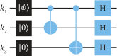
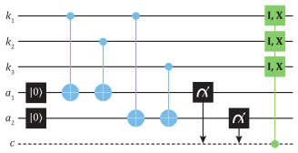
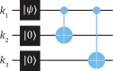
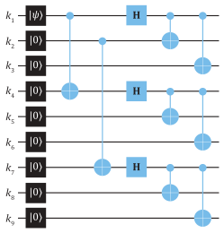
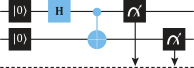
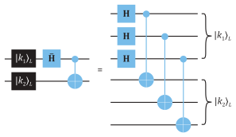
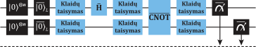
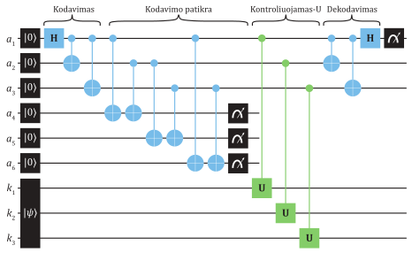
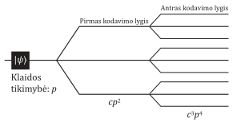

# Kvantinių klaidų aptikimas ir taisymas

Klaidų taisymas iš pirmo žvilgsnio neatrodo itin estetiškas ar įdomus
užsiėmimas. Tačiau kvantinėje kompiuterijoje tai yra viena iš labiausiai
apšviečiančių ir stebinančių sričių. Dekoherencija yra artimai susijusi
su mus supančių klasikinių reiškinių atsiradimu iš pasaulio, kuris
fundamentaliai vadovaujasi kvantinėmis taisyklėmis. Dekoherencija --
pagrindinė priežastis, kuri neleidžia realizuoti makroskopinio dydžio
objektų, esančių superpozicijos būsenose. Atliekant klaidų analizę ir
taisymą taip pat geriau atsiskleidžia gili informacijos sąvokos reikšmė
ir kvantinio supynimo svarba. Informacijos atskleidimas gali sugriauti
sistemos superpozicijos būseną net ir tada, jeigu su šia sistema nėra
tiesioginės sąveikos.

## Klasikinės ir kvantinės klaidos

Kvantinė kompiuterija pasikliauja delikačiomis kubitų superpozicijos
būsenomis. Praktikoje kubitai nėra idealiai izoliuoti nuo aplinkos, jų
neišvengiama sąveika su išorinėmis sistemomis mažina gebėjimą išlikti
superpozicijos būsenose ilgą laiką. Pirmame skyriuje minėtos $T_1$ ir $T_2$
dekoherencijos trukmės atspindi, kaip intensyviai išorinės sąveikos
vyksta su kubitais, taip pat įvardija laiko skalę, pagal kurią galima
spręsti, kiek loginių operacijų įmanoma atlikti iki tol, kol neatsiras
didelė klaidų tikimybė. Dekoherencija nėra vienintelis klaidų
šaltinis -- atliekamų loginių vartų netikslumai taip pat praktiškai
neišvengiami. Unitariosios operacijos yra nusakomos tolydžiai
kintančiais parametrais, todėl praktikoje atsiremiama į ribotą loginių
vartų tikslumą. Nepaisant šių klaidų šaltinių, pageidaujamo tikslumo bei
ilgumo kvantiniai skaičiavimai gali būti atlikti pasitelkiant klaidų
taisymo algoritmus. Tam yra reikalaujama, kad dekoherencijos trukmės
nebūtų per daug trumpos, o loginių vartų netikslumai -- per daug dideli.
Tada pasitelkus papildomus išteklius -- kubitus ir logines operacijas --
galima formaliai pasiekti klaidoms atsparius skaičiavimus. Šiame procese
klaidos yra taisomos dinaminėje situacijoje viso skaičiavimo proceso
metu. Žinoma, kvantines būsenas norima apsaugoti ir statinėse
situacijose -- siunčiant kubitus kvantiniais ryšiais ar saugant
kvantinio kompiuterio atmintyje. Kaip matysime, panašūs principai yra
taikomi abiem situacijoms.

Šiuolaikiniai klasikiniai kompiuteriai yra itin atsparūs skaičiavimo
klaidoms ir šiuo atžvilgiu gali būti traktuojami kaip esantys be
trūkumų. Klaidos turi didesnę tikimybę atsirasti siunčiant skaitmeninę
informaciją komunikacijos kanalais ir ją užrašant į atmintį. Klaidų
atsiradimas daugeliu atvejų yra nenuspėjamas (formaliau -- stochastinis)
ir šnekamojoje kalboje vadinamas **triukšmu** (angl. *noise*).
Pagrindinis principas norint užtikrinti, kad esant triukšmui informacija
nebus prarasta, yra pasitelkti papildomą, vadinamąją perteklinę
informaciją. Jeigu dalis
informacijos ir yra prarandama, perteklinė informacija padeda
užtikrinti, kad informacijos turinys bus sėkmingai atstatytas. Šį
principą taiko ir žmonės tarpusavio komunikacijoje, kai paprašoma
pakartoti gerai neišgirstą sakinį. Kaip to pavyzdį kompiuterijoje
imkime, kad Agnė ketina nusiųsti Benui informaciją dvejetainiu pavidalu
naudodama triukšmingą komunikacijos kanalą, kuriame triukšmo efektas yra
kiekvieną bitą apversti ($0 \leftrightarrow 1)$ su tikimybe $p$
($0 \leq p \leq 1$), nepriklausomai nuo kitų bitų verčių. Tad tikimybė,
kad bus gautas teisingas bitas, yra $1 - p$. Siekdama apsaugoti
dvejetainę informaciją, Agnė kiekvieną turinio bitą prieš siuntimą
pakeičia trimis identiškais bitais: $0 \rightarrow 000$,
$1 \rightarrow 111$. Šios 0 ir 1 trijų bitų sekos yra formaliai
vadinamos loginiais 0 ir 1 bitais, o pasirinktas specifinis būdas
perteikti bitų vertėms vadinamas kodu. Benas, žinodamas Agnės kodavimo
būdą ir taikydamas **daugumos balsavimo metodą** (angl. *majority
voting*), gavęs bitų seką gali nuspręsti, koks bitas jam buvo siųstas.
Pavyzdžiui, jeigu gauta seka yra 001, daugumos balso principu jis
nusprendžia, kad įvyko klaida trečiajame bite ir buvo siųsta $000$. Toks
trijų bitų kodavimo būdas bus sėkmingas, jeigu kode atsiranda ne daugiau
nei viena klaida. Galima nesunkiai parodyti, kad bendra tikimybė,
nusakanti, jog įvyks nepataisoma dviejų ar trijų bitų apvertimo klaida,
yra $3p^2 (1 - p) + p^3$. Tad palyginus su $p$, kai siunčiamas
pavienis bitas, trijų bitų kodas sumažina nepataisomų klaidų tikimybę,
jeigu $p < 0.5$, ir suteikia sparčiai didėjantį pranašumą toliau
mažėjant $p$.

Klasikiniuose klaidų taisymo koduose yra taikomas bitų kopijavimas
pridedant perteklinę informaciją, o siekiant klaidas aptikti ir jas
taisyti bitų sekos yra tiesiogiai nuskaitomos. Akivaizdu, kad abu šie
procesai negali būti pritaikomi kvantiniam kompiuteriui ir kvantiniams
ryšiams. Bendrosios kvantinės būsenos neįmanoma nukopijuoti, o tokios
būsenos tiesioginis nuskaitymas sugriauna superpoziciją ir joje laikomą
informaciją. Be to, bitų apvertimas yra vienintelė galima klaida
klasikinėje terpėje; o štai kvantinių klaidų įvairovė yra didesnė, nes
klaidos kinta tolydžiai dėl analoginio kvantinių būsenų pobūdžio.
Pavyzdžiui, 1 kubito būseną $|\psi\rangle$ nusakome
Blocho vektoriumi, kuris apibūdinamas dviem tolydžiais parametrais,
nurodančiais kampus. Jeigu loginiais vartais norima pasukti šį vektorių,
sakykime, apie $x$ ašį kampu $\theta$, tačiau gaunamas
$\theta + \varepsilon$, netikslumas $\varepsilon$ yra viena galima
klaida. Tai galima formaliai užrašyti dviem unitariaisiais operatoriais,
veikiančiais kubitą paeiliui:
\begin{equation}
ER_x(\theta)|\psi\rangle = \mathrm{e}^{-\mathrm{i}\varepsilon X/2}\mathrm{e}^{-\mathrm{i}\theta X/2}|\psi\rangle\,.
(\#eq:posukis-klaida)
\end{equation}
Čią $R_x(\theta) = \mathrm{e}^{-\mathrm{i}\theta X/2}$ nusako tikslią operaciją, o po
jos rašomas klaidos operatorius $E = \mathrm{e}^{-\mathrm{i}\varepsilon X/2}$.
Nepageidaujamos išorinės sąveikos taip pat gali įvesti šias klaidas.
Įsivaizduokime vėl, kad sąveikos efektas yra pasukti Blocho vektorių
aplink *x* ašį kampu $\varepsilon$, kai pradinė kubito būsena yra
$|0 \rangle$. Siekiant supaprastinti simboliką, toliau
minuso ženklą ir faktorių 2 įtrauksime į $\varepsilon$. Randame paveiktą
būseną:
\begin{equation}
\mathrm{e}^{\mathrm{i}\varepsilon X}|0\rangle
= \big\lbrack\cos(\varepsilon)I + \mathrm{i}\sin(\varepsilon)X\big\rbrack|0\rangle
= \cos(\varepsilon)|0\rangle + \mathrm{i}\sin(\varepsilon)|1\rangle\,.
(\#eq:paveikta-busena)
\end{equation}
Tai formaliai nusako nepaveiktos būsenos $|0\rangle$ ir
klaidingos būsenos $|1\rangle$ superpoziciją. Tikimybė,
kad atlikus matavimą kubitas bus rastas būsenose
$|0\rangle$ arba $|1\rangle$, kai
$\varepsilon$ yra itin mažas, tampa:
\begin{align}
p\big(|0\rangle\big) = & \cos^2(\varepsilon) \approx 1 - \varepsilon^2\,; (\#eq:tikimybe-0)\\
p\big(|1\rangle\big) = & \sin^2(\varepsilon) \approx \varepsilon^2\,.(\#eq:tikimybe-1)
\end{align}
Jeigu ši sąveika, ar loginių vartų paklaida, įvyktų sistemiškai
$n$ kartų, tada tikimybės būtų atitinkamai $1 - (n\varepsilon)^2$ ir
$(n\varepsilon)^2$. Itin mažos paklaidos skaičiavimo metu gali būti
toleruotinos, nes tikimybė rasti klaidingą būseną bus itin maža. Tačiau
dideliuose algoritmuose, tokiuose kaip atliekant Šoro pirminių skaičių
faktorizavimą, loginių vartų skaičius gali siekti $\sim 10^{10}$ ir daugiau.
Loginių vartų paklaida $\varepsilon$ atitinkamai turi būti mažesnė nei
$\sim 10^{-10}$. Šios knygos rašymo metu loginių vartų tikslumas
siekia $\sim 10^{-4}$, tad klaidų taisymo algoritmai
yra pageidautini.

Kvantinis supynimas ir su juo įvedamos koreliacijos klaidų taisymo
algoritmuose dar kartą iliustruoja ypatingą šio ištekliaus svarbą.
Nepaisant klaidų analoginio pobūdžio ir begalinio tikslumo norint jas
apibūdinti, šis išteklius užtikrina, kad reikia taisyti tik diskrečias
trijų tipų klaidas. Kitaip tariant, kvantinėje kompiuterijoje klaidos
yra efektyviai skaitmenizuojamos. Pirmojo tipo klaida yra, kaip ir
klasikinėje skaitmeninėje kompiuterijoje, vadinama **bito apvertimo
klaida** (angl. *bit-flip error*), kuri sukeičia kubito būsenas
$|0\rangle \leftrightarrow |1\rangle$.
Kubito apvertimo klaidos procesas yra nusakomas Pauli-$X$ operatoriumi,
kuris veikdamas bendrą superpozicijos būseną turi efektą:
\begin{equation}
X\big(a|0\rangle + b|1\rangle\big) = a|1\rangle + b|0\rangle\,.
(\#eq:kubito-apvertimo-klaida)
\end{equation}
**Fazės apvertimo klaida** (angl. *phase-flip error*) yra išskirtinai
kvantinio pobūdžio, nes klasikinėje kompiuterijoje fazės atitikmens
nėra. Fazės apvertimo klaidos atsiradimas yra nusakomas Pauli-$Z$
operatoriumi:
\begin{equation}
Z\big(a|0\rangle + b|1\rangle\big) = a|0\rangle - b|1\rangle\,.
(\#eq:fazes-klaida)
\end{equation}
Matyti, kad santykinė fazė tarp $|0\rangle$ ir
$|1\rangle$ kubito būsenų yra pakeičiama. Galiausiai, bito ir fazės
apvertimo klaidų kombinacija, $XZ$, yra trečia galima klaida. Primename
Pauli operatorių sąryšį $XZ = -\mathrm{i}Y$. Tad šių dviejų klaidų kombinaciją
iki globalios fazės galime išreikšti Pauli-$Y$ loginiais vartais:
\begin{equation}
-\mathrm{i}Y\big(a|0\rangle + b|1\rangle\big) = a|1\rangle - b|0\rangle\,.
(\#eq:kombinuota-klaida)
\end{equation}

## Kvantinis supynimas su aplinka ir klaidų atsiradimas {#supynimas-ir-klaidu-atsiradimas}

Loginių vartų netikslumai po kiekvieno jų pritaikymo gali įvesti
tolydžiai kintančias klaidas. Sistemiškai atsirandančios vienodo tipo
klaidos yra lengviau aptinkamos bei ištaisomos, na, o kintančios
atsitiktiniu būdu įveda triukšmo pobūdį. Tačiau, net ir palikus kubitus
ramybėje, jų būsenos gali būti paveikiamos nekontroliuojamų sąveikų su
išorinėmis sistemomis. Bendrą kubitų ir aplinkos kvantinę sistemą visada
galime apibūdinti kaip naują išplėstinę sistemą, kuri kinta laike
deterministiškai vadovaujantis Šriodingerio lygtimi. Tačiau dėl
informacijos apie įvykusias sąveikas trūkumo mūsų požiūriu bus stebimi
atsitiktiniai, triukšmo pobūdžio, kubitų būsenų pokyčiai. Dėl sąveikų
tarp kvantinių sistemų bendroje situacijoje atsiranda supynimas.
Siekdami iliustruoti supynimo įtaką imkime paprastą pavyzdį, kuriame
kubitas yra paruoštas pradinėje superpozicijos būsenoje:
\begin{equation}
|\psi\rangle = \frac{1}{\sqrt{2}}\big(|0\rangle + |1\rangle\big)\,.
(\#eq:superpozicija-klaidoms)
\end{equation}
Jeigu atliksime šiai būsenai (idealiai veikiančius) Hadamardo loginius
vartus, ji taps
$H|\psi\rangle = |0\rangle$. Tad
išmatavus kubito būseną su $p = 1$ tikimybe rasime
$|0\rangle$. Sakykime, kad prieš atliekant $H$ kubitas
patyrė sąveiką $U$ su aplinkos sistema $|e\rangle$, ir
tai lėmė jų kvantinį supynimą ir bendrą būseną:
\begin{equation}
U|\psi\rangle\otimes|e\rangle
= \frac{1}{\sqrt{2}}\big(|0\rangle\otimes|e_1\rangle + |1\rangle\otimes|e_2\rangle\big)\,.
(\#eq:busena-saveika-aplinka)
\end{equation}
Čia $|e_0\rangle$ ir $|e_1\rangle$
yra aplinkos sistemos būsenos. Nežinodami apie įvykusią sąveiką,
atliekame kubitui Hadamardo vartus:
\begin{equation}
H\otimes I\big(U|\psi\rangle\otimes|e\rangle\big)
= \frac{1}{2}\big(|0\rangle + |1\rangle )\otimes|e_1\rangle
+ \frac{1}{2}\big(|0\rangle - |1\rangle )\otimes|e_2\rangle\big)\,.
(\#eq:h-po-saveikos)
\end{equation}
Matome, kad kvantinis supynimas neleidžia panaikinti kubito būsenos
$|1\rangle$, kaip tai atsitinka dėl interferencijos
$H|\psi\rangle$. Tolesniame žingsnyje vėl išmatuojame
kubito būseną, tikimybės $p(0)$ ir $p(1)$ rasti
$|0\rangle$ ir $|1\rangle$ yra:
\begin{align}
p(0) = & \frac{1}{4}\big(\langle e_1 | e_1 \rangle + \langle e_2 | e_2 \rangle
+ \langle e_1 | e_2 \rangle + \langle e_2 | e_1 \rangle\big) \nonumber\\
= & \frac{1}{4}\big(\langle e_1 | e_1 \rangle + \langle e_2 | e_2 \rangle
+ 2\mathrm{Re}\lbrack \langle e_1 | e_2 \rangle\rbrack\big)\,;(\#eq:tikimybe-0-po-saveikos)\\
p(1) = & \frac{1}{4}\big(\langle e_1 | e_1 \rangle + \langle e_2 | e_2 \rangle
- 2\mathrm{Re}\lbrack \langle e_1 | e_2 \rangle\rbrack\big)\,.(\#eq:tikimybe-1-po-saveikos)
\end{align}
Norėdami įvertinti šias tikimybes, turime daugiau pasakyti apie išorinę
sistemą. Darydami prielaidą, kad ji yra normuotoji, o būsenos
ortogonaliosios, $\langle e_1 | e_2 \rangle = 0$,
randame $p(0) = p(1) = 1/2$. Tai nusako lygias tikimybes rasti
$|0\rangle$ arba $|1\rangle$ pamatavus
sistemos kubito būseną. Todėl nežinant apie įvykusią sąveiką ir kvantinį
supynimą mūsų požiūriu atrodys, kad kubito būsena tampa visiškai
atsitiktinė, o ne $|0\rangle$, kaip tikėtasi.
Informacija, koduojama bendrosios būsenos amplitudėse, tampa efektyviai
nebepasiekiama, nes yra delokalizuojama koreliacijose tarp aplinkos ir
kubito. Sąveikos su aplinka priveda kvantines sistemas prie
dekoherencijos, dėl kurios jos panašėja į klasikines triukšmingas
sistemas.

Norėdami aiškiau pamatyti, kaip atsiranda trys minėtos Pauli
operatoriais nusakomos kubitų būsenų klaidos, imkime bendriausio tipo
unitariąją transformaciją $U$, veikiančią kubito ir aplinkos kvantinę
sistemą. Ji nebūtinai apibūdinama dviem skirtingomis būsenomis, kaip
kubitai, bet gali turėti jų daug daugiau. Transformacijos įtaka kubito
standartiniams baziniams vektoriams ir aplinkos pradinei būsenai
$|e\rangle$ išreiškiama taip:
\begin{align}
U|0\rangle\otimes|e\rangle = & |0\rangle\otimes|e_1 \rangle + |1\rangle\otimes|e_2 \rangle\,;(\#eq:u-0-e) \\
U|1\rangle\otimes|e\rangle = & |0\rangle\otimes|e_3 \rangle + |1\rangle\otimes|e_4 \rangle\,.(\#eq:u-1-e)
\end{align}
Bendroje situacijoje, aplinkos sistemos būsena, kuri dalyvavo sąveikoje,
gali būti nenormuotoji ir skirtingi $|e_i \rangle$
tarpusavyje neortogonalūs,
$\langle e_i | e_j \rangle \neq 0$. Imkime bendrą
kubito būseną
$|\psi\rangle = a|0\rangle + b|1\rangle$,
tada randame:
\begin{equation}
\begin{aligned}
U|\psi\rangle\otimes|e\rangle
= & a\big(|0\rangle\otimes|e_1 \rangle + |1\rangle\otimes|e_2 \rangle\big)
+ b\big(|0\rangle\otimes|e_3 \rangle + |1\rangle\otimes|e_4 \rangle\big) \\
= & \frac{1}{2}\Big\lbrack\big(a|0\rangle + b|1\rangle\big)
\otimes\big(|e_0 \rangle + |e_3 \rangle\big)
+ \big(a|1\rangle + b|0\rangle\big)
\otimes\big(|e_1 \rangle + |e_2 \rangle\big) \\
& + \big(a|0\rangle - b|1\rangle\big)
\otimes\big(|e_0 \rangle - |e_3 \rangle\big)
+ \big(a|1\rangle - b|0\rangle\big)
\otimes\big(|e_1 \rangle - |e_2 \rangle\big)\Big\rbrack\,.
\end{aligned}
(\#eq:bendra-situacija-saveika-su-aplinka)
\end{equation}
Antroje eilutėje pergrupavome būsenas siekdami parodyti, kad kubito
sąveika su aplinka gali būti išreikšta Pauli operatoriais, veikiančiais
kubito superpozicijos būseną:
\begin{equation}
U|\psi\rangle\otimes|e\rangle
= I|\psi\rangle\otimes|e_I \rangle + X|\psi\rangle\otimes|e_x \rangle
+ Z|\psi\rangle\otimes|e_z \rangle + XZ|\psi\rangle\otimes|e_{xz}\rangle\,.
(\#eq:saveika-su-aplinka-pauli)
\end{equation}
Aplinkos būsenas pervadinome taip:
\begin{equation}
\begin{aligned}
|e_I \rangle = & \frac{\big(|e_0 \rangle + |e_3 \rangle\big)}{2}\,,\quad
|e_x \rangle = \frac{\big(|e_1 \rangle + |e_2 \rangle\big)}{2}\,,\\
|e_z \rangle = & \frac{\big(|e_0 \rangle - |e_3 \rangle\big)}{2}\,,\quad
|e_{xz}\rangle = \frac{\big(|e_1 \rangle - |e_2 \rangle\big)}{2}\,.
\end{aligned}
(\#eq:aplinkos-busenos)
\end{equation}
Matome, kad aplinkos ir kubito sistema tampa supintąja. Pirmoji
superpozicijoje būsena
$I|\psi\rangle\otimes|e_I \rangle$
įvardija nepakitusią kubito pradinę būseną. Kubito apvertimo klaida yra
nusakoma nariu
$X|\psi\rangle\otimes|e_x \rangle$,
o štai fazės klaida, taip pat fazės ir kubito apvertimo klaidų
kombinacija nusako būsenas
$Z|\psi \rangle\otimes|e_z \rangle$
ir
$XZ|\psi \rangle\otimes|e_xz \rangle$,
atitinkamai. Tai neturėtų būti stebinantis rezultatas, kadangi visos
$(2 \times 2)$ dydžio unitariosios matricos, nusakančios visas įmanomas
1 kubito būsenų transformacijas, gali būti išreikštos Pauli matricų
$\{I, X, Y, Z\}$ tiesinėmis kombinacijomis.

## Bito apvertimo klaidos aptikimas ir taisymas

Darome prielaidą, kad klaidos atsiranda kiekviename registro kubite
atskirai nuo kitų kubitų. Tai yra vadinamosios nekoreliuotos triukšmo
pobūdžio klaidos. Formaliai sakysime, kad klaidos atsiranda siunčiant
kvantines būsenas per **triukšmingą kvantinį kanalą** (angl. *noisy
quantum channel*). Tai gali įvardyti kubitų siuntimą kvantiniais ryšiais
arba kubitų laiko evoliuciją tam tikru laiko intervalu kvantiniame
kompiuteryje. Kubitas nukeliauja kanalą nepaveiktas su tikimybe $1 - p$
ir patiria klaidą su tikimybe $p$. Šioje stadijoje taip pat darome
prielaidą, kad loginiai vartai veikia idealiai, be netikslumų. Dinaminę
klaidų taisymo metodologiją, apimančią dekoherencijos ir loginių vartų
efektus kartu, aptariame šio skyriaus pabaigoje.

Kvantinių klaidų taisymo algoritmai yra dažnai pristatomi pradedant nuo
3 kubitų kodų, skirtų taisyti bito apvertimo arba fazės apvertimo
klaidas. Pavieniui jie nėra pilnieji kodai, galintys ištaisyti visas
klaidų kombinacijas, tačiau leidžia pamatyti esminius klaidų aptikimo ir
taisymo principus. Šių dviejų kodų sujungimu **konkatenacijos būdu**
(angl. *concatenation*) yra pagrįstas Šoro 9 kubitų kodas -- vienas iš
pirmųjų gebantis ištaisyti bendrojo tipo klaidas.

Kaip ir klasikiniame bito apvertimo klaidos pavyzdyje, loginis kubitas
yra sudaromas iš trijų fizinių kubitų. Vieno kubito būsena
$|\psi\rangle$ yra perteikiama loginiu kubitu
$|\psi\rangle_L$ taip:
\begin{equation}
|\psi\rangle = a|0\rangle + b|1\rangle
\rightarrow |\psi\rangle_L = a|0\rangle_L + b|1\rangle_L
= a|000\rangle + b|111\rangle\,.
(\#eq:loginis-kubitas-is-fiziniu)
\end{equation}
Būsenos yra normuotosios,
$|a|^2 + |b|^2 = 1$, o 1 kubito baziniai vektoriai koduojami
$|0\rangle\rightarrow |000\rangle$,
$|1\rangle \rightarrow |111\rangle$.
Atkreipiame dėmesį, kad loginiame kubite
$|\psi\rangle_L$ baziniai vektoriai yra
„patrigubinami", tačiau $|\psi\rangle$ būsena nėra
nukopijuojama tris kartus,
$|\psi\rangle\otimes|\psi\rangle\otimes|\psi\rangle$,
ir todėl neprieštarauja uždraustojo kopijavimo teoremai. Loginis kubitas
$|\psi\rangle_L$ nusako supintąją trijų fizinių kubitų
kvantinę būseną, kurią galima sukurti pradedant nuo kubito
$|\psi\rangle$ būsenoje ir dviejų papildomų kubitų
$|00\rangle$ būsenoje atliekant dvejus $CNOT$ loginius
vartus.

```{r loginio-kubito-paruosimas, echo=FALSE, fig.cap='Loginio kubito būsenos $|\\psi\\rangle_L$ paruošimas naudojant 3 fizinius kubitus', out.width='40%', fig.align='center'}

```

Visi trys fiziniai kubitai, formuojantys loginį kubitą, gali būti
paveikti triukšmo; tad šis kodas bus veiksmingas, jeigu bito apvertimo
klaida atsiranda ne daugiau nei viename iš trijų kubitų. Toliau
pažiūrėkime, kaip aptikti atsirandančią bito apvertimo klaidą loginiame
kubite.

Tiesioginiai 3 kubitų būsenų matavimai nėra išeitis aptikti ir taisyti
klaidas. Sakykime, kad atsiranda klaida pirmajame kubite, kuri pakeičia
$|\psi\rangle_L$ būseną taip:
\begin{equation}
|\psi\rangle_L \rightarrow a|100\rangle + b|011\rangle\,.
(\#eq:bito-apvertimo-klaida-loginiame-kubite)
\end{equation}
Atlikę Pauli-$Z$ matavimus su visais 3 kubitais rastume
$|100\rangle$ arba $|011\rangle$ būsenas
su $|a|^2$ ir $|b|^2$ tikimybėmis, atitinkamai. Tai užtikrintų
klaidos aptikimą, tačiau superpozicija bus sugriauta, o negalėdami
sužinoti $a$ ir $b$ amplitudžių šios būsenos nebeatstatysime. Aptikti
klaidas 3 kubitų kode galima pritaikius vadinamąjį nelokalų matavimą,
pasitelkiant papildomus ancila kubitus. Atkreipiame dėmesį, kad abu
kodai $|0\rangle_L$ ir $|1\rangle_L$
yra $Z\otimes Z\otimes I$, $Z\otimes I\otimes Z$ ir
$I\otimes Z\otimes Z$ operatorių tikriniai vektoriai su vienodomis
tikrinėmis vertėmis $\lambda = 1$. Pavyzdžiui,
$Z\otimes Z\otimes I|0 \rangle_L = |0\rangle_L$
ir
$Z\otimes Z\otimes I|1\rangle_L = |1\rangle_L$.
Tokį dėsningumą matome iš to, kad Pauli-$Z$ operatoriai tenzorinėje
operatorių sandaugoje, veikdami pavienių kubitų būsenas
$|0\rangle$ ir $|1\rangle$ jas sudaugina
su $\lambda = 1$ ir $\lambda = -1$ tikrinėmis vertėmis, atitinkamai.
Tad $Z\otimes Z\otimes I$ veikdamas pirmąjį ir antrąjį kubitus
$|000\rangle$ ir $|111\rangle$ būsenose,
arba jų superpozicijoje, sudaugina bendrą būseną su
$\lambda_1 \lambda_2 = 1$. Tačiau, jeigu vienas iš šių dviejų kubitų
patyrė bito apvertimo klaidą, tada jų būsenos skirsis, o tikrinių verčių
sandauga taps $\lambda_1 \lambda_2 = -1$. Siekiant nustatyti,
kuriame iš trijų kubitų įvyko klaida, pakanka atlikti du matavimus
$Z\otimes Z\otimes I$ ir $Z\otimes I\otimes Z$, arba bet
kurią iš kitų dviejų porų kombinacijos. Pavyzdžiui, jeigu
$Z\otimes Z\otimes I$ ir $Z\otimes I\otimes Z$ matavimų
tikrinės vertės yra abi
$\lambda_1 \lambda_2 = \lambda_1 \lambda_3 = -1$, galime
unikaliai konstatuoti, kad įvyko klaida pirmajame kubite. Kitos dvi
galimybės $\lambda_1 \lambda_2 = -1$ ir $\lambda_1 \lambda_3 = 1$
bei $\lambda_1 \lambda_2 = 1$ ir $\lambda_1 \lambda_3 = -1$
indikuoja klaidą antrajame ir trečiajame kubite, atitinkamai. Kvantinė
grandinė \@ref(fig:bito-apvertimo-taisymo-grandine) pav. iliustruoja bito
apvertimo klaidos aptikimą ir taisymą.

```{r bito-apvertimo-taisymo-grandine, echo=FALSE, fig.cap="Bito apvertimo klaidos aptikimą ir taisymą atliekanti grandinė", out.width='81%', fig.align='center'}

```

Siekdami atlikti $Z\otimes Z\otimes I$ ir
$Z\otimes I\otimes Z$ operatorių matavimus panaudojame papildomus
ancila kubitus, inicializuotus pradinėje $|00\rangle$
būsenoje. Keturi $CNOT$ vartai su ancila adresatiniais kubitais nusako
aptikimo stadiją, kuri yra pagrįsta dviejų kubitų lyginumo nustatymu.
Matome, kad $Z\otimes Z\otimes I$ matavimas realizuojamas keičiant
pirmosios ancilos $a_1$ būseną. Esant skirtingoms kubitų $k_1$ ir
$k_2$ būsenoms, ji tampa
$|a_1 \rangle = |k_1\oplus k_2 \rangle$;
čia $\oplus$ yra $\mod(2)$ bitų sudėtis. Tad, jeigu
$|k_1 \rangle = |k_2 \rangle$, tada
$|a_1 \rangle = |0 \rangle$, ir tai
atitinka tikrinę vertę $\lambda_1 \lambda_2 = 1$, indikuojančią
lyginį lyginumą. Jeigu $|k_1 \rangle\neq |k_2 \rangle$, tada
$|a_1 \rangle = |1\rangle$, ir tai
nusako tikrinę vertę $\lambda_1 \lambda_2 = -1$ bei nelyginį
lyginumą. Operatoriaus $Z\otimes I\otimes Z$ matavimas yra
analogiškai užrašomas keičiant antrosios ancilos būseną
$|a_2 \rangle = |k_1\oplus k_3 \rangle$.
Užbaigiant aptikimo stadiją, bendra loginio kubito ir ancilų su klaida
pirmajame fiziniame kubite būsena tampa:
\begin{equation}
|\psi\rangle_L \rightarrow \big(a|100\rangle + b|011\rangle\big)\otimes|11\rangle\,.
(\#eq:bendra-loginio-ancilos-busena)
\end{equation}
Atkreipiame dėmesį, kad ancilos ir loginio kubito būsena yra
faktorizuojamoji, todėl ancilų kubitų matavimo procesas neturi įtakos
loginio kubito būsenai. Ancilų kubitų būsenos yra išmatuojamos, ir tai
leidžia aptikti įvykusią klaidą. Čia svarbu atkreipti dėmesį, kad kode
atlikti nelokalūs matavimai suteikia informaciją apie koreliacijas tarp
dviejų būsenų, nusakančią, ar jos vienodos, ar skirtingos (lyginumas).
Šios informacijos pakanka klaidų nustatymui neatskleidžiant loginio
kubito būsenos amplitudžių $a$ ir $b$. Jų atskleidimas sugriautų
superpoziciją ir joje laikomą informaciją.

Būsena po klaidos sindromo nustatymo                    Tikimybė rasti šią būseną
------------------------------------------------------  -------------------------
$\big(a|000\rangle+b|111\rangle\big)\otimes|00\rangle$  $(1-p)^3$
$\big(a|100\rangle+b|011\rangle\big)\otimes|11\rangle$  $p(1-p)^2$
$\big(a|010\rangle+b|101\rangle\big)\otimes|10\rangle$  $p(1-p)^2$
$\big(a|001\rangle+b|110\rangle\big)\otimes|01\rangle$  $p(1-p)^2$
$\big(a|110\rangle+b|001\rangle\big)\otimes|01\rangle$  $p^2(1-p)$
$\big(a|101\rangle+b|010\rangle\big)\otimes|10\rangle$  $p^2(1-p)$
$\big(a|011\rangle+b|100\rangle\big)\otimes|11\rangle$  $p^2(1-p)$
$\big(a|111\rangle+b|000\rangle\big)\otimes|00\rangle$  $p^3$
------------------------------------------------------  -------------------------

Table: (\#tab:klaidos-sindromai) Faktorizuojamosios loginio kubito ir 2-jų ancilų kubitų būsenos, kurios indikuoja klaidos sindromą loginiame kubite. Tikimybės dešinėje nurodo rasti atitinkamas būsenas naudojant 3 kubitų bito apvertimo klaidos taisymo kodą. Pirma būsena lentelėje atitinka nepaveiktą, kitos trys nusako bito klaidą viename iš trijų fizinių kubitų. Dar kitos trys būsenos nusako būsenas su dviem bito klaidomis skirtinguose kubituose, paskutinioji -- su bito klaidomis visuose trijuose.

Visos įmanomos ancilų kubitų būsenos, šiuo
atveju keturios skirtingos, yra vadinamos **klaidos sindromais**
(angl. *error syndrome*). \@ref(tab:klaidos-sindromai) lentelė nusako visas apvertimo
klaidas kartu su atitinkamomis būsenomis ir tikimybėmis šią būseną
rasti.

Pagal sindromo būseną, yra pritaikomi Pauli-$X$ loginiai vartai
pažeistam kubitui ir taip ištaisoma bito apvertimo klaida:
$|11\rangle\rightarrow X\otimes I\otimes I$,
$|10\rangle\rightarrow I\otimes X\otimes I$,
$|01\rangle\rightarrow I\otimes I\otimes X$,
tačiau nieko nedaroma radus
$|00\rangle\rightarrow I\otimes I\otimes I$. Tai
atliekama naudojant parodytus klasiškai kontroliuojamus loginius vartus,
pritaikytus pažeistam kubitui. Šio algoritmo pabaigoje, pagal
skaičiavimų paskirtį, galima atlikti dekodavimo žingsnį
$|\psi\rangle_L \rightarrow |\psi\rangle\otimes|00\rangle$,
kuris panaikina loginį kubitą ir palieka vieną fizinį kubitą
$|\psi\rangle$ būsenoje. Tai yra atliekama naudojant
kodavimo loginių vartų seką atvirkštine tvarka. Toliau panagrinėkime šio
3 kubitų kodo efektyvumą.

Tikimybė, kad trys pavieniai kubitai, nusiųsti per triukšmingą kvantinį
kanalą, neįgaus klaidos, yra $(1 - p)^3$. O štai kiekviena iš
būsenų, turinčių vieną klaidą, yra randama su tikimybe $p(1 - p)^2$,
būsenos su dviem klaidomis yra $p^2(1 - p)$, ir $p^3$ su trimis.
Sindromą nusakančios būsenos pradeda kartotis atsiradus dviem ir daugiau
klaidų. Tačiau dviejų ir trijų klaidų tikimybė yra daug mažesnė, jeigu
$p$ yra itin mažas. Bendra tikimybė, kad pateiktas trijų kubitų kodas
neveiks, yra visų kubitų dviejų ir trijų klaidų tikimybių suma
$3p^2(1 - p) + p^3$, ir tai galima palyginti su tikimybe $p$, kai
nėra naudojamas klaidų taisymo kodas. Pavyzdžiui, kai $p = 0.1$,
nepataisomos klaidos tikimybė trijų kubitų kode yra $10^2$ kartų mažesnė,
o kai $p = 0.01$, ji yra $10^4$ mažesnė. Šios tikimybės susilygina
kai $p = 0.5$, todėl, kaip ir klasikiniame pavyzdyje, trijų kubitų
taisymo metodas suteiks pranašumo prieš pavienio kubito siuntimą
triukšmingu kanalu, jeigu $p < 0.5$.

## Fazės apvertimo klaidos aptikimas ir taisymas

Bito ir fazės klaidų aptikimas ir taisymas yra glaudžiai susijęs.
Surinksime visą informaciją siekdami tai pademonstruoti.
\@ref(kvantiniai-loginiai-vartai-grandines) skyriuje
matėme, kad Pauli-$Z$ loginius vartus galima išreikšti dviejų Hadamardo
ir Pauli-$X$ vartų sandauga, $Z = HXH$ bei $X = HZH$. Hadamardo vartai,
veikdami Pauli-$Z$ bazinius vektorius transformuoja juos į Pauli-$X$
bazinius vektorius:
$H|0\rangle = |0_x \rangle$,
$H|1\rangle = |1_x \rangle$. O pritaikę
šiems Pauli-$Z$ vartus randame:
\begin{equation}
Z|0_x \rangle = |1_x \rangle\,,\quad Z|1_x \rangle = |0_x \rangle\,.
(\#eq:pauli-z-ant-x-busenu)
\end{equation}
Kitaip tariant, fazės apvertimo klaida
$\{|0\rangle , |1\rangle\}$ baziniuose
vektoriuose yra ne kas kita, kaip bito apvertimo klaida
$\{|0_x \rangle , |1_x \rangle\}$
baziniuose vektoriuose. Tai reiškia, kad atitinkamai transformavę
3 kubitų bito apvertimo kodą galime jį panaudoti norėdami aptikti ir
taisyti fazės klaidas.

Siųsdami kubitus per triukšmingą kvantinį kanalą, kuriame atsiranda
fazės klaidos, kubito būseną $|\psi\rangle$ koduojame
dviem žingsniais. Pirmiausia, vėl „patrigubiname" bazinius vektorius:
\begin{equation}
|\psi\rangle = a|0\rangle + b|1\rangle \rightarrow a|000\rangle + b|111\rangle\,.
(\#eq:baziniu-vektoriu-trigubinimas)
\end{equation}
Tolesniame žingsnyje pritaikome Hadamardo transformacijas kiekvienam iš
trijų kubitų:
\begin{equation}
|\psi\rangle_L = H^{\otimes 3}\big(a|000\rangle + b|111\rangle\big)
= a|0_x 0_x 0_x \rangle + b|1_x 1_x 1_x \rangle\,.
(\#eq:h-kiekvienam-is-3)
\end{equation}
\@ref(fig:grandine-loginio-paruosimui) pav. pateikiame grandinę,
iliustruojančią šio loginio kubito paruošimą.

```{r grandine-loginio-paruosimui, echo=FALSE, fig.cap="Loginė grandinė, paruošianti loginį kubitą, skirtą taisyti fazės klaidai", out.width='31%', fig.align='center'}

```

Atsiradusi fazės klaida, pavyzdžiui, pirmajame kodo kubite, pakeis
loginę būseną taip:
\begin{equation}
|\psi\rangle_L \rightarrow a|1_x 0_x 0_x \rangle + b|0_x 1_x 1_x \rangle\,.
(\#eq:fazes-klaida-loginiame-kubite-1)
\end{equation}
Norėdami pritaikyti bito apvertimo klaidos aptikimo ir taisymo
algoritmą, turime pirmiausiai šią būseną transformuoti atgal į
$\{|0\rangle , |1\rangle\}$ bazinius
vektorius. Atlikę Hadamardo transformacijas pažeistai būsenai randame:
\begin{equation}
H^{\otimes 3}\big(a|1_x 0_x 0_x \rangle + b|0_x 1_x 1_x \rangle\big)
= a|100\rangle + b|011\rangle\,.
(\#eq:h-pazeistai-busenai)
\end{equation}
Akivaizdu, kad šis fazės klaidų taisymo kodas turi identiškas
charakteristikas bito apvertimo kodui, tad anksčiau pateikta analizė
tinka ir čia.

##  Tolydžiosios klaidos

Bendroje situacijoje 1 kubito klaidos gali kisti tolydžiai ir yra
nusakomos Blocho vektoriaus posūkio operatoriais $R_x(\theta)$,
$R_y(\theta)$ ir $R_z(\theta)$ aplink $x$, $y$ ir $z$ ašis kampu
$\theta$. Pritaikykime tolydžiąją bito apvertimo klaidą
$R_x(\theta)\otimes I\otimes I$ pirmajam kubitui
$|\psi\rangle_L$ būsenoje 3 kubitų bito apvertimo
taisymo kode:
\begin{equation}
R_{x}(\theta)\otimes I\otimes I|\psi \rangle_L
= \cos(\theta/2)\big(a|000\rangle + b|111\rangle)
- \mathrm{i}\sin(\theta/2)\big(a|100\rangle + b|011\rangle\big)\,.
(\#eq:tolydi-bito-apvertimo-klaida)
\end{equation}
Matome loginio kubito būseną, kuri yra klaidos nepaveiktos ir paveiktos
būsenos superpozicijoje. Kad aptiktume klaidą, vėl galime taikyti
$Z\otimes Z\otimes I$ ir $Z\otimes I\otimes Z$ operatorių
matavimus naudodami identišką grandinę su dviem ancila kubitais. Tai
atlikę randame:
\begin{equation}
\cos(\theta/2)\big(a|000\rangle + b|111\rangle\big)\otimes|00\rangle
- \mathrm{i}\sin(\theta/2)\big(a|100\rangle + b|011\rangle\big)\otimes|11\rangle\,.
(\#eq:tolydzios-klaidos-aptikimo-matavimas)
\end{equation}
Ancilų nusakyta sindromo būsena $|00 \rangle$ yra supinta
su loginio kubito būsena, kuriai neįvyko klaida. O štai
$|11\rangle$ sindromo būsena yra supinta su kubitų
būsena, kuriai įvyko bito apvertimo klaida. Kaip ir anksčiau, darome
prielaidą, kad fizinis kubitas paveikiamas $R_x(\theta)$ klaidos
nepriklausomai nuo kitų kubitų su tikimybe $p$. Atlikę ancilų kubitų
būsenų matavimą galime rasti sindromą $|00\rangle$ su
tikimybe $p\cos^2(\theta/2)$, dėl kurio loginio kubito būsena lieka
nepažeista
$|\psi \rangle_L = a|000\rangle + b|111\rangle$.
Sindromo būsena $|11\rangle$ randama su tikimybe
$p\sin^2(\theta/2)$, o po matavimo loginio kubito būsena tampa
$X\otimes I\otimes I|\psi\rangle_L = a|100\rangle + b|011\rangle$;
tai nusako bito apvertimo klaidą.

Klaidų tolydumą nusakantis faktorius $\theta$ atsiranda šalia
amplitudžių ir paveikia tik tikimybes rasti pažeistą ir nepažeistą
būsenas. Šiuo atveju, tikimybė rasti pažeistą būseną tampa
$p \rightarrow p\sin^2(\theta/2)$. Atlikus ancilų kubitų matavimus $\theta$
faktorius iškrinta, o bendra loginių kubitų ir ancilų būsena lieka
faktorizuojamoji. Radus
$|a_1 a_2 \rangle = |00\rangle$
sindromą imtis veiksmų nereikia, o štai radus
$|a_1 a_2 \rangle = |11\rangle$
pritaikomi $X\otimes I\otimes I$ loginiai vartai, ištaisantys
klaidą pirmame kubite
$(X\otimes I\otimes I)(X\otimes I\otimes I)|\psi\rangle_L \otimes|11\rangle
= |\psi\rangle_L \otimes|11\rangle$.

Tai savo ruožtu demonstruoja itin svarbų teiginį, kad kvantinės klaidos
gali būti efektyviai diskretizuojamos, nors pačios būsenos gali kisti ir
tolydžiai. Tie patys metodai, taikomi taisyti diskrečiosioms kvantinėms
klaidoms, kurių yra tik trys rūšys {$X$, $Y$, $Z$}, kartu ištaiso ir
tolydžias klaidas.

## Bendrieji klaidų taisymo principai

Šiame poskyryje pateikiame bendruosius principus, kurie įvardija, kokias
klaidas kodai gali ištaisyti, ir bendrą taisymo proceso principą.
Vadinkime kubitų klaidas nusakantį unitarųjį operatorių $E$. Klaidų
operatorius, veikiantis $n$-kubitų registrą, yra sudarytas iš
$n$ tenzorinių Pauli operatorių sandaugų sekos
${E \in \{I,X,Y,Z\}}^{\otimes n}$. Kubitų bazinius vektorius
koduojančias būsenas vadinkime $|i\rangle_L$. Pirma
būtina sąlyga, norint užtikrinti klaidų taisymą, reikalauja, kad klaidų
operatoriai, veikiantys skirtingas kodų būsenas, pakeistų jas į kitas,
ortogonaliąsias, klaidų būsenas. Tai galime užrašyti glaustai:
\begin{equation}
\langle i| E_a^{\dagger} E_b |j\rangle_L = 0\,,\,\mathrm{jeigu}\, i \neq j\,.
(\#eq:klaidu-busenu-ortogonalumas)
\end{equation}
Jeigu skirtingų kodų būsenos $|i\rangle_L$ ir
$|j\rangle_L$ klaidų operatoriais yra pakeičiamos į
klaidų būsenas, kurios nėra ortogonalios kodų būsenoms ir kitoms klaidų
būsenoms, jos nebegali būti patikimai atskirtos, ir todėl taisymas tampa
neįmanomas. Šiuo atžvilgiu, klaidų operatoriai $E$ transformuoja kodo
būsenas iš kodo erdvės į vieną iš kodo erdvei ortogonalių klaidų būsenų
poerdvių.

Antroji sąlyga nusako, kad atliekant matavimą sindromui nustatyti gauta
informacija negali atskleisti koduojamos kubitų būsenos. Informacijos
atskleidimas bendrai paveikia kvantines būsenas ir atsitiktiniu būdu jas
negrąžinamai pakeičia. Šią sąlygą galima glaustai užrašyti:
\begin{equation}
\langle i|E_a^{\dagger} E_b |i\rangle_L = c_{ab}\,.
(\#eq:informacijos-neatskleidimo-salyga)
\end{equation}
Vertė $c_{ab}$ negali priklausyti nuo būsenos
$|i\rangle_L$, nes tai atskleistų apie ją informaciją.
Matavimo rezultatas gali priklausyti tik nuo klaidų operatorių $E_a$
ir $E_b$. Kubito apvertimo ir fazės klaidų aptikimo stadijoje matėme,
kad $Z\otimes Z\otimes I$ ir $Z\otimes I\otimes Z$
operatorių matavimai leidžia identifikuoti kubitų būsenų lyginumą,
tačiau neatskleidžia informacijos, kokios tai būsenos, tai yra jų
amplitudžių. Jeigu minėtos dvi sąlygos yra užtikrintos, tada $E_a$ ir
$E_b$ priklauso ištaisomų klaidų operatorių rinkiniui,
$\varepsilon \subseteq \{ I,X,Y,Z\}^{\otimes n}$.

Siekdami iliustruoti bendrą klaidų taisymo principą, imkime išplėstinę
sistemą, sudarytą iš $n$ kubitų registro $|\psi\rangle$,
aplinkos sistemos būsenų $|e\rangle$ ir pradinio
ancilos kubito būsenoje $|0\rangle$:
\begin{equation}
|\Psi\rangle = |\psi\rangle\otimes|e\rangle\otimes|0\rangle\,.
(\#eq:isplestines-sistemos-busena)
\end{equation}
Šioje stadijoje kubitų registras yra veikiamas klaidų operatoriaus
$E_i$ ir supinamas su aplinkos būsenomis. Toliau atliekame unitariąją
transformaciją $U$, supinančią ir ancilos kubitą:
\begin{equation}
U|\Psi\rangle = \sum_{E_i \in \varepsilon} E_i|\psi\rangle\otimes|e_i \rangle\otimes|a_i \rangle\,.
(\#eq:registro-aplinkos-ancilos-supynimas)
\end{equation}
Siekiant identifikuoti ir atstatyti kodą, yra atliekama
$U|\Psi\rangle$ būsenos projekcija į vieną iš
ortogonaliųjų klaidų poerdvių. Tai matėme bito ir fazės apvertimo klaidų
taisyme, kuriuose ancilos kubitai yra supinami su klaidų būsenomis ir
atliekamas projekcinis matavimas. Dėl tokios priežasties superpozicija
yra sugriaunama ir ši būsena, su tam tikra tikimybe, pasikeičia į vieną
iš galimų:
\begin{equation}
E_i|\psi\rangle\otimes|e_i \rangle\otimes|a_i \rangle\,.
(\#eq:galima-busena-po-matavimo)
\end{equation}
Atkreipiame dėmesį, kad šioje stadijoje kubitų registro būsena
$E_i|\psi\rangle$ yra nebesupinta nei su aplinkos, nei
su ancilų sistemų būsenomis. Tad norint atstatyti koduotą būseną yra
pritaikomas atvirkštinis klaidos operatorius $E_i^{\dagger}$, nes
$E_i^{\dagger}E_i|\psi\rangle = |\psi\rangle$.

## Kvantinė Hamingo riba

Siekdami ištaisyti vieno tipo klaidą 1 kubito registre naudojome
3 kubitų kodą. Kyla natūralus klausimas, ar galima rasti kriterijų,
pasakantį, kiek minimaliai reikia fizinių kubitų siekiant ištaisyti
$n$ kubitų dydžio registrą, kuriame atsiranda daugiausia $t$ skaičius
klaidų. Tai iš principo leistų ieškoti optimalaus kodo dydžio,
neeikvojančio papildomų fizinių kubitų.

**Kvantinė Hamingo riba** (angl. *quantum Hamming bound*) suteikia būdą
tai įvertinti klasei kodų, kurie yra lietuviškai vadinami
**neišsigimusiais** (angl.* non-degenerate*). Neišsigimusiuose koduose
su kiekvienu skirtingu sindromu galima susieti unikalų kubitą, kuriame
įvyko klaida, ir nusakyti klaidos tipą. Klasikiniuose koduose visos
klaidos yra neišsigimusios, išsigimusios atsiranda išskirtinai
kvantinėje terpėje. Platesnės analizės, apimančios išsigimusius kodus,
šios knygos rašymo metu dar nėra, ir lieka išsiaiškinti, ar
išsigimusieji kodai gali būti efektyvesni negu neišsigimusieji ir
įveikti kvantinę Hamingo ribą.

Siekdami išvesti Hamingo ribą pirmiausia įvertinsime, kiek dominančio
kodo dydyje egzistuoja skirtingų klaidų. Pirmiausiai, egzistuoja
$\binom{n}{j}$ skirtingų konfigūracijų, nusakančių, kuriuose
$j$ skaičiuje kubitų iš esamų $n$ kubitų įvyko klaida. Čia
$\binom{n}{j} = n!/j!(n - j)!$ yra kombinatorinis skaičius. Kiekvienam
kubitui yra galimos trys skirtingos klaidos, nusakomos {$X$, $Y$, $Z$}
operatoriais, tad skaičius $N(t)$ klaidų iš viso yra:
\begin{equation}
N(t) = \sum_{j = 0}^t 3^j\binom{n}{j}\,.
(\#eq:bendras-klaidu-skaicius)
\end{equation}
Suma indeksuojama skaičiais $j$ ir kinta nuo 0 (nėra klaidų) iki
didžiausio skaičiaus klaidų $t$, kai $t < n$. Pavyzdžiui,
$\binom{3}{2}$ nusako, kad trijuose kubituose galimos dvi klaidos.
Dviejų klaidų išsidėstymo skaičius tarp trijų kubitų, neskaičiuojant
skirtingo tipo klaidų, yra iš viso trys ($k_1{-}k_2$, $k_1{-}k_3$,
$k_2{-}k_3$). Atsižvelgdami į tai, kad kiekviename iš kubitų gali būti
viena iš trijų skirtingų klaidų, randame $N(2) = 3^2\times 3 = 27$ galimų
klaidų konfigūracijų.

Sakykime, kad turime $k$ skaičių loginių kubitų, kurie yra koduojami
naudojant $n$ skaičių fizinių kubitų. Loginiai kubitai dengia
$2^k$ dimensijų vektorių erdvę, ir visos jos būsenos gali būti
išreikštos $2^k$ baziniais kodo vektoriais
$|i\rangle_L$. Pavyzdžiui, vieno loginio kubito
Hilberto erdvė yra 2 dimensijų ir dengiama
$|0\rangle_L$ bei $|1\rangle_L$.
Ankstesniame poskyryje minėjome, kad taisytinų klaidų pirmoji sąlyga
reikalauja, jog klaidų operatoriai, veikdami kodo būsenas, pakeistų jas
į viena kitai ortogonalias klaidų būsenas. Taip pat kodo būsenos,
paveiktos skirtingo klaidų operatoriaus, $E_a$, turi būti ortogonalios
toms paveiktoms $E_b$. Tad kiekvienai skirtingai klaidai turi būti
priskiriamas $2^k$ dimensijų poerdvis. Kadangi yra $N(t)$ skaičius
skirtingų klaidų konfigūracijų (ir todėl toks pat skaičius klaidų
operatorių), erdvės dimensija, talpinanti visas ortogonaliąsias klaidų
būsenas (įskaitant klaidų nepažeistą būseną), turi būti bent $N(t)2^{k}$
dydžio. Tai nusako minimalų $n$ fizinių kubitų, koduojančių $k$ loginius
kubitus, dimensijos dydį $2^n$. Hamingo riba randama:
\begin{equation}
\sum_{j = 0}^t 3^j \binom{n}{j}2^k \leq 2^n\,.
(\#eq:hamingo-riba)
\end{equation}
Pavyzdžiui, $k$ loginių kubitų, kuriems leidžiama tik viena
($t = 1$) bendrojo tipo kvantinė klaida, ši nelygybė yra:
\begin{equation}
(1 + 3n)2^k \leq 2^n\,.
(\#eq:hamingo-riba-vienai-klaidai)
\end{equation}
Galima patikrinti, kiek reikia minimaliai fizinių kubitų siekiant
koduoti 1 loginį kubitą, kuriam leidžiama viena bendrojo tipo klaida.
Šiuo atveju $k = t = 1$ ir Hamingo riba nusako, kad $n = 5$ suteikia
lygybę. Tad neegzistuoja neišsigimusis kodas, kuris, koduodamas vieną
loginį kubitą mažiau nei penkiuose fiziniuose kubituose, galėtų
apsaugoti nuo visų galimų klaidų viename kubite.

Kadangi ne visi kodai yra neišsigimusieji, kvantinę Hamingo ribą galima
taikyti veikiau kaip pirminį įvertinimą. Egzistuoja ir kitų kvantinių
kodų ribų apibrėžimų, pavyzdžiui, kvantinė Singltono riba
(angl. *quantum Singleton bound*) tinka abejoms kodų klasėms. Jos
įrodymo čia nepateiksime, tačiau nelygybė yra:
\begin{equation}
n - k \geq 4t\,.
(\#eq:singleton-riba)
\end{equation}
Simboliai $n$ ir $k$ nusako fizinių ir loginių kubitų skaičių,
atitinkamai, taip pat didžiausią klaidų paveiktų kubitų skaičių $t$.
Matome, kad mažiausias kubitų skaičius, kai $k = t = 1$, yra $n = 5$ ir
atitinka Hamingo ribą neišsigimusiems kodams. Šis optimalus kodas gali
būti užrašomas $[n, k, t] = [5, 1, 1]$.

## Šoro 9 kubitų kodas

Šoro 9 kubitų kodas yra vienas iš pirmųjų atrastų kodų, leidžiančių
ištaisyti bet kuriame iš 9 kubitų vieną bendriausio tipo kvantinę
klaidą. Taikant viršuje minėtą susitarimą, tai formaliai yra
$[n, k, t] = [9, 1, 1]$ kodas. Šoro kodas naudoja dviejų lygių
konkatenaciją. Pirmajame žingsnyje įvykdomas 3 kubitų kodavimas,
naudojamas apsaugoti kubitus nuo fazės apvertimo klaidos,
$|0\rangle \rightarrow |0_x 0_x 0_x \rangle$,
$|1\rangle \rightarrow |1_x 1_x 1_x \rangle$.
Antrajame žingsnyje kiekvienas iš šių 3 kubitų yra toliau koduojamas dar
3 kubitais, apsaugant juos nuo bito apvertimo klaidos:
\begin{equation}
|0_x \rangle = \frac{|0\rangle + |1\rangle}{\sqrt{2}} \rightarrow \frac{|000\rangle + |111\rangle}{\sqrt{2}}\,;\quad
|1_x \rangle = \frac{|0\rangle - |1\rangle}{\sqrt{2}} \rightarrow \frac{|000\rangle - |111\rangle}{\sqrt{2}}\,.
(\#eq:antras-soro-zingsnis)
\end{equation}
Bendroje loginio kubito būsenoje
$|\psi\rangle_L = a|0\rangle_L + b|1\rangle_L$
baziniai vektoriai yra:
\begin{align}
|0\rangle_L = & \frac{1}{\sqrt{8}}\big(|000\rangle + |111\rangle\big)
\otimes\big(|000\rangle + |111\rangle\big)
\otimes\big(|000\rangle + |111\rangle\big)\nonumber\\
\equiv & |+\rangle\otimes|+\rangle\otimes|+\rangle\,;(\#eq:shoro-loginis-0)\\
|1\rangle_L = & \frac{1}{\sqrt{8}}\big(|000\rangle - |111\rangle\big)
\otimes\big(|000\rangle - |111\rangle\big)
\otimes\big(|000\rangle - |111\rangle\big)\nonumber\\
\equiv & |-\rangle\otimes|-\rangle\otimes|-\rangle\,.(\#eq:shoro-loginis-1)
\end{align}
Kubitus sugrupavome į tris blokus ir, siekdami supaprastinti simboliką,
blokus pervadinome atitinkamai $|+\rangle$ ir
$|-\rangle$. Grandinė atliekanti kodo paruošimą pateikta
\@ref(fig:grandine-shoro-loginiam-kubitui) pav.

```{r grandine-shoro-loginiam-kubitui, echo=FALSE, fig.cap="Šoro 9 kubitų kodo loginio kubito paruošimas", out.width='58%', fig.align='center'}

```

Kaip ir 3 kubitų kode, aptikti atsirandančioms bito apvertimo klaidoms
pasitelkiami nelokalūs matavimai. Sakykime, kad atsiranda bito apvertimo
klaida pirmojo bloko pirmame kubite,
$|+\rangle \rightarrow \big(|100\rangle + |011\rangle\big)$.
Klaidos aptikimui pirmajame bloke taikome $Z_1\otimes Z_2$ ir
$Z_1\otimes Z_3$ matavimus pasitelkdami du ancilų kubitus. Čia,
supaprastindami simboliką, praleidome vienetinių operatorių $I$ rašymą,
tad
$Z_1\otimes Z_2 = Z\otimes Z\otimes I\otimes I\otimes I\otimes I\otimes I\otimes I\otimes I$
ir
$Z_1\otimes Z_3 = Z\otimes I\otimes Z\otimes I\otimes I\otimes I\otimes I\otimes I\otimes I$.
Antrajame ir trečiajame bloke klaidos aptikimui analogiškai naudojamos
$Z_4\otimes Z_5$ ir $Z_4\otimes Z_6$, taip pat
$Z_7\otimes Z_8$ ir $Z_7\otimes Z_9$ operatorių poros,
kurių vertės įrašomos į dar dvi poras ancilų kubitų. Tai leidžia
unikaliai nustatyti, kuriame iš 9 kubitų įvyko bito apvertimo klaida, ir
ją ištaisyti pritaikius atitinkamam kubitui Pauli-$X$ loginius vartus.

Jeigu atsiranda fazės klaida, pavyzdžiui, pirmojo bloko viename iš
kubitų, šio bloko būsena pakinta taip:
\begin{align}
|0\rangle_L : & \quad |000\rangle + |111\rangle\rightarrow |000\rangle - |111\rangle\,;(\#eq:fazes-klaida-shoro-0)\\
|1\rangle_L : & \quad |000\rangle - |111\rangle\rightarrow |000\rangle + |111\rangle\,.(\#eq:fazes-klaida-shoro-1)
\end{align}
Atkreipiame dėmesį, kad nesvarbu, kuris iš trijų kubitų bloke patiria
fazės klaidą, to bloko būsena pasikeičia lygiai taip pat. Tad
identifikuoti, kuris kubitas patyrė fazės klaidą, neįmanoma, ir dėl to
Šoro kodas yra formaliai išsigimęs. Įvykus klaidai pradinė būsena
$|\psi\rangle_L$ pasikeičia taip:
\begin{equation}
|\psi\rangle_L \rightarrow a|-\rangle\otimes|+\rangle\otimes|+\rangle
+ b|+\rangle\otimes|-\rangle\otimes|-\rangle\,.
(\#eq:logine-busena-ivykus-klaidai)
\end{equation}
Vietoj pavienių kubitų bloke palyginimo, kaip daroma aptinkant bito
apvertimo klaidą, fazės apvertimo klaidos aptikimui tarpusavyje
palyginami patys blokai. Tam atlikti pasitelkiame irgi du ancilų
kubitus, į kuriuos užrašomi, šiuo atveju,
$X_1\otimes X_2\otimes X_3\otimes X_4\otimes X_5\otimes X_6$
ir
$X_1\otimes X_2\otimes X_3\otimes X_7\otimes X_8\otimes X_9$
operatorių matavimų rezultatai (praleidžiame vienetinių operatorių $I$
rašymą likusiems kubitams). Kad tai būtų lengviau suprasti, atkreipiame
dėmesį, jog Šoro kodo būsenos
$|+\rangle\otimes|+\rangle\otimes|+\rangle$
ir
$|-\rangle\otimes|-\rangle\otimes|-\rangle$
yra šių operatorių tikriniai vektoriai su tikrinėmis vertėmis +1. Galime
išskaidyti šias tikrines vertes į dviejų pavienių blokų tikrinių verčių
sandaugas. Naudodami pirmąjį bloką kaip pavyzdį matome, kad individualių
blokų būsenos $|+\rangle$ ir
$|-\rangle$ yra trijų Pauli-$X$ tenzorių sandaugos
operatorių tikriniai vektoriai su tikrinėmis vertėmis $\lambda = 1$ ir
$\lambda = -1$, atitinkamai:
\begin{align}
X_1\otimes X_2\otimes X_3\big(|000\rangle + |111\rangle\big )
= & |000\rangle + |111\rangle = |+\rangle\,;(\#eq:bloko-busena-p1)\\
X_1\otimes X_2\otimes X_3\big(|000\rangle - |111\rangle\big )
= & -\big(|000\rangle - |111\rangle) = - |-\rangle\,.(\#eq:bloko-busena-m1)
\end{align}
Tad bet kurių dviejų blokų būsenų, nepaveiktų klaidos, tikrinių verčių
sandauga yra visada +1.

Klaidų aptikimo procese, vadindami
$X_1\otimes X_2\otimes X_3$,
$X_4\otimes X_5\otimes X_6$ ir
$X_7\otimes X_8\otimes X_9$ operatorių, veikiančių kiekvieną
iš trijų kubitų blokų, tikrines vertes atitinkamai $\lambda_1$,
$\lambda_2$, $\lambda_3$, užrašysime jų porų sandaugas
$\lambda_1 \lambda_2$ ir $\lambda_1 \lambda_3$ į du ancilų
kubitus. Pirmasis minėtas operatorius patikrina pirmą ir antrą blokus, o
antrasis -- pirmą ir trečią blokus. Jeigu viename iš blokų įvyksta fazės
klaida, tikrinė vertė pasikeičia į -1 ir todėl tikrinių verčių poros
sandauga tampa -1.

Norėdami realizuoti klaidų aptikimo procesą kvantinėje grandinėje,
pirmiausiai Pauli-$X$ operatorius perrašysime $X = HZH$. Kad įvykdytume
$X$ operatorių matavimus, kiekvienam kubitui atliekame Hadamardo
transformacijas $H^{\otimes 9}$ ir Pauli-$Z$ matavimus, pasitelkdami
$CNOT$ vartus ir ancilos kubitą. Pirmų dviejų blokų palyginimui
matavimas
$Z_1\otimes Z_2\otimes Z_3\otimes Z_4\otimes Z_5\otimes Z_6$
užrašomas ancilos būsenoje
$|a_1 \rangle = |k_1\oplus k_2\oplus k_3\otimes k_4\oplus k_5\oplus k_6 \rangle$
naudojant $\mod(2)$ bitų sudėtį. Taip randame
$|a_1 \rangle = |0\rangle$, jeigu
dviejų blokų būsenos yra vienodos, ir
$|a_1 \rangle = |1\rangle$, jeigu jos
skiriasi. Tai savo ruožtu atspindi
$X_1\otimes X_2\otimes X_3\otimes X_4\otimes X_5\otimes X_6$
operatoriaus $\pm 1$ tikrines vertes. Tas pats procesas atliekamas su
pirmojo ir trečiojo bloko matavimais naudojant
$Z_1\otimes Z_2\otimes Z_3\otimes Z_7\otimes Z_8\otimes Z_9$.
Abiejų matavimų rezultatas užrašomas į dviejų ancilų kubitų būsenas
$|a_1 a_2 \rangle$, o standartinis Pauli-$Z$ matavimas
leidžia unikaliai nusakyti, kuriame bloke įvyko fazės klaida.
Pavyzdžiui, fazės klaida loginio kubito pirmame bloke bus nusakyta šia
bendra būsena:
\begin{equation}
\big(a|-\rangle\otimes|+\rangle\otimes|+\rangle
+ b|+\rangle\otimes|-\rangle\otimes|-\rangle\big)\otimes|11\rangle\,.
(\#eq:fazes-klaida-loginiame-kubite)
\end{equation}
Fazės klaida pirmajame bloke ištaisoma pritaikius
$Z_1\otimes Z_2\otimes Z_3$ loginius vartus. Galiausiai
atliekami dar vieni Hadamardo vartai $H^{\otimes 9}$ visiems kubitams
siekiant atstatyti būsenas į $|+\rangle$ ir
$|-\rangle$ kodų formą, o ancilos grąžinamos į
$|00 \rangle$.

Šoro kodas gali ištaisyti bendriausio tipo klaidą. Tai išplaukia iš šio
skyriaus \@ref(supynimas-ir-klaidu-atsiradimas) poskyryje
pateikto įrodymo, kad visas klaidas galima
išreikšti Pauli operatorių $\{I, X, Y, Z\}$ ir jų tenzorinių sandaugų
tiesinėmis kombinacijomis. Todėl gebant taisyti $X$ (bito apvertimo) ir
$Z$ (fazės apvertimo) klaidas, Šoro kode automatiškai galima taisyti ir
šių dviejų klaidų kombinaciją, $XZ = -\mathrm{i}Y.$ Šoro kodas bus efektyvus,
jeigu atsiranda ne daugiau nei viena klaida 9 kubituose. Tikimybė, kad
siunčiant loginį kubitą per triukšmingą kanalą nė vienas fizinis kubitas
nebus pažeistas, yra $(1 - p)^9$. Čia $p$ nusako tikimybę, kad
fizinis kubitas patirs klaidą. Tikimybė, kad Šoro kode įvyks viena
klaida, yra $9p(1 - p)^8$, ir kodas leidžia ją ištaisyti. Tad dvi ar
daugiau klaidų atsitiks su tikimybe
$1 - 9p(1 - p)^8 - (1 - p)^9 \approx 36p^2$, jeigu $p$ yra
itin mažas. Palyginus su pavieniu fizinio kubito siuntimu, nepataisomų
klaidų tikimybės susilygina, kai $p \approx 0.032,$ ir Šoro kodas
suteikia didėjantį pranašumą toliau mažėjant $p$.

## Kodų stabilizatoriai {#kodu-stabilizatoriai-poskyris}

Iki šiol analizavome klaidų taisymo kodus pradėdami nuo kodų būsenų.
Idealiai, norėtume turėti sisteminį receptą, leidžiantį sugeneruoti kodą
su mus dominančiomis savybėmis -- fizinių ir loginių kubitų skaičiumi,
ištaisomų klaidų skaičiumi ir juose naudojamais operatoriais aptikti ir
taisyti klaidas. **Kodų stabilizatorių** (angl. *code stabilizers*)
formalizmas atlieka šią funkciją ir yra plačiai taikomas kvantinėje
kompiuterijoje. Egzistuoja taisyklės, kaip stabilizatorių kodams
konstruoti kvantines grandines, paruošiančias kodų būsenas, aptinkančias
ir taisančias klaidas, taip pat leidžiančias lengviau formuluoti
klaidoms atsparius skaičiavimus. Kodų stabilizatorių algoritmai gali
būti realizuojami vien tik Klifordo grupės loginiais vartais {$H$, $S$,
$cX$}, todėl jų veikimą galima efektyviai modeliuoti ir testuoti
klasikiniais kompiuteriais. Toliau glaustai pristatome šios plačios kodų
grupės įvadinius principus.

Kodų stabilizatorių formalizmas yra pagrįstas ne kvantinių būsenų, o
unitariųjų operatorių analize pasitelkiant **grupių teoriją**
(angl. *group theory*). Sakoma, kad būsena
$|\psi\rangle$ yra stabilizuojama operatoriaus $K$,
jeigu ji yra šio operatoriaus tikrinis vektorius su +1 tikrine verte:
\begin{equation}
K|\psi \rangle = |\psi\rangle\,.
(\#eq:busena-stabilizuojama-op-K)
\end{equation}
Pavyzdžiui, 1 kubito būsena $|0\rangle$ yra
stabilizuojama Pauli-$Z$ operatoriaus, nes
$Z|0\rangle = |0\rangle$. Šoro 9 kubitų
kodas yra taip pat stabilizatorių klasės kodas. Aštuoni operatoriai
$Z_1\otimes Z_2$, $Z_1\otimes Z_3$,
$Z_4\otimes Z_5$, $Z_4\otimes Z_6$,
$Z_7\otimes Z_8$, $Z_7\otimes Z_9$ bei
$X_1\otimes X_2\otimes X_3\otimes X_4\otimes X_5\otimes X_6$
ir
$X_1\otimes X_2\otimes X_3\otimes X_7\otimes X_8\otimes X_9$
yra jo stabilizatoriai.

Apžvelgdami operatorių savybes stabilizuojančių $n$-kubitų būsenas,
pirmiausiai apibūdiname 1 kubito Pauli grupę $\mathcal{P}$, kuri yra
sudaryta iš Pauli operatorių:
\begin{equation}
\mathcal{P} = \{\pm I\,, \pm \mathrm{i}I\,, \pm X\,, \pm \mathrm{i}X\,, \pm Y, \pm \mathrm{i}Y\,, \pm Z, \pm \mathrm{i}Z\, \}\,.
(\#eq:pauli-grupe)
\end{equation}
Pauli elementų rinkinys (Pauli operatoriai kartu su juos dauginančiais
skaičiais {$\pm 1$, $\pm \mathrm{i}$}) formuoja grupę operatorių sandaugos
operacijų atžvilgiu. Pauli grupė pratesiama $n$ kubitų sistemoms
naudojant jos elementų $n$ tenzorių sandaugą,
$\mathcal{P}^{\otimes n}$. Galima parodyti, kad visi Pauli grupės
elementai yra tarpusavyje arba komutatyvūs, arba antikomutatyvūs.
Primename, kad du komutatyvūs operatoriai $A$ ir $B$ tenkina $AB=BA$, ir
tai standartiškai užrašoma $\lbrack A,B\rbrack = 0$. Tačiau $A$ ir $B$
yra antikomutatyvūs, jeigu sandaugoje sukeitus jų vietas atsiranda
minuso ženklas, $AB = -BA$. Tai išreiškiama
$\{A, B\} = AB + BA = 0$. $N$ kubitų stabilizatorių būsena
$|\psi\rangle$ yra nusakoma Pauli grupės
$\mathcal{P}^{\otimes n}$ operatorių pogrupe
$\mathcal{G}^{\otimes n}$, kurios visi elementai, vadinkime juos
$K_i$, yra tarpusavyje komutatyvūs. Operatorių pogrupės
$\mathcal{G}^{\otimes n}$ savybes galima glaustai užrašyti taip:
\begin{equation}
\mathcal{G}^{\otimes n} = \big\{K_i|\psi\rangle = |\psi\rangle\,,
\lbrack K_i,K_j \rbrack = 0\,, \forall(i,j)\big\} \subset \mathcal{P}^{\otimes n}\,.
(\#eq:op-pogrupio-savybes)
\end{equation}
Stabilizatorių tarpusavio komutatyvumas užtikrina, kad ir jų sandauga
$K_1 K_2 K_3\cdots$ taip pat stabilizuoja
$|\psi\rangle$. Praktiškai taip pat reikalaujame, kad
stabilizatorių rinkinyje visi operatoriai būtų tiesiškai
nepriklausomi -- negali būti išreikšti kitų rinkinio stabilizatorių
sandauga.

Stabilizatoriai $K_i$ efektyviai užfiksuoja dalį $n$ kubitų
$2^n$ dimensijų vektorių erdvės, kitaip tariant, jos poerdvį, kuriame
atliekamas būsenų kodavimas. Imkime 2 kubitų pavyzdį, kai naudojamas
Belo bazinių vektorių rinkinys {$|\chi^{+}\rangle$,
$|\chi^{-}\rangle$, $|\eta^{+}\rangle$,
$|\eta^{-}\rangle$}. Galima lengvai patikrinti, kad
operatorius $X\otimes X$ unikaliai stabilizuoja
$|\chi^{+}\rangle$ ir $|\eta^{+}\rangle$
būsenas. Tad, jeigu naudosime poerdvį, stabilizuotą $X\otimes X$,
šias dvi 2 kubitų ortogonaliąsias būsenas galime naudoti formuodami
vieną loginį kubitą:
\begin{equation}
|0\rangle_L = \frac{1}{\sqrt{2}}\big(|00\rangle + |11\rangle\big)\quad
\mathrm{ir}\quad
|1\rangle_L = \frac{1}{\sqrt{2}}\big(|01\rangle + |10\rangle\big)\,.
(\#eq:poerdvis-stabilizuotas-x-x)
\end{equation}
Taip 4 dimensijų erdvę sumažinome iki 2 dimensijų, kuri nusako vieno
kubito būsenas. Šioje erdvėje operatorius $Z\otimes Z$ leidžia
atskirti $|0\rangle_L$ ir
$|1\rangle_L$ vieną nuo kitos, nes
$Z\otimes Z|0\rangle_L = |0\rangle_L$
ir
$Z\otimes Z|1\rangle_L = -|1\rangle_L$.
Jis atlieka loginio Pauli-$Z$ rolę, žymimą su brūkšniu,
$\bar{Z} = Z\otimes Z$. Žinoma, galėtume pasirinkti ir
$Z\otimes Z$ operatorių, stabilizuojantį
$|\chi^{+}\rangle$ ir $|\chi^{-}\rangle$
būsenas, ir naudoti jas formuodami loginį kubitą. Tada loginis Pauli-$Z$
būtų $\bar{Z} = X\otimes X$ ir leistų atskirti šio loginio
kubito $|0\rangle_L$ ir
$|1\rangle_L$ būsenas. Bendrai, jeigu $n$ kubitų koduoja $k$ loginių kubitų,
tada yra $k$ loginių Pauli-$Z$, $n - k$ stabilizatorių, o loginių kubitų vektorių
erdvės dimensija $2^{n - k}$. Toks stabilizatorių kodas yra glaustai
indikuojamas skliausteliuose $[n, k]$.

Kiekvienas stabilizatorius $K_i$ yra ermitinis ir tuo pačiu unitarusis
operatorius, todėl gali turėti dvi tikrines vertes, $\lambda = 1$ ir
$\lambda = -1$. Klaidų operatoriai $\{E_i\}$ taip pat priklauso Pauli
grupės operatoriams, $\mathcal{P}^{\otimes n}$. Todėl bet kuris $E$
gali būti komutatyvusis arba antikomutatyvusis su tam tikru
stabilizatoriumi $K$ dominančioje $n$ kubitų erdvėje. Jeigu $E$ ir $K$
yra komutatyvieji, tada:
\begin{equation}
KE|\psi\rangle = EK|\psi\rangle = E|\psi\rangle\,.
(\#eq:e-komutuoja-su-k)
\end{equation}
Tad klaidos operatorius išsaugo $K$ stabilizatoriaus +1 tikrinę vertę.
Tačiau, jeigu $E$ ir $K$ yra antikomutatyvieji:
\begin{equation}
KE|\psi\rangle = - EK|\psi\rangle = - E|\psi\rangle\,.
(\#eq:e-antikomutuoja-su-k)
\end{equation}
Tai galime interpretuoti kaip stabilizatorių $K$, veikiantį klaidos
paveiktą
$E|\psi\rangle = |\psi\rangle_E$ kodo
būseną,
$K|\psi\rangle_E = - |\psi\rangle_E$;
tai galiausiai pakeičia stabilizatoriaus tikrinę vertę į -1. Ši tikrinė
vertė gali būti aptikta atlikus stabilizatoriaus matavimą siekiant
taisyti klaidas. Kaip matėme Šoro 9 kubitų kode, jo stabilizatorių porų
kombinacijų matavimas ir rastų tikrinių verčių kombinacijos
$\{ \pm 1, \pm 1 \}$ leidžia identifikuoti klaidą. Mat dalis kodo
stabilizatorių yra antikomutatyvieji su specifiniais klaidų
operatoriais, ir jų unikali kombinacija leidžia nustatyti, kokie klaidų
operatoriai veikė kodo būsenas.

Formaliai $h$ stabilizatorių turi $2^h$ skirtingas
$\{\lambda_i, \lambda_j\}$ kombinacijas ir todėl gali identifikuoti
tokį skaičių skirtingų klaidų būsenų (įskaitant nepažeistą būseną).
Pavyzdžiui, 1 loginio kubito, apsaugoto nuo vienos bendriausios klaidos
5 kubitų kode $[5,1,1]$, Hamingo riba yra $1 + 3 \cdot 5 \geq 2^4$.
Keturi stabilizatoriai identifikuoja $2^4= 16$ ortogonaliuosius
2 dimensijų klaidų būsenų poerdvius ir todėl suteikia lygybę Hamingo
riboje. Šio optimalaus 5 kubitų kodo stabilizatoriai yra:
\begin{align}
K_1 = & X\otimes Z\otimes Z\otimes X\otimes I\,;(\#eq:5-kubitu-stabilizatoriai-1) \\
K_2 = & I\otimes X\otimes Z\otimes Z\otimes X\,;(\#eq:5-kubitu-stabilizatoriai-2) \\
K_3 = & X\otimes I\otimes X\otimes Z\otimes Z\,;(\#eq:5-kubitu-stabilizatoriai-3) \\
K_4 = & Z\otimes X\otimes I\otimes X\otimes Z\,.(\#eq:5-kubitu-stabilizatoriai-4)
\end{align}
Atkreipiame dėmesį, kad cikliškai pakeistas operatorius
$K_5 = Z\otimes Z\otimes X\otimes I\otimes X$ nėra
tiesiškai nepriklausomas, nes gali būti išreikštas sandauga,
$K_5 = K_1 K_2 K_3 K_4$. Penktasis operatorius,
$\bar{Z} = Z\otimes Z\otimes Z\otimes Z\otimes Z$, yra
komutatyvus su keturiais šio kodo stabilizatoriais ir atlieka loginio
Pauli-$Z$ vaidmenį. Taip pat yra apibūdinamas ir loginis Pauli-$X$
operatorius,
$\bar{X} = X\otimes X\otimes X\otimes X\otimes X$,
kuris konvertuoja logines būsenas vieną tarp kitos
$\bar{X}|0\rangle_L = |1\rangle_L$,
$\bar{X}|1\rangle_L = |0\rangle_L$.

Toliau panagrinėkime, kaip sugeneruoti kodo būsenas iš pateiktų
stabilizatorių rinkinio. Kodo stabilizatoriai bei loginiai Pauli-$Z$ yra
unitariniai ir kartu ermitiniai operatoriai, tad turi dvi tikrines
vertes, +1 ir -1. Taikant spektrinę dekompoziciją, tokį $n$ kubitų
būsenas veikiantį operatorių $K$ galima užrašyti:
\begin{equation}
K = \sum_{\lambda} \lambda P(\lambda) = P(1) - P(-1)\,.
(\#eq:k-op-dekompozicija)
\end{equation}
Pasitelkdami projekcinius operatorius $P(1)$ ir $P(-1)$ į vektorių
poerdvius, asocijuotus su +1 ir -1 tikrinėmis vertėmis, atitinkamai, bei
jų pilnumo savybę $P(1) + P(-1) = I$, randame:
\begin{equation}
P(1) = \frac{I + K}{2}\,,\quad P(-1) = \frac{I - K}{2}\,.
(\#eq:projekciniu-op-israiska-k)
\end{equation}
Bet kokią $n$ kubitų būseną
$|\psi\rangle$ galima išreikšti jos projekcijų į $\pm 1$
stabilizatoriaus $K$ poerdvių būsenas superpozicija:
\begin{equation}
|\psi\rangle = P(1)|\psi\rangle + P(-1)|\psi\rangle\,.
(\#eq:busena-kaip-k-poerdviu-superpozicija)
\end{equation}
Norint paruošti stabilizatorių rinkinio kodo būseną
$|0\rangle_L$, užduotis yra atlikti pradinės registro
būsenos, standartiškai $|0\rangle^{\otimes n}$,
projekciją į $h$ skaičiaus stabilizatorių rinkinio bendrą +1 poerdvį bei +1 loginio
Pauli-$Z$. Jeigu, sakykime, turime tris tarpusavyje komutatyvius
ermitinius operatorius $K_1, K_2, K_3$, tada projekcinis operatorius
į jų bendrą +1 poerdvį, nusakytą $P(1)$, bus atitinkamai trijų
projekcinių operatorių sandauga, $P(1) = P_1(1)P_2(1)P_3(1)$.
Norint paruošti $|1\rangle_L$, projekcija atliekama į
+1 stabilizatorių poerdvį bei loginio Pauli-$Z$ -1 poerdvį.

Optimalaus $[5, 1, 1]$ kodo atveju pradedame nuo
$|00000\rangle$ ir $|11111\rangle$
registro būsenų, kurios yra $\bar{Z}$ tikriniai vektoriai su
$\pm 1$ tikrinėmis vertėmis, atitinkamai. Kodo būsenas (normuotąsias)
randame atlikdami projekciją į bendrą keturių stabilizatorių +1 poerdvį:
\begin{align}
|0\rangle_L = & \frac{1}{4}(I + K_1)\otimes(I + K_2)\otimes(I + K_3)\otimes(I + K_4)|00000\rangle\,;(\#eq:5-1-1-kodo-busena-0)\\
|1\rangle_L = & \frac{1}{4}(I + K_1)\otimes(I + K_2)\otimes(I + K_3)\otimes(I + K_4)|11111\rangle\,.(\#eq:5-1-1-kodo-busena-1)
\end{align}
Hadamardo testo kvantinė grandinė (žr. \@ref(hadamard-testas-poskyris) poskyrį) gali atlikti norimą projekciją. Atkreipiame dėmesį, kad galutinė Hadamardo testo būsena
$|\chi\rangle$ turi ieškomąją formą:
\begin{equation}
\begin{aligned}
|\chi\rangle = & |0\rangle\otimes\left(\frac{I + K}{2}\right)|\psi\rangle
+ |1\rangle\otimes\left(\frac{I - K}{2}\right)|\psi\rangle \\
= & |0\rangle\otimes P(1)|\psi\rangle + |1\rangle\otimes P(-1)|\psi\rangle\,.
\end{aligned}
(\#eq:galutine-hadamard-testo-busena-k)
\end{equation}
Atlikus ancilos kubito (pirmasis registras) Pauli-$Z$ matavimą, pagal
tai, ar bus rasta $|0\rangle,$ ar
$|1\rangle$ būsena, antrojo kubito būsenai
$|\psi\rangle$ bus atlikta projekcija į $K$ operatoriaus
+1 arba -1 tikrinių verčių poerdvį, atitinkamai. Šis metodas yra
elementariai praplečiamas $n$ kubitų sistemai pasitelkiant daugiau
ancilų kubitų, o $K$ gali nusakyti kodų stabilizatorių rinkinio bendrąjį
matavimą. Tad jeigu randama +1 ancilos tikrinė vertė, pradinė būsena yra
konvertuojama į norimo stabilizatorių kodo būseną. Radus -1 tikrinę
vertę, pasitelkus ancilų matavimus atliekama klaidų taisymo stadijai
identiška grandinė, konvertuojanti šią būseną į +1 tikrinės vertės
būseną. Taip paruošus, pavyzdžiui, loginį
$|0\rangle_L$, kode apibrėžtu loginiu Pauli-$X$ galima
konvertuoti $|0\rangle_L$ į
$|1\rangle_L$, $\bar{X}|0\rangle_L = |1\rangle_L$.

## Klaidoms atsparus skaičiavimas

Iki šiol pristatytuose klaidų protokoluose darėme prielaidą, kad klaidos
atsiranda tik tada, kai nėra atliekami loginiai vartai ar kubitų
matavimai, ancilų kubitai patys nepatiria klaidų, ir kad loginiai vartai
yra absoliučiai tikslūs. Šios prielaidos nėra realistinės. Klaidoms
atsparus skaičiavimas yra
kvantinių grandinių dizaino metodologija, kuri kartu su klaidų taisymo
algoritmais leidžia sėkmingai įvykdyti skaičiavimus, kai visi
skaičiavimo elementai ir atmintyje laikomi kubitai gali patirti klaidas.

Klaidoms atsparus skaičiavimas yra pagrįstas klaidų sklidimo užkirtimu.
Galime įvardyti du pagrindinius šaltinius, kurie leidžia pasklisti
klaidoms kvantinėse grandinėse. Pirmasis -- tai loginiai vartai.
Akivaizdu, kad loginiai vartai, veikiantys tik vieną kubitą, nesugeba
leisti klaidoms daugintis ir propaguoti neteisingą informaciją. Tačiau,
jeigu 2 kubitų $cX$ loginiuose vartuose kontrolinis kubitas patyrė
klaidą, tada ši klaida bus perteikta į adresatinį kubitą ir kaskados
principu gali sklisti toliau. Taip pat galimas ir grynai kvantinis
efektas klaidų sklidime dėl 6 skyriuje minėtos fazės atatrankos. Jeigu,
prieš atliekant $cX$ loginius vartus, įvyksta fazės klaida
adresatiniame kubite, tada ši klaida perneš fazės klaidą ir į kontrolinį
kubitą. Antrasis klaidų sklidimo šaltinis yra kubitų būsenų matavimo
procesas, kurio rezultatas naudojamas kaip sąlyga pritaikyti loginius
vartus kitiems kubitams. Pavyzdžiui, jeigu klaidų nustatymo procese
ancilos matavimas patiria klaidą, tada gali būti pritaikomi neteisingi
loginiai vartai taisyti loginiam kubitui.

Siekiant užkirsti kelią klaidų dauginimuisi ir sklidimui, kvantinės
grandinės loginiai elementai yra pakeičiami klaidoms atspariais
loginiais elementais. Imkime kaip
pavyzdį \@ref(fig:klaidoms-neatspari-grandine) pav. parodytą kvantinę
grandinę, sudarytą iš klaidoms neatsparių loginių elementų, atliekančią
2 kubitų supynimą ir jų matavimus.

```{r klaidoms-neatspari-grandine, echo=FALSE, fig.cap="Klaidoms neatspari loginė grandinė, atliekanti kubitų supynimą ir jų matavimą", out.width='49%', fig.align='center'}

```

\@ref(fig:klaidoms-atsparus-loginiai-elementai) pav. pateikiame klaidoms atsparius
$\overline{H}$ ir $\overline{cX}$ loginius elementus (vėlgi žymime su
brūkšniuku) kodui, kuriame $k_1$ ir $k_2$ loginiai kubitai koduojami
3 fiziniais kubitais. Šiuos tris fizinius kubitus, priklausančius
$k_1$ arba $k_2$, vadinkime kubitų blokais. Matome, kad jeigu vienam
iš fizinių kubitų $k_1$ bloke pritaikomi netikslūs $H$ loginiai
vartai, ši klaida gali paveikti tik šį kubitą $k_1$ bloke. Loginiai
vartai $\overline{cX}$, veikiantys tarp atskirų kubitų kiekviename
bloke, užtikrina, kad $H$ vartų klaida $k_1$ bloke paveiks daugiausiai vieną
papildomą kubitą $k_2$ bloke. Tą patį galima pasakyti ir apie pačius
$\overline{cX}$, kurių klaidingas atlikimas paveikia tik po vieną
kubitą kiekviename bloke. Loginiai vartai, veikiantys tarp fizinių
kubitų blokuose nepriklausomai nuo kitų kubitų, yra vadinami
**skersiniais** (angl. *transversal gates*). Klaidoms atspari loginė
operacija yra formaliai tokia, kurios metu vieno loginio komponento
klaidingas veikimas paveikia ne daugiau negu vieną kubitą kiekviename
bloke.

```{r klaidoms-atsparus-loginiai-elementai, echo=FALSE, fig.cap="Kvantinė grandinė, dviem 3 kubitų kodo loginiams kubitams atliekanti jų supynimą klaidoms atspariais loginiais vartais", out.width='73%', fig.align='center'}

```
Klaidoms atspari kvantinė grandinė
pakeičia loginius vartus $H$ ir $cX$, taip pat matavimų operacijas
klaidoms atspariais loginiais elementais. Be to, loginių kubitų
paruošimas $\overline{|0\rangle}_L$ turi būti taip
pat atliekamas naudojant klaidoms atsparius loginius vartus, o kubitų
būsenos yra periodiškai patikrinamos ir prireikus ištaisomos.

```{r klaidoms-atspari-versija, echo=FALSE, fig.cap='(ref:fig97caption)', out.width='88%', fig.align='center'}

```
(ref:fig97caption) Iliustracijoje \@ref(fig:klaidoms-neatspari-grandine) pav. parodytos loginės grandinės klaidoms atspari versija. Du loginiai kubitai čia koduojami $n$ kubitais, toliau patikrinama, ar koduojant neįvyko klaidų, ir atitinkamai atliekamas taisymas.  Pirmam loginiam kubitui pritaikomi klaidoms atsparūs $\overline{H}$; matomi dar du periodiškai atliekami klaidų nustatymai ir 2 loginių kubitų klaidoms atsparūs $\overline{cX}$; galiausiai atliekami klaidoms atsparūs kubitų būsenos matavimai

Siekiant realizuoti klaidoms atsparų būsenų matavimą, vėlgi pasitelkiame Hadamardo testu pagrįstą metodą
(žr. \@ref(hadamard-testas-poskyris) poskyrį). Šiuo metodu galima atlikti
loginio Pauli-$\overline{Z}$ ar bet kokio kito $n$ kubitų ermitinio operatoriaus
$U$, išreiškiamo skersiniais loginiais vartais, projekcinį matavimą į jo
+1 ir -1 poerdvius. Iliustracijai, čia jį pritaikome 3 kubitų būsenos
$|\psi\rangle$ matavimui. Tai atliekanti kvantinė grandinė
pateikta \@ref(fig:klaidoms-atsparus-matavimai) pav.

Kiekvienam $|\psi\rangle$ būsenos kubitui yra
pasitelkiamas papildomas ancilos kubitas. Šiuo atveju, trys fiziniai
ancilų kubitai pradinėje būsenoje
$|a_1 a_2 a_3 \rangle = |000\rangle$
yra paruošiami į superpoziciją
$|\varphi\rangle = \big(|000\rangle + |111\rangle\big)1/\sqrt{2}$,
panašią į 3 kubitų loginį kubitą. Kodavimo žingsnis nėra klaidoms
atsparus, nes naudojami klaidoms neatsparūs $H$ ir $cX$ loginiai
vartai. Tačiau po kodo paruošimo kitais trim ancilų kubitais
$(a_4, a_5, a_6)$ kodas yra patikrinamas (atliekama kodavimo
patikra). Patikra yra pagrįsta jau mums žinomu būsenų lyginumo matavimu.
Jeigu kodas teisingas, tada šie ancilų kubitai naudojami tolimesnėms
operacijoms. Kitu atveju kodavimas kartojamas iš naujo.

Tolesniame žingsnyje atliekamas skersinis sąlyginis $cU$
(kontroliuojamas $U$). Ancilų kubitų būsena
$|\varphi\rangle$ užtikrina, kad klaidos neplinta šioje
stadijoje. Galiausiai ancilų kubitai yra dekoduojami, o galutinė bendra
pirmo ancilos kubito ir $|\psi\rangle$ būsena lieka
supintoji
$|0\rangle\otimes P(1)|\psi\rangle + |1\rangle\otimes P(-1)|\psi\rangle$.
Išmatavus ancilos kubito būseną bus rasta +1 arba -1 tikrinė vertė ir
atlikta $|\psi\rangle$ būsenos projekcija į atitinkamą
poerdvį. Siekiant sumažinti tikimybę, kad klaida dekodavimo stadijos
loginiuose vartuose suteiks klaidingą matavimo rezultatą, visa ši
matavimo procedūra kartojama tris kartus. Kai taikomas daugumos balso
principas nustatant galutinio matavimo rezultatą, klaidingo atsakymo
tikimybė sumažėja nuo $p$ iki $O(p^2)$. Čia $p$ yra tikimybė, kad
atsiras klaida bet kuriame grandinės elemente.

```{r klaidoms-atsparus-matavimai, echo=FALSE, fig.cap="Klaidoms atsparūs 3 kubitų kodo loginio kubito būsenos bendrojo tipo matavimai", out.width='97%', fig.align='center'}

```

Galima parodyti, kad tikimybė, jog klaidoms atspariose grandinėse
atsiras daugiau nei viena klaida kubitų bloke, yra $cp^2$. Čia
proporcingumo konstanta $c$ priklauso nuo loginės operacijos bei
kodavimo metodo ir bendrai nusako skaičių skirtingų vietų loginiame
žingsnyje, kuriose gali įvykti klaida. Tad loginės operacijos klaidoms
atsparioje kvantinėje grandinėje įvykdomos sėkmingai su tikimybe
$1 - cp^2$ ir toliau įgaunamas pranašumas mažėjant $p$.

```{r kodu-konkatenacijos-schema, echo=FALSE, fig.cap="Kodų konkatenacijos schema. Nurodytos nepataisomos klaidos tikimybė kiekviename kodavimo lygyje", out.width='70%', fig.align='center'}

```

Kodų konkatenacijos metodas, taikomas kartu su klaidoms
atspariomis loginėmis operacijomis, leidžia dar labiau sumažinti
atsirandančių klaidų poveikį skaičiavimams. Kodų konkatenacijoje yra
atliekamas aukštesnio lygio kodavimas taip sukuriant antro, trečio, \...
, $k$ lygio loginius kubitus (nebūtinai tuo pačiu kodu). Pavyzdžiui,
jeigu naudotume tris fizinius kubitus sukurti 1 lygio loginį kubitą,
tada kiekvieną iš šių kubitų koduodami dar trimis kubitais gautume
2 lygio loginį kubitą, iš viso panaudoję $3^2$ fizinius kubitus. Atlikti
logines operacijas šiems 2 lygio loginiams kubitams atitinkamai
pasitelkiami jiems pritaikyti klaidoms atsparūs elementai, neleidžiantys
klaidoms plisti. Pirmo lygio kodavime klaidos tikimybė yra $cp^2$,
antro lygio $c(cp^2)^2$, ir jeigu konkatenacija yra atliekama
$k$ kartų, loginiame $k$ lygio kubite -- $(cp)^{2^k}/c$. Dėl
eksponentės, klaidingo atsakymo tikimybė gali būti padaroma
pageidaujamai maža didinant konkatenacijų skaičių $k$, jeigu $cp < 1$.

Sakykime, kad norima atlikti skaičiavimą su ne didesne negu
$\varepsilon$ klaidos tikimybe, kuriam reikia pasitelkti iš viso
$p(n)$ skaičių loginių vartų. Skaičius $n$ nusako problemos dydį, o
$p(n)$ -- polinomiškai augantį loginių vartų skaičių. Tad klaidos
tikimybė $p$ per loginį žingsnį turėtų būti $p < \varepsilon/p(n)$.
Todėl mažiausias konkatenacijų skaičius $k$, reikalingas pasiekti šį
tikslą, randamas iš nelygybės:
\begin{equation}
\frac{(cp)^{2^k}}{c} \leq \frac{\varepsilon}{p(n)}\,.
(\#eq:nelygybe-maziausiam-konkatenaciju-skaiciui)
\end{equation}
Iš to išplaukia, kad konkatenacijų skaičius turi būti:
\begin{equation}
k \geq \left\{1 + \frac{\log\left\lbrack\frac{p(n)}{\varepsilon}\right\rbrack}{\log\left\lbrack\frac{1}{cp}\right\rbrack}\right\}\,.
(\#eq:konkatenaciju-skaiciaus-ivertinimas)
\end{equation}
Iš anksčiau pateiktų argumentų matome, kad kvantinės grandinės ilgis ir
fizinių kubitų skaičius auga tik polilogaritmiškai su
$p(n)/\varepsilon$. **Ribinė teorema** (angl. *threshold theorem*)
formaliai įvardija, kad klaidos atsiradimo tikimybė kiekviename loginių
operacijų žingsnyje turi būti $p_{\mathrm{th}} < 1/c$, norint užtikrinti, kad
$k$ lygių konkatenacija leistų atlikti pageidaujamo tikslumo ir ilgio
kvantinius skaičiavimus. Šios ribos apskaičiavimas yra svarbus kvantinių
kompiuterių dizainui, įvairūs vertinimai rodo, kad
$p_{\mathrm{th}} \approx 10^{-4}–10^{-6}$.

## Kvantinis tūris 

Dekoherencijos trukmės bei loginių vartų tikslumas įvardija du esminius
klaidų šaltinius (žr. \@ref(#dekoherencija-poskyris) poskyrį). Tačiau didėjant kubitų skaičiui ir mažėjant šioms
klaidoms atsiranda poreikis tiksliau įvertinti skaičiuojamąją galią. Tam
idealiai norėtume suformuluoti rodiklį ar keletą rodiklių, kurie taikant
standartinį protokolą leistų palyginti skirtingus įrenginius
nepriklausomai nuo jų fizinio realizavimo. Galima įvardyti svarbiausius
fizinius parametrus, kurie nulemia ankstyvosios NISQ raidos kvantinių
kompiuterių skaičiuojamąją galią:

1.  *kubitų skaičius;*
2.  2 *kubitų (arba $n$ kubitų) loginių vartų realizavimo architektūra procesoriuje;*
3.  *loginių grandinių gylis, kurį galima pasiekti, kol rezultatų neužmaskuoja klaidos;*
4.  *pasiekiamas loginių vartų rinkinys;*
5.  *operacijų skaičius, kurį galima vykdyti lygiagrečiai;*

Siekdami apimti visus šiuos parametrus, panagrinėkime **kvantiniu
tūriu** (angl. *quantum volume*) vadinamą rodiklį. Kvantinis tūris
randamas nustačius didžiausią skaičių procesoriaus kubitų, kurie gali
patikimai įvykdyti pateikto gylio specifinę grandinę. Kvantinio tūrio
rodiklis yra paremtas **kvadratinėmis grandinėmis** (angl. *square
circuits*), susidedančiomis iš $d$ skaičiaus loginių vartų sluoksnių,
nusakančių grandinės gylį, ir veikia tokiam pačiam $d$ skaičiui kubitų,
vadinamam **grandinės pločiu** (angl. *circuit width*). Imkime
procesorių, sudarytą iš $n$ kubitų. Pradėdami protokolą bandytume
įvykdyti kvadratinę $2 \times 2$ grandinę, sudarytą iš $d=2$ gylio su pasirinktais
2 kubitais. Čia turime laisvę pasirinkti geriausiai funkcionuojančius
kubitus procesoriuje. Jeigu, pagal formaliai nustatytus rodiklius,
grandinė atliekama sėkmingai, tada tęstume toliau: $3 \times 3, 4 \times 4, \ldots$,
kol rastume didžiausią $m \times m$ dydžio kvadratinę grandinę
($m \leq n$), kurios procesorius nebegali sėkmingai įvykdyti. Taip
randamas procesoriaus kvantinis tūris, jis žymimas simboliu $V_Q$, o
jo formalus apibrėžimas yra:
\begin{equation}
\log_2 V_Q = \max_{m \leq n} \{\min(m, d(m))\}\,.
(\#eq:kvantinio-turio-apibrezimas)
\end{equation}
Ši išraiška nusako, kad ieškomas didžiausias $m$ skaičius kubitų tarp
visų procesoriaus $n$ kubitų, kurie sėkmingai įvykdo grandinę, $d(m)$
yra maksimalus gylis didžiausioje $m$ kubitų skaičiaus kvadratinėje
grandinėje. Čia tūris pateikiamas naudojant logaritmą su baze 2, tad
$\log_2 V_Q$ galima interpretuoti kaip procesoriaus efektyvų kubitų
skaičių, kuris gali būti lygus arba mažesnis nei fizinių kubitų skaičius
procesoriuje. Eksponentiškai kubitų skaičiumi išreikštas kvantinis tūris
$V_Q$ atspindi kvantinių būsenų erdvės dydį, kurį procesorius gali
efektyviai pasiekti atliekant unitariąsias transformacijas. Jeigu,
sakykime $d(m) = 10$, tada kvantinis tūris, imant eksponentę su
baze 2, yra randamas: $V_Q = 2^{10} = 1024$.

Toliau apžvelgiame kvantinio tūrio įvertinimo protokolą. Kiekvieną
loginių vartų sluoksnį sudaro dvi dalys: atsitiktinis visų $d$ kubitų
indeksavimo sukeitimas (angl. *permutation*) ir atsitiktinės 2 kubitų
unitariosios transformacijos, atliekamos kiekvienai porai vienas šalia
kito esančių (ar atsiradusių po sukeitimo) kubitų. Kubitų indeksavimo
sukeitimas kvantinėje grandinėje bendrai žymimas raide $\pi$ ir
pasitelkia $SWAP$ loginius vartus. O štai kiekviena iš 2 kubitų operacijų
yra parenkama **Haar-atsitiktinai** (angl. *Haar random*) iš $(4 \times 4)$
matricų, nusakančių bendro tipo unitariąsias 2 kubitų transformacijas.
Šių transformacijų asortimentas yra formaliai vadinamas **SU(4) grupe**
(angl. *special unitary group*). Haar-atsitiktinis SU(4) matricos
parinkimas yra analogiškas atsitiktiniam skaliarinio skaičiaus
parinkimui iš lygiai pasiskirsčiusių skaičių rinkinio. Kvantinio tūrio
protokolą atliekanti grandinė yra
parodyta \@ref(fig:kvantinio-turio-protokolo-grandine) pav.

```{r kvantinio-turio-protokolo-grandine, echo=FALSE, fig.cap="Kvadratinėmis $(d \\times d)$ grandinėmis pagrįstas kvantinio tūrio nustatymo protokolas", out.width='85%', fig.align='center'}
knitr::include_graphics("media/image9_11.svg")
```

Siekiant įvertinti, ar grandinė buvo įvykdyta sėkmingai, taikomas
**sunkiųjų išvesties būsenų generavimas** (angl. *heavy output
generation*). Išmatuotų galutinių būsenų pasiskirstymas yra nusakomas
tikimybėmis
$p_U(x) = |\langle x|U|0\rangle|^2$.
Čia $|0\rangle$ yra pradinė $n$ kubitų registro būsena,
$U$ nusako visą $n$ kubitų protokolo unitariųjų transformacijų seką, o
$|x\rangle$ yra galutinė registro būsena. Galutinės
būsenos $|x\rangle$ ir tikimybės $p_U(x)$ randami
atliekant modeliavimą klasikiniu kompiuteriu. Sunkiosios išvesties
kubitų būsenos yra tos, kurių tikimybės jas rasti yra didesnės nei visų
galimų būsenų tikimybių mediana, $p_U(x) > p_{\mathrm{med}}$. Taikant
Haar-atsitiktinumą galima apskaičiuoti, kad tikimybė rasti būsenas
$|x\rangle$ aukščiau medianos yra $p=0.85$ ir
asimptotiškai artėja prie $p=0.5$ tikimybės, jeigu įrenginys veikia itin
blogai. Kvadratinės grandinės testas yra laikomas įvykdytu, jeigu bent
2/3 visų sugeneruotų būsenų atitinka būsenas su didesnėmis tikimybėmis
nei tikimybių mediana.

Didesnis kvantinis tūris gali būti pasiektas procesoriuose, kurie turi
daugiau kubitų su ilgomis koherencijos trukmėmis ir mažomis loginių
vartų klaidomis. Taip pat svarbu, kad protokolo pateikti $SWAP$ bei SU(4)
loginiai vartai galėtų būti efektyviai išreikšti kvantinio procesoriaus
loginių vartų rinkiniu. Svarbu yra ir kubitų maksimalus tarpusavio
jungimas, loginių operacijų paralelizavimo galimybės, taip pat
optimaliai sukompiliuotos loginės operacijos. Kitu atveju siekiant
įvykdyti pateiktą kvantinę grandinę reikės papildomų loginių operacijų
skaičiaus, ir realus grandinės gylis įrenginyje bus didesnis, tad
tikimybė ją sėkmingai įvykdyti mažės.

Siekdami iliustruoti kubitų tarpusavio jungimo įtaką
skaičiavimams, \@ref(fig:dvi-kv-procesoriaus-architekturos) pav. pateikiame dvi skirtingas kvantinio procesoriaus kubitų jungčių
schemas. Pirmoje pavaizduota IBM superlaidininkais
pagrįstų grupės *Falcon* procesorių architektūra, kurioje kubitų
išdėstymas paremtas heksagonine simetrija. Toks kubitų išdėstymas yra
specialiai gamintojų pritaikytas atlikti jų parinktiems klaidų taisymo
algoritmams, atsižvelgiant į kitus procesoriaus parametrus. Didėjant
kubitų skaičiui, jų išdėstymas *Falcon* procesoriuose toliau bus
paremtas heksagonine simetrija. Čia kubitas, pagal savo poziciją, gali
turėti nuo vienos iki trijų jungčių su **artimiausiai esančiais kubitais
kaimynais** (angl. *nearest-neighbor connectivity*). Tai reiškia, kad
tiktai tarp šių kubitų įmanomi 2 kubitų loginiai vartai, tokie kaip
*cX*. Pavyzdžiui, atlikti *cX* tarp kubitų #1 ir #15 tiesiogiai
neįmanoma. Tam būtina įvykdyti seką *SWAP* loginių operacijų tarp
tarpinių kubitų, šitaip realizuojant norimą operaciją šiems dviem
kubitams.

Antroji pateikta kvantinio procesoriaus architektūra
leidžia 2 kubitų loginius vartus atlikti tiesiogiai tarp bet kurių
kubitų. Tai vadinamasis **visų su visais" jungimasis**
(angl. *all-to-all connectivity*). Jonų gardelėmis pagrįsti kvantiniai
procesoriai pasižymi galimybėmis realizuoti „visų su visais"
architektūrą. Neatsižvelgiant į kitus procesoriaus veikimo faktorius,
tokio tipo architektūra turi akivaizdų pranašumą prieš IBM *Falcon*, nes
potencialiai sumažina reikalaujamą loginių vartų skaičių atlikti tam
pačiam algoritmui.

```{r dvi-kv-procesoriaus-architekturos, echo=FALSE, fig.cap="Dvi kvantinio procesoriaus architektūros, pasitelkiančios skirtingą kubitų tarpusavio jungimą. Tai nulemia, tarp kurių kubitų galima atlikti 2 ar daugiau kubitų sąlyginius loginius vartus", out.width='41%', fig.align='center', fig.show='hold'}
knitr::include_graphics(c("media/image9_12.svg", "media/image9_13.svg"))
```

Kvantinis tūris leidžia patikimai įvertinti pagrindinius skaičiuojamąją
galią nulemiančius faktorius, tačiau yra orientuotas į artimosios raidos
NISQ kvantinius kompiuterius. Spartus klasikinių skaičiavimo išteklių
augimas gali užkirsti kelią atlikti klasikiniam kvantinės grandinės
modeliavimui, kuris reikalingas rezultatų patikrinimui procesoriuose su
daugiau nei \~60 kubitų. Augant kubitų skaičiui bei mažėjant klaidoms
bus reikalingas kitas būdas įvertinti kvantinių kompiuterių
skaičiuojamajai galiai.
